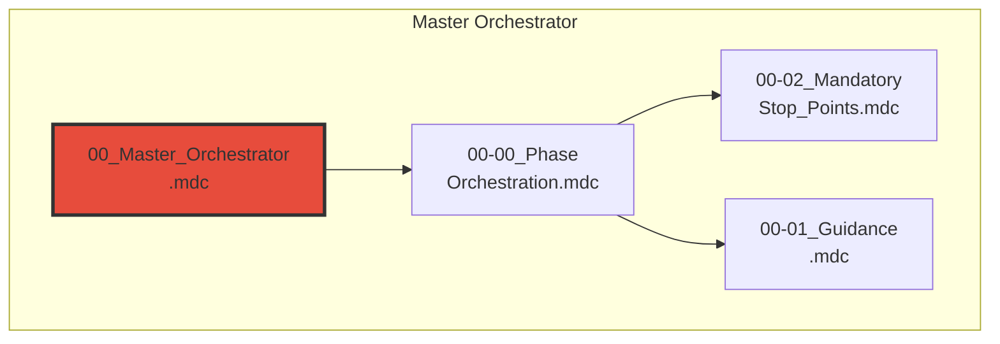
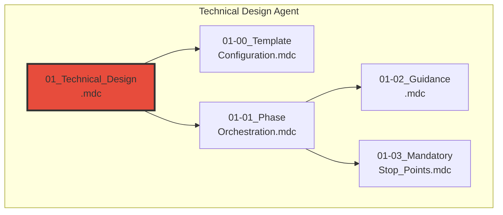
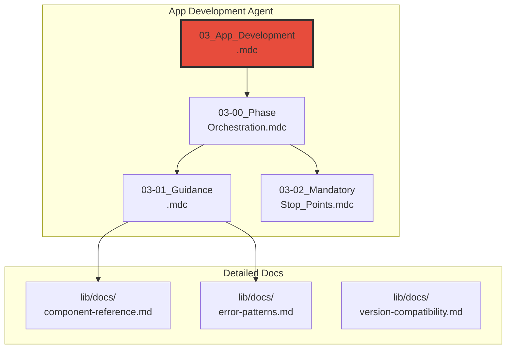
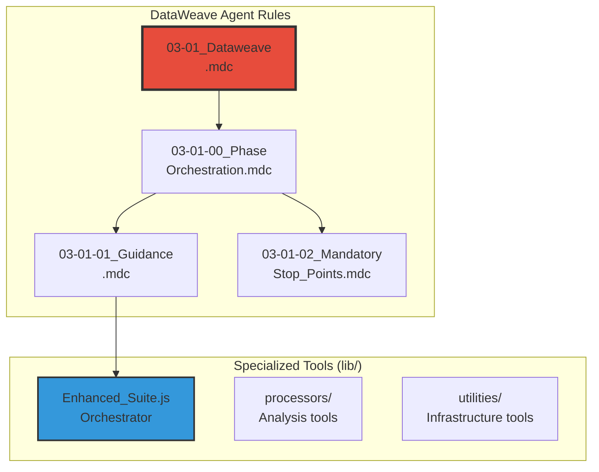
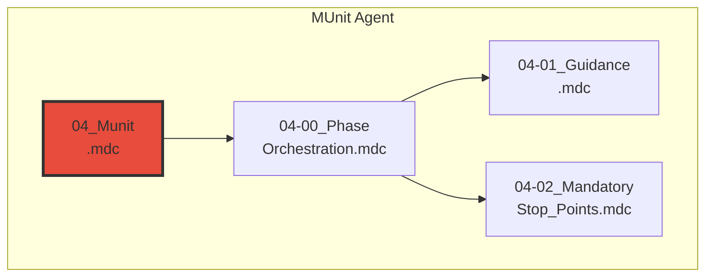
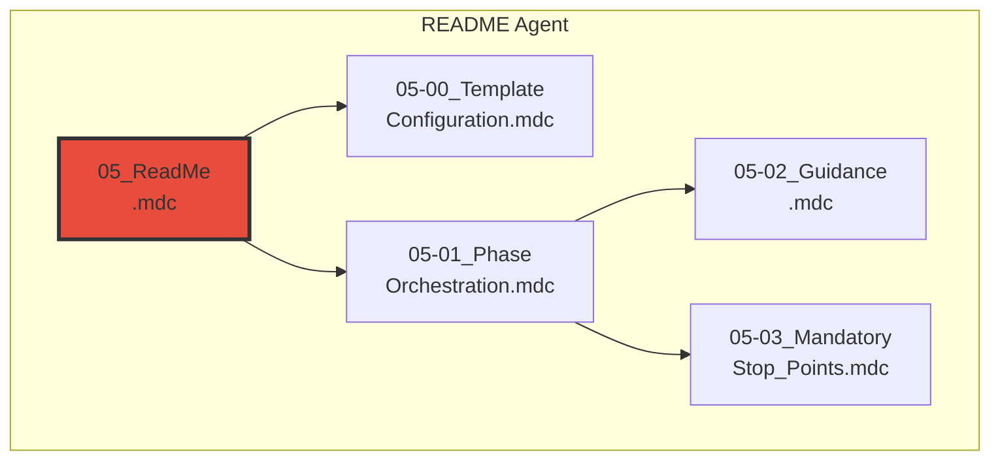
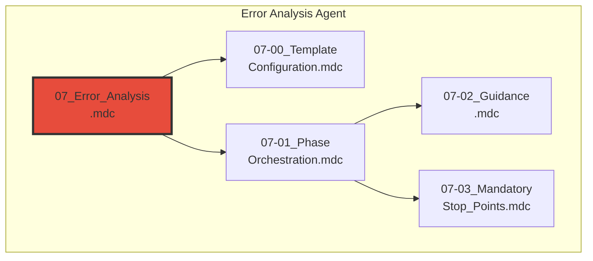
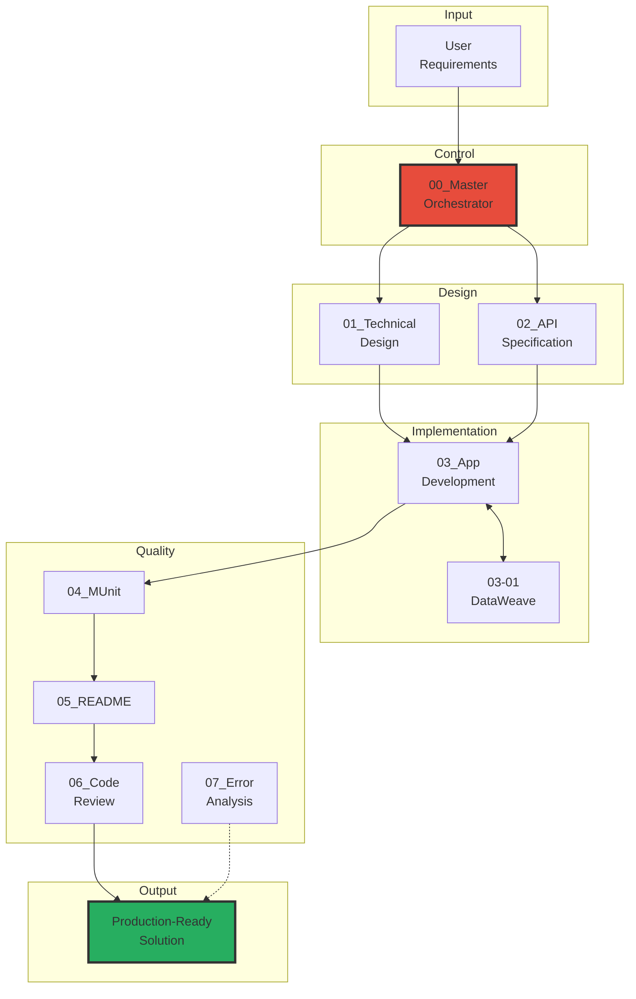

# 🧞‍♂️ R-GENIE SYSTEM ARCHITECTURE

**📄 Version:** 3.0  
**📅 Updated:** January 2026  
**👨‍💻 Author:** Cheppali Shaik Sohail  
**🎯 Purpose:** Complete System Architecture & Integration Guide  

---

## 📋 TABLE OF CONTENTS

1. [Executive Summary](#executive-summary)
2. [System Overview](#system-overview)
3. [Lean 4-5 File Architecture Standard](#lean-4-5-file-architecture-standard)
4. [Master Orchestrator System (00)](#master-orchestrator-system-00)
5. [Technical Design Agent (01)](#technical-design-agent-01)
6. [API Specification Agent (02)](#api-specification-agent-02)
7. [App Development Agent (03)](#app-development-agent-03)
8. [DataWeave Intelligence Agent (03-01)](#dataweave-intelligence-agent-03-01)
9. [MUnit Agent (04)](#munit-agent-04)
10. [README Agent (05)](#readme-agent-05)
11. [Code Review Agent (06)](#code-review-agent-06)
12. [Error Analysis Agent (07)](#error-analysis-agent-07)
13. [System Integration & Data Flow](#system-integration--data-flow)
14. [File Structure & Organization](#file-structure--organization)

---

> **📝 Note:** This document contains multiple Mermaid diagrams. **Mermaid extension is required** in Cursor/Windsurf IDE to view these diagrams properly.

## 🎯 EXECUTIVE SUMMARY

### **R-GENIE: AI-Powered MuleSoft Development Ecosystem**

R-GENIE is a comprehensive, AI-powered development ecosystem that transforms business requirements into production-ready MuleSoft solutions through intelligent automation. The system consists of **9 integrated agents** following a **lean 4-5 file architecture standard** (4 core files + optional template configuration).

### **Key Capabilities**

| Capability | Description |
|------------|-------------|
| **User-Controlled Pipeline** | 5-stage orchestration with mandatory checkpoints |
| **Lean Architecture** | 4-5 rule files per agent (4 core + optional template config) |
| **Intelligent Design** | Technical designs with essential Mermaid diagrams (Mermaid extension required for viewing) |
| **RAML/OpenAPI** | API-Led Connectivity with 105-point quality scoring |
| **DataWeave Intelligence** | Specialized tools with smart auto-routing |
| **Application Generation** | 6-phase MuleSoft development pipeline |
| **Testing** | 85%+ test coverage with iterative optimization |
| **Documentation** | Template-driven professional documentation |
| **Quality Assurance** | 100-point comprehensive code review |

---

## 🌟 SYSTEM OVERVIEW

### **Architecture Philosophy**

R-GENIE follows a **Sequential Development Pipeline** with **mandatory user checkpoints**:

```
User Requirements → Technical Design → Application Development → 
Testing → Documentation → Quality Review → Production-Ready Solution
```

### **Core Design Principles**

1. **🎯 User-Centric Control** - Checkpoints at every major stage
2. **📦 Lean Architecture** - 4-5 rule files per agent (4 core + optional template config)
3. **🔄 Interactive Workflow** - Stop-and-wait protocol
4. **✅ Quality-First** - Multiple validation layers
5. **🧞‍♂️ Production Safety** - Enterprise-grade reliability

---

## 📐 LEAN 4-5 FILE ARCHITECTURE STANDARD

Every R-GENIE agent follows this structure (4 core files + optional template configuration):

| # | File Pattern | Purpose |
|---|--------------|---------|
| 1 | `{ID}_Agent.mdc` | Main entry point with RISEN framework |
| 2 | `{ID}-00_Phase_Orchestration.mdc` | Phase workflow & state management |
| 3 | `{ID}-01_Guidance.mdc` | Patterns, functions, quick reference |
| 4 | `{ID}-02_Mandatory_Stop_Points.mdc` | Interactive enforcement |
| + | `INDEX.md` | Navigation guide |

### **Directory Structure**

```
r-genie/{agent-folder}/
├── rules/                    # 4-5 rule files + INDEX.md (4 core + optional template config)
├── lib/                      # Supporting scripts/docs (if applicable)
├── examples/                 # Usage examples
├── templates/                # Configuration templates (if applicable)
├── README.md                 # Agent overview
├── ARCHITECTURE.md           # Technical architecture
└── {ID}_Production_Learnings.md
```

---

## 🎭 MASTER ORCHESTRATOR SYSTEM (00)

### **Purpose**
Central control system managing the 5-stage R-GENIE pipeline with user checkpoints.

### **Architecture Diagram**


### **Rule Files (4 + INDEX)**

| File | Purpose |
|------|---------|
| `00_Master_Orchestrator.mdc` | Main entry point, pipeline control |
| `00-00_Phase_Orchestration.mdc` | 5-stage workflow management |
| `00-02_Mandatory_Stop_Points.mdc` | User checkpoint enforcement |
| `00-01_Guidance.mdc` | Command references, enable/disable, multi-IDE |
| `INDEX.md` | Navigation guide |

### **Documentation**

- **README.md** - [Master Orchestrator Overview](r-genie/00_Master_Orchestrator_System/README.md)
- **ARCHITECTURE.md** - [Technical Architecture Details](r-genie/00_Master_Orchestrator_System/ARCHITECTURE.md) |

### **5-Stage Pipeline**

| Stage | Agent | Checkpoint |
|-------|-------|------------|
| 1 | Technical Design (01) | Continue / Skip / Stop |
| 2 | App Development (03) | Continue / Skip / Stop |
| 3 | MUnit Testing (04) | Continue / Skip / Stop |
| 4 | README Documentation (05) | Continue / Stop |
| 5 | Code Review (06) | Complete |

---

## 🏗️ TECHNICAL DESIGN AGENT (01)

### **Purpose**
Transforms requirements into lean, developer-focused MuleSoft technical designs with Mermaid diagrams.

### **Architecture Diagram**


### **Rule Files (5 + INDEX)**

| File | Purpose |
|------|---------|
| `01_Technical_Design.mdc` | Main entry with RISEN framework |
| `01-00_Template_Configuration.mdc` | Template-first approach |
| `01-01_Phase_Orchestration.mdc` | 6-phase workflow |
| `01-02_Guidance.mdc` | RISEN, patterns, diagrams |
| `01-03_Mandatory_Stop_Points.mdc` | Interactive enforcement |
| `INDEX.md` | Navigation guide |

### **Documentation**

- **README.md** - [Technical Design Agent Overview](r-genie/01_Technical_Design_Agent/README.md)
- **ARCHITECTURE.md** - [Technical Architecture Details](r-genie/01_Technical_Design_Agent/ARCHITECTURE.md) |

### **6-Phase Workflow**

| Phase | Name | Deliverable |
|-------|------|-------------|
| 0 | Initialization | Scope confirmation |
| 1 | Template Parsing | Style rules loaded |
| 2 | Discovery | Component list |
| 3 | Requirements Analysis | Requirements extracted |
| 4 | Design Generation | Technical design document |
| 5 | Finalization | Quality-validated output |

### **Essential Diagrams (3 essential + 3 optional = 6 total)**

**Essential (Always Included):**
1. Integration Sequence (sequenceDiagram)
2. Error Handling (flowchart)
3. Connector Pattern (graph TB)

**Optional (On Request):**
4. System Architecture (graph TB)
5. Business Process Flow (flowchart)
6. Data Flow Diagram (graph LR)

---

## 🌐 API SPECIFICATION AGENT (02)

### **Purpose**
Generates RAML 1.0 or OpenAPI 3.0 specifications with API-Led Connectivity patterns.

### **Architecture Diagram**


### **Rule Files (5 + INDEX)**

| File | Purpose |
|------|---------|
| `02_API_Specification.mdc` | Main entry with RISEN framework |
| `02-00_Template_Configuration.mdc` | Format selection (RAML/OAS) |
| `02-01_Phase_Orchestration.mdc` | 5-phase state machine |
| `02-02_Guidance.mdc` | API layers, quality, patterns |
| `02-08_Mandatory_Stop_Points.mdc` | STOP_AND_WAIT protocol |
| `INDEX.md` | Navigation guide |

### **Documentation**

- **README.md** - [API Specification Agent Overview](r-genie/02_API_Specification_Agent/README.md)
- **ARCHITECTURE.md** - [Technical Architecture Details](r-genie/02_API_Specification_Agent/ARCHITECTURE.md) |

### **105-Point Quality Scoring**

| Category | Points |
|----------|--------|
| RAML Syntax | 15 |
| Structure Quality | 20 |
| Documentation | 20 |
| Security | 15 |
| RESTful Design | 15 |
| API-Led Compliance | 10 |
| Enterprise Standards | 5 |
| Project Organization | 5 |

**Target**: 85+ points for production deployment

---

## 🏗️ APP DEVELOPMENT AGENT (03)

### **Purpose**
Generates complete MuleSoft 4.6+ applications through a 6-phase pipeline.

### **Architecture Diagram**


### **Rule Files (4 + INDEX)**

| File | Purpose |
|------|---------|
| `03_App_Development.mdc` | Main entry with RISEN framework |
| `03-00_Phase_Orchestration.mdc` | 6-phase workflow |
| `03-01_Guidance.mdc` | Patterns, components, error fixes |
| `03-02_Mandatory_Stop_Points.mdc` | Interactive enforcement |
| `INDEX.md` | Navigation guide |

### **Documentation**

- **README.md** - [App Development Agent Overview](r-genie/03_App_Development_Agent/README.md)
- **ARCHITECTURE.md** - [Technical Architecture Details](r-genie/03_App_Development_Agent/ARCHITECTURE.md) |

### **Detailed Documentation (lib/docs/)**

| File | Content |
|------|---------|
| `component-reference.md` | MuleSoft connector patterns |
| `error-patterns.md` | Build error diagnosis |
| `version-compatibility.md` | MuleSoft version matrix |

### **6-Phase Pipeline**

| Phase | Name | Deliverable |
|-------|------|-------------|
| 0 | Requirements Analysis | Project scope |
| 1 | Design Analysis | Implementation plan |
| 2 | Application Generation | MuleSoft project |
| 3 | Build Optimization | Maven build success |
| 3.5 | Secure Properties | Credential configuration |
| 4 | Deployment Preparation | CloudHub config |
| 5 | Final Validation | Quality score |

---

## 🔄 DATAWEAVE INTELLIGENCE AGENT (03-01)

### **Purpose**
Generates production-ready DataWeave transformations with specialized scripts/tools.

### **Architecture Diagram**


### **Rule Files (4 + INDEX)**

| File | Purpose |
|------|---------|
| `03-01_Dataweave.mdc` | Main entry with RISEN framework |
| `03-01-00_Phase_Orchestration.mdc` | 5-phase workflow |
| `03-01-01_Guidance.mdc` | Patterns, functions, tools |
| `03-01-02_Mandatory_Stop_Points.mdc` | Interactive enforcement |
| `INDEX.md` | Navigation guide |

### **Documentation**

- **README.md** - [DataWeave Intelligence Agent Overview](r-genie/03-01_Dataweave_Agent/README.md)
- **ARCHITECTURE.md** - [Technical Architecture Details](r-genie/03-01_Dataweave_Agent/ARCHITECTURE.md) |

### **Specialized Tools**

| Category | Tools |
|----------|-------|
| **Orchestration** | Enhanced_Suite.js |
| **Analysis** | Requirements_Analyzer, Scenario_Detector, Error_Detector, Security_Scanner |
| **Validation** | CLI_Validator, Multi_Example_Validator, Multi_Input_Validator, Output_Validator |
| **File Processing** | Excel_Converter, Mapping_Analyzer |
| **Infrastructure** | Config_Manager, Error_Handler, Unified_Logger, File_Utils, Quality_Gates |

### **5-Phase Workflow**

| Phase | Name | Duration |
|-------|------|----------|
| 0 | Scenario Detection | 1-2s |
| 1 | Requirements Analysis | 5ms |
| 2 | Script Generation | User-driven |
| 3 | Validation Suite | 2-5s |
| 4 | Performance Optimization | 5-15s |

---

## 🧪 MUNIT AGENT (04)

### **Purpose**
Generates comprehensive MUnit test suites with 85%+ coverage through iterative optimization.

### **Architecture Diagram**


### **Rule Files (4 + INDEX)**

| File | Purpose |
|------|---------|
| `04_Munit.mdc` | Main entry with RISEN framework |
| `04-00_Phase_Orchestration.mdc` | 8-phase state machine |
| `04-01_Guidance.mdc` | Patterns, iteration loops, error fixes |
| `04-02_Mandatory_Stop_Points.mdc` | Interactive enforcement |
| `INDEX.md` | Navigation guide |

### **Documentation**

- **README.md** - [MUnit Agent Overview](r-genie/04_Munit_Agent/README.md)
- **ARCHITECTURE.md** - [Technical Architecture Details](r-genie/04_Munit_Agent/ARCHITECTURE.md) |

### **8-Phase Workflow**

| Phase | Name | Iterations |
|-------|------|------------|
| 0 | Requirements Analysis | 1 |
| 1 | Flow Classification | 1 |
| 2 | Strategy Planning | 1 |
| 3 | Test Generation | 1 |
| 4 | Proactive Validation | 1 |
| 4.5 | Properties Check | 1 |
| 5 | Maven Validation | Max 10 |
| 6 | Coverage Optimization | Max 5 |
| 7 | Completion | 1 |

### **Quality Targets**

| Metric | Target |
|--------|--------|
| Coverage | 85%+ |
| Auto-fix Rate | 90% |
| Schema Compliance | 100% |

---

## 📚 README AGENT (05)

### **Purpose**
Generates professional documentation with template-driven workflow and Mermaid diagrams.

### **Architecture Diagram**


### **Rule Files (5 + INDEX)**

| File | Purpose |
|------|---------|
| `05_ReadMe.mdc` | Main entry with RISEN framework |
| `05-00_Template_Configuration.mdc` | Template-first approach |
| `05-01_Phase_Orchestration.mdc` | 6-phase workflow |
| `05-02_Guidance.mdc` | Extraction patterns, Mermaid |
| `05-03_Mandatory_Stop_Points.mdc` | Interactive enforcement |
| `INDEX.md` | Navigation guide |

### **Documentation**

- **README.md** - [README Agent Overview](r-genie/05_ReadMe_Agent/README.md)
- **ARCHITECTURE.md** - [Technical Architecture Details](r-genie/05_ReadMe_Agent/ARCHITECTURE.md) |

### **6-Phase Workflow**

| Phase | Name | Checkpoint |
|-------|------|------------|
| 0 | Initialization | User confirms scope |
| 1 | Template Parsing | Auto-proceed |
| 2 | Discovery | User validates components |
| 3 | Extract | User confirms metadata |
| 4 | Generate | User approves content |
| 5 | Finalize | Quality check (90+ target) |

---

## 🔍 CODE REVIEW AGENT (06)

### **Purpose**
Performs mental code execution and 100-point quality assessment with progressive document updates.

### **Architecture Diagram**


### **Rule Files (5 + INDEX)**

| File | Purpose |
|------|---------|
| `06_Code_Review.mdc` | Main entry with RISEN framework |
| `06-00_Template_Configuration.mdc` | Report template configuration |
| `06-01_Phase_Orchestration.mdc` | 5-phase progressive workflow |
| `06-02_Guidance.mdc` | Bug patterns, scoring |
| `06-03_Mandatory_Stop_Points.mdc` | Interactive enforcement |
| `INDEX.md` | Navigation guide |

### **Documentation**

- **README.md** - [Code Review Agent Overview](r-genie/06_Code_Review_Agent/README.md)
- **ARCHITECTURE.md** - [Technical Architecture Details](r-genie/06_Code_Review_Agent/ARCHITECTURE.md) |

### **100-Point Scoring**

| Category | Points |
|----------|--------|
| Requirements Compliance | 25 |
| Implementation Quality | 25 |
| Architecture & Design | 20 |
| Code Quality & Tests | 20 |
| Security & Compliance | 10 |

**Production Threshold**: 80+ points

---

## 🔥 ERROR ANALYSIS AGENT (07)

### **Purpose**
Specialized error diagnosis and resolution with confidence-based solutions.

### **Architecture Diagram**


### **Rule Files (5 + INDEX)**

| File | Purpose |
|------|---------|
| `07_Error_Analysis.mdc` | Main entry with RISEN framework |
| `07-00_Template_Configuration.mdc` | Analysis template |
| `07-01_Phase_Orchestration.mdc` | 3-phase diagnostic workflow |
| `07-02_Guidance.mdc` | Error patterns, root cause |
| `07-03_Mandatory_Stop_Points.mdc` | Confidence-based enforcement |
| `INDEX.md` | Navigation guide |

### **Documentation**

- **README.md** - [Error Analysis Agent Overview](r-genie/07_Error_Analysis_Agent/README.md)
- **ARCHITECTURE.md** - [Technical Architecture Details](r-genie/07_Error_Analysis_Agent/ARCHITECTURE.md) |

### **3-Phase Workflow**

| Phase | Name | Output |
|-------|------|--------|
| 0 | Input Reception | Error categorized |
| 1 | Root Cause Analysis | Confidence level |
| 2 | Solution & Prevention | Actionable fix |

---

## 🔄 SYSTEM INTEGRATION & DATA FLOW

### **Integration Architecture**


### **Sequential Pipeline**
```
User Requirements → 00_Master_Orchestrator
    → 01_Technical_Design → 02_API_Specification
    → 03_App_Development ↔ 03-01_DataWeave
    → 04_MUnit → 05_README → 06_Code_Review
    → Production-Ready Solution
```

---

## 📁 FILE STRUCTURE & ORGANIZATION

### **Complete Directory Structure**
```
r-genie/
├── AGENT_ARCHITECTURE_STANDARD.md
├── 00_Master_Orchestrator_System/
│   ├── rules/ (4 + INDEX)
│   ├── examples/
│   ├── README.md
│   ├── ARCHITECTURE.md
│   └── 00_Production_Learnings.md
├── 01_Technical_Design_Agent/
│   ├── rules/ (5 + INDEX)
│   ├── templates/
│   ├── examples/
│   ├── README.md
│   ├── ARCHITECTURE.md
│   └── 01_Production_Learnings.md
├── 02_API_Specification_Agent/
│   ├── rules/ (5 + INDEX)
│   ├── examples/
│   ├── README.md
│   ├── ARCHITECTURE.md
│   └── 02_Production_Learnings.md
├── 03_App_Development_Agent/
│   ├── rules/ (4 + INDEX)
│   ├── lib/docs/
│   ├── examples/
│   ├── README.md
│   ├── ARCHITECTURE.md
│   └── 03_Production_Learnings.md
├── 03-01_Dataweave_Agent/
│   ├── rules/ (4 + INDEX)
│   ├── lib/ (scripts/tools)
│   ├── validation/
│   ├── README.md
│   ├── ARCHITECTURE.md
│   └── 03-01_Production_Learnings.md
├── 04_Munit_Agent/
│   ├── rules/ (4 + INDEX)
│   ├── examples/
│   ├── README.md
│   ├── ARCHITECTURE.md
│   └── 04_Production_Learnings.md
├── 05_ReadMe_Agent/
│   ├── rules/ (5 + INDEX)
│   ├── templates/
│   ├── examples/
│   ├── README.md
│   ├── ARCHITECTURE.md
│   └── 05_Production_Learnings.md
├── 06_Code_Review_Agent/
│   ├── rules/ (5 + INDEX)
│   ├── templates/
│   ├── examples/
│   ├── README.md
│   ├── ARCHITECTURE.md
│   └── 06_Production_Learnings.md
└── 07_Error_Analysis_Agent/
    ├── rules/ (5 + INDEX)
    ├── examples/
    ├── README.md
    ├── ARCHITECTURE.md
    └── 07_Production_Learnings.md
```

### **Agent Summary**

| ID | Agent | Rules | Special |
|----|-------|-------|---------|
| 00 | Master Orchestrator | 4 | Pipeline control |
| 01 | Technical Design | 5 | Templates |
| 02 | API Specification | 5 | RAML/OpenAPI |
| 03 | App Development | 4 | lib/docs/ |
| 03-01 | DataWeave | 4 | Scripts/tools |
| 04 | MUnit | 4 | Iterative |
| 05 | README | 5 | Templates |
| 06 | Code Review | 5 | Templates |
| 07 | Error Analysis | 5 | 3-phase |

---

**🧞‍♂️ R-GENIE - Your wish for comprehensive MuleSoft development automation is hereby GRANTED!** ✨
