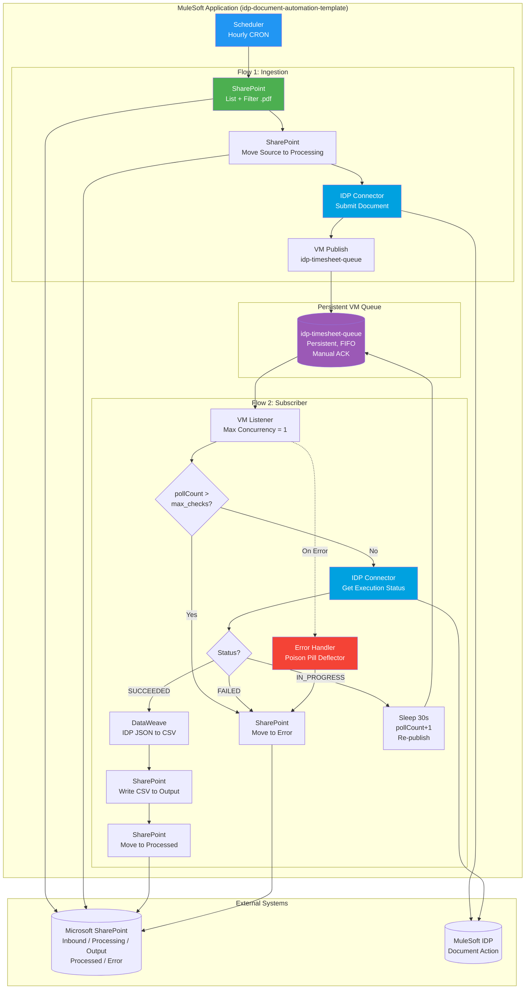
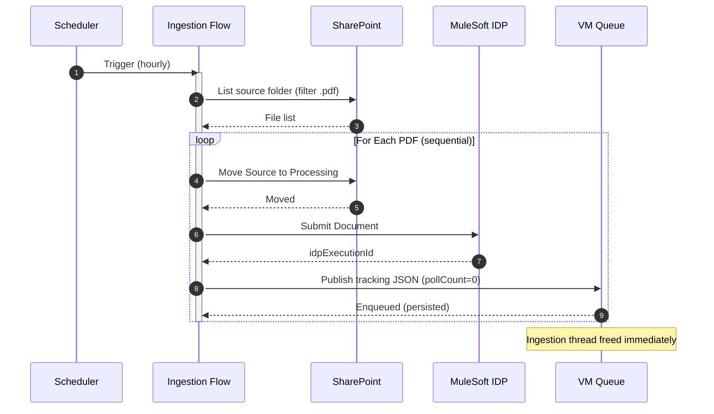
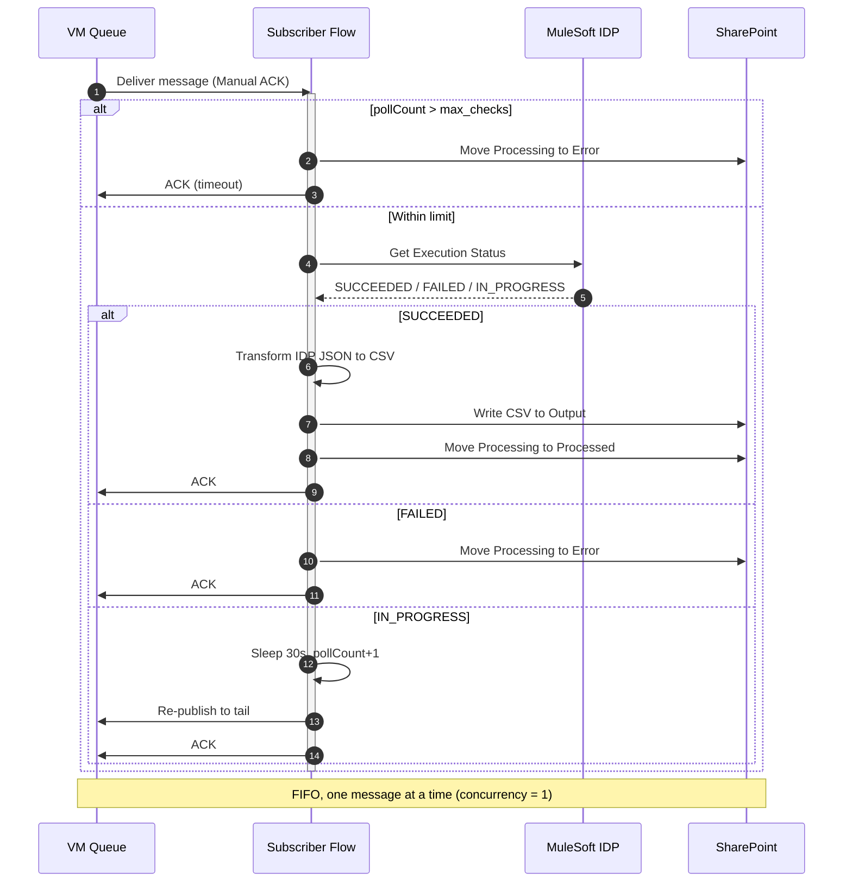
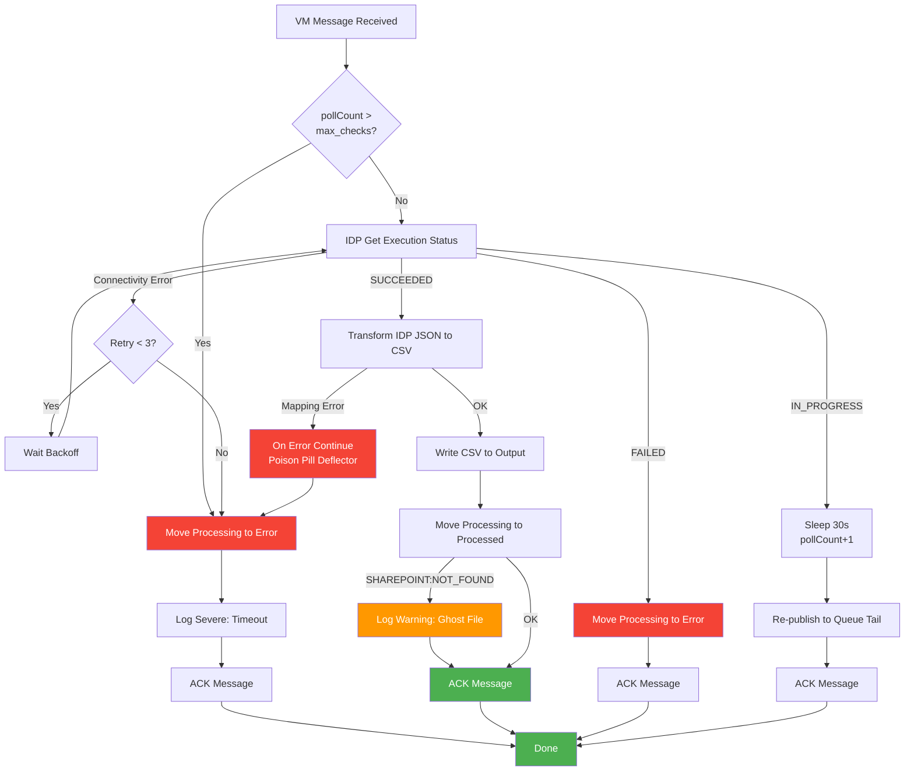
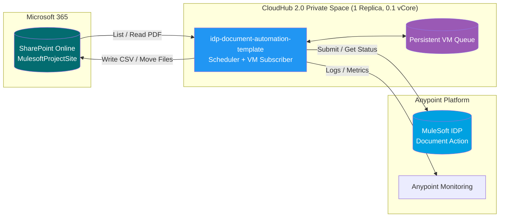
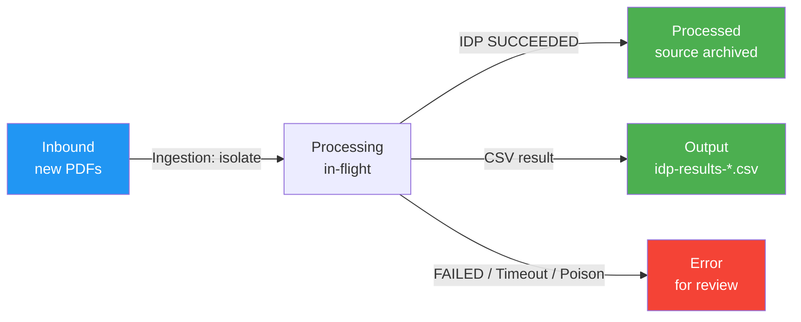

# SKG IDP Document Automation - MuleSoft Technical Design

**Project:** SKG Intelligent Document Automation
**Application:** idp-document-automation-template
**Integration:** SharePoint → MuleSoft IDP → CSV (SharePoint)
**Processing:** Scheduled Ingestion + Event-Driven (Persistent VM Queue)
**Date:** 2026-07-09

> **STATUS: DESIGN COMPLETE (Phase 5)** — 5 core sections + 3 essential diagrams + 4 supplementary sections. AI-generated output; review and validate before use.

---

## 1. Project Overview

### 1.1 Business Context

The `idp-document-automation-template` is a self-contained MuleSoft integration utility that automates document ingestion and data extraction for SKG. Each deployed instance is dedicated to a single MuleSoft Intelligent Document Processing (IDP) action mapped to an explicit Microsoft SharePoint directory structure.

To process documents at volume without worker-thread starvation or memory pressure, the design uses an asynchronous, decoupled pattern. Because external cloud message brokers are out of licensing scope, the pattern is implemented with MuleSoft native **persistent VM Queues** with built-in state tracking (loop counters) for automated recovery.

**Key Business Drivers:**
- Automate manual timesheet/document ingestion and extraction
- Guarantee processing idempotency (no duplicate processing across scheduler runs)
- Survive worker restarts without losing in-flight work
- Keep each deployment simple and self-contained (one app per IDP action)

### 1.2 Integration Scope

| Aspect | Details |
|--------|---------|
| **Source System** | Microsoft SharePoint Online |
| **Source Site** | `https://skgtechoffice.sharepoint.com/sites/MulesoftProjectSite` |
| **Source Location** | Inbound folder (`sharepoint.path.source`), filtered by `.pdf` |
| **Processing Engine** | MuleSoft IDP (via IDP Connector) |
| **Internal Broker** | Native Persistent VM Queue (`idp-timesheet-queue`) |
| **Target System** | Microsoft SharePoint Online (CSV output + archival) |
| **Target Locations** | Output, Processed, Error folders |
| **SharePoint Auth** | OAuth 2.0 client-credentials with certificate (JKS keystore `server.jks`, alias `mule`) |
| **Integration Pattern** | Scheduled ingestion + event-driven asynchronous subscriber (poll-loop) |
| **Integration Layer** | Process / Utility Layer |
| **Processing Type** | Asynchronous, decoupled (near-batch, scheduler-driven) |

### 1.3 Volume and Performance Requirements

| Requirement | Value | Notes |
|-------------|-------|-------|
| **Daily Volume** | ~50 PDF documents/day | Confirmed by stakeholder |
| **Average File Size** | ~200 KB | Timesheet PDFs |
| **Runtime Platform** | CloudHub 2.0 Private Space | - |
| **Replicas** | **1 (mandatory)** | Persistent VM queue state cannot replicate across workers |
| **Worker Size** | 0.1 vCore | Sufficient for stated low volume |
| **IDP Poll Timeout** | 20 checks × 30s ≈ 10 minutes/document | `idp.action.max_checks` |
| **Scheduler Frequency** | Every 1 hour | `scheduler.cron` |

### 1.4 Key Functional Requirements

| ID | Requirement | Trigger | Input | Output | Priority |
|----|-------------|---------|-------|--------|----------|
| **FR-01** | Scheduled ingestion poll | Scheduler (hourly cron) | SharePoint source dir listing | Filtered PDF list | HIGH |
| **FR-02** | Extension filter | Per poll | File metadata | Only `.pdf` files | HIGH |
| **FR-03** | Idempotency isolation | Per file | Source file | File moved source → processing | HIGH |
| **FR-04** | IDP document submit | Per file | PDF payload | `idpExecutionId` | HIGH |
| **FR-05** | Queue handoff | After submit | Tracking JSON | Message on persistent VM queue | HIGH |
| **FR-06** | Timeout guard | Per queue message | `pollCount` vs `max_checks` | Route to timeout/error path | HIGH |
| **FR-07** | IDP status check | Per queue message | `executionId` | SUCCEEDED / FAILED / IN_PROGRESS | HIGH |
| **FR-08** | Success reconciliation | SUCCEEDED | IDP JSON result | CSV to output, source → processed, ACK | HIGH |
| **FR-09** | Failure routing | FAILED | Error details | source → error, ACK | HIGH |
| **FR-10** | In-progress requeue | IN_PROGRESS | Tracking message | Sleep 30s, pollCount+1, re-publish, ACK | HIGH |

### 1.5 Non-Functional Requirements

| Category | Requirement | Metric | Target |
|----------|-------------|--------|--------|
| **Deployment** | Runtime platform | Platform | CloudHub 2.0 Private Space |
| **Scalability** | Replica count | Count | 1 (mandatory — VM state non-replicable) |
| **Performance** | Worker sizing | vCore | 0.1 |
| **Reliability** | Queue durability | Persistence | Persistent VM queue (disk-mirrored) |
| **Reliability** | Ordering | Concurrency | FIFO, max concurrency = 1, manual ACK |
| **Reliability** | Processing timeout | Threshold | 20 checks × 30s ≈ 10 min/document |
| **Reliability** | Crash recovery | Behavior | Auto-resume from persistent queue after worker reboot |
| **Security** | Credential management | Storage | Secure Configuration Properties (no plaintext) |
| **Security** | SharePoint auth | Method | OAuth 2.0 client-credentials, certificate (JKS) |

---

## 2. Technical Architecture

### 2.1 Architecture Pattern
**Selected:** Single Self-Contained System/Utility Application (one IDP action per deployment)

- **Rationale:** The utility integrates one SharePoint directory structure with one IDP action; no multi-system orchestration or multi-channel reuse is required (stated in requirements).
- Two-flow internal decoupling: a scheduler-driven ingestion flow and an asynchronous VM-queue subscriber flow.
- Keeps deployment simple, isolated, and independently versioned per IDP action.

### 2.2 Processing Strategy
**Selected:** Asynchronous, Event-Driven Decoupling via Native Persistent VM Queue

| Aspect | Details |
|--------|---------|
| **Strategy** | Scheduler ingestion hands off to a persistent VM queue; async subscriber tracks IDP completion |
| **Broker** | Native VM queue (persistent), manual ACK, FIFO, max concurrency = 1 |
| **Volume** | ~50 documents/day, ~200 KB each |
| **Resource Constraint** | CloudHub 2.0 Private Space, 1 replica, 0.1 vCore |
| **Justification** | External brokers excluded from licensing scope, VM queue provides persistence and auto-recovery, single-worker constraint required because VM state is worker-local |

**Key Design Decisions:**
- **Idempotency isolation:** Move each file source → processing immediately so overlapping scheduler runs never reprocess the same file.
- **Thread liberation:** Ingestion publishes a lightweight tracking JSON and returns; long IDP waits happen in the subscriber, not the scheduler.
- **Non-blocking poll loop:** IN_PROGRESS documents are re-published (with incremented `pollCount`) after a 30s pause rather than busy-waiting.
- **Timeout guard:** `pollCount > max_checks` (20 × 30s ≈ 10 min) routes the document to the error path.
- **Manual ACK:** The subscriber ACKs only after the terminal action completes, guaranteeing at-least-once processing across restarts.

### 2.3 Connector Summary

| Connector | Configuration | Purpose |
|-----------|---------------|---------|
| **Scheduler** | CRON: `0 0 0/1 * * ?` (hourly) | Trigger ingestion poll |
| **SharePoint (Online)** | Existing `Sharepoint_Sharepoint_online`, OAuth client-credentials, certificate (JKS `server.jks`, alias `mule`), site `.../sites/MulesoftProjectSite` | List, read, move, and write files in SharePoint |
| **MuleSoft IDP** | IDP Connector, action id `idp.action.id`, version `idp.action.version` | Submit document, get execution status/result |
| **VM** | Persistent queue `idp-timesheet-queue`, manual ACK, max concurrency = 1 | Async tracking handoff and requeue |

### 2.4 Connector Pattern Diagram



---

## 3. Flow Architecture

### 3.1 Flow 1: SharePoint Ingestion Flow

**Flow Name:** `scheduler-sharepoint-ingest-flow`

Scans the inbound SharePoint directory, isolates each source file for idempotency, submits it to IDP, hands off tracking to the persistent VM queue, and frees the ingestion thread.

| Step | Component | Action | Details |
|------|-----------|--------|---------|
| **1** | Scheduler | Trigger poll | CRON `0 0 0/1 * * ?` (hourly) |
| **2** | SharePoint Connector | List folder | Query `sharepoint.path.source`, filter by `sharepoint.filter.extension` (`pdf`) |
| **3** | For Each | Sequential loop | Iterate files, natural throttling on fractional vCore |
| **4** | SharePoint Connector | Move file | Source → Processing (idempotency isolation) |
| **5** | IDP Connector | Submit document | Stream file to IDP action, returns `idpExecutionId` |
| **6** | VM Publish | Queue handoff | Publish tracking JSON (executionId, fileName, sourcePath, pollCount=0) to `idp-timesheet-queue` |

**Tracking Payload:**
```json
{
  "executionId": "ec76f45a-a205-44a9-9a0c-af46abbd2208",
  "fileName": "timesheet_01.pdf",
  "sourcePath": "Shared Documents/Manual Uploads/Processing/timesheet_01.pdf",
  "pollCount": 0
}
```

**Sequence Diagram:**



### 3.2 Flow 2: VM Queue Subscriber Flow

**Flow Name:** `subscriber-vm-queue-flow`

Asynchronous subscriber that tracks IDP completion in FIFO order and performs terminal file movements.

| Step | Component | Action | Details |
|------|-----------|--------|---------|
| **1** | VM Listener | Receive message | Queue `idp-timesheet-queue`, manual ACK, max concurrency = 1 |
| **2** | Choice Router | Timeout check | If `pollCount > idp.action.max_checks` → timeout path |
| **3a** | SharePoint + Logger | Timeout handling | Move Processing → Error, log severe alert, ACK |
| **3b** | IDP Connector | Get execution status | GET execution by `executionId` |
| **4** | Choice Router | Status routing | SUCCEEDED / FAILED / IN_PROGRESS |
| **5a** | DataWeave + SharePoint | SUCCEEDED | Map IDP JSON → CSV, write to Output, move Processing → Processed, ACK |
| **5b** | SharePoint | FAILED | Move Processing → Error, ACK |
| **5c** | Sleep + VM Publish | IN_PROGRESS | Sleep 30s, `pollCount+1`, re-publish to queue tail, ACK |

**Sequence Diagram:**



---

## 4. Field Mapping Tables

**Source Format:** MuleSoft IDP execution result (JSON) — top-level `id`/`documentName`/`status`, header fields under `fields.{name}.value`, line-items under `tables.timeSheetData[]` (each cell `{name}.value`).
**Target Format:** CSV — comma-delimited, UTF-8, with header row.
**Transformation:** Flatten to **one row per line-item**, repeating document/header fields on each row; extract `.value` from every field; `null` → empty string.

### 4.1 Source to Target Field Mapping

**Document/Header Fields** (repeated on every CSV row):

| Source (IDP JSON) | Target CSV Column | Transformation | Notes |
|-------------------|-------------------|----------------|-------|
| `id` | `id` | Direct | IDP execution ID |
| `documentName` | `documentName` | Direct | Source PDF name |
| `status` | `status` | Direct | Execution status (SUCCEEDED) |
| `fields.lastName.value` | `lastName` | Extract `.value` | - |
| `fields.firstName.value` | `firstName` | Extract `.value` | - |
| `fields.fullName.value` | `fullName` | Extract `.value` | - |
| `fields.employeeID.value` | `employeeID` | Extract `.value` | e.g. `KW3404` |
| `fields.timeSheet.value` | `timeSheet` | Extract `.value` | Boolean-as-string ("True") |
| `fields.dateFrom.value` | `dateFrom` | Extract `.value`, keep `yyyyMMdd` | e.g. `20260518` |
| `fields.dateTo.value` | `dateTo` | Extract `.value`, keep `yyyyMMdd` | e.g. `20260522` |
| `fields.tableStructure.value` | `tableStructure` | Extract `.value` | Boolean-as-string ("True") |
| `fields.rawText.value` | *(excluded)* | Not mapped | Intentionally dropped from CSV |

**Line-Item Fields** (from `tables.timeSheetData[]` — one CSV row each):

| Source (IDP JSON) | Target CSV Column | Transformation | Notes |
|-------------------|-------------------|----------------|-------|
| `timeSheetData[].projectCode.value` | `projectCode` | Extract `.value` | e.g. `B11464` |
| `timeSheetData[].tradeCode.value` | `tradeCode` | Extract `.value` | e.g. `B01000` |
| `timeSheetData[].description.value` | `description` | Extract `.value` | e.g. `AMALINDA 91567` |
| `timeSheetData[].monTime.value` | `monTime` | Extract `.value`, null → empty | Time range e.g. `0700 - 1100` |
| `timeSheetData[].tueTime.value` | `tueTime` | Extract `.value`, null → empty | - |
| `timeSheetData[].wedTime.value` | `wedTime` | Extract `.value`, null → empty | - |
| `timeSheetData[].thurTime.value` | `thurTime` | Extract `.value`, null → empty | - |
| `timeSheetData[].friTime.value` | `friTime` | Extract `.value`, null → empty | - |
| `timeSheetData[].satTime.value` | `satTime` | Extract `.value`, null → empty | - |
| `timeSheetData[].sunTime.value` | `sunTime` | Extract `.value`, null → empty | - |

**Flatten Rule:** For each item in `timeSheetData`, emit one CSV row combining the header fields with that item's fields. If `timeSheetData` is empty, emit **one** row with header fields populated and all line-item columns empty.

### 4.2 Output File Structure

| Attribute | Value |
|-----------|-------|
| Format | CSV (comma-delimited) |
| Encoding | UTF-8 |
| Header row | Yes |
| Filename | `idp-results-{documentName}.csv` |
| Row cardinality | One row per `timeSheetData` line-item (minimum one row per document) |

**Column order (21 columns):**
`id, documentName, status, lastName, firstName, fullName, employeeID, timeSheet, dateFrom, dateTo, tableStructure, projectCode, tradeCode, description, monTime, tueTime, wedTime, thurTime, friTime, satTime, sunTime`

⚠️ **ASSUMPTION:** The `.pdf` extension is stripped from `documentName` before composing the CSV filename (to avoid `...pdf.csv`). Confirm if you prefer the raw name retained.

### 4.3 Validation Rules

| Field / Condition | Validation Rule | Action |
|-------------------|-----------------|--------|
| `status` | Must equal `SUCCEEDED` before transformation | FAILED / other → routed to error path (Section 5) |
| `fields` object | Present and non-empty | If missing → treat as mapping failure (poison pill) |
| `tables.timeSheetData` | Array (may be empty) | Empty → emit single header-only row |
| Any `.value` | May be `null` | Render as empty string in CSV |
| `employeeID`, `documentName` | Present (used for traceability / filename) | If missing → log warning, continue |

---

## 5. Error Handling Strategy

### 5.1 Error Categories

| Error Category | Error Type | Examples | Severity | Handling Strategy |
|----------------|------------|----------|----------|-------------------|
| **IDP Processing Failed** | IDP:EXECUTION_FAILED | IDP returns `FAILED` status | MEDIUM | Move Processing → Error, ACK |
| **IDP Timeout** | IDP:TIMEOUT | `pollCount > max_checks` (~10 min) | MEDIUM | Move Processing → Error, log severe alert, ACK |
| **Poison Pill (Mapping/Structural)** | TRANSFORM:MAPPING_ERROR | Malformed IDP JSON, missing `fields` | HIGH | On Error Continue → move to Error, ACK (purge payload) |
| **Ghost File (Missing Source)** | SHAREPOINT:NOT_FOUND | File deleted/moved by user mid-processing | LOW | Still write CSV output, log warning, ACK |
| **SharePoint Connectivity** | CONNECTIVITY:SHAREPOINT | Auth/token failure, timeout, 5xx | HIGH | Retry with backoff, then Error path |
| **IDP Connectivity** | CONNECTIVITY:IDP | IDP endpoint unreachable/timeout | HIGH | Retry with backoff, then re-queue/Error |
| **VM Queue Error** | VM:QUEUE_ERROR | Publish/consume failure | HIGH | Rely on persistence + redelivery; log |

### 5.2 Retry Patterns

| Error Type | Max Retries | Initial Delay | Backoff Strategy | On Exhaustion |
|------------|-------------|---------------|------------------|---------------|
| SharePoint Connectivity | 3 | 2 s | Exponential (2x) | Move to Error, ACK |
| IDP Connectivity (status/submit) | 3 | 5 s | Fixed | Leave for next poll cycle / Error |
| IDP `IN_PROGRESS` (functional wait) | `max_checks` (20) | 30 s | Fixed (re-publish loop) | Timeout → Error path |
| Mapping / Poison Pill | 0 | - | No retry | Move to Error, ACK immediately |

**Retry Logic:** Transient connectivity errors retry with backoff. The `IN_PROGRESS` wait is a **functional** poll loop (not an exception retry): sleep 30s, increment `pollCount`, re-publish, ACK. Structural/poison errors never retry.

### 5.3 Error Notification Strategy

| Scenario | Mechanism | Content | Priority |
|----------|-----------|---------|----------|
| IDP Failed / Timeout | Structured log (severe) | executionId, documentName, pollCount, reason | MEDIUM |
| Poison Pill | Structured log (severe) | executionId, error, payload ref | HIGH |
| Ghost File | Structured log (warning) | documentName, missing path | LOW |
| Connectivity failures | Structured log (severe) + runtime metrics | endpoint, error, retry count | HIGH |

> Notifications are log-based (consumable by CloudHub 2.0 monitoring / Anypoint Monitoring), consistent with the existing `CustomLogMapper` logging framework. No email connector is in scope.

### 5.4 Error Handling Flow Details

**Poison Pill Deflector:** Any structural or mapping exception in the subscriber flow is caught by an **On Error Continue** block — logs a severe alert, moves the source file from Processing → Error, and forces an explicit **ACK** to purge the unprocessable payload.

**App Crash / Worker Reboot Recovery:** Because the VM queue is **persistent** (disk-mirrored), messages survive a worker crash/reboot. On restart, the VM Listener resumes, re-consumes trapped execution IDs, and re-queries IDP. Uncompleted files remain in the Processing folder, shielded from duplicate ingestion.

**Missing Document Resiliency (Ghost Files):** If a user removes/modifies a document mid-processing, the terminal file-move throws `SHAREPOINT:NOT_FOUND`. The handler still generates and publishes the CSV output, logs a warning about the missing source, and **ACKs** to prevent queue stagnation.

### 5.5 Error Handling Flow Diagram



### 5.6 Error Recovery Procedures

| Scenario | Recovery Action |
|----------|-----------------|
| **IDP Failed** | Ops reviews source PDF quality in Error folder, re-uploads to Inbound for reprocessing |
| **IDP Timeout** | Ops verifies IDP action health; re-uploads document from Error folder |
| **Poison Pill** | Ops inspects malformed document/log, corrects source, re-uploads to Inbound |
| **SharePoint Connectivity** | Ops checks certificate/token + SharePoint availability; files remain safe in Processing |
| **Worker Crash** | Automatic — persistent VM queue replays on restart; no manual action |

---

## 6. Security Considerations

### 6.1 Authentication & Authorization

| Concern | Approach |
|---------|----------|
| **SharePoint** | OAuth 2.0 **client-credentials** with **certificate** (Azure AD app), JKS keystore `server.jks` (alias `mule`), scope `.default`, tenant token URL. No user-delegated tokens. |
| **MuleSoft IDP** | Anypoint platform credentials (`anypoint.clientId` / `anypoint.clientSecret`) to the IDP runtime endpoint (`idp-rt.<region>.anypoint.mulesoft.com`). |
| **Least privilege** | The Azure AD app is granted access only to the target SharePoint site (`MulesoftProjectSite`) and only the folders it operates on. |

### 6.2 Secure Credential Management

- All secrets (keystore password, `anypoint.clientSecret`, any SharePoint client secret) stored via **Secure Configuration Properties** (`secure-properties:config`, key `${mule.secure.key}`), encrypted with the `![...]` syntax — consistent with the existing `secure/${mule.env}-secure-properties.yaml` files.
- **No plaintext secrets** in properties, code, or logs.
- The `${mule.secure.key}` is injected at deploy time (CloudHub 2.0 secured property / runtime manager), never committed.
- Keystore (`server.jks`) packaged as a protected resource; keystore password externalized to secure properties.

### 6.3 Data Handling

- Payloads are streamed (PDF submit, CSV write) — avoid retaining document content in memory or logs.
- Logging via `CustomLogMapper` logs metadata (executionId, documentName, status) — **not** extracted PII (employee names/IDs). Extracted field values must not be logged at INFO; restrict any payload logging to DEBUG in non-production only.
- CSV outputs contain employee PII (names, IDs, timesheet data) — ensure the SharePoint Output folder has appropriately restricted access.

### 6.4 Transport Security

- All SharePoint and IDP calls over HTTPS/TLS.
- Health-check HTTP listener bound per environment ports (`http.port` / `https.port`); restrict public exposure of non-health endpoints on the Private Space.

---

## 7. Performance & Monitoring

### 7.1 Performance & Sizing

| Aspect | Design Choice | Rationale |
|--------|---------------|-----------|
| Worker | 0.1 vCore, 1 replica | ~50 docs/day @ ~200 KB is very low throughput |
| Concurrency | VM subscriber max concurrency = 1 (FIFO) | Guarantees ordered, single-worker-safe processing |
| Streaming | Stream PDF submit + CSV write | Avoids loading documents fully into memory |
| Throttling | Sequential `For Each` in ingestion | Natural backpressure control on fractional vCore |
| Poll cadence | 30s between IDP status checks, max 20 | Balances latency vs. IDP load; ~10 min ceiling/doc |

**Throughput note:** The 30s in-thread sleep on `IN_PROGRESS` serializes the single consumer. At 50 docs/day this is negligible; if volume grows materially, revisit (e.g. scheduler-based re-poll or externalized broker + multiple replicas).

### 7.2 Monitoring & Logging

| Metric / Signal | Source | Purpose |
|-----------------|--------|---------|
| Ingestion count per run | Log (`CustomLogMapper`) | Files discovered / submitted per poll |
| Queue depth & age | CloudHub 2.0 / Anypoint Monitoring | Detect backlog / stuck documents |
| Poll-loop counters | Log (pollCount per executionId) | Detect documents approaching timeout |
| Terminal outcomes | Log (SUCCEEDED/FAILED/TIMEOUT/POISON) | Reconciliation & alerting |
| Error-folder writes | Log (severe) | Trigger ops investigation |

- Structured JSON logs via existing `CustomLogMapper`, correlation-ID propagated.
- Alerting on severe logs / error-folder growth via Anypoint Monitoring or CloudHub alerts.

### 7.3 Health Checks

- Existing `/health-check/liveliness-probe` and `/health-check/readiness-probe` (APIkit) reused for CloudHub 2.0 probes.
- Readiness should reflect connectivity to SharePoint/IDP where feasible.

---

## 8. Configuration Files

Configuration follows the existing project layout (`src/main/resources/properties/`): a shared `common-properties.yaml`, per-environment `${mule.env}-properties.yaml`, and encrypted `secure/${mule.env}-secure-properties.yaml`. The keys below **add** the design-specific properties (SharePoint paths, IDP action, scheduler, VM queue) to what already exists (`http`, `https`, `api.id`, `idp.host/port/protocol`, `anypoint.*`, `log.level`).

**Non-secure — `properties/${mule.env}-properties.yaml` (additions):**
```yaml
idp:
  action:
    id: "idp-skg-salaries-pjc"     # Mapped IDP Action UUID/name
    version: "1.0.0"               # Target version in Exchange
    max_checks: "20"               # Max poll loops before timeout

sharepoint:
  site:
    url: "https://skgtechoffice.sharepoint.com/sites/MulesoftProjectSite"
  path:
    source: "Shared Documents/Manual Uploads/Inbound"
    processing: "Shared Documents/Manual Uploads/Processing"
    output: "Shared Documents/Manual Uploads/Output"
    processed: "Shared Documents/Manual Uploads/Processed"
    error: "Shared Documents/Manual Uploads/Error"
  filter:
    extension: "pdf"

scheduler:
  cron: "0 0 0/1 * * ?"            # Every 1 hour

vm:
  queue:
    name: "idp-timesheet-queue"    # Persistent VM queue
  poll:
    sleepMillis: "30000"           # 30s pause between IN_PROGRESS re-checks
```

**Secure — `properties/secure/${mule.env}-secure-properties.yaml` (encrypted `![...]`):**
```yaml
sharepoint:
  keystore:
    password: "![encrypted-keystore-password]"
  clientId: "![encrypted-if-applicable]"

anypoint:
  clientId: "![encrypted-anypoint-client-id]"
  clientSecret: "![encrypted-anypoint-client-secret]"
```

> Environment set: `dev`, `test`, `preprod`, `prod` (matching existing files). Only values differ per environment; keys stay consistent. Secrets are never stored in plaintext.

---

## 9. Additional Diagrams

### 9.1 System Architecture



### 9.2 Data Flow (SharePoint Folder Lifecycle)



---

<!-- Deployment Guide intentionally omitted (include: false in design-style.yaml). -->
