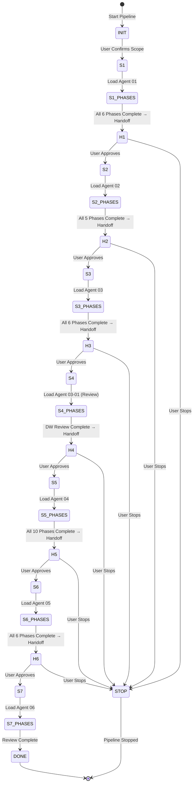

# Master Orchestrator System - Architecture

> **Version:** 3.0.0  
> **Last Updated:** April 2026  
> **Purpose:** Technical architecture documentation for the 7-stage phase-aware pipeline  
> **Author**: Cheppali Shaik Sohail

## Overview

The Master Orchestrator System V3 is the central control mechanism for R-GENIE's 7-stage MuleSoft development pipeline. Unlike V2 which delegated passively to agents, V3 actively drives each agent's full phase workflow in sequence within the same chat, creating structured handoff documents between stages.

The system loads one agent at a time to manage context window constraints, executes all of the agent's internal phases (respecting internal stop points), then creates a handoff document that carries context to the next agent. This ensures no information is lost between stages and every agent receives the full context of previous work.

Key capabilities include phase-aware orchestration (the orchestrator knows each agent's phases), structured handoff documents saved to `project/output_00_orchestrator/`, two-level checkpoints (agent internal + orchestrator stage transitions), state persistence for workflow resumption, and agent load/unload to manage context.

## Workflow Steps

### Stage 1: Technical Design (Agent 01) — 6 Phases
- **What**: Transforms user requirements into implementation-ready technical design documents with Mermaid diagrams and field mapping tables
- **How**: Loads Technical Design Agent (01), drives all 6 phases: skeleton → requirements → architecture → mappings → completion → config
- **Why**: Establishes the foundation for all subsequent development work
- **Handoff**: `handoff-01-to-02.md` — design decisions, output paths, API layer recommendations

### Stage 2: API Specification (Agent 02) — 5 Phases
- **What**: Generates RAML 1.0 or OpenAPI 3.0 specification from the technical design
- **How**: Loads API Specification Agent (02), reads handoff from Stage 1, drives 5 phases: discovery → format selection → structure → quality → delivery
- **Why**: Creates the contract-first API specification that drives application development
- **Handoff**: `handoff-02-to-03.md` — spec format, endpoints, data types, module structure

### Stage 3: App Development (Agent 03) — 6 Phases
- **What**: Generates complete MuleSoft 4.6+ applications with flows, configurations, and DataWeave transformations
- **How**: Loads App Development Agent (03), reads handoff from Stage 2, drives 6 phases: requirements → design analysis → generation → build → credentials → deployment → validation
- **Why**: Converts API specification into executable MuleSoft code
- **Handoff**: `handoff-03-to-0301.md` — app structure, DW file locations, flow list

### Stage 4: DataWeave Review (Agent 03-01) — Review Mode
- **What**: Reviews and optimizes all DataWeave transformations generated during app development
- **How**: Loads DataWeave Agent (03-01) in review mode, reads handoff from Stage 3, analyzes each .dwl file for production safety
- **Why**: Ensures all transformations are production-safe with no unsafe coercions or hardcoded values
- **Handoff**: `handoff-0301-to-04.md` — optimized DW list, validation results, changes made

### Stage 5: MUnit Testing (Agent 04) — 10 Phases
- **What**: Generates comprehensive test suites with 85%+ coverage guarantee
- **How**: Loads MUnit Agent (04), reads handoff from Stage 4, drives 10 phases: setup → discovery → analysis → scenarios → data → tests → mocks → coverage → build → delivery
- **Why**: Ensures code quality through systematic testing before production deployment
- **Handoff**: `handoff-04-to-05.md` — test count, coverage %, build status

### Stage 6: ReadMe Documentation (Agent 05) — 6 Phases
- **What**: Generates professional README documentation with Mermaid diagrams
- **How**: Loads ReadMe Agent (05), reads handoff from Stage 5, drives 6 phases: confirm → templates → analysis → generation → diagrams → delivery
- **Why**: Provides essential documentation for developers, operators, and stakeholders
- **Handoff**: `handoff-05-to-06.md` — doc location, project summary for review context

### Stage 7: Code Review (Agent 06) — 5 Phases + RGV Multi-Pass
- **What**: Performs forensic code review against the Stage 1 technical design document
- **How**: Loads Code Review Agent (06), reads handoff from Stage 6, uses Stage 1 design as requirements source, drives 5 phases with RGV multi-pass iteration on flow analysis and field mapping verification
- **Why**: Validates that the implementation matches the original design, identifies gaps and bugs
- **Output**: Final code review report with 0-100 score

## Flow Diagram

