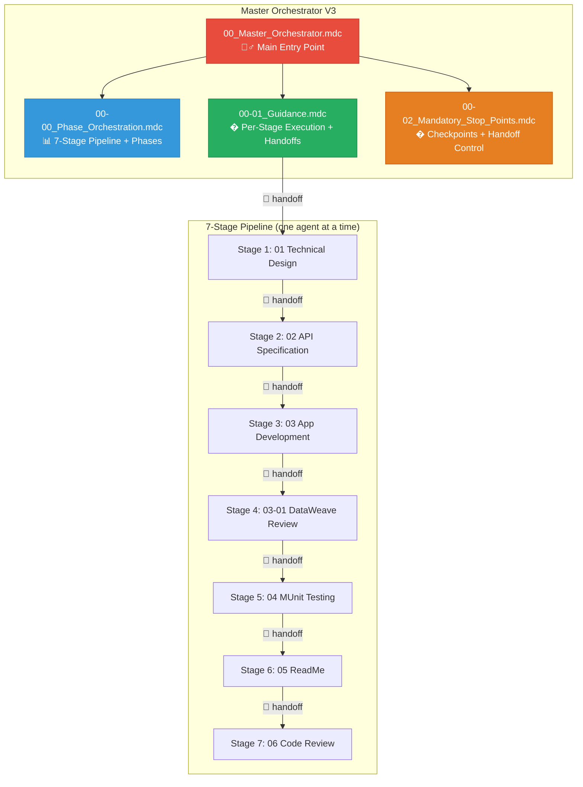

# 🧞‍♂️ **MASTER ORCHESTRATOR SYSTEM V3**

**📄 Version:** v3.0 (Phase-Aware 7-Stage Pipeline with Structured Handoffs)  
**📅 Updated:** April 2026  
**👨‍💻 Author:** Cheppali Shaik Sohail  
**🎯 Purpose:** End-to-End MuleSoft Pipeline — Drives Each Agent's Full Workflow

---

## 🎯 **SYSTEM OVERVIEW**

The **Master Orchestrator V3** is R-GENIE's central control system that actively drives each agent's complete phase workflow through a 7-stage pipeline. Unlike V2 which delegated passively, V3 executes each agent's full phases in sequence within the same chat, creating structured handoff documents between stages.

### **🆕 What's New in V3**

| Feature | V2 | V3 |
|---------|-----|-----|
| Orchestration | Passive delegation | Phase-aware, drives each agent's full workflow |
| Pipeline | 5-6 stages | 7 stages (adds API Spec + DataWeave Review) |
| Context passing | None (hope agent finds outputs) | Structured handoff documents |
| Agent loading | Manual | Auto load/unload one at a time |
| Code Review | General review | Review against Stage 1 design |
| DataWeave | Supporting agent only | Stage 4: DW Review |

### **🏆 Key Capabilities**

- ✅ **7-Stage Pipeline** — Design → API → App → DW Review → Test → Docs → Review
- ✅ **Phase-Aware** — Drives each agent's full phase workflow in detail
- ✅ **Structured Handoffs** — Markdown handoff docs between every stage
- ✅ **Two-Level Checkpoints** — Agent internal + orchestrator stage transitions
- ✅ **One Agent at a Time** — Load/unload to manage context window
- ✅ **Resume Capability** — State file + handoff docs enable mid-pipeline restart
- ✅ **Design Verification** — Code Review validates against Stage 1 design

---

## 🏗️ **V3 SYSTEM ARCHITECTURE**

---

## 📊 **7-STAGE DEVELOPMENT PIPELINE**

### **Stage Details**

| Stage | Agent | Phases | Purpose |
|-------|-------|--------|---------|
| **1** | Technical Design (01) | 6 | Architecture, diagrams, mappings |
| **2** | API Specification (02) | 5 | RAML/OAS spec from design |
| **3** | App Development (03) | 6 | Complete MuleSoft app |
| **4** | DataWeave Review (03-01) | 5 | Review & optimize DW transforms |
| **5** | MUnit Testing (04) | 10 | Test suite (85%+ coverage) |
| **6** | ReadMe Documentation (05) | 6 | Professional documentation |
| **7** | Code Review (06) | 5+RGV | Review against design doc |

---

## 🚀 **QUICK START**

### **📋 Prerequisites**

- Cursor or Windsurf IDE with AI Agent capability
- Business requirements or technical specifications
- Target project scope defined

### **🎯 Option 1: Full Pipeline**

\`\`\`bash
# Activate the Master Orchestrator
/use-00-master-orchestrator

# Describe your requirements
"I need a complete Customer Integration API that syncs data between 
Salesforce and our internal database. Build the complete solution."
\`\`\`

### **⚡ Option 2: Selective Execution**

\`\`\`bash
# Start from specific stage
"I have an existing design and API spec. Start from Stage 3."

# Single agent only (bypass orchestrator)
/use-06-code-review
\`\`\`

---

## 📁 **RULE FILE REFERENCE**

| File | Purpose | When to Use |
|------|---------|-------------|
| \`00_Master_Orchestrator.mdc\` | Main entry, RISEN, execution model | Start pipeline |
| \`00-00_Phase_Orchestration.mdc\` | 7-stage pipeline, per-agent phases | Understanding stages |
| \`00-01_Guidance.mdc\` | Per-stage execution, handoff templates | During execution |
| \`00-02_Mandatory_Stop_Points.mdc\` | Checkpoint + handoff enforcement | Checkpoint behavior |
| \`INDEX.md\` | Complete navigation guide | Finding rules |

---

## 📚 **EXAMPLES**

| Example | Description | Stages |
|---------|-------------|--------|
| \`01_complete_pipeline_workflow.md\` | Full pipeline with handoffs | All 7 |
| \`02_selective_execution_workflow.md\` | Selective execution | 3-7 |

---

## 🎯 **USER CONTROL FEATURES**

At every stage transition + handoff:

| Option | Description |
|--------|-------------|
| **Continue** | Create handoff, proceed to next stage |
| **Skip N** | Jump to stage N |
| **Stop** | Save progress + handoffs, end pipeline |
| **Show** | Display outputs or handoff docs |
| **Modify** | Make changes to current output |
| **Restart** | Redo current stage |

---

## 📊 **QUALITY GATES**

| Stage | Success Criteria |
|-------|------------------|
| 1 | Design with 3+ diagrams, mappings, user approved |
| 2 | Complete API spec, 85+/105 quality score |
| 3 | MuleSoft app builds, all flows generated |
| 4 | All DW transforms production-safe |
| 5 | Test coverage ≥85%, Maven build passes |
| 6 | README 90+/100 quality score |
| 7 | Code review 80+/100, no critical findings |

---

## � **CHANGELOG**

### **V3 (April 2026)**
- ✅ **Phase-aware orchestration** — Drives each agent's full workflow
- ✅ **7-stage pipeline** — Added API Specification + DataWeave Review
- ✅ **Structured handoffs** — Markdown handoff docs between stages
- ✅ **Two-level checkpoints** — Agent internal + orchestrator transitions
- ✅ **Design verification** — Code Review validates against Stage 1 design
- ✅ **Load/unload agents** — One agent at a time for context management

### **V2 (January 2026)**
- ✅ Created from scratch — Previously empty directory
- ✅ Modular architecture with 4 rule files
- ✅ 6-stage pipeline with passive delegation
- ✅ INDEX.md and examples directory

---

## 🔗 **RELATED RESOURCES**

- **Rules Index:** \`rules/INDEX.md\`
- **Examples:** \`examples/README.md\`
- **System Architecture:** `../../docs/R-GENIE_SYSTEM_ARCHITECTURE.md`
- **Design Philosophy:** `../../docs/R-GENIE_DESIGN_PHILOSOPHY.md`

---

🧞‍♂️ **R-GENIE Master Orchestrator V3 - Phase-Aware Pipeline with Structured Handoffs!** ✨
