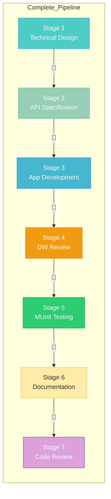

# 🧞‍♂️ R-GENIE Master Orchestrator - Examples

> **Purpose:** Pipeline workflow examples demonstrating R-GENIE orchestration  
> **Version:** 3.0.0  
> **Author**: Cheppali Shaik Sohail

---

## 📋 **Available Examples**

| Example | Description | Stages |
|---------|-------------|--------|
| [01_complete_pipeline_workflow.md](./01_complete_pipeline_workflow.md) | Full 7-stage pipeline with handoffs | All 7 stages |
| [02_selective_execution_workflow.md](./02_selective_execution_workflow.md) | Selective stage execution | Stages 3-7 |

---

## 🎯 **How to Use These Examples**

### **For Learning**
1. Read through each example to understand the workflow
2. Note the checkpoint interactions and handoff documents
3. Understand skip and stop patterns

### **For Reference**
1. Copy conversation patterns for your own workflows
2. Use as templates for similar projects
3. Reference for best practices

---

## 📊 **Pipeline Overview**

---

## 🔗 **Related Resources**

- `../rules/INDEX.md` - Rule navigation guide
- `../rules/00_Master_Orchestrator.mdc` - Main orchestration rules
- `../README.md` - Quick start guide

---

🧞‍♂️ **Learn from Examples, Orchestrate with Confidence!** ✨
