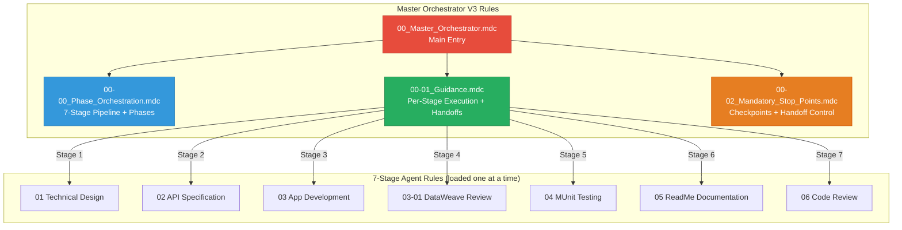

# 🧞‍♂️ R-GENIE Master Orchestrator V3 - Rules Index

> **Version:** v3.0 (Phase-Aware 7-Stage Pipeline with Handoffs)  
> **Last Updated:** April 2026  
> **Author**: Cheppali Shaik Sohail  
> **IDE Support:** Cursor & Windsurf

---

## 📋 **4-FILE LEAN ARCHITECTURE**

| # | Rule File | Purpose | Priority |
|---|-----------|---------|----------|
| 1 | `00_Master_Orchestrator.mdc` | **MAIN ENTRY** - RISEN, 7-stage pipeline, execution model | HIGHEST |
| 2 | `00-00_Phase_Orchestration.mdc` | 7-stage pipeline, per-agent phases, handoff protocol, state | HIGH |
| 3 | `00-01_Guidance.mdc` | Per-stage execution details, handoff templates, I/O mapping | HIGH |
| 4 | `00-02_Mandatory_Stop_Points.mdc` | Stage + handoff checkpoints, user control | HIGHEST |

---

## 🎯 **CORE PRINCIPLE**

> **The orchestrator drives each agent's FULL phase workflow — not just delegate and hope.**
> **Each stage: Enable agent → Load rules → Execute ALL phases → Create handoff → Disable agent**

---

## 🔄 **Rule Dependency Map**

---

## 📊 **7-Stage Pipeline**

| Stage | Agent | Phases | Handoff To |
|-------|-------|--------|------------|
| 1 | Technical Design (01) | 6 | → Stage 2 |
| 2 | API Specification (02) | 5 | → Stage 3 |
| 3 | App Development (03) | 6 | → Stage 4 |
| 4 | DataWeave Review (03-01) | 5 | → Stage 5 |
| 5 | MUnit Testing (04) | 10 | → Stage 6 |
| 6 | ReadMe Documentation (05) | 6 | → Stage 7 |
| 7 | Code Review (06) | 5+RGV | Done |

**Handoff documents:** `project/output_00_orchestrator/handoff-{from}-to-{to}.md`

---

## 📁 **Rule File Details**

### **`00_Master_Orchestrator.mdc`** - Main Entry Point
- **Purpose:** Central pipeline control, RISEN, execution model
- **Contains:** 7-stage overview, stage-to-agent mapping, load/unload protocol
- **Key Principle:** Phase-aware orchestration with structured handoffs

### **`00-00_Phase_Orchestration.mdc`** - Pipeline + Phases
- **Purpose:** 7-stage state machine with per-agent phase tables
- **Contains:** State diagram, all 7 agent phase breakdowns, state file schema
- **Key Principle:** Drive each agent's full workflow, not just delegate

### **`00-01_Guidance.mdc`** - Per-Stage Execution
- **Purpose:** Detailed execution instructions for each stage
- **Contains:** Stage-by-stage guide, handoff template, enable/disable patterns
- **Key Principle:** Structured handoff between every stage

### **`00-02_Mandatory_Stop_Points.mdc`** - Checkpoints
- **Purpose:** Two-level checkpoint enforcement (agent + orchestrator)
- **Contains:** Checkpoint format, handoff sequence, anti-patterns
- **Key Principle:** STOP, create handoff, WAIT at every transition

---

## 🔍 **Quick Lookup**

| Task | Reference |
|------|-----------|
| Start complete pipeline | `@00_Master_Orchestrator.mdc` |
| See agent phases per stage | `@00-00_Phase_Orchestration.mdc` |
| Get stage execution instructions | `@00-01_Guidance.mdc` |
| Know checkpoint + handoff rules | `@00-02_Mandatory_Stop_Points.mdc` |

---

## 🚀 **Getting Started**

### **Cursor IDE**
1. **Activate:** `/use-00-master-orchestrator`
2. **Provide:** Requirements or input files
3. **Follow:** Agent internal checkpoints + stage transition checkpoints
4. **Review:** Handoff documents between stages

### **Windsurf IDE**
1. **Run workflow:** `use-00-master-orchestrator`
2. **Provide:** Requirements or input files
3. **Follow:** Agent internal checkpoints + stage transition checkpoints
4. **Review:** Handoff documents between stages

---

## 🔗 **Related Resources**

- `../examples/` - Pipeline workflow examples
- `../README.md` - Agent overview
- `../../../docs/R-GENIE_SYSTEM_ARCHITECTURE.md` - System architecture

---

🧞‍♂️ **Master Orchestrator V3 - Phase-Aware with Structured Handoffs!** ✨
