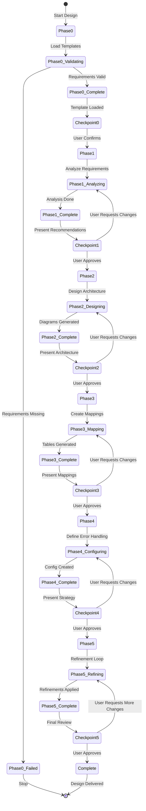

# Technical Design Agent - Architecture

**Author**: Cheppali Shaik Sohail

## Overview

The Technical Design Agent generates lean, developer-focused MuleSoft technical design documents that serve as the blueprint for integration implementations. It transforms user requirements (provided as text, screenshots, or files) into comprehensive technical specifications including architecture patterns, flow designs, essential Mermaid diagrams, and field mapping tables.

The agent emphasizes interactive workflow with mandatory stop points at critical decision junctures, ensuring users maintain control over architectural choices. It follows a streamlined 6-phase approach (Phases 0-5) that produces 3 essential diagrams (Integration Sequence, Error Handling, Connector Pattern) in the main document, with 3 optional diagrams (System Architecture, Business Process, Data Flow) available in supplementary content. The design philosophy prioritizes developer-focused content over verbose documentation, focusing on actionable technical details needed for implementation.

Key capabilities include API-Led Connectivity pattern selection, processing strategy determination (Real-Time, Batch, Event-Driven), connector selection guidance, error handling strategy definition, and iterative refinement loops that allow users to improve designs based on feedback. The agent supports template customization through configuration files, enabling organizations to align output with their documentation standards.

As of V2.1, the agent incorporates LLM behavioral gap countermeasures aligned with the R-GENIE Architecture Standard §13: `<thinking>` blocks for structured reasoning before every phase output, Confidence Calibration (HIGH/MEDIUM/LOW), RGV (Read-Generate-Verify) count verification per phase, Evidence-Bound Outputs, Tree of Thought for ambiguous decisions, Few-Shot BAD/GOOD patterns, Constitutional Principles (4 ranked override rules), Semantic Anti-Autopilot, Contradiction Handling, Graceful Degradation, and Input Sanitization. These techniques address all 14 documented LLM behavioral gaps including Hallucination, Shallow Reasoning, Autopilot Generation, Overconfidence, Sycophancy, and Specification Gaming.

## Workflow Steps

### Phase 0: Document Initialization
- **What**: Creates initial document skeleton and validates requirements presence, optionally loading custom project templates
- **How**: Detects workspace, loads template configuration (if available), creates document structure with placeholders, and validates that requirements input exists
- **Why**: Establishes the foundation document structure and ensures all prerequisites are met before beginning analysis, enabling customization through templates while maintaining default R-GENIE style

### Phase 1: Strategic Technical Analysis
- **What**: Performs deep requirement analysis and presents strategic recommendations for technical approach
- **How**: Analyzes requirements thoroughly (performance, business context, constraints), identifies technical challenges, presents ranked recommendations, and requests clarification on ambiguous requirements
- **Why**: Ensures comprehensive understanding of requirements before architectural decisions, enabling informed pattern selection and preventing costly rework during implementation

### Phase 2: MuleSoft Flow Architecture
- **What**: Designs MuleSoft flow architecture with specific patterns, generates essential diagrams, and defines connector usage
- **How**: Selects API-Led Connectivity pattern (System Only, System+Process, or Full API-Led), determines processing strategy, generates 3 essential Mermaid diagrams, and documents flow step-by-step architecture
- **Why**: Translates requirements into concrete MuleSoft implementation patterns, providing visual and textual guidance for developers who will build the integration

### Phase 3: Data Mapping & Transformation Design
- **What**: Documents field mappings using tables (no code), analyzes data transformations, and defines transformation logic
- **How**: Creates field mapping tables showing source-to-target mappings, analyzes DataWeave transformation requirements, documents conditional logic and lookups, and requests data samples for validation
- **Why**: Provides clear mapping specifications without generating code, enabling developers to understand transformation requirements before implementation

### Phase 4: Document Completion
- **What**: Completes main design document, verifies all essential diagrams, and prompts for optional supplementary content
- **How**: Verifies 3 essential diagrams are embedded, adds simple document footer (version, date, status), prompts user for optional config files and supplementary documentation
- **Why**: Ensures main document is complete with developer-essential content before offering optional supplementary generation in Phase 5

### Phase 5: Iterative Refinement & Finalization
- **What**: Allows user-driven refinement of architecture, mappings, and diagrams through structured iteration loops
- **How**: Presents design for review, collects user feedback, applies refinements to specific sections, and validates improvements before finalizing
- **Why**: Enables collaborative design improvement, ensuring the technical design meets user expectations and addresses all requirements accurately

## Flow Diagram

