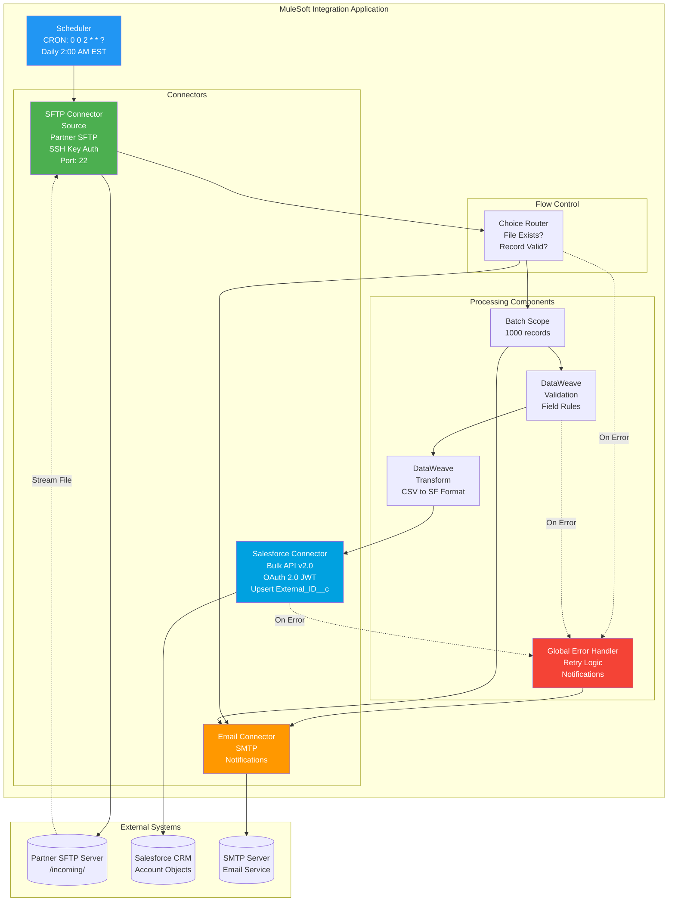
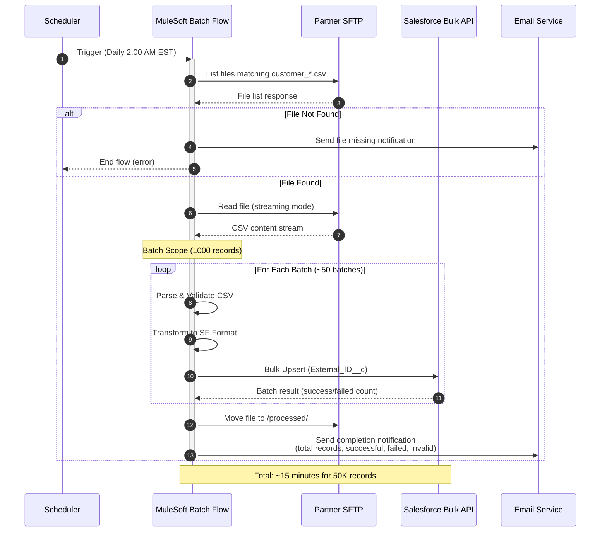
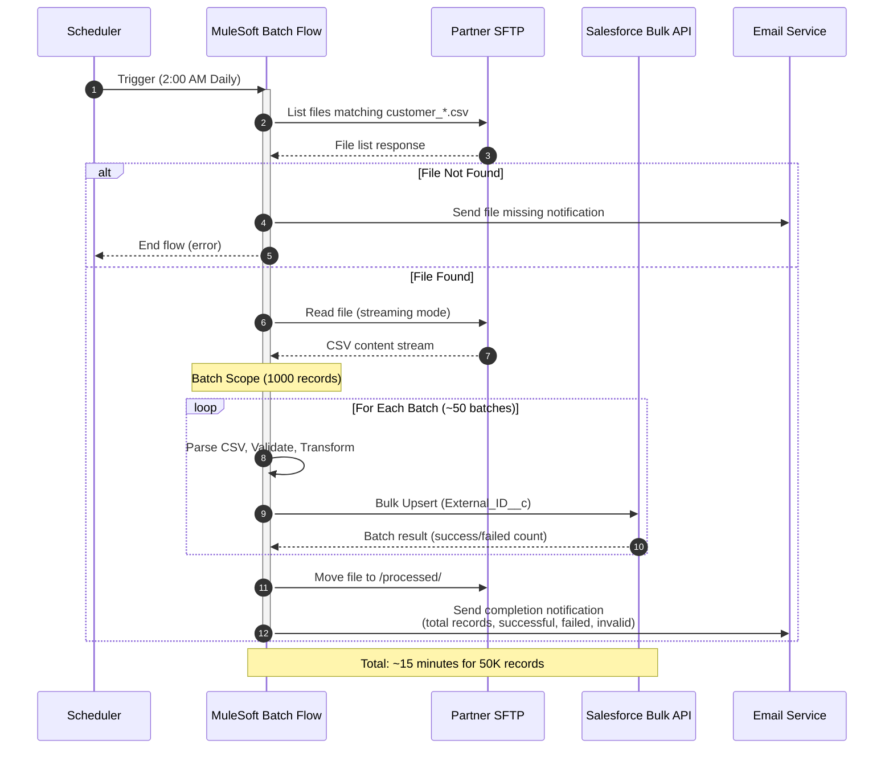
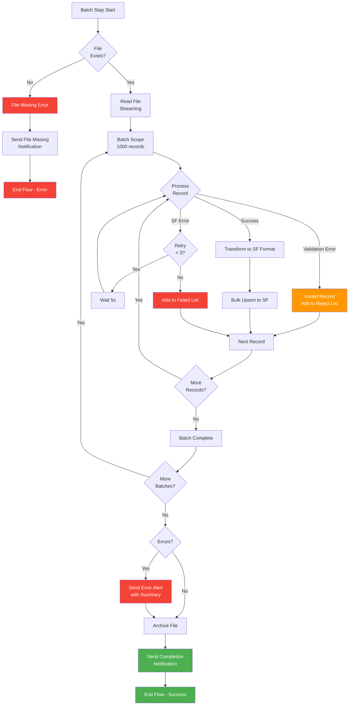

# Customer Data Sync - MuleSoft Technical Design

**Project:** Customer Data Batch Synchronization  
**Integration:** SFTP → Salesforce (Bulk)  
**Processing:** Batch (Daily)  
**Date:** December 2025

---

## 1. Project Overview

### 1.1 Business Context

A financial services organization needs to synchronize customer account data from a partner system to Salesforce CRM on a daily basis. The partner system generates daily CSV files containing customer account updates, which must be synchronized to Salesforce Account objects to maintain accurate customer records for sales and service teams.

**Key Business Drivers:**
- Maintain accurate customer data in Salesforce CRM
- Support daily synchronization of partner customer updates
- Enable sales teams to access up-to-date customer information
- Ensure data consistency between partner system and Salesforce
- Automate manual data synchronization processes

### 1.2 Integration Scope

| Aspect | Details |
|--------|---------|
| **Source System** | Partner SFTP Server |
| **Source Protocol** | SFTP (File Transfer) |
| **Source Format** | CSV (Comma-separated values) |
| **Source Location** | `/incoming/customer_*.csv` |
| **Source Schedule** | Daily file generation at 1:00 AM EST |
| **Target System** | Salesforce CRM |
| **Target Protocol** | REST API (Bulk API v2.0) |
| **Target Format** | Salesforce Account objects |
| **Target Operation** | Bulk Upsert on External_ID__c |
| **Integration Pattern** | Batch File Processing (Scheduled) |
| **Processing Schedule** | Daily at 2:00 AM EST (after source file generation) |

### 1.3 Volume and Performance Requirements

| Requirement | Value | Notes |
|-------------|-------|-------|
| **Daily Records** | ~50,000 records per day | Average daily customer updates |
| **File Size** | ~10-15 MB | CSV file size |
| **Processing Window** | 30 minutes maximum | Must complete before business hours |
| **Resource Constraint** | 0.2 vCore | CloudHub worker resource limit |
| **Peak Volume** | Up to 75,000 records | During month-end processing |
| **Availability** | 99.9% uptime | Daily synchronization critical for business operations |

### 1.4 Key Functional Requirements

| ID | Requirement | Priority | Description |
|----|-------------|----------|-------------|
| **FR-01** | Scheduled Processing | HIGH | Trigger integration daily at 2:00 AM EST using scheduler |
| **FR-02** | File Detection | HIGH | Check for input file existence; notify if missing |
| **FR-03** | File Validation | HIGH | Validate all records: mandatory fields, data types, format validation |
| **FR-04** | Invalid Record Handling | HIGH | Filter invalid records, continue processing valid ones, notify support team |
| **FR-05** | Bulk Upsert | HIGH | Upsert records to Salesforce using Bulk API v2.0 on External_ID__c |
| **FR-06** | Error Handling | HIGH | Graceful error handling with notifications and retry logic |
| **FR-07** | File Archival | MEDIUM | Archive processed files to `/processed/` folder |
| **FR-08** | Completion Notification | MEDIUM | Send email notification with processing summary |

### 1.5 Non-Functional Requirements

| Category | Requirement | Metric | Target |
|----------|-------------|--------|--------|
| **Performance** | File Processing Time | Duration | ≤ 15 minutes for 50K records |
| **Performance** | Resource Efficiency | CPU Usage | ≤ 0.2 vCore |
| **Reliability** | System Availability | Uptime | 99.9% monthly availability |
| **Reliability** | Data Accuracy | Error Rate | < 0.1% invalid records |
| **Security** | Authentication | Method | SFTP SSH key, Salesforce OAuth 2.0 JWT |
| **Maintainability** | Error Notification | Response Time | Immediate notification for failures |
| **Maintainability** | Audit Trail | Logging | Complete audit trail for all processed records |

---

## 2. Technical Architecture

### 2.1 Architecture Pattern
**Selected:** System API Only (Single Layer)

- **Rationale:** Point-to-point file synchronization (Partner SFTP → Salesforce)
- Single source, single target integration
- No complex business logic or multi-system orchestration required
- Minimal complexity for fastest implementation
- Lowest resource consumption (critical for 0.2 vCore constraint)
- Direct data transformation and bulk upsert

### 2.2 Processing Strategy
**Selected:** Batch Processing with Bulk API

| Aspect | Details |
|--------|---------|
| **Strategy** | Batch Processing with Salesforce Bulk API v2.0 |
| **Volume** | ~50,000 records/day |
| **File Size** | ~10-15 MB CSV files |
| **Processing Window** | 30 minutes maximum (2:00 AM - 2:30 AM EST) |
| **Resource Constraint** | 0.2 vCore CloudHub worker |
| **Justification** | Volume exceeds real-time threshold, Nightly window allows batch processing, Salesforce Bulk API optimizes large upserts, Batch processing optimizes throughput, Bulk API handles large datasets efficiently |

**Key Design Decisions:**
- **Streaming Read:** Process file line-by-line to handle large files without loading entire file into memory
- **Batch Scope:** Process records in batches of 1000 for optimal Bulk API performance
- **Bulk Upsert:** Use External_ID__c field for upsert operation (insert if new, update if exists)
- **Error Continuation:** Continue processing valid records even if invalid records are found
- **File Archival:** Move processed files to archive folder for audit trail

### 2.3 Connector Summary

| Connector | Configuration | Purpose |
|-----------|---------------|---------|
| **Scheduler** | CRON: `0 0 2 * * ?` (Daily 2:00 AM EST) | Trigger scheduled job |
| **SFTP (Source)** | Host: `sftp.partner.com`, Port: 22, Authentication: SSH Key, Path: `/incoming/customer_*.csv` | Read input customer file |
| **Salesforce** | OAuth 2.0 JWT Bearer, Bulk API v2.0, Upsert on `External_ID__c`, Batch Size: 1000 records | Bulk upsert Account records |
| **Email** | SMTP server configuration, Recipients: Support team | Send notifications (file missing, errors, completion) |

### 2.4 Connector Pattern Diagram

---

## 3. Flow Architecture

### 3.1 Main Flow: Customer Batch Sync Flow

**Flow Name:** `customer-batch-sync-flow`

| Step | Component | Action | Details |
|------|-----------|--------|---------|
| **1** | Scheduler | Trigger scheduled job | CRON: `0 0 2 * * ?` (Daily at 2:00 AM EST) |
| **2** | SFTP Connector | Check for input file | List files matching pattern: `customer_*.csv` in `/incoming/` folder |
| **3** | Choice Router | File exists? | Route based on file existence check |
| **4a** | Email Connector | Send file missing notification | If file not found: Send email to support team, end flow |
| **4b** | SFTP Connector | Read file (streaming) | If file found: Stream file content line-by-line to avoid memory issues |
| **5** | Batch Scope | Process in batches | Configure batch size: 1000 records per batch |
| **6** | DataWeave | Parse CSV | Parse CSV line to structured data |
| **7** | DataWeave | Validate record | Validate: All mandatory fields present, data types correct, format valid |
| **8** | Choice Router | Record valid? | Route based on validation result |
| **9a** | Logger + Variable | Log invalid record | Add invalid record to error collection variable |
| **9b** | DataWeave | Transform to Salesforce format | Transform CSV record to Salesforce Account object format |
| **10** | Salesforce Connector | Bulk Upsert | Upsert batch to Salesforce using Bulk API v2.0 on External_ID__c |
| **11** | Logger | Log batch result | Log success/failure count for batch |
| **12** | Continue | Next batch | Continue to next batch in Batch Scope |
| **13** | Choice Router | Invalid records found? | Check if error collection has records |
| **14** | Email Connector | Send validation error notification | If invalid records: Send email with invalid records list to support team |
| **15** | SFTP Connector | Archive source file | Move processed file to `/processed/` folder |
| **16** | Email Connector | Send completion notification | Send success email with processing summary (total records, successful, failed, invalid count) |

**Sequence Diagram:**

### 3.2 Error Handling Flow

**Flow Name:** `customer-batch-sync-error-handler`

| Step | Component | Action | Details |
|------|-----------|--------|---------|
| **1** | Error Handler | Catch all errors | Global error handler for system errors |
| **2** | Logger | Log error details | Log error message, stack trace, payload |
| **3** | Choice Router | Error type? | Route based on error category |
| **4a** | Retry Policy | Retry transient errors | SFTP connection errors: Retry 3 times with exponential backoff |
| **4b** | Retry Policy | Retry Salesforce errors | Salesforce API errors: Retry 3 times with 5-second delay |
| **5** | Email Connector | Send system error notification | Send error notification to support team with error details |
| **6** | File Connector | Move file to error folder | Move source file to `/error/` folder for manual review |
| **7** | End Flow | Terminate | End flow with error status |

### 3.3 Processing Strategy Details

**Batch Processing Approach:**
- Use Batch Scope to process records in batches of 1000
- Each batch processed independently through Bulk API
- Failed batches logged but processing continues
- Final summary includes all batch results

**Memory Management:**
- Streaming read prevents loading entire file into memory
- Batch Scope processes one batch at a time
- Variables cleared after each batch to free memory
- Error collection stored separately for reporting

**Performance Optimization:**
- Bulk API v2.0 optimizes large upsert operations
- Batch size of 1000 balances throughput and memory
- Streaming prevents memory issues with large files
- Efficient CSV parsing using DataWeave

### 3.4 Integration Sequence Diagram

---

## 4. Field Mapping Tables

### 4.1 Source to Target Field Mapping

**Source Format:** CSV file from Partner SFTP  
**Target Format:** Salesforce Account object  
**Transformation:** CSV to Salesforce Account with validation and lookups

| Source Field | Target Field | Transformation | Validation Rules | Notes |
|--------------|--------------|----------------|------------------|-------|
| `customer_id` | `External_ID__c` | Direct copy | Mandatory, non-empty string, unique | Used for upsert operation |
| `company_name` | `Name` | Trim whitespace, max 255 chars | Mandatory, non-empty string | Account name |
| `billing_street` | `BillingStreet` | Direct copy | Optional | Address line 1 |
| `billing_city` | `BillingCity` | Direct copy | Optional | City |
| `billing_state` | `BillingState` | Uppercase, 2-char code | Optional, must be valid US state code | State abbreviation |
| `billing_zip` | `BillingPostalCode` | Direct copy | Optional, format: 5 or 9 digits | ZIP code |
| `billing_country` | `BillingCountry` | Lookup: ISO code → Country name | Optional, default: "USA" | Country name |
| `phone` | `Phone` | Format: +1-XXX-XXX-XXXX | Optional, valid phone format | Phone number |
| `industry_code` | `Industry` | Lookup: code → picklist value | Optional, must be valid picklist value | Industry picklist |
| `annual_revenue` | `AnnualRevenue` | Parse as Decimal | Optional, numeric, ≥ 0 | Revenue in USD |
| `employee_count` | `NumberOfEmployees` | Parse as Integer | Optional, numeric, ≥ 0 | Employee count |

### 4.2 Output File Structure

**Not Applicable:** This integration writes directly to Salesforce Account objects via Bulk API, not to files.

### 4.3 Lookup Tables

**Industry Code Mapping:**

| Source Code | Salesforce Picklist Value |
|-------------|---------------------------|
| `MFG` | Manufacturing |
| `TECH` | Technology |
| `FIN` | Finance |
| `HLTH` | Healthcare |
| `RET` | Retail |
| `EDU` | Education |
| `GOV` | Government |
| `CONS` | Consulting |
| (other) | Other |

**Country Code Mapping:**

| ISO Code | Country Name |
|----------|--------------|
| `US` | USA |
| `CA` | Canada |
| `MX` | Mexico |
| `GB` | United Kingdom |
| (other) | Lookup from ISO standard |

### 4.4 Validation Rules

| Field | Validation Rule | Error Message | Action |
|-------|----------------|---------------|--------|
| **customer_id** | Non-empty string, length > 0 | "customer_id is mandatory" | Reject record |
| **company_name** | Non-empty string, length > 0, max 255 chars | "company_name is mandatory and must be ≤ 255 characters" | Reject record |
| **billing_state** | If provided, must be 2-char valid US state code | "Invalid billing_state format" | Reject record |
| **billing_zip** | If provided, must be 5 or 9 digits | "Invalid billing_zip format" | Reject record |
| **phone** | If provided, must be valid phone format | "Invalid phone format" | Reject record |
| **industry_code** | If provided, must exist in lookup table | "Invalid industry_code" | Default to "Other" |
| **annual_revenue** | If provided, must be numeric, ≥ 0 | "annual_revenue must be a positive number" | Reject record |
| **employee_count** | If provided, must be integer, ≥ 0 | "employee_count must be a non-negative integer" | Reject record |

**Validation Flow:**
- Validation occurs during batch processing
- Invalid records are collected in error collection variable
- Processing continues with valid records
- Error notification sent after processing completes with invalid records list

---

## 5. Error Handling Strategy

### 5.1 Error Categories

| Error Category | Error Type | Examples | Severity | Retry Strategy |
|----------------|------------|----------|----------|---------------|
| **File Not Found** | FILE:NOT_FOUND | Source file missing at 2:00 AM | HIGH | No retry - Send notification immediately |
| **Validation Error** | VALIDATION:INVALID_RECORD | Missing customer_id, invalid format, invalid industry_code | MEDIUM | No retry - Collect invalid records, continue processing |
| **Transform Error** | TRANSFORM:PARSE_ERROR | CSV parse error, data type conversion error | MEDIUM | No retry - Collect invalid records, continue processing |
| **SFTP Connection Error** | CONNECTIVITY:SFTP_CONNECTION | SFTP server unreachable, authentication failure | HIGH | Retry 3 times with exponential backoff (1s, 2s, 4s) |
| **SFTP Read Error** | CONNECTIVITY:SFTP_READ | File read timeout, connection lost during read | HIGH | Retry 3 times, move file to error folder on failure |
| **Salesforce API Error** | CONNECTIVITY:SALESFORCE_API | API timeout, rate limit exceeded, authentication failure | HIGH | Retry 3 times with 5-second delay |
| **Bulk API Limit** | CONNECTIVITY:BULK_API_LIMIT | Bulk API concurrent job limit exceeded | MEDIUM | Wait and retry, throttle requests |
| **Memory Error** | SYSTEM:OUT_OF_MEMORY | Insufficient memory for batch processing | CRITICAL | No retry - Fail fast, notify immediately |
| **Email Notification Error** | NOTIFICATION:EMAIL_FAILED | SMTP server unreachable | LOW | Retry 2 times, log error (non-blocking) |

### 5.2 Retry Patterns

| Error Type | Max Retries | Initial Delay | Backoff Strategy | Max Delay |
|------------|-------------|---------------|-----------------|-----------|
| **SFTP Connection** | 3 | 1 second | Exponential (2x) | 4 seconds |
| **SFTP Read** | 3 | 1 second | Exponential (2x) | 4 seconds |
| **Salesforce API** | 3 | 5 seconds | Fixed interval | 5 seconds |
| **Bulk API Limit** | 5 | 30 seconds | Fixed interval | 30 seconds |
| **Email Notification** | 2 | 5 seconds | Fixed interval | 5 seconds |

**Retry Logic:**
- Transient errors (connectivity, timeouts): Retry with exponential backoff or fixed delay
- Validation errors: No retry - collect and report
- System errors (memory): No retry - fail fast and notify
- Bulk API limits: Wait and retry with longer delay

### 5.3 Error Notification Strategy

| Error Scenario | Notification Type | Recipients | Content | Priority |
|----------------|-------------------|------------|---------|----------|
| **File Missing** | Email | Support team | File name, expected location, timestamp | HIGH |
| **Validation Errors** | Email | Support team | Count of invalid records, sample records, error details | MEDIUM |
| **System Errors** | Email | Support team + On-call engineer | Error message, stack trace, file location, processing status | CRITICAL |
| **Processing Complete** | Email | Support team | Total records processed, successful count, failed count, invalid count, processing time | LOW |

**Notification Content Template:**
- **Subject:** `[Customer Sync] {Error Type} - {Date}`
- **Body:** Error details, file information, processing statistics, recommended actions

### 5.4 Error Handling Flow Details

**Global Error Handler:**
- Catches all unhandled exceptions
- Logs error details with full stack trace
- Moves source file to `/error/` folder for manual review
- Sends error notification to support team
- Terminates flow with error status

**Validation Error Handling:**
- Errors collected during batch processing
- Processing continues with valid records
- Invalid records logged with details
- Notification sent after batch completion
- Invalid records included in error report

**Connectivity Error Handling:**
- Retry with exponential backoff or fixed delay
- After max retries: Move file to error folder
- Send error notification
- Flow terminates with error status

### 5.5 Error Handling Flow Diagram

### 5.6 Error Recovery Procedures

| Scenario | Recovery Action |
|----------|-----------------|
| **File Missing** | Support team investigates partner system file generation, manually triggers reprocessing if needed |
| **Validation Errors** | Support team reviews invalid records, fixes source data, reprocesses file |
| **SFTP Connection Failure** | Support team checks SFTP server status, retries integration manually |
| **Salesforce API Failure** | Support team checks Salesforce status, reviews API limits, retries integration manually |
| **Bulk API Limit** | Support team waits for limit reset, retries integration manually or adjusts batch size |
| **System Errors** | Support team reviews logs, fixes root cause, reprocesses file from error folder |

---
