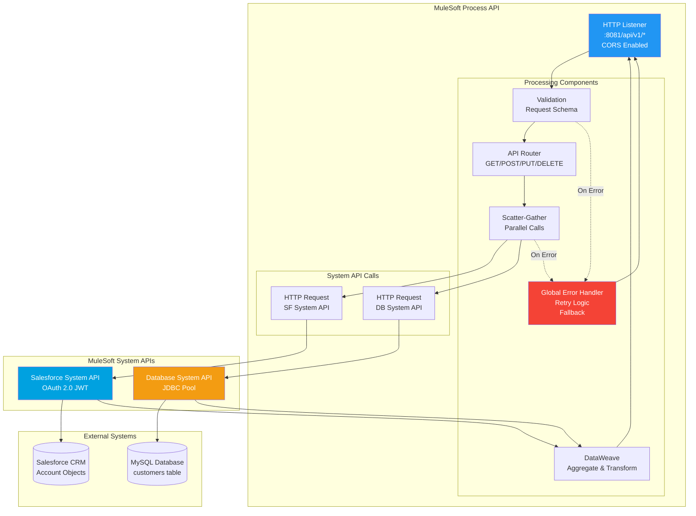
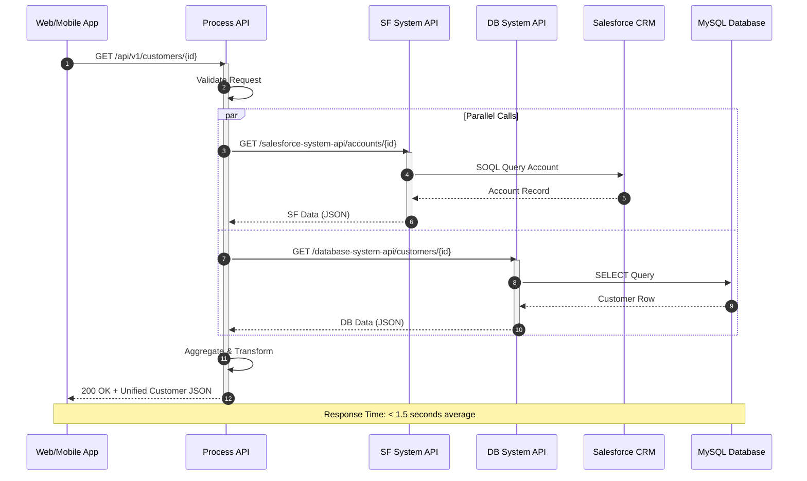
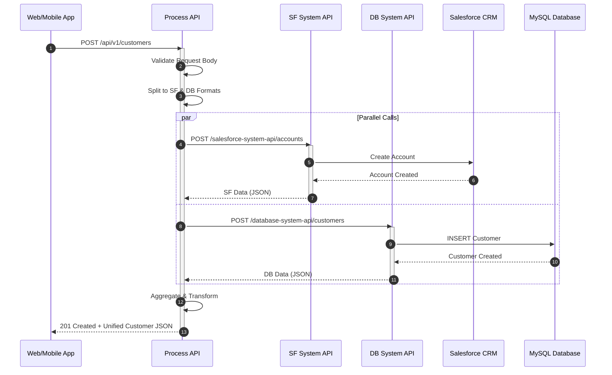
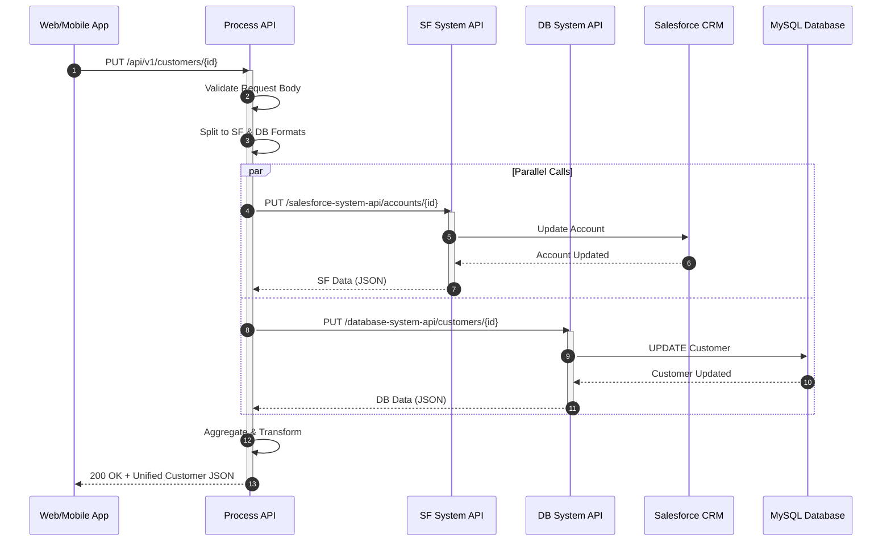
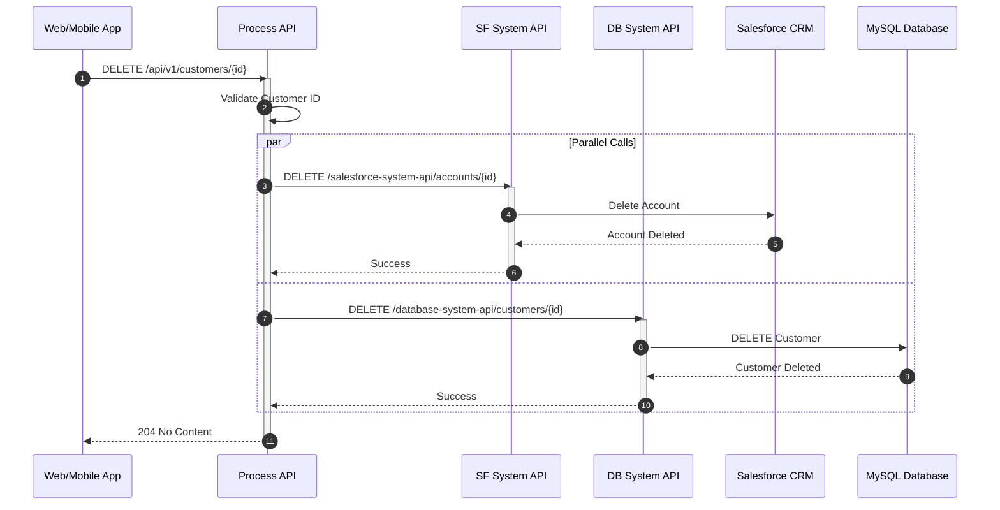
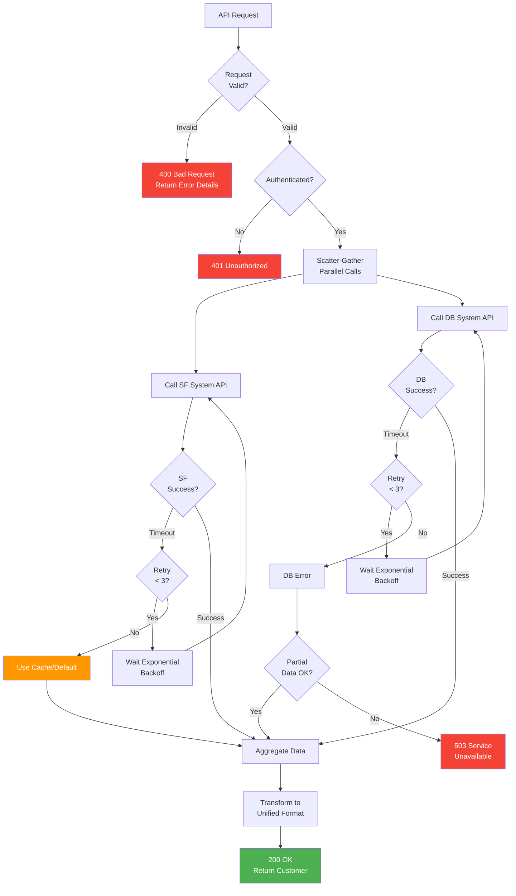

# Customer API - MuleSoft Technical Design

**Project:** Customer Management API  
**Integration:** Multi-system orchestration (Salesforce + Database)  
**Processing:** Real-Time  
**Date:** December 2025

---

## 1. Project Overview

### 1.1 Business Context

A financial services organization needs to provide a unified Customer 360 view to web and mobile applications by aggregating customer data from multiple backend systems. The solution must combine Salesforce CRM account data with internal MySQL database customer information to provide a comprehensive customer profile for sales and service teams.

**Key Business Drivers:**
- Provide unified customer view across multiple systems
- Support web and mobile application consumers
- Enable real-time access to customer information
- Reduce complexity for frontend applications
- Improve customer service response times
- Support future API consumers with reusable system APIs

### 1.2 Integration Scope

| Aspect | Details |
|--------|---------|
| **Consumers** | Web Application, Mobile App |
| **Source Systems** | Salesforce CRM (Account objects), MySQL Database (customer table) |
| **Source Protocol** | REST API (Salesforce), JDBC (MySQL) |
| **Source Format** | JSON (Salesforce), Relational (MySQL) |
| **Target Protocol** | REST API (HTTP/HTTPS) |
| **Target Format** | JSON (Unified customer object) |
| **Integration Pattern** | System + Process API (2-Layer) |
| **Processing** | Real-time synchronous API |
| **Response Time** | < 3 seconds (95th percentile) |

### 1.3 Volume and Performance Requirements

| Requirement | Value | Notes |
|-------------|-------|-------|
| **Peak Requests/Hour** | ~1,000 requests/hour | Peak business hours |
| **Average Requests/Hour** | ~500 requests/hour | Normal business hours |
| **Concurrent Users** | Up to 50 concurrent users | Web and mobile applications |
| **Response Time** | < 3 seconds (95th percentile) | End-to-end API response time |
| **Response Time Target** | < 1.5 seconds (average) | Optimal user experience |
| **Availability** | 99.9% uptime | Critical for customer service operations |
| **Resource Constraint** | 0.2 vCore | CloudHub worker resource limit |

### 1.4 Key Functional Requirements

| ID | Requirement | Priority | Description |
|----|-------------|----------|-------------|
| **FR-01** | Customer Retrieval | HIGH | GET customer by ID with unified view from Salesforce and Database |
| **FR-02** | Customer List | HIGH | GET list of customers with pagination support |
| **FR-03** | Customer Creation | HIGH | POST create customer in both Salesforce and Database |
| **FR-04** | Customer Update | HIGH | PUT update customer in both Salesforce and Database |
| **FR-05** | Customer Deletion | MEDIUM | DELETE customer from both systems |
| **FR-06** | Data Aggregation | HIGH | Aggregate data from Salesforce and Database into unified response |
| **FR-07** | Parallel Processing | HIGH | Call Salesforce and Database APIs in parallel for performance |
| **FR-08** | Error Handling | HIGH | Graceful error handling with partial data fallback |

### 1.5 Non-Functional Requirements

| Category | Requirement | Metric | Target |
|----------|-------------|--------|--------|
| **Performance** | API Response Time | 95th percentile | < 3 seconds |
| **Performance** | API Response Time | Average | < 1.5 seconds |
| **Performance** | Resource Efficiency | CPU Usage | ≤ 0.2 vCore |
| **Reliability** | System Availability | Uptime | 99.9% monthly availability |
| **Reliability** | Fault Tolerance | Partial Data | Return partial data if one system fails |
| **Security** | Authentication | Method | OAuth 2.0 / API Key |
| **Security** | Authorization | Method | Role-based access control |
| **Maintainability** | API Versioning | Strategy | URL versioning (/api/v1/) |

---

## 2. Technical Architecture

### 2.1 Architecture Pattern
**Selected:** System + Process API (2-Layer)

- **Rationale:** Multi-system orchestration requiring abstraction layer
- Two backend systems (Salesforce CRM + MySQL Database) need unified access
- Business logic for data aggregation and transformation
- Reusable system APIs for future consumers
- Separation of concerns: System APIs handle system-specific logic, Process API handles business logic

**Layer Breakdown:**
- **Process API:** Customer Process API - Business logic, aggregation, orchestration
- **System API 1:** Salesforce System API - Salesforce Account CRUD operations
- **System API 2:** Database System API - MySQL customer operations

### 2.2 Processing Strategy
**Selected:** Real-Time Synchronous Processing

| Aspect | Details |
|--------|---------|
| **Strategy** | Real-Time Synchronous API Processing |
| **Pattern** | Scatter-Gather for parallel system calls |
| **Response Time** | < 3 seconds (95th percentile) |
| **Resource Constraint** | 0.2 vCore CloudHub worker |
| **Justification** | Interactive user experience required, Low latency expectation (< 3 seconds), Synchronous response needed for web/mobile apps, Parallel calls optimize response time, Scatter-Gather pattern enables concurrent system access |

**Key Design Decisions:**
- **Parallel Processing:** Use Scatter-Gather to call Salesforce and Database APIs concurrently
- **Caching:** Implement caching for Salesforce data to handle timeouts gracefully
- **Fallback Strategy:** Return partial data if one system fails (Salesforce timeout → use cache, Database timeout → return Salesforce data only)
- **Connection Pooling:** Use database connection pool (size: 10) for efficient MySQL access
- **API Versioning:** URL-based versioning (/api/v1/) for future compatibility

### 2.3 Connector Summary

| Connector | Configuration | Purpose |
|-----------|---------------|---------|
| **HTTP Listener** | Port: 8081, Base Path: `/api/v1`, CORS: Enabled, Methods: GET, POST, PUT, DELETE | Receive API requests from web/mobile apps |
| **Salesforce** | OAuth 2.0 JWT Bearer, API Version: v58.0, Connection Pool: Default | Access Salesforce Account objects |
| **Database (MySQL)** | JDBC Connection, MySQL 8.0, Connection Pool: 10, Connection String: Configured | Access MySQL customer table |
| **HTTP Request (System APIs)** | Internal API calls, Base URLs: Configured per environment | Call System APIs (Salesforce System API, Database System API) |

### 2.4 Connector Pattern Diagram



---

## 3. Flow Architecture

### 3.1 Process API Flow: Customer Process API

**Flow Name:** `customer-process-api-flow`

#### GET /customers/{id} - Get Customer by ID

| Step | Component | Action | Details |
|------|-----------|--------|---------|
| **1** | HTTP Listener | Receive GET request | Path: `/api/v1/customers/{id}` |
| **2** | API Router | Route to GET operation | Route based on HTTP method |
| **3** | Validation | Validate request | Validate customer ID format, authentication token |
| **4** | Scatter-Gather | Parallel system calls | Call Salesforce System API and Database System API concurrently |
| **5a** | HTTP Request | Call Salesforce System API | GET `/salesforce-system-api/accounts/{id}` |
| **5b** | HTTP Request | Call Database System API | GET `/database-system-api/customers/{id}` |
| **6** | DataWeave | Aggregate responses | Combine Salesforce Account and Database customer data |
| **7** | DataWeave | Transform to unified format | Transform to unified customer JSON response |
| **8** | HTTP Response | Return unified customer | Status: 200 OK, Body: Unified customer JSON |

**Sequence Diagram:**



#### POST /customers - Create Customer

| Step | Component | Action | Details |
|------|-----------|--------|---------|
| **1** | HTTP Listener | Receive POST request | Path: `/api/v1/customers` |
| **2** | API Router | Route to POST operation | Route based on HTTP method |
| **3** | Validation | Validate request body | Validate JSON schema, required fields |
| **4** | DataWeave | Split request | Split unified request into Salesforce and Database formats |
| **5** | Scatter-Gather | Parallel system calls | Call Salesforce System API and Database System API concurrently |
| **6a** | HTTP Request | Call Salesforce System API | POST `/salesforce-system-api/accounts` |
| **6b** | HTTP Request | Call Database System API | POST `/database-system-api/customers` |
| **7** | DataWeave | Aggregate responses | Combine Salesforce and Database responses |
| **8** | HTTP Response | Return created customer | Status: 201 Created, Body: Unified customer JSON |

**Sequence Diagram:**



#### PUT /customers/{id} - Update Customer

| Step | Component | Action | Details |
|------|-----------|--------|---------|
| **1** | HTTP Listener | Receive PUT request | Path: `/api/v1/customers/{id}` |
| **2** | API Router | Route to PUT operation | Route based on HTTP method |
| **3** | Validation | Validate request body | Validate JSON schema, customer ID exists |
| **4** | DataWeave | Split request | Split unified request into Salesforce and Database formats |
| **5** | Scatter-Gather | Parallel system calls | Call Salesforce System API and Database System API concurrently |
| **6a** | HTTP Request | Call Salesforce System API | PUT `/salesforce-system-api/accounts/{id}` |
| **6b** | HTTP Request | Call Database System API | PUT `/database-system-api/customers/{id}` |
| **7** | DataWeave | Aggregate responses | Combine Salesforce and Database responses |
| **8** | HTTP Response | Return updated customer | Status: 200 OK, Body: Unified customer JSON |

**Sequence Diagram:**



#### DELETE /customers/{id} - Delete Customer

| Step | Component | Action | Details |
|------|-----------|--------|---------|
| **1** | HTTP Listener | Receive DELETE request | Path: `/api/v1/customers/{id}` |
| **2** | API Router | Route to DELETE operation | Route based on HTTP method |
| **3** | Validation | Validate request | Validate customer ID exists |
| **4** | Scatter-Gather | Parallel system calls | Call Salesforce System API and Database System API concurrently |
| **5a** | HTTP Request | Call Salesforce System API | DELETE `/salesforce-system-api/accounts/{id}` |
| **5b** | HTTP Request | Call Database System API | DELETE `/database-system-api/customers/{id}` |
| **6** | HTTP Response | Return success | Status: 204 No Content |

**Sequence Diagram:**



### 3.2 System APIs

#### Salesforce System API: salesforce-system-api

**Purpose:** Abstract Salesforce Account CRUD operations

| Operation | Endpoint | Backend Call |
|-----------|----------|-------------|
| **GET** | `/salesforce-system-api/accounts/{id}` | Salesforce SOQL Query: `SELECT Id, Name, BillingStreet, ... FROM Account WHERE Id = :id` |
| **POST** | `/salesforce-system-api/accounts` | Salesforce Create Account |
| **PUT** | `/salesforce-system-api/accounts/{id}` | Salesforce Update Account |
| **DELETE** | `/salesforce-system-api/accounts/{id}` | Salesforce Delete Account |

#### Database System API: database-system-api

**Purpose:** Abstract MySQL customer CRUD operations

| Operation | Endpoint | Backend Call |
|-----------|----------|-------------|
| **GET** | `/database-system-api/customers/{id}` | MySQL SELECT: `SELECT * FROM customers WHERE id = :id` |
| **POST** | `/database-system-api/customers` | MySQL INSERT into customers table |
| **PUT** | `/database-system-api/customers/{id}` | MySQL UPDATE customers table |
| **DELETE** | `/database-system-api/customers/{id}` | MySQL DELETE from customers table |

### 3.3 Error Handling Flow

**Flow Name:** `customer-api-error-handler`

| Step | Component | Action | Details |
|------|-----------|--------|---------|
| **1** | Error Handler | Catch all errors | Global error handler for API errors |
| **2** | Logger | Log error details | Log error message, stack trace, request payload |
| **3** | Choice Router | Error type? | Route based on error category |
| **4a** | HTTP Response | Validation Error | Status: 400 Bad Request, Body: Error details |
| **4b** | HTTP Response | Authentication Error | Status: 401 Unauthorized |
| **4c** | HTTP Response | Not Found | Status: 404 Not Found |
| **4d** | Retry Policy | Transient Error | Retry Salesforce/Database calls (3 times with exponential backoff) |
| **4e** | HTTP Response | Service Unavailable | Status: 503 Service Unavailable (after retries exhausted) |
| **5** | End Flow | Terminate | End flow with error status |

---

## 4. Field Mapping Tables

### 4.1 API Endpoints

| Method | Endpoint | Description | Request Body | Response Body |
|--------|----------|-------------|--------------|---------------|
| **GET** | `/api/v1/customers` | List customers | Query params: page, limit | Array of customer objects |
| **GET** | `/api/v1/customers/{id}` | Get customer by ID | - | Customer object |
| **POST** | `/api/v1/customers` | Create customer | Customer object | Created customer object |
| **PUT** | `/api/v1/customers/{id}` | Update customer | Customer object | Updated customer object |
| **DELETE** | `/api/v1/customers/{id}` | Delete customer | - | 204 No Content |

### 4.2 Response Aggregation Mapping

**Source Systems:** Salesforce Account + MySQL Customer  
**Target:** Unified Customer JSON Response

| Salesforce Field | Database Field | API Response Field | Transformation | Notes |
|------------------|----------------|-------------------|----------------|-------|
| `Id` | `sf_account_id` | `id` | Use Salesforce Id if available, else Database id | Primary identifier |
| `Name` | `company_name` | `name` | Prefer Salesforce Name, fallback to Database company_name | Required field |
| `BillingStreet` | `address_line1` | `address.street` | Combine if both available | Nested object |
| `BillingCity` | `city` | `address.city` | Prefer Salesforce, fallback to Database | Nested object |
| `BillingState` | `state` | `address.state` | Prefer Salesforce, fallback to Database | Nested object |
| `BillingPostalCode` | `zip_code` | `address.zip` | Prefer Salesforce, fallback to Database | Nested object |
| `BillingCountry` | `country` | `address.country` | Prefer Salesforce, fallback to Database | Nested object |
| `Phone` | `phone_number` | `phone` | Prefer Salesforce, fallback to Database | - |
| `Industry` | `industry_code` | `industry` | Prefer Salesforce, fallback to Database | - |
| - | `internal_notes` | `notes` | Database only | Internal field |
| - | `credit_limit` | `creditLimit` | Database only, parse as Decimal | Internal field |
| `AnnualRevenue` | - | `revenue` | Salesforce only, parse as Decimal | Revenue in USD |
| `CreatedDate` | `created_at` | `createdAt` | Prefer Salesforce, fallback to Database | ISO 8601 format |
| `LastModifiedDate` | `updated_at` | `updatedAt` | Prefer Salesforce, fallback to Database | ISO 8601 format |

### 4.3 Request Transformation Mapping

**POST/PUT Request:** Unified Customer JSON → Split to Salesforce + Database formats

| API Request Field | Salesforce Field | Database Field | Transformation | Notes |
|-------------------|-----------------|----------------|----------------|-------|
| `name` | `Name` | `company_name` | Direct copy | Required |
| `address.street` | `BillingStreet` | `address_line1` | Direct copy | Optional |
| `address.city` | `BillingCity` | `city` | Direct copy | Optional |
| `address.state` | `BillingState` | `state` | Direct copy | Optional |
| `address.zip` | `BillingPostalCode` | `zip_code` | Direct copy | Optional |
| `address.country` | `BillingCountry` | `country` | Direct copy | Optional |
| `phone` | `Phone` | `phone_number` | Direct copy | Optional |
| `industry` | `Industry` | `industry_code` | Direct copy | Optional |
| `creditLimit` | - | `credit_limit` | Database only | Internal field |
| `revenue` | `AnnualRevenue` | - | Salesforce only | Revenue in USD |
| `notes` | - | `internal_notes` | Database only | Internal field |

### 4.4 Validation Rules

| Field | Validation Rule | Error Message | HTTP Status |
|-------|----------------|---------------|-------------|
| **id (GET/PUT/DELETE)** | Must be valid format (18-char Salesforce ID or UUID) | "Invalid customer ID format" | 400 Bad Request |
| **name (POST/PUT)** | Required, non-empty string, max 255 chars | "name is required and must be ≤ 255 characters" | 400 Bad Request |
| **phone** | If provided, must be valid phone format | "Invalid phone format" | 400 Bad Request |
| **creditLimit** | If provided, must be numeric, ≥ 0 | "creditLimit must be a positive number" | 400 Bad Request |
| **revenue** | If provided, must be numeric, ≥ 0 | "revenue must be a positive number" | 400 Bad Request |

---

## 5. Error Handling Strategy

### 5.1 Error Categories

| Error Category | Error Type | HTTP Status | Handling | Retry Strategy |
|----------------|------------|-------------|----------|---------------|
| **Validation Error** | VALIDATION:INVALID_REQUEST | 400 | Return error details in response body | No retry |
| **Authentication Error** | AUTH:UNAUTHORIZED | 401 | Return unauthorized message | No retry |
| **Authorization Error** | AUTH:FORBIDDEN | 403 | Return forbidden message | No retry |
| **Not Found** | RESOURCE:NOT_FOUND | 404 | Return not found message | No retry |
| **Salesforce Timeout** | CONNECTIVITY:SF_TIMEOUT | 200 (partial) | Use cached data or default values | Retry 3 times with exponential backoff |
| **Database Timeout** | CONNECTIVITY:DB_TIMEOUT | 503 | Return Salesforce data only (partial) or 503 | Retry 3 times with exponential backoff |
| **Salesforce API Error** | CONNECTIVITY:SF_API_ERROR | 503 | Use fallback cache or return 503 | Retry 3 times |
| **Database Connection Error** | CONNECTIVITY:DB_CONNECTION | 503 | Return Salesforce data only or 503 | Retry 3 times |
| **Rate Limit** | CONNECTIVITY:RATE_LIMIT | 429 | Return rate limit message | No retry, client should retry |
| **Internal Server Error** | SYSTEM:INTERNAL_ERROR | 500 | Log error, return generic message | No retry |

### 5.2 Retry Patterns

| Error Type | Max Retries | Initial Delay | Backoff Strategy | Max Delay |
|------------|-------------|---------------|-----------------|-----------|
| **Salesforce Timeout** | 3 | 1 second | Exponential (2x) | 4 seconds |
| **Database Timeout** | 3 | 1 second | Exponential (2x) | 4 seconds |
| **Salesforce API Error** | 3 | 1 second | Exponential (2x) | 4 seconds |
| **Database Connection Error** | 3 | 1 second | Exponential (2x) | 4 seconds |

**Retry Logic:**
- Transient errors (timeouts, connection errors): Retry with exponential backoff
- Validation errors: No retry - return error immediately
- Rate limits: No retry - return 429, client should retry
- System errors: No retry - return 500

### 5.3 Error Notification Strategy

| Error Scenario | Notification Type | Recipients | Content | Priority |
|----------------|-------------------|------------|---------|----------|
| **API Errors (4xx)** | HTTP Response | API Client | Error message in response body | N/A (client handles) |
| **System Errors (5xx)** | Logging + Monitoring | DevOps team | Error message, stack trace, request details | HIGH |
| **Repeated Failures** | Alert | On-call engineer | Error pattern, affected endpoints, frequency | CRITICAL |

**Error Response Format:**
```json
{
  "error": {
    "code": "ERROR_CODE",
    "message": "Human-readable error message",
    "details": "Additional error details",
    "timestamp": "2025-12-15T10:30:00Z"
  }
}
```

### 5.4 Error Handling Flow Details

**Global Error Handler:**
- Catches all unhandled exceptions
- Logs error details with full stack trace and request context
- Returns appropriate HTTP status code
- Includes error details in response body (for 4xx errors)
- Sends alerts for critical errors (5xx)

**Partial Data Handling:**
- If Salesforce call succeeds but Database call fails: Return Salesforce data only
- If Database call succeeds but Salesforce call fails: Use cache/fallback for Salesforce, return Database data
- If both calls fail after retries: Return 503 Service Unavailable

**Fallback Strategy:**
- Salesforce timeout: Use cached Salesforce data (if available) or return partial response
- Database timeout: Return Salesforce data only (partial response)
- Both timeout: Return 503 Service Unavailable

### 5.5 Error Handling Flow Diagram



### 5.6 Error Recovery Procedures

| Scenario | Recovery Action |
|----------|-----------------|
| **Salesforce Timeout** | System retries automatically; if fails, uses cache/fallback; support team reviews Salesforce status |
| **Database Timeout** | System retries automatically; if fails, returns partial data; support team reviews database status |
| **Authentication Failure** | Client must refresh authentication token; no automatic retry |
| **Rate Limit** | Client must implement exponential backoff retry; API returns 429 immediately |
| **System Errors** | Support team reviews logs, fixes root cause, monitors for recurrence |

---
