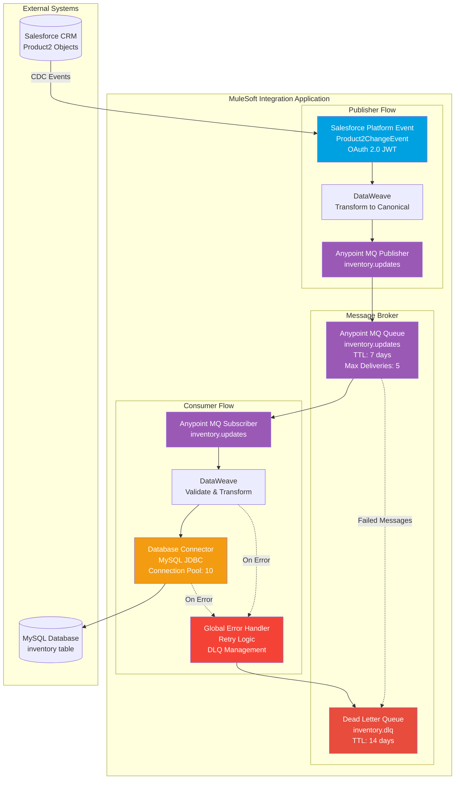
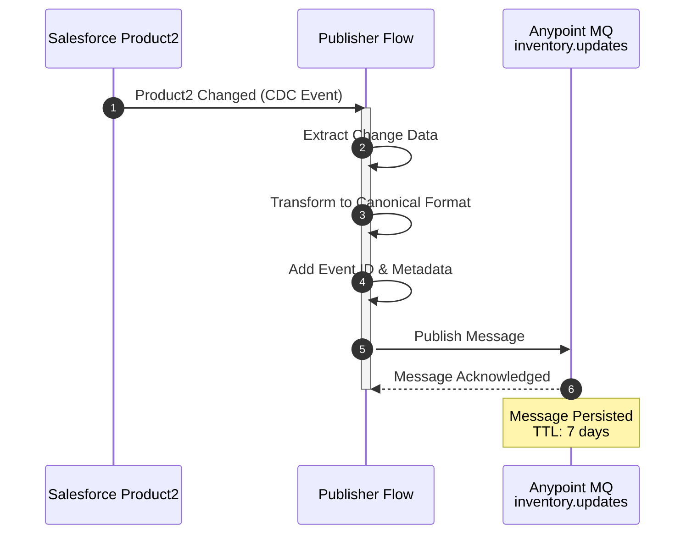
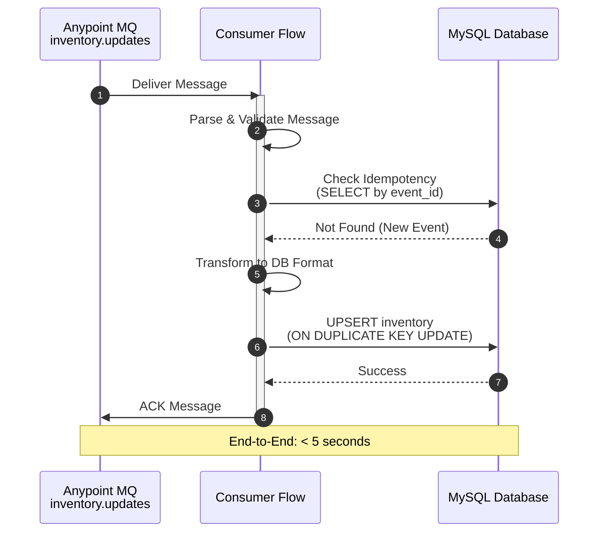
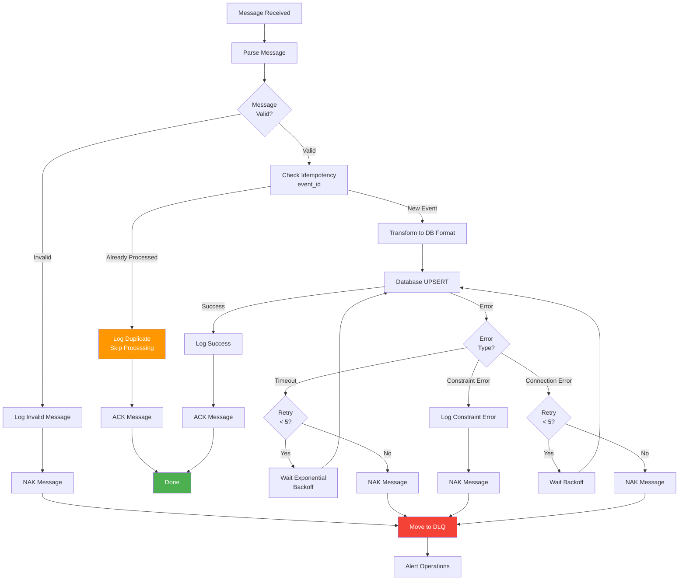

# Inventory Sync - MuleSoft Technical Design

**Project:** Real-Time Inventory Synchronization  
**Integration:** Salesforce CDC → Anypoint MQ → Database  
**Processing:** Event-Driven  
**Date:** December 2025

---

## 1. Project Overview

### 1.1 Business Context

A retail organization needs to synchronize inventory changes from Salesforce Product2 objects to a warehouse MySQL database in near real-time. When product inventory quantities change in Salesforce (due to sales, returns, or manual adjustments), these changes must be immediately reflected in the warehouse database to ensure accurate inventory tracking and prevent overselling.

**Key Business Drivers:**
- Real-time inventory visibility across systems
- Prevent overselling by maintaining accurate inventory counts
- Support warehouse operations with up-to-date product information
- Decouple Salesforce from warehouse database for reliability
- Enable scalable processing of inventory updates
- Support audit trail of all inventory changes

### 1.2 Integration Scope

| Aspect | Details |
|--------|---------|
| **Source System** | Salesforce CRM (Product2 object) |
| **Source Protocol** | Platform Events (Change Data Capture - CDC) |
| **Source Format** | JSON (Salesforce Platform Event) |
| **Source Trigger** | Product2 object changes (create, update, delete) |
| **Message Broker** | Anypoint MQ |
| **Message Queue** | `inventory.updates` queue |
| **Dead Letter Queue** | `inventory.dlq` queue |
| **Target System** | Warehouse MySQL Database |
| **Target Protocol** | JDBC |
| **Target Format** | Relational (inventory table) |
| **Target Operation** | UPSERT on product_id |
| **Integration Pattern** | Event-Driven with Message Broker (System + Process) |
| **Processing** | Asynchronous, near real-time (< 5 seconds end-to-end) |

### 1.3 Volume and Performance Requirements

| Requirement | Value | Notes |
|-------------|-------|-------|
| **Average Events/Hour** | ~500 events/hour | Normal business hours |
| **Peak Events/Hour** | ~2,000 events/hour | During sales events, promotions |
| **End-to-End Latency** | < 5 seconds | From Salesforce change to database update |
| **Message Processing Time** | < 2 seconds per message | Consumer processing time |
| **Availability** | 99.9% uptime | Critical for inventory accuracy |
| **Message Persistence** | 7 days (main queue), 14 days (DLQ) | Message retention for audit |
| **Resource Constraint** | 0.2 vCore | CloudHub worker resource limit |

### 1.4 Key Functional Requirements

| ID | Requirement | Priority | Description |
|----|-------------|----------|-------------|
| **FR-01** | CDC Event Capture | HIGH | Capture Product2 object changes via Salesforce Platform Events |
| **FR-02** | Event Transformation | HIGH | Transform CDC events to canonical message format |
| **FR-03** | Message Publishing | HIGH | Publish messages to Anypoint MQ queue |
| **FR-04** | Message Consumption | HIGH | Consume messages from Anypoint MQ queue |
| **FR-05** | Database Synchronization | HIGH | UPSERT inventory records to MySQL database |
| **FR-06** | Idempotency | HIGH | Prevent duplicate processing using event ID |
| **FR-07** | Error Handling | HIGH | Handle errors gracefully with retry and DLQ |
| **FR-08** | Message Acknowledgment | HIGH | ACK messages only after successful database update |

### 1.5 Non-Functional Requirements

| Category | Requirement | Metric | Target |
|----------|-------------|--------|--------|
| **Performance** | End-to-End Latency | Duration | < 5 seconds (95th percentile) |
| **Performance** | Message Processing Time | Duration | < 2 seconds per message |
| **Reliability** | Message Delivery | Guarantee | At-least-once delivery |
| **Reliability** | System Availability | Uptime | 99.9% monthly availability |
| **Reliability** | Fault Tolerance | Decoupling | Salesforce outage doesn't stop database updates |
| **Scalability** | Message Throughput | Messages/sec | Handle 2,000 events/hour peak |
| **Security** | Authentication | Method | Salesforce OAuth 2.0, Database credentials |
| **Maintainability** | Message Audit Trail | Retention | 7 days main queue, 14 days DLQ |

---

## 2. Technical Architecture

### 2.1 Architecture Pattern
**Selected:** System + Process with Message Broker (Anypoint MQ)

- **Rationale:** Event-driven integration requiring decoupling and reliability
- Salesforce CDC events need to be decoupled from database updates
- Message broker provides guaranteed delivery and persistence
- Enables scalable consumption with multiple workers if needed
- Supports fault tolerance (Salesforce outage doesn't stop database updates)

**Component Breakdown:**
- **Publisher Flow:** Captures Salesforce CDC events, transforms to canonical format, publishes to MQ
- **Consumer Flow:** Consumes messages from MQ, validates, transforms, updates database
- **Message Broker:** Anypoint MQ provides message persistence and guaranteed delivery

### 2.2 Processing Strategy
**Selected:** Event-Driven Asynchronous Processing

| Aspect | Details |
|--------|---------|
| **Strategy** | Event-Driven Processing with Message Broker |
| **Pattern** | Publish-Subscribe with Queue |
| **Latency** | < 5 seconds end-to-end |
| **Resource Constraint** | 0.2 vCore CloudHub worker |
| **Justification** | Changes occur unpredictably, Near real-time sync required (< 5 seconds), Async processing acceptable for database updates, Message broker provides decoupling and reliability, Supports scalable consumption with multiple workers |

**Key Design Decisions:**
- **CDC Events:** Use Salesforce Platform Events to capture Product2 changes
- **Canonical Format:** Transform CDC events to canonical message format for flexibility
- **Message Persistence:** Anypoint MQ provides message persistence and guaranteed delivery
- **Idempotency:** Use event ID to prevent duplicate processing
- **Error Handling:** Retry failed messages, move to DLQ after max retries
- **Message Acknowledgment:** ACK messages only after successful database update

### 2.3 Connector Summary

| Connector | Configuration | Purpose |
|-----------|---------------|---------|
| **Salesforce Platform Event** | Platform Event: `Product2ChangeEvent`, OAuth 2.0 JWT Bearer, API Version: v58.0 | Capture Product2 object changes via CDC |
| **Anypoint MQ Publisher** | Queue: `inventory.updates`, Message TTL: 7 days, Region: US East | Publish inventory update messages |
| **Anypoint MQ Subscriber** | Queue: `inventory.updates`, Max Deliveries: 5, Redelivery Delay: 5 seconds | Consume inventory update messages |
| **Database (MySQL)** | JDBC Connection, MySQL 8.0, Connection Pool: 10, Table: `inventory` | UPSERT inventory records |

### 2.4 Connector Pattern Diagram



---

## 3. Flow Architecture

### 3.1 Publisher Flow: Inventory Event Publisher

**Flow Name:** `inventory-event-publisher-flow`

| Step | Component | Action | Details |
|------|-----------|--------|---------|
| **1** | Salesforce Platform Event Listener | Receive CDC event | Listen to `Product2ChangeEvent` Platform Event |
| **2** | Logger | Log event received | Log event details for audit trail |
| **3** | DataWeave | Extract change data | Extract Product2 fields from CDC event |
| **4** | DataWeave | Transform to canonical format | Transform to canonical inventory message format |
| **5** | DataWeave | Add metadata | Add event ID (UUID), timestamp, change type |
| **6** | Validation | Validate canonical message | Validate required fields, data types |
| **7** | Choice Router | Message valid? | Route based on validation result |
| **8a** | Logger | Log invalid message | Log validation errors |
| **8b** | Anypoint MQ Publisher | Publish message | Publish to `inventory.updates` queue |
| **9** | Logger | Log publish success | Log message ID for tracking |
| **10** | End Flow | Complete | End publisher flow |

**Sequence Diagram:**



### 3.2 Consumer Flow: Inventory Event Consumer

**Flow Name:** `inventory-event-consumer-flow`

| Step | Component | Action | Details |
|------|-----------|--------|---------|
| **1** | Anypoint MQ Subscriber | Receive message | Consume message from `inventory.updates` queue |
| **2** | Logger | Log message received | Log message ID and details |
| **3** | DataWeave | Parse message | Parse canonical message format |
| **4** | Validation | Validate message | Validate required fields, data types, event ID |
| **5** | Choice Router | Message valid? | Route based on validation result |
| **6a** | Anypoint MQ | NAK message | Negative acknowledgment, send to DLQ |
| **6b** | Database Connector | Check idempotency | Check if event ID already processed (SELECT by event_id) |
| **7** | Choice Router | Already processed? | Route based on idempotency check |
| **8a** | Logger | Log duplicate | Log duplicate event ID, skip processing |
| **8b** | DataWeave | Transform to database format | Transform canonical message to database row format |
| **9** | Database Connector | UPSERT inventory | UPSERT to `inventory` table on `product_id` |
| **10** | Logger | Log update success | Log database update result |
| **11** | Anypoint MQ | ACK message | Acknowledge message after successful database update |
| **12** | End Flow | Complete | End consumer flow |

**Sequence Diagram:**



### 3.3 Error Handling Flow

**Flow Name:** `inventory-consumer-error-handler`

| Step | Component | Action | Details |
|------|-----------|--------|---------|
| **1** | Error Handler | Catch all errors | Global error handler for consumer errors |
| **2** | Logger | Log error details | Log error message, stack trace, message payload |
| **3** | Choice Router | Error type? | Route based on error category |
| **4a** | Retry Policy | Retry transient errors | Database timeout: Retry 5 times with exponential backoff |
| **4b** | Anypoint MQ | NAK message | After max retries: Negative acknowledgment |
| **5** | Anypoint MQ | Move to DLQ | Message moved to `inventory.dlq` queue |
| **6** | Logger | Log DLQ move | Log message moved to DLQ for manual review |
| **7** | Alert | Send alert | Send alert to operations team |
| **8** | End Flow | Terminate | End flow with error status |

### 3.4 Processing Strategy Details

**Event-Driven Approach:**
- Publisher flow triggered by Salesforce CDC events
- Messages published to Anypoint MQ for decoupling
- Consumer flow processes messages asynchronously
- Database updates occur independently of Salesforce availability

**Idempotency Handling:**
- Each message includes unique event ID (UUID)
- Consumer checks if event ID already processed
- Prevents duplicate database updates
- Enables safe message redelivery

**Message Processing:**
- Messages processed one at a time per consumer
- ACK only after successful database update
- Failed messages retried up to 5 times
- After max retries, moved to DLQ for manual review

---

## 4. Field Mapping Tables

### 4.1 CDC Event to Canonical Message Mapping

**Source Format:** Salesforce Platform Event (Product2ChangeEvent)  
**Target Format:** Canonical JSON Message  
**Transformation:** Extract Product2 fields, add metadata

| CDC Event Field | Canonical Field | Transformation | Notes |
|-----------------|----------------|----------------|-------|
| `ChangeEventHeader.recordIds[0]` | `productId` | Direct copy | Salesforce Product2 ID (18-char) |
| `ChangeEventHeader.changeType` | `changeType` | Direct copy | CREATE, UPDATE, DELETE |
| `ProductCode` | `productCode` | Direct copy | Product SKU code |
| `QuantityOnHand` | `quantityAvailable` | Direct copy | Available inventory quantity |
| `Reserved_Quantity__c` | `quantityReserved` | Direct copy | Reserved quantity (default: 0) |
| `Warehouse__c` | `warehouseLocation` | Direct copy | Warehouse location code |
| `LastModifiedById` | `lastModifiedBy` | Lookup user email | User who made the change |
| `LastModifiedDate` | `lastModifiedDate` | Direct copy | ISO 8601 timestamp |
| - | `eventId` | Generate UUID | Unique event identifier for idempotency |
| - | `timestamp` | `now()` | Event processing timestamp |
| - | `source` | `"salesforce"` | Static value: "salesforce" |

### 4.2 Canonical Message to Database Mapping

**Source Format:** Canonical JSON Message  
**Target Format:** MySQL inventory table  
**Transformation:** Canonical to database row format

| Canonical Field | Database Column | Transformation | Validation | Notes |
|-----------------|----------------|----------------|------------|-------|
| `productId` | `sf_product_id` | Direct copy | Required, 18-char Salesforce ID | Primary key (part of composite) |
| `warehouseLocation` | `warehouse_code` | Direct copy | Required, max 10 chars | Primary key (part of composite) |
| `productCode` | `product_code` | Direct copy | Required, max 50 chars | Product SKU |
| `quantityAvailable` | `qty_available` | Parse as Integer | Required, integer ≥ 0 | Available quantity |
| `quantityReserved` | `qty_reserved` | Parse as Integer | Optional, integer ≥ 0, default: 0 | Reserved quantity |
| `eventId` | `last_event_id` | Direct copy | Required, UUID format | For idempotency check |
| `lastModifiedBy` | `last_modified_by` | Direct copy | Optional, max 100 chars | User email |
| `lastModifiedDate` | `last_modified_date` | Parse as DateTime | Required, valid timestamp | ISO 8601 format |
| `changeType` | `change_type` | Direct copy | Required, enum: CREATE/UPDATE/DELETE | Change type |
| `timestamp` | `processed_at` | Parse as DateTime | Required, valid timestamp | Processing timestamp |

**Database Table Structure:**
```sql
CREATE TABLE inventory (
    sf_product_id VARCHAR(18) NOT NULL,
    warehouse_code VARCHAR(10) NOT NULL,
    product_code VARCHAR(50) NOT NULL,
    qty_available INT NOT NULL DEFAULT 0,
    qty_reserved INT NOT NULL DEFAULT 0,
    last_event_id VARCHAR(36) NOT NULL,
    last_modified_by VARCHAR(100),
    last_modified_date DATETIME NOT NULL,
    change_type ENUM('CREATE', 'UPDATE', 'DELETE') NOT NULL,
    processed_at DATETIME NOT NULL,
    PRIMARY KEY (sf_product_id, warehouse_code),
    INDEX idx_event_id (last_event_id),
    INDEX idx_product_code (product_code)
);
```

### 4.3 Validation Rules

| Field | Validation Rule | Error Message | Action |
|-------|----------------|---------------|--------|
| **productId** | Required, 18-char Salesforce ID format | "productId is required and must be 18 characters" | Reject message, send to DLQ |
| **warehouseLocation** | Required, non-empty string, max 10 chars | "warehouseLocation is required and must be ≤ 10 characters" | Reject message, send to DLQ |
| **productCode** | Required, non-empty string, max 50 chars | "productCode is required and must be ≤ 50 characters" | Reject message, send to DLQ |
| **quantityAvailable** | Required, integer, ≥ 0 | "quantityAvailable must be a non-negative integer" | Reject message, send to DLQ |
| **quantityReserved** | Optional, integer, ≥ 0, default: 0 | "quantityReserved must be a non-negative integer" | Default to 0 if missing |
| **eventId** | Required, UUID format | "eventId is required and must be valid UUID" | Reject message, send to DLQ |
| **changeType** | Required, enum: CREATE/UPDATE/DELETE | "changeType must be CREATE, UPDATE, or DELETE" | Reject message, send to DLQ |

**Validation Flow:**
- Validation occurs in consumer flow after message parsing
- Invalid messages are NAK'd and moved to DLQ immediately
- Valid messages proceed to idempotency check and database update

---

## 5. Error Handling Strategy

### 5.1 Error Categories

| Error Category | Error Type | Examples | Severity | Retry Strategy |
|----------------|------------|----------|----------|---------------|
| **Invalid Payload** | VALIDATION:INVALID_MESSAGE | Missing required fields, invalid format, invalid data types | MEDIUM | No retry - NAK immediately, send to DLQ |
| **Duplicate Event** | IDEMPOTENCY:DUPLICATE | Event ID already processed | LOW | No retry - ACK message, skip processing |
| **Database Timeout** | CONNECTIVITY:DB_TIMEOUT | Database query timeout, connection timeout | HIGH | Retry 5 times with exponential backoff |
| **Database Constraint Error** | CONNECTIVITY:DB_CONSTRAINT | Foreign key violation, unique constraint violation | MEDIUM | No retry - NAK immediately, send to DLQ |
| **Database Connection Error** | CONNECTIVITY:DB_CONNECTION | Database unreachable, connection pool exhausted | HIGH | Retry 5 times with exponential backoff |
| **MQ Connection Error** | CONNECTIVITY:MQ_CONNECTION | Anypoint MQ unreachable, authentication failure | HIGH | Retry automatically (MQ handles) |
| **Message Processing Error** | SYSTEM:PROCESSING_ERROR | Unexpected error during processing | CRITICAL | Retry 5 times, then send to DLQ |

### 5.2 Retry Patterns

| Error Type | Max Retries | Initial Delay | Backoff Strategy | Max Delay |
|------------|-------------|---------------|-----------------|-----------|
| **Database Timeout** | 5 | 1 second | Exponential (2x) | 16 seconds |
| **Database Connection Error** | 5 | 1 second | Exponential (2x) | 16 seconds |
| **Message Processing Error** | 5 | 1 second | Exponential (2x) | 16 seconds |

**Retry Logic:**
- Transient errors (timeouts, connection errors): Retry with exponential backoff
- Validation errors: No retry - NAK immediately, send to DLQ
- Duplicate events: No retry - ACK message, skip processing
- Constraint errors: No retry - NAK immediately, send to DLQ

### 5.3 Queue Configuration

| Queue | TTL | Max Deliveries | Redelivery Delay | Purpose |
|-------|-----|----------------|------------------|---------|
| **inventory.updates** | 7 days | 5 | 5 seconds | Main queue for inventory update messages |
| **inventory.dlq** | 14 days | - | - | Dead letter queue for failed messages |

**Message Lifecycle:**
- Message published to `inventory.updates` queue
- Consumer processes message (max 5 delivery attempts)
- If processing fails after 5 attempts: Message moved to `inventory.dlq`
- DLQ messages retained for 14 days for manual review

### 5.4 Error Notification Strategy

| Error Scenario | Notification Type | Recipients | Content | Priority |
|----------------|-------------------|------------|---------|----------|
| **Message Moved to DLQ** | Alert | Operations team | Message ID, error details, message payload | HIGH |
| **Repeated Failures** | Alert | On-call engineer | Error pattern, affected messages, frequency | CRITICAL |
| **Queue Backlog** | Alert | Operations team | Queue depth, processing rate, backlog growth | MEDIUM |

**Alert Content Template:**
- **Subject:** `[Inventory Sync] {Error Type} - {Queue Name}`
- **Body:** Error details, message information, queue statistics, recommended actions

### 5.5 Error Handling Flow Details

**Global Error Handler:**
- Catches all unhandled exceptions in consumer flow
- Logs error details with full stack trace and message context
- Retries transient errors up to max retries
- NAKs message after max retries exhausted
- Moves message to DLQ for manual review

**Idempotency Handling:**
- Each message includes unique event ID
- Consumer checks if event ID already processed before database update
- Prevents duplicate processing
- Enables safe message redelivery

**DLQ Management:**
- Failed messages moved to DLQ after max retries
- DLQ messages retained for 14 days
- Operations team reviews DLQ messages manually
- Manual reprocessing or data correction as needed

### 5.6 Error Handling Flow Diagram



### 5.7 Dead Letter Queue (DLQ) Strategy

**DLQ Configuration:**
- Queue name: `inventory.dlq`
- TTL: 14 days
- Purpose: Store failed messages for manual review

**DLQ Processing:**
- Messages moved to DLQ after max retries exhausted
- Operations team reviews DLQ messages
- Manual reprocessing after data correction
- DLQ monitoring and alerting for backlog growth

### 5.8 Error Recovery Procedures

| Scenario | Recovery Action |
|----------|-----------------|
| **Invalid Payload** | Operations team reviews message, corrects data, manually republishes to main queue |
| **Database Constraint Error** | Operations team reviews constraint violation, fixes database constraints or data, manually republishes |
| **Database Connection Failure** | Operations team checks database status, fixes connection issues, messages automatically retried |
| **Repeated Failures** | Operations team reviews error pattern, identifies root cause, fixes issue, monitors for recurrence |
| **DLQ Backlog** | Operations team reviews DLQ messages, identifies common issues, fixes root cause, reprocesses messages |

---
