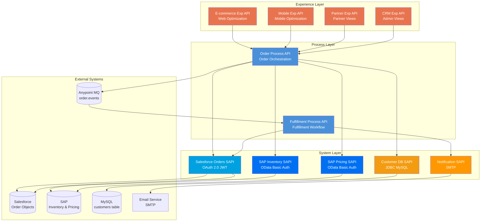
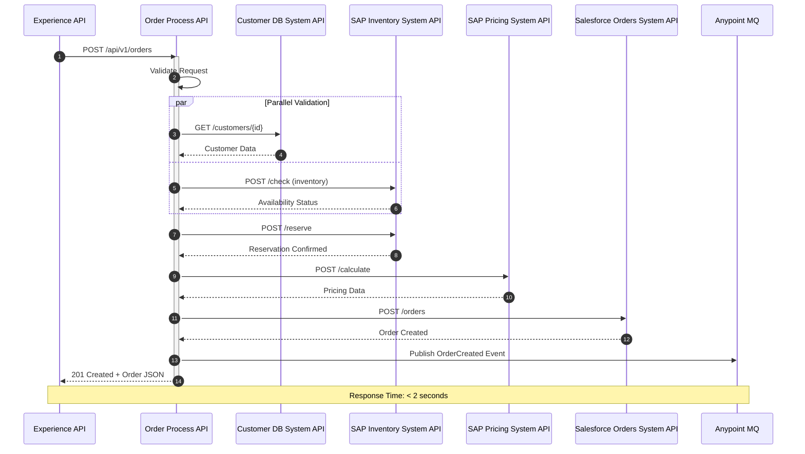
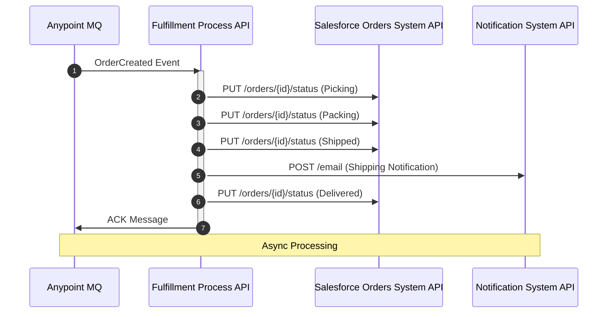
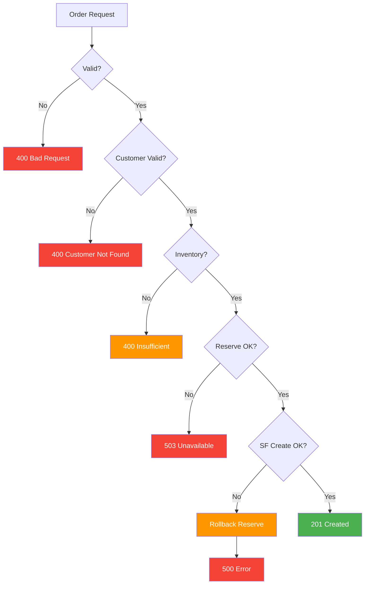

# Order Management API - MuleSoft Technical Design

**Project:** Enterprise Order Management Platform  
**Integration:** Multi-system orchestration (Salesforce, SAP, Database, Email)  
**Processing:** Real-Time + Async  
**Date:** December 2025

---

## 1. Project Overview

### 1.1 Business Context

A global e-commerce organization needs to provide a unified order management platform that orchestrates order creation, inventory reservation, pricing, and fulfillment across multiple backend systems. The platform must support multiple consumer channels (e-commerce, mobile app, partner portals, internal CRM) with channel-specific optimizations while maintaining a consistent order processing workflow.

**Key Business Drivers:**
- Support multiple consumer channels with different requirements
- Orchestrate complex order processing across 4+ backend systems
- Provide channel-specific optimizations (web, mobile, partner)
- Ensure data consistency across systems
- Support high-volume order processing (5,000 orders/day)
- Enable real-time order status and async fulfillment
- Maintain transaction integrity across systems

### 1.2 Integration Scope

| Aspect | Details |
|--------|---------|
| **Consumers** | E-commerce Web Portal, Mobile App, Partner Portals, Internal CRM |
| **Source Systems** | Salesforce (Orders), SAP (Inventory & Pricing), MySQL (Customers), Email Service |
| **Source Protocols** | REST API (Salesforce), OData (SAP), JDBC (MySQL), SMTP (Email) |
| **Source Formats** | JSON (Salesforce), XML/JSON (SAP), Relational (MySQL), Email |
| **Target Protocol** | REST API (HTTP/HTTPS) |
| **Target Format** | JSON (Unified order object) |
| **Integration Pattern** | Full API-Led Connectivity (3-Layer Architecture) |
| **Processing** | Real-time synchronous API + Asynchronous event-driven fulfillment |
| **Response Time** | < 2 seconds (order creation), Async (fulfillment) |

### 1.3 Volume and Performance Requirements

| Requirement | Value | Notes |
|-------------|-------|--------|
| **Daily Orders** | ~5,000 orders/day | Average daily order volume |
| **Peak Orders** | Up to 10,000 orders/day | During sales events, holidays |
| **Concurrent Users** | Up to 50 concurrent users | Across all channels |
| **Order Creation Response** | < 2 seconds (95th percentile) | Synchronous order creation |
| **Fulfillment Processing** | Async, < 5 minutes | Asynchronous fulfillment workflow |
| **Availability** | 99.9% uptime | Critical for e-commerce operations |
| **Resource Constraint** | 0.5 vCore (Process APIs), 0.2 vCore (System APIs) | CloudHub worker resources |

### 1.4 Key Functional Requirements

| ID | Requirement | Priority | Description |
|----|-------------|----------|-------------|
| **FR-01** | Order Creation | HIGH | POST create order with validation, inventory check, pricing, and Salesforce creation |
| **FR-02** | Order Retrieval | HIGH | GET order by ID with unified view from multiple systems |
| **FR-03** | Order Update | HIGH | PUT update order status and sync across systems |
| **FR-04** | Order List | HIGH | GET list of orders with pagination and filtering |
| **FR-05** | Inventory Validation | HIGH | Check inventory availability in SAP before order creation |
| **FR-06** | Inventory Reservation | HIGH | Reserve inventory in SAP during order creation |
| **FR-07** | Pricing Calculation | HIGH | Get pricing from SAP based on customer and products |
| **FR-08** | Order Fulfillment | HIGH | Async fulfillment workflow: Pick → Pack → Ship → Notify |
| **FR-09** | Multi-Channel Support | HIGH | Support e-commerce, mobile, partner, and CRM channels |
| **FR-10** | Compensation Pattern | HIGH | Rollback inventory reservation if Salesforce order creation fails |

### 1.5 Non-Functional Requirements

| Category | Requirement | Metric | Target |
|----------|-------------|--------|--------|
| **Performance** | Order Creation Response | 95th percentile | < 2 seconds |
| **Performance** | Order Creation Response | Average | < 1.5 seconds |
| **Performance** | Resource Efficiency | CPU Usage | ≤ 0.5 vCore (Process), ≤ 0.2 vCore (System) |
| **Reliability** | System Availability | Uptime | 99.9% monthly availability |
| **Reliability** | Transaction Integrity | Success Rate | 99.5% successful order creation |
| **Reliability** | Compensation Pattern | Rollback Success | 100% rollback success on failures |
| **Security** | Authentication | Method | OAuth 2.0 / API Key per channel |
| **Security** | Authorization | Method | Role-based access control per channel |
| **Maintainability** | API Versioning | Strategy | URL versioning (/api/v1/) |

---

## 2. Technical Architecture

### 2.1 Architecture Pattern
**Selected:** Full API-Led Connectivity (3-Layer Architecture)

- **Rationale:** Multi-channel consumers with different requirements and multiple backend systems
- 4+ consumer channels require channel-specific optimizations
- 4+ backend systems require abstraction and orchestration
- Complex business logic for order orchestration
- High reusability requirement across channels
- Separation of concerns: Experience APIs for channels, Process APIs for business logic, System APIs for system access

**Layer Breakdown:**
- **Experience Layer:** Channel-specific APIs (E-commerce, Mobile, Partner, CRM)
- **Process Layer:** Business logic APIs (Order Process, Fulfillment Process)
- **System Layer:** System abstraction APIs (Salesforce, SAP, Database, Notification)

### 2.2 Processing Strategy
**Selected:** Hybrid (Real-Time Synchronous + Event-Driven Asynchronous)

| Aspect | Details |
|--------|---------|
| **Strategy** | Hybrid Processing: Real-Time for Order Creation, Event-Driven for Fulfillment |
| **Order Creation** | Synchronous: Validate → Check Inventory → Reserve → Get Pricing → Create Order → Return Response |
| **Fulfillment** | Asynchronous: Subscribe to OrderCreated event → Pick → Pack → Ship → Notify |
| **Response Time** | < 2 seconds (order creation) |
| **Resource Constraint** | 0.5 vCore (Process APIs), 0.2 vCore (System APIs) |
| **Justification** | Order queries need immediate response, Order creation requires synchronous validation and confirmation, Fulfillment can be async for better scalability, Event-driven fulfillment enables decoupling and reliability |

**Key Design Decisions:**
- **Parallel Validation:** Use Scatter-Gather to validate customer and check inventory concurrently
- **Compensation Pattern:** Rollback inventory reservation if Salesforce order creation fails
- **Event-Driven Fulfillment:** Publish OrderCreated event to Anypoint MQ for async fulfillment
- **Channel Optimization:** Experience APIs optimize responses per channel (mobile: smaller payload, web: full details)
- **Connection Pooling:** Use connection pools for SAP and Database for efficient access

### 2.3 Layer Architecture

| Layer | APIs | Purpose | Consumers |
|-------|------|---------|-----------|
| **Experience** | `order-ecommerce-exp-api` | Web channel optimization, full order details | E-commerce Web Portal |
| **Experience** | `order-mobile-exp-api` | Mobile-optimized responses, reduced payload | Mobile App |
| **Experience** | `order-partner-exp-api` | Partner-specific views, custom fields | Partner Portals |
| **Experience** | `order-crm-exp-api` | Internal CRM views, administrative fields | Internal CRM |
| **Process** | `order-process-api` | Order orchestration, validation, coordination | All Experience APIs |
| **Process** | `fulfillment-process-api` | Fulfillment workflow orchestration | Event-driven |
| **System** | `salesforce-orders-sapi` | Salesforce Order CRUD operations | Order Process API |
| **System** | `sap-inventory-sapi` | SAP inventory check and reservation | Order Process API |
| **System** | `sap-pricing-sapi` | SAP pricing calculation | Order Process API |
| **System** | `customer-db-sapi` | Customer database operations | Order Process API |
| **System** | `notification-sapi` | Email/SMS notification service | Fulfillment Process API |

### 2.4 Connector Summary

| Connector | Configuration | Purpose |
|-----------|---------------|---------|
| **HTTP Listener** | Port: 8081, Base Path: `/api/v1`, CORS: Enabled, Methods: GET, POST, PUT | Receive API requests from channels |
| **Salesforce** | OAuth 2.0 JWT Bearer, API Version: v58.0, Connection Pool: Default | Access Salesforce Order objects |
| **SAP (OData)** | HTTP Request, OData v4, Basic Auth + VPN, Connection Pool: 5 | Access SAP inventory and pricing |
| **Database (MySQL)** | JDBC Connection, MySQL 8.0, Connection Pool: 10 | Access MySQL customer table |
| **Anypoint MQ** | Publisher & Subscriber, Queue: `order.events`, TTL: 7 days | Event-driven fulfillment |
| **Email** | SMTP, SMTP server configuration | Send order notifications |

### 2.5 Connector Pattern Diagram



---

## 3. Flow Architecture

### 3.1 Order Creation Flow: Order Process API

**Flow Name:** `order-process-api-create-flow`

| Step | Component | Action | Details |
|------|-----------|--------|---------|
| **1** | HTTP Listener | Receive POST request | Path: `/api/v1/orders` from Experience API |
| **2** | API Router | Route to CREATE operation | Route based on HTTP method |
| **3** | Validation | Validate request body | Validate JSON schema, required fields, data types |
| **4** | Scatter-Gather | Parallel validation | Call Customer DB System API and SAP Inventory System API concurrently |
| **5a** | HTTP Request | Call Customer DB System API | GET `/customer-db-sapi/customers/{id}` to validate customer |
| **5b** | HTTP Request | Call SAP Inventory System API | POST `/sap-inventory-sapi/check` to check inventory availability |
| **6** | Choice Router | Validation results | Route based on customer and inventory validation |
| **7a** | HTTP Response | Customer not found | Status: 400 Bad Request, Error: "Customer not found" |
| **7b** | HTTP Response | Insufficient inventory | Status: 400 Bad Request, Error: "Insufficient inventory" |
| **8** | HTTP Request | Reserve inventory | POST `/sap-inventory-sapi/reserve` to reserve inventory |
| **9** | Choice Router | Reservation success? | Route based on reservation result |
| **10a** | HTTP Response | Reservation failed | Status: 503 Service Unavailable, Error: "Inventory reservation failed" |
| **11** | HTTP Request | Get pricing | POST `/sap-pricing-sapi/calculate` to get order pricing |
| **12** | DataWeave | Build order payload | Combine request data with pricing for Salesforce |
| **13** | HTTP Request | Create order in Salesforce | POST `/salesforce-orders-sapi/orders` to create order |
| **14** | Choice Router | Order creation success? | Route based on Salesforce response |
| **15a** | HTTP Request | Rollback inventory | POST `/sap-inventory-sapi/release` to release reserved inventory |
| **15b** | HTTP Response | Order creation failed | Status: 500 Internal Server Error, Error: "Order creation failed, inventory released" |
| **16** | DataWeave | Transform order response | Transform Salesforce order to unified format |
| **17** | Anypoint MQ Publisher | Publish OrderCreated event | Publish to `order.events` queue for async fulfillment |
| **18** | HTTP Response | Return order confirmation | Status: 201 Created, Body: Unified order JSON |

**Sequence Diagram:**



### 3.2 Async Fulfillment Flow: Fulfillment Process API

**Flow Name:** `fulfillment-process-api-flow`

| Step | Component | Action | Details |
|------|-----------|--------|---------|
| **1** | Anypoint MQ Subscriber | Subscribe to OrderCreated event | Consume message from `order.events` queue |
| **2** | DataWeave | Parse order event | Parse OrderCreated event message |
| **3** | HTTP Request | Update order status: Picking | PUT `/salesforce-orders-sapi/orders/{id}/status` Status: "Picking" |
| **4** | Logger | Log picking started | Log order picking initiation |
| **5** | HTTP Request | Update order status: Packing | PUT `/salesforce-orders-sapi/orders/{id}/status` Status: "Packing" |
| **6** | Logger | Log packing started | Log order packing initiation |
| **7** | HTTP Request | Update order status: Shipped | PUT `/salesforce-orders-sapi/orders/{id}/status` Status: "Shipped" |
| **8** | DataWeave | Build notification payload | Build email notification with order details |
| **9** | HTTP Request | Send notification | POST `/notification-sapi/email` to send shipping notification |
| **10** | HTTP Request | Update order status: Delivered | PUT `/salesforce-orders-sapi/orders/{id}/status` Status: "Delivered" (after delivery confirmation) |
| **11** | Anypoint MQ | ACK message | Acknowledge message after fulfillment complete |
| **12** | End Flow | Complete | End fulfillment flow |

**Sequence Diagram:**



### 3.3 System APIs

#### Salesforce Orders System API: salesforce-orders-sapi

**Purpose:** Abstract Salesforce Order CRUD operations

| Operation | Endpoint | Backend Call |
|-----------|----------|-------------|
| **GET** | `/salesforce-orders-sapi/orders/{id}` | Salesforce SOQL Query: `SELECT Id, OrderNumber, Status, ... FROM Order WHERE Id = :id` |
| **POST** | `/salesforce-orders-sapi/orders` | Salesforce Create Order |
| **PUT** | `/salesforce-orders-sapi/orders/{id}` | Salesforce Update Order |
| **PUT** | `/salesforce-orders-sapi/orders/{id}/status` | Salesforce Update Order Status field |

#### SAP Inventory System API: sap-inventory-sapi

**Purpose:** Abstract SAP inventory operations

| Operation | Endpoint | Backend Call |
|-----------|----------|-------------|
| **POST** | `/sap-inventory-sapi/check` | SAP OData: Check inventory availability |
| **POST** | `/sap-inventory-sapi/reserve` | SAP OData: Reserve inventory |
| **POST** | `/sap-inventory-sapi/release` | SAP OData: Release reserved inventory |

#### SAP Pricing System API: sap-pricing-sapi

**Purpose:** Abstract SAP pricing operations

| Operation | Endpoint | Backend Call |
|-----------|----------|-------------|
| **POST** | `/sap-pricing-sapi/calculate` | SAP OData: Calculate order pricing |

#### Customer Database System API: customer-db-sapi

**Purpose:** Abstract MySQL customer operations

| Operation | Endpoint | Backend Call |
|-----------|----------|-------------|
| **GET** | `/customer-db-sapi/customers/{id}` | MySQL SELECT: `SELECT * FROM customers WHERE id = :id` |

#### Notification System API: notification-sapi

**Purpose:** Abstract notification operations

| Operation | Endpoint | Backend Call |
|-----------|----------|-------------|
| **POST** | `/notification-sapi/email` | SMTP: Send email notification |

### 3.4 Error Handling Flow

**Flow Name:** `order-process-api-error-handler`

| Step | Component | Action | Details |
|------|-----------|--------|---------|
| **1** | Error Handler | Catch all errors | Global error handler for order processing errors |
| **2** | Logger | Log error details | Log error message, stack trace, request payload |
| **3** | Choice Router | Error type? | Route based on error category |
| **4a** | HTTP Response | Validation Error | Status: 400 Bad Request, Body: Error details |
| **4b** | HTTP Response | Customer Not Found | Status: 400 Bad Request, Error: "Customer not found" |
| **4c** | HTTP Response | Insufficient Inventory | Status: 400 Bad Request, Error: "Insufficient inventory" |
| **4d** | Retry Policy | SAP Timeout | Retry SAP calls (3 times with exponential backoff) |
| **4e** | HTTP Request | Rollback inventory | If inventory reserved, release reservation |
| **4f** | HTTP Response | Service Unavailable | Status: 503 Service Unavailable (after retries exhausted) |
| **5** | End Flow | Terminate | End flow with error status |

### 3.5 Compensation Pattern

**Scenario:** Salesforce order creation fails after inventory reservation

**Compensation Flow:**
1. Catch Salesforce creation error
2. Call SAP Inventory System API to release reserved inventory
3. Log rollback action for audit trail
4. Return 500 Internal Server Error to client
5. Alert operations team of compensation action

---

## 4. Field Mapping Tables

### 4.1 Order Creation: Experience API to Process API

**Source Format:** Channel-specific request (E-commerce, Mobile, Partner, CRM)  
**Target Format:** Canonical order format  
**Transformation:** Normalize channel-specific formats to canonical

| Experience Field | Process Field | Transformation | Validation | Notes |
|-----------------|---------------|---------------|------------|-------|
| `customer.id` | `customerId` | Direct copy | Required, valid customer ID | Customer identifier |
| `items[]` | `orderItems[]` | Array transformation | Required, non-empty array | Order line items |
| `items[].sku` | `orderItems[].productCode` | Direct copy | Required, non-empty string | Product SKU |
| `items[].quantity` | `orderItems[].quantity` | Parse as Integer | Required, integer > 0 | Quantity per item |
| `shipping.address` | `shippingAddress` | Object transformation | Required object | Shipping address |
| `shipping.address.street` | `shippingAddress.street` | Direct copy | Required, max 255 chars | Street address |
| `shipping.address.city` | `shippingAddress.city` | Direct copy | Required, max 100 chars | City |
| `shipping.address.state` | `shippingAddress.state` | Direct copy | Required, 2-char code | State |
| `shipping.address.zip` | `shippingAddress.zip` | Direct copy | Required, 5 or 9 digits | ZIP code |
| `payment.method` | `paymentType` | Map to enum | Required, enum: CARD/BANK/INVOICE | Payment method |
| `payment.cardNumber` | `paymentDetails.cardNumber` | Mask last 4 digits | Required if CARD | Card number (masked) |

### 4.2 Process API to System APIs Mapping

**Source Format:** Canonical order format  
**Target Formats:** Salesforce Order, SAP Inventory/Pricing, MySQL Customer

| Process Field | Salesforce Field | SAP Inventory Field | SAP Pricing Field | Database Field | Notes |
|---------------|------------------|---------------------|-------------------|----------------|-------|
| `customerId` | `AccountId` | `KUNNR` (customer number) | `KUNNR` | `customer_id` | Customer identifier |
| `orderItems[].productCode` | `OrderItems[].Product2.ProductCode` | `MATNR` (material number) | `MATNR` | - | Product SKU |
| `orderItems[].quantity` | `OrderItems[].Quantity` | `MENGE` (quantity) | `MENGE` | - | Quantity |
| `totalAmount` | `TotalAmount` | - | `NETWR` (net value) | - | Order total |
| `shippingAddress.street` | `ShippingStreet` | - | - | - | Shipping address |
| `shippingAddress.city` | `ShippingCity` | - | - | - | City |
| `shippingAddress.state` | `ShippingState` | - | - | - | State |
| `shippingAddress.zip` | `ShippingPostalCode` | - | - | - | ZIP code |
| `paymentType` | `Payment_Method__c` | - | - | - | Payment method |
| `status` | `Status` | - | - | - | Order status |

### 4.3 Response Aggregation Mapping

**Source Systems:** Salesforce Order + SAP Pricing + Database Customer  
**Target:** Unified Order JSON Response

| Salesforce Field | SAP Field | Database Field | API Response Field | Transformation | Notes |
|------------------|-----------|----------------|-------------------|----------------|-------|
| `Id` | - | - | `id` | Direct copy | Order ID |
| `OrderNumber` | - | - | `orderNumber` | Direct copy | Order number |
| `AccountId` | - | `id` | `customer.id` | Use Salesforce AccountId | Customer ID |
| `TotalAmount` | `NETWR` | - | `totalAmount` | Prefer Salesforce, fallback to SAP | Order total |
| `Status` | - | - | `status` | Direct copy | Order status |
| `OrderItems[].Product2.ProductCode` | `MATNR` | - | `items[].sku` | Prefer Salesforce | Product SKU |
| `OrderItems[].Quantity` | `MENGE` | - | `items[].quantity` | Prefer Salesforce | Quantity |
| `ShippingStreet` | - | - | `shipping.address.street` | Direct copy | Shipping address |
| `CreatedDate` | - | `created_at` | `createdAt` | Prefer Salesforce | Creation timestamp |

### 4.4 Validation Rules

| Field | Validation Rule | Error Message | HTTP Status |
|-------|----------------|---------------|-------------|
| **customerId** | Required, valid customer ID format | "customerId is required and must be valid" | 400 Bad Request |
| **orderItems** | Required, non-empty array, max 100 items | "orderItems is required and must contain 1-100 items" | 400 Bad Request |
| **orderItems[].productCode** | Required, non-empty string, max 50 chars | "productCode is required for each item" | 400 Bad Request |
| **orderItems[].quantity** | Required, integer > 0, max 1000 | "quantity must be a positive integer ≤ 1000" | 400 Bad Request |
| **shippingAddress.street** | Required, non-empty string, max 255 chars | "shippingAddress.street is required" | 400 Bad Request |
| **shippingAddress.city** | Required, non-empty string, max 100 chars | "shippingAddress.city is required" | 400 Bad Request |
| **shippingAddress.state** | Required, 2-char US state code | "shippingAddress.state must be a valid 2-character state code" | 400 Bad Request |
| **shippingAddress.zip** | Required, 5 or 9 digits | "shippingAddress.zip must be 5 or 9 digits" | 400 Bad Request |
| **paymentType** | Required, enum: CARD/BANK/INVOICE | "paymentType must be CARD, BANK, or INVOICE" | 400 Bad Request |

---

## 5. Error Handling Strategy

### 5.1 Error Categories

| Error Category | Error Type | HTTP Status | Handling | Retry Strategy |
|----------------|------------|-------------|----------|---------------|
| **Validation Error** | VALIDATION:INVALID_REQUEST | 400 | Return error details in response body | No retry |
| **Customer Not Found** | RESOURCE:CUSTOMER_NOT_FOUND | 400 | Return error message | No retry |
| **Insufficient Inventory** | RESOURCE:INSUFFICIENT_INVENTORY | 400 | Return error message with available quantity | No retry |
| **SAP Timeout** | CONNECTIVITY:SAP_TIMEOUT | 503 | Service unavailable, rollback if needed | Retry 3 times with exponential backoff |
| **SAP Connection Error** | CONNECTIVITY:SAP_CONNECTION | 503 | Service unavailable, rollback if needed | Retry 3 times |
| **Salesforce Timeout** | CONNECTIVITY:SF_TIMEOUT | 503 | Service unavailable, rollback inventory | Retry 3 times |
| **Salesforce Create Failed** | CONNECTIVITY:SF_CREATE_FAILED | 500 | Rollback inventory reservation, return error | No retry (compensation executed) |
| **Database Timeout** | CONNECTIVITY:DB_TIMEOUT | 503 | Service unavailable | Retry 3 times |
| **Rate Limit** | CONNECTIVITY:RATE_LIMIT | 429 | Too many requests | No retry, client should retry |
| **Internal Server Error** | SYSTEM:INTERNAL_ERROR | 500 | Log error, return generic message | No retry |

### 5.2 Retry Patterns

| Error Type | Max Retries | Initial Delay | Backoff Strategy | Max Delay |
|------------|-------------|---------------|-----------------|-----------|
| **SAP Timeout** | 3 | 1 second | Exponential (2x) | 4 seconds |
| **SAP Connection Error** | 3 | 1 second | Exponential (2x) | 4 seconds |
| **Salesforce Timeout** | 3 | 1 second | Exponential (2x) | 4 seconds |
| **Database Timeout** | 3 | 1 second | Exponential (2x) | 4 seconds |

**Retry Logic:**
- Transient errors (timeouts, connection errors): Retry with exponential backoff
- Validation errors: No retry - return error immediately
- Salesforce create failure: No retry - execute compensation pattern
- Rate limits: No retry - return 429, client should retry

### 5.3 Compensation Pattern

**Scenario:** Salesforce order creation fails after inventory reservation

**Compensation Flow:**
1. Catch Salesforce creation error
2. Call SAP Inventory System API to release reserved inventory (`POST /sap-inventory-sapi/release`)
3. Log rollback action with order details for audit trail
4. Return 500 Internal Server Error to client
5. Alert operations team of compensation action

**Compensation Success Criteria:**
- Inventory reservation successfully released
- Rollback action logged for audit
- Client notified of failure
- Operations team alerted

**Compensation Failure Handling:**
- If inventory release fails: Alert operations team immediately (CRITICAL)
- Log compensation failure for manual intervention
- Operations team manually releases inventory

### 5.4 Error Notification Strategy

| Error Scenario | Notification Type | Recipients | Content | Priority |
|----------------|-------------------|------------|---------|----------|
| **API Errors (4xx)** | HTTP Response | API Client | Error message in response body | N/A (client handles) |
| **System Errors (5xx)** | Logging + Monitoring | DevOps team | Error message, stack trace, request details | HIGH |
| **Compensation Executed** | Alert | Operations team | Order details, compensation action, inventory released | CRITICAL |
| **Compensation Failed** | Alert | On-call engineer | Order details, compensation failure, manual intervention required | CRITICAL |
| **Repeated Failures** | Alert | On-call engineer | Error pattern, affected endpoints, frequency | CRITICAL |

**Error Response Format:**
```json
{
  "error": {
    "code": "ERROR_CODE",
    "message": "Human-readable error message",
    "details": "Additional error details",
    "compensation": {
      "executed": true,
      "action": "Inventory reservation released",
      "timestamp": "2025-12-15T10:30:00Z"
    },
    "timestamp": "2025-12-15T10:30:00Z"
  }
}
```

### 5.5 Error Handling Flow Details

**Global Error Handler:**
- Catches all unhandled exceptions in order processing
- Logs error details with full stack trace and request context
- Executes compensation pattern if inventory reserved
- Returns appropriate HTTP status code
- Includes error details in response body (for 4xx errors)
- Sends alerts for critical errors (5xx, compensation)

**Compensation Pattern Execution:**
- Triggered when Salesforce order creation fails after inventory reservation
- Calls SAP Inventory System API to release reservation
- Logs compensation action for audit trail
- Returns 500 error to client with compensation details
- Alerts operations team of compensation execution

**Partial Failure Handling:**
- If customer validation fails: Return 400 immediately, no system calls
- If inventory check fails: Return 400 immediately, no reservation
- If inventory reservation fails: Return 503, no pricing or order creation
- If pricing fails: Return 503, release inventory reservation
- If Salesforce creation fails: Execute compensation, return 500

### 5.6 Error Handling Flow Diagram



### 5.7 Dead Letter Queue (DLQ) Strategy

**Fulfillment Flow DLQ:**
- Queue: `order.events.dlq`
- TTL: 14 days
- Purpose: Store failed fulfillment messages for manual review
- Processing: Operations team reviews DLQ messages, fixes issues, reprocesses

**Note:** Order creation API (synchronous) does not use DLQ pattern.

### 5.8 Error Recovery Procedures

| Scenario | Recovery Action |
|----------|-----------------|
| **SAP Timeout** | System retries automatically; if fails, returns 503; support team reviews SAP status |
| **Salesforce Timeout** | System retries automatically; if fails, executes compensation; support team reviews Salesforce status |
| **Inventory Reservation Failed** | Client retries order creation; system checks inventory again |
| **Order Creation Failed (Compensation Executed)** | Client retries order creation; inventory available for retry |
| **Compensation Failed** | Operations team manually releases inventory; client notified; order retry possible after manual release |
| **Repeated Failures** | Support team reviews error pattern, identifies root cause, fixes issue, monitors for recurrence |

---
