# Mermaid Diagram Examples V2

**Purpose:** Examples of 3 essential + 3 optional diagram types for technical designs.

---

## 📊 **V2 Diagram Structure**

### ✅ Essential Diagrams (Always in Main Document)

| # | Diagram Type | Mermaid Type | Purpose |
|---|--------------|--------------|---------|
| 1 | Integration Sequence | `sequenceDiagram` | Step-by-step flow interactions |
| 2 | Error Handling | `flowchart TD` | Error recovery strategies |
| 3 | Connector Pattern | `graph TB` | Connector & component layout |

### 📋 Optional Diagrams (Supplementary Document Only)

| # | Diagram Type | Mermaid Type | When to Include |
|---|--------------|--------------|-----------------|
| 4 | System Architecture | `graph TB` | Complex multi-system integrations |
| 5 | Business Process | `flowchart TD` | Business stakeholder documentation |
| 6 | Data Flow | `flowchart LR` | Complex transformation pipelines |

---

# ✅ ESSENTIAL DIAGRAMS

---

## 📊 **Essential 1: Integration Sequence Examples**

### Example 1A: Simple API Call

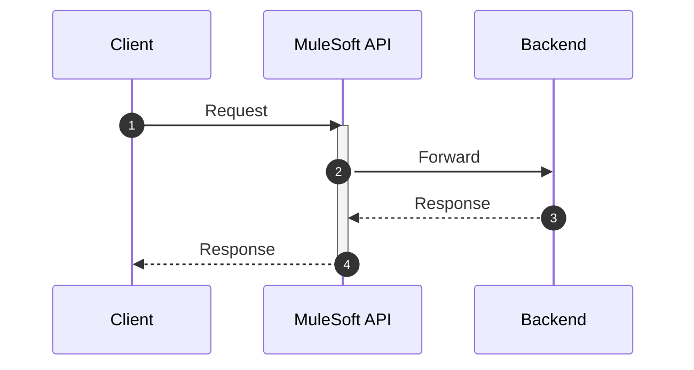

### Example 1B: With Validation and Error

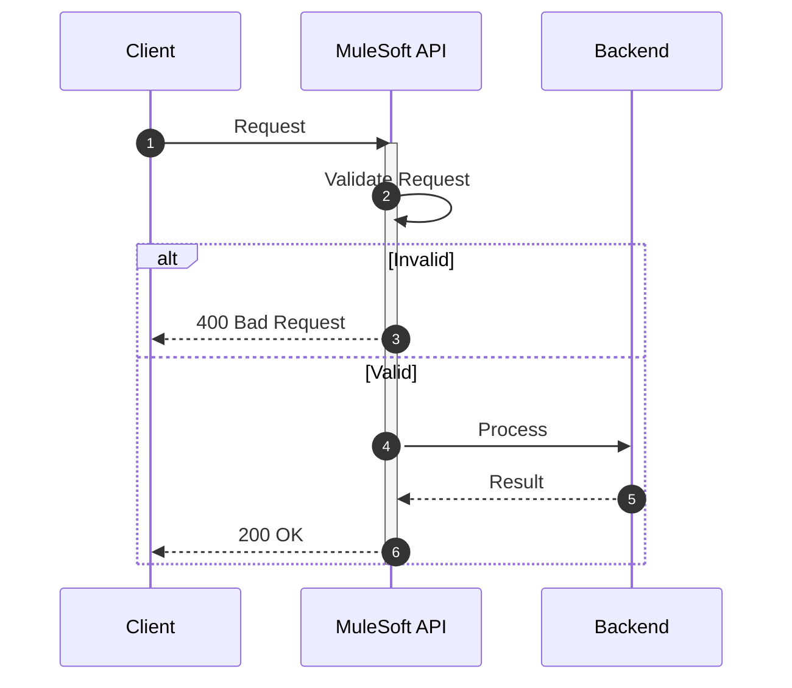

### Example 1C: Parallel Calls

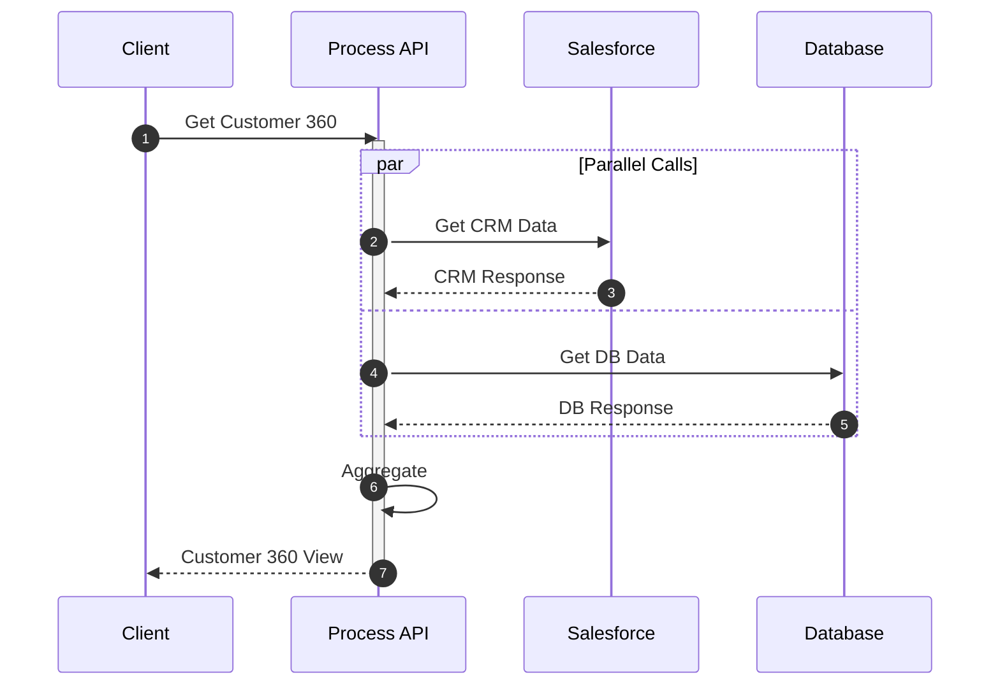

### Example 1D: Batch Processing

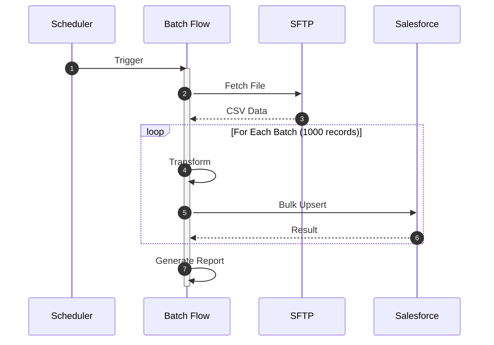

---

## 📊 **Essential 2: Error Handling Examples**

### Example 2A: Basic Error Handling

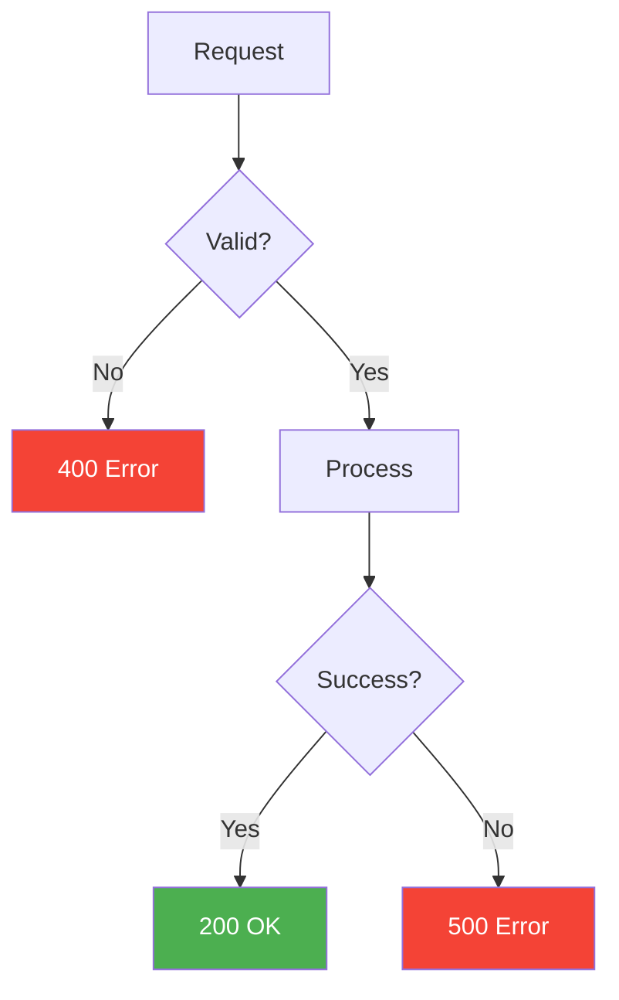

### Example 2B: With Retry and Circuit Breaker

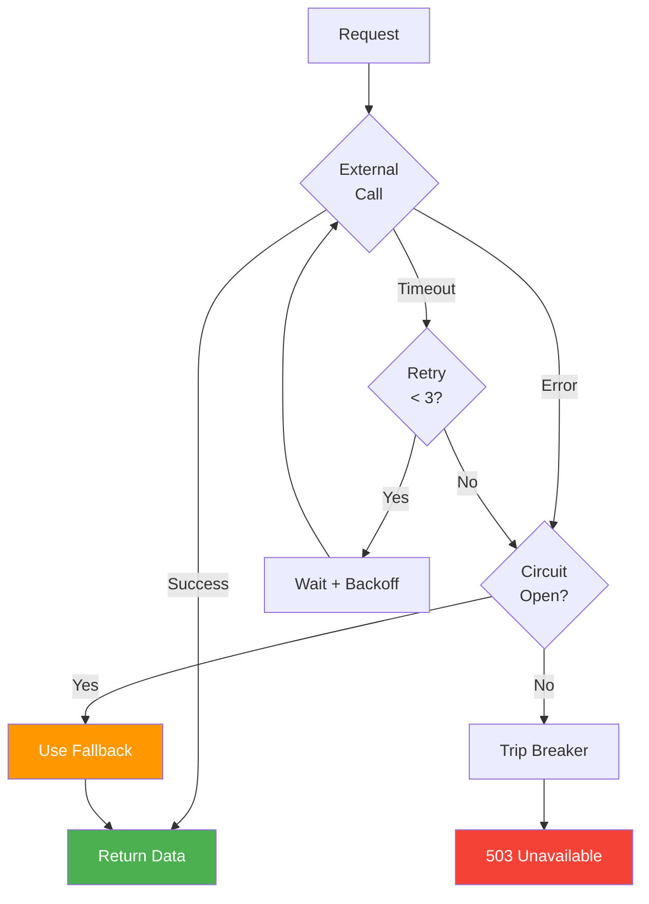

### Example 2C: Batch Error Handling

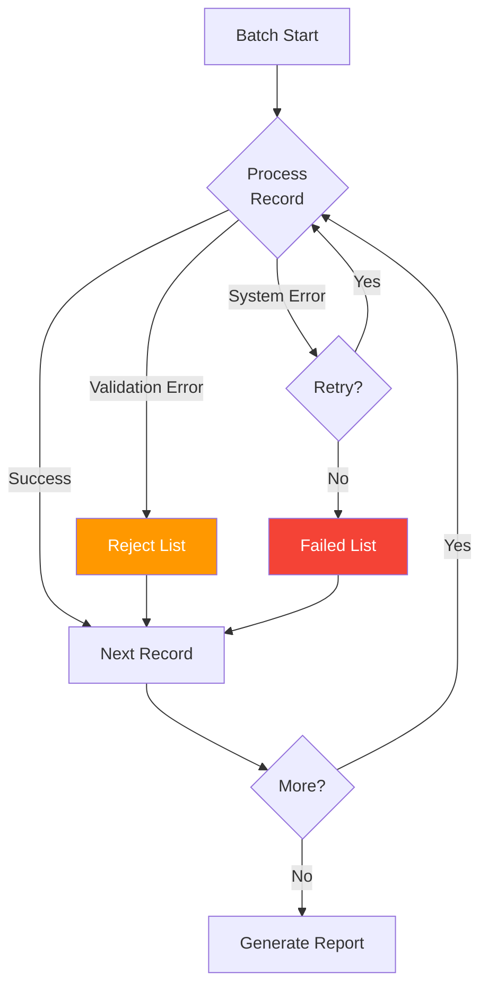

---

## 📊 **Essential 3: Connector Pattern Examples**

### Example 3A: Connector Overview

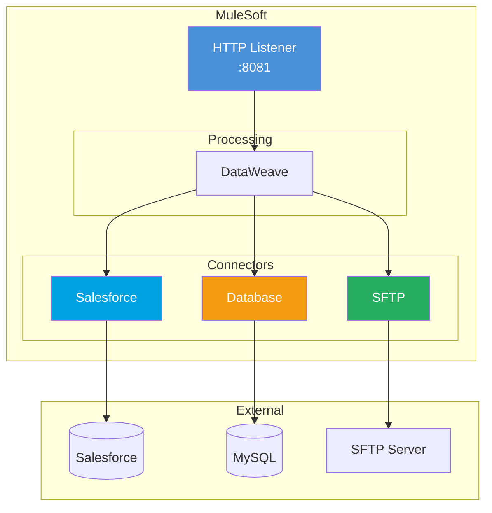

### Example 3B: Event Architecture

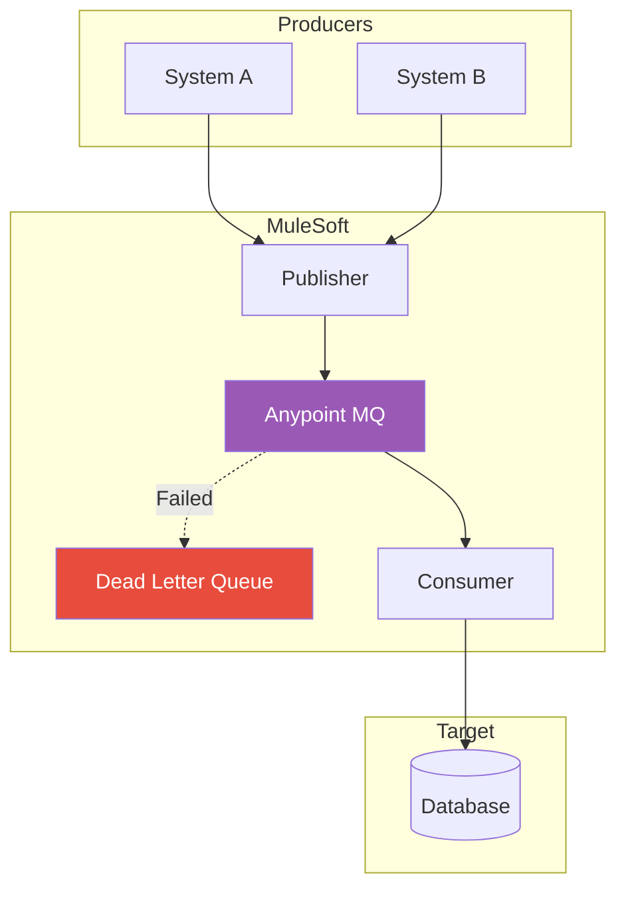

### Example 3C: Full API-Led Pattern

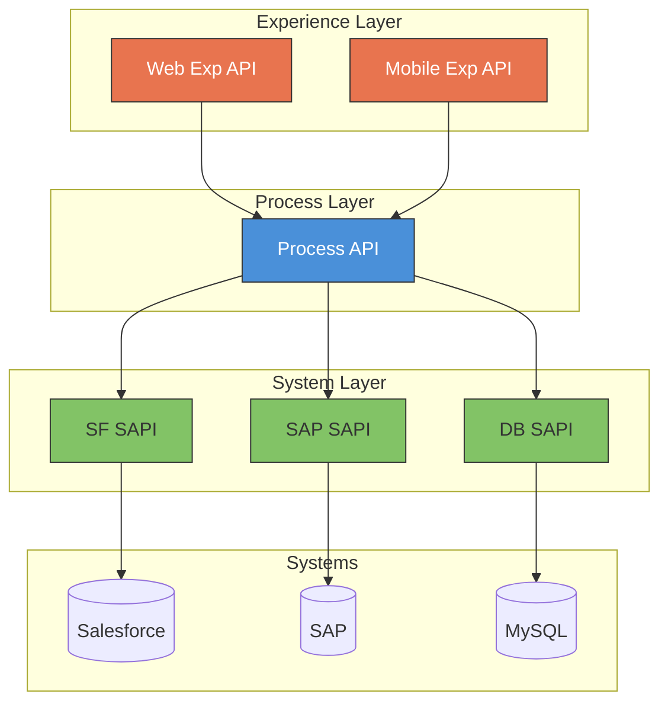

---

# 📋 OPTIONAL DIAGRAMS (Supplementary Document)

---

## 📊 **Optional 4: System Architecture Examples**

### Example 4A: Simple Integration

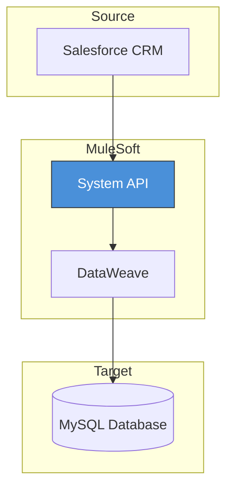

### Example 4B: API-Led Architecture

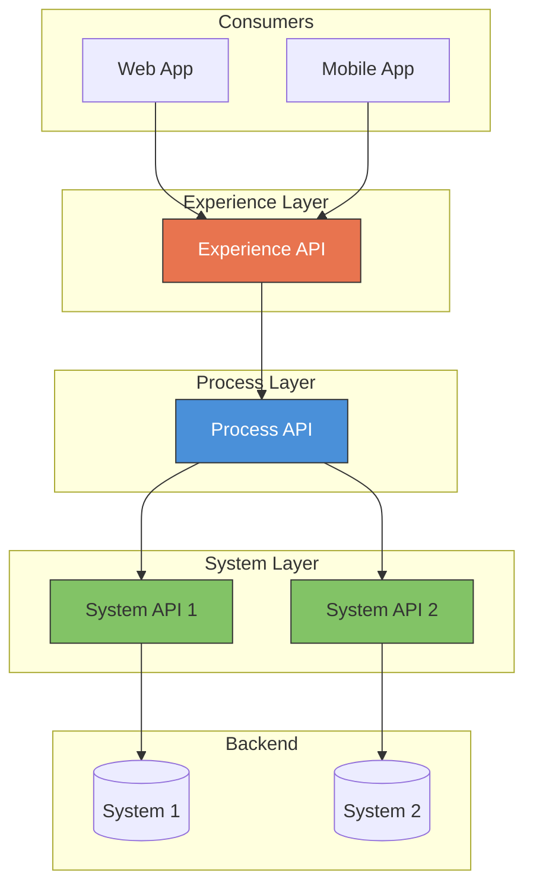

---

## 📊 **Optional 5: Business Process Examples**

### Example 5A: Order Processing

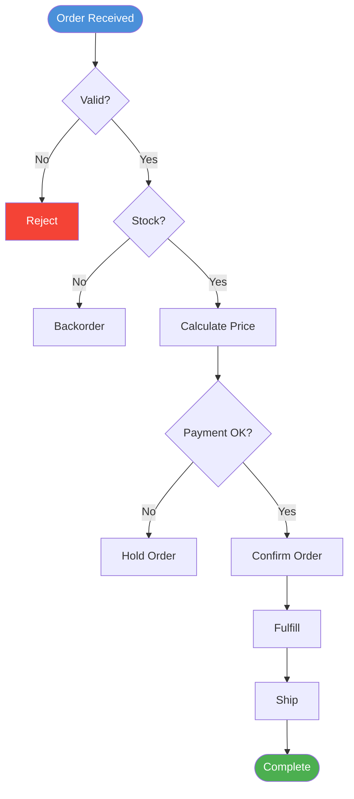

### Example 5B: Data Sync Process

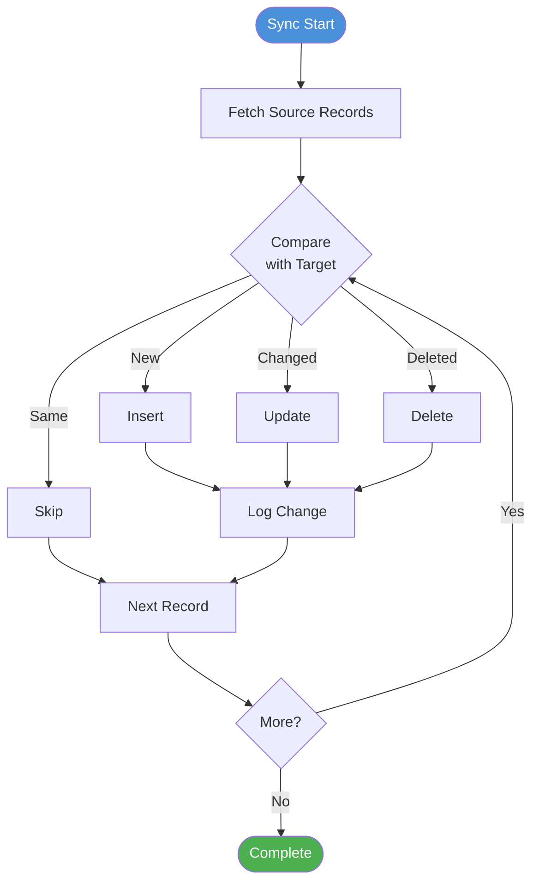

---

## 📊 **Optional 6: Data Flow Examples**

### Example 6A: Simple Transformation

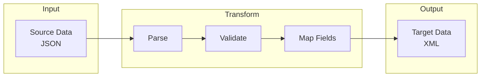

### Example 6B: Field Mapping Visualization

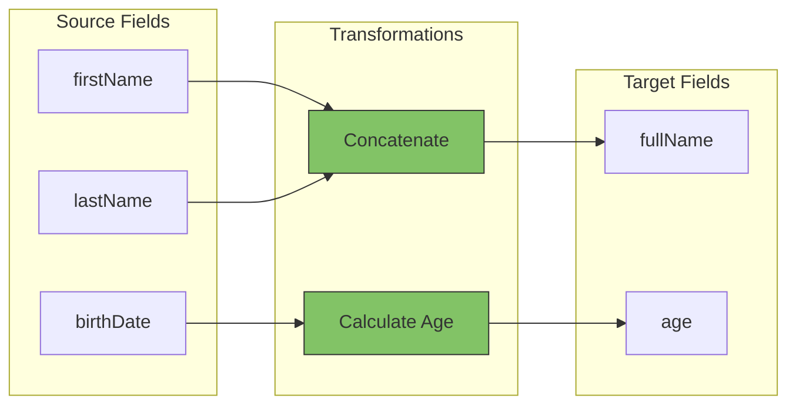

---

## 🎨 **Styling Reference**

### Color Palette

```
Experience API:    fill:#e8744f,color:#fff (Orange)
Process API:       fill:#4a90d9,color:#fff (Blue)
System API:        fill:#82c366,stroke:#333 (Green)
HTTP/Trigger:      fill:#4a90d9,color:#fff (Blue)
Salesforce:        fill:#00a1e0,color:#fff (SF Blue)
Database:          fill:#f39c12,color:#fff (Orange)
File/SFTP:         fill:#27ae60,color:#fff (Green)
Anypoint MQ:       fill:#9b59b6,color:#fff (Purple)
Email:             fill:#e74c3c,color:#fff (Red)
Success:           fill:#4caf50,color:#fff (Green)
Error:             fill:#f44336,color:#fff (Red)
Warning:           fill:#ff9800,color:#fff (Amber)
```

---

🧞‍♂️ **Mermaid Diagram Examples V2 - 3 Essential + 3 Optional!** ✨
