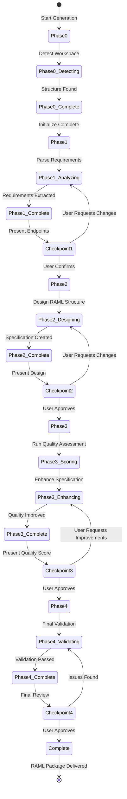

# API Specification Agent - Architecture

**Author**: Cheppali Shaik Sohail

## Overview

The API Specification Agent generates production-quality RAML 1.0 API specifications following MuleSoft API-Led Connectivity best practices. It creates modular, reusable API specifications with fragment architecture, comprehensive documentation, and a 105-point quality scoring framework that ensures enterprise-grade output.

The agent emphasizes interactive workflow with mandatory user checkpoints at critical decision points (endpoint requirements, API layer selection, security configuration, design approval, and quality review). It supports all three API-Led layers (Experience, Process, System APIs) with layer-appropriate security schemes, traits, and resource types. The fragment architecture enables maintainability through externalized data types, security schemes, traits, and resource types stored in separate files.

Key capabilities include automatic API layer pattern detection, fragment modularization for reusability, RFC 7807 Problem Details error formatting, comprehensive example generation (externalized via `!include`), and enterprise patterns like correlation IDs and health endpoints. The agent validates specifications against a 105-point quality framework across 8 categories (RAML Syntax, Structure, Documentation, Security, RESTful Design, API-Led Compliance, Enterprise Standards, Project Organization), ensuring minimum 85 points for production readiness.

As of V2.1, the agent incorporates LLM behavioral gap countermeasures aligned with the R-GENIE Architecture Standard §13: `<thinking>` blocks for structured reasoning before every phase output, Confidence Calibration (HIGH/MEDIUM/LOW), RGV (Read-Generate-Verify) count verification per phase, Evidence-Bound Outputs, Tree of Thought for ambiguous decisions, Few-Shot BAD/GOOD patterns, Constitutional Principles (4 ranked override rules), Semantic Anti-Autopilot, Contradiction Handling, Graceful Degradation, and Input Sanitization. These techniques address all 14 documented LLM behavioral gaps.

## Workflow Steps

### Phase 0: Initialization
- **What**: Initializes API specification generation session by detecting workspace, discovering existing designs, and identifying existing RAML files
- **How**: Scans workspace for technical design documents, locates existing RAML specifications and fragments, initializes state tracking, and determines project structure
- **Why**: Establishes context for generation, enables reuse of existing fragments, and ensures proper integration with existing API projects

### Phase 1: Requirements Analysis
- **What**: Gathers and validates API requirements with user confirmation, determining endpoints, data models, API layer type, and security needs
- **How**: Parses technical design documents (if available), extracts API endpoint requirements, identifies data models and schemas, determines API layer type (Experience/Process/System), and identifies security requirements
- **Why**: Ensures accurate understanding of API requirements before specification generation, enabling correct pattern selection and preventing rework

### Phase 2: RAML Design
- **What**: Designs RAML structure and creates specification components including resources, data types, traits, and security schemes
- **How**: Generates RAML header and metadata, designs resource hierarchy, creates data type definitions, designs traits and behaviors, configures security schemes, and organizes fragments into modular structure
- **Why**: Creates the core API specification structure following RAML 1.0 best practices, establishing reusable components that enable maintainability and consistency

### Phase 3: Quality Enhancement
- **What**: Applies 105-point quality scoring framework and enhances RAML specification with examples, enterprise patterns, and comprehensive documentation
- **How**: Runs quality assessment across 8 categories, adds comprehensive examples (externalized), adds enterprise patterns (correlation ID, health endpoint), applies RFC 7807 error formatting, and validates fragment dependencies
- **Why**: Ensures production-ready specifications that meet enterprise standards, providing comprehensive documentation and following industry best practices for API design

### Phase 4: Validation & Delivery
- **What**: Performs final validation, generates quality report, and delivers complete RAML package with all fragments
- **How**: Validates RAML syntax, checks fragment dependencies, generates quality score report, creates final package structure, and presents complete specification for user review
- **Why**: Ensures specification correctness and completeness before delivery, providing quality metrics that validate production readiness

## Flow Diagram

