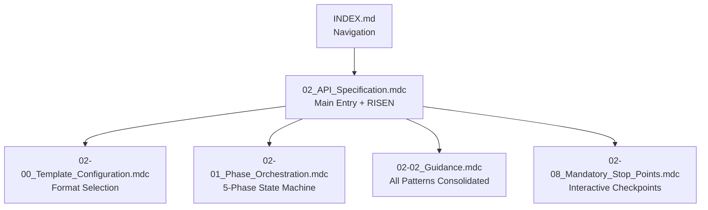
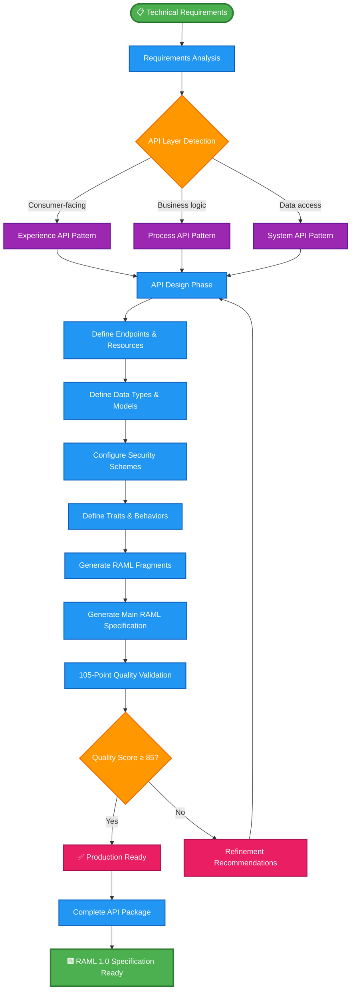
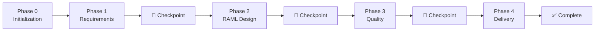

# 🧞‍♂️ **API SPECIFICATION AGENT (02)**

**📄 Version:** v2.1 (RAML & OpenAPI Support)  
**📅 Updated:** January 2026  
**👨‍💻 Author:** Cheppali Shaik Sohail  
**🎯 Purpose:** Generate Production-Quality RAML 1.0 or OpenAPI 3.0 Specifications with API-Led Connectivity Excellence  

---

## 🎯 **SYSTEM OVERVIEW**

The **API Specification Agent** is R-GENIE's intelligent API specification engine that transforms technical requirements into production-quality **RAML 1.0 or OpenAPI 3.0** specifications following **MuleSoft API-Led Connectivity best practices** with comprehensive **105-point quality scoring**.

### **🏆 Key Capabilities:**
- ✅ **🆕 Dual Format Support** - RAML 1.0 and OpenAPI 3.0
- ✅ **Format Selection** - User chooses preferred format in Phase 1
- ✅ **API-Led Connectivity Patterns** - Experience, Process, and System API layers
<!-- Q2hlcHBhbGlTaGFpa1NvaGFpbDE1MDgxOTkz -->
- ✅ **Modular Architecture** - Fragments (RAML) or Components (OpenAPI)
- ✅ **105-Point Quality Scoring** - Comprehensive validation across 8 categories
- ✅ **Enterprise Security Standards** - OAuth 2.0, OpenID Connect, API Key authentication
- ✅ **Interactive Workflow** - Mandatory checkpoints for user confirmation
- ✅ **5-Phase Orchestration** - State machine with format-aware generation
- ✅ **Consolidated Rules** - Streamlined, DRY-compliant rule architecture
- ✅ **🧠 Structured Reasoning** - `<thinking>` blocks, Confidence Calibration, RGV verification
- ✅ **🛡️ LLM Gap Countermeasures** - Evidence-Bound, Constitutional Principles, Anti-Autopilot, Input Sanitization

---

## 📚 **V2 CONSOLIDATED RULE ARCHITECTURE**

### **Rule Files**



### **Rule Files Overview**

| File | Purpose |
|------|---------|
| `02_API_Specification.mdc` | Main entry point with RISEN framework, format selection |
| `02-00_Template_Configuration.mdc` | Template-first approach, format comparison (RAML/OAS) |
| `02-01_Phase_Orchestration.mdc` | 5-phase state machine with format-aware tasks |
| `02-02_Guidance.mdc` | **Consolidated**: API layers, quality, security, patterns |
| `02-08_Mandatory_Stop_Points.mdc` | STOP_AND_WAIT protocol for interactive behavior |
| `INDEX.md` | Complete navigation and cross-reference map |

### **Examples**

| Example | Format | Description |
|---------|--------|-------------|
| `examples/customer-system-api/` | RAML 1.0 | Complete System API with fragments |
| `examples/customer-system-api-oas/` | OpenAPI 3.0 | Same API in OpenAPI format |

---

## 🏗️ **SYSTEM ARCHITECTURE**

### **🌐 API-Led Connectivity Architecture**

```mermaid
graph TB
    subgraph "🎯 API-LED CONNECTIVITY LAYERS"
        subgraph "Experience API Layer"
            EXP_API[Experience APIs<br/>🎯 Consumer-facing<br/>📱 Mobile & Web optimized<br/>🔐 OAuth 2.0 + OpenID Connect]
            EXP_BASE[Base URI: api.domain.com/experience/v1<br/>🎨 Channel-specific responses<br/>⚡ Lightweight & fast]
        end
        
        subgraph "Process API Layer"
            PROC_API[Process APIs<br/>🏗️ Business logic orchestration<br/>🔄 Multi-system workflows<br/>🔐 Client Credentials + OAuth]
            PROC_BASE[Base URI: api.domain.com/process/v1<br/>🎯 Business-centric operations<br/>📋 Complex orchestration]
        end
        
        subgraph "System API Layer"
            SYS_API[System APIs<br/>💾 Systems of Record access<br/>📊 Canonical data models<br/>🔐 API Key + Basic Auth]
            SYS_BASE[Base URI: api.domain.com/system/v1<br/>🔧 CRUD operations<br/>⚡ High performance]
        end
    end
    
    subgraph "🎨 RAML GENERATION ENGINE"
        subgraph "Core Processing"
            RAML_GEN[02_API_Specification.mdc<br/>🧞‍♂️ RAML Generator<br/>📋 API-Led Patterns<br/>🎯 Quality Validation]
        end
        
        subgraph "Fragment Architecture"
            FRAGMENTS[RAML Fragments<br/>🧩 Modular Components<br/>♻️ Reusable Patterns<br/>📚 Enterprise Libraries]
        end
        
        subgraph "Quality Validation"
            QUALITY[105-Point Scoring<br/>📊 8 Quality Categories<br/>🎯 Production Readiness<br/>✅ Compliance Validation]
        end
    end
    
    subgraph "📤 GENERATED OUTPUTS"
        subgraph "Main Specification"
            MAIN_RAML[{api-name}-{layer}-api.raml<br/>📄 Main RAML specification<br/>🎯 Complete API definition<br/>📊 Embedded documentation]
        end
        
        subgraph "Fragment Libraries"
            LIBS[libraries/<br/>📚 common-data-types.raml<br/>🔐 security-schemes.raml]
            TRAITS[traits/<br/>🎯 common-traits.raml<br/>📋 Shared behaviors]
            RESOURCES[resource-types/<br/>🏗️ common-resource-types.raml<br/>♻️ Standard patterns]
        end
        
        subgraph "Metadata & Reports"
            METADATA[{api-name}-metadata.json<br/>📊 Generation metadata<br/>📈 Quality scores<br/>🎯 Recommendations]
        end
    end
    
    %% Flow Connections
    EXP_API --> RAML_GEN
    PROC_API --> RAML_GEN
    SYS_API --> RAML_GEN
    
    RAML_GEN --> FRAGMENTS
    FRAGMENTS --> QUALITY
    
    QUALITY --> MAIN_RAML
    QUALITY --> LIBS
    QUALITY --> TRAITS
    QUALITY --> RESOURCES
    QUALITY --> METADATA
    
    %% Styling
    classDef experienceLayer fill:#e1f5fe,stroke:#0277bd,stroke-width:2px
    classDef processLayer fill:#f3e5f5,stroke:#7b1fa2,stroke-width:2px
    classDef systemLayer fill:#e8f5e8,stroke:#388e3c,stroke-width:2px
    classDef engineLayer fill:#fff3e0,stroke:#f57c00,stroke-width:2px
    classDef outputLayer fill:#fce4ec,stroke:#c2185b,stroke-width:2px
    
    class EXP_API,EXP_BASE experienceLayer
    class PROC_API,PROC_BASE processLayer
    class SYS_API,SYS_BASE systemLayer
    class RAML_GEN,FRAGMENTS,QUALITY engineLayer
    class MAIN_RAML,LIBS,TRAITS,RESOURCES,METADATA outputLayer
```

### **🔄 RAML Generation Process Flow**



---

## 🚀 **USAGE GUIDE**

### **📋 Prerequisites**
```bash
# Ensure R-GENIE dependencies are installed
./temp/install-r-genie.sh

# Navigate to R-GENIE directory
cd r-genie
```

### **🎯 Quick Start - API Specification Generation**
```bash
# Use with cursor chat for immediate API specification generation
@r-genie/02_API_Specification_Agent/rules/02_API_Specification.mdc

"Please generate RAML 1.0 API specification for my customer management System API"
```

### **⚡ Layer-Specific Generation**
```bash
# Experience API for mobile/web consumers
@r-genie/02_API_Specification_Agent/rules/02_API_Specification.mdc
"Generate Experience API for mobile customer portal with OAuth 2.0 security"

# Process API for business logic orchestration
@r-genie/02_API_Specification_Agent/rules/02_API_Specification.mdc
"Generate Process API for customer onboarding workflow with multi-system orchestration"

# System API for data access
@r-genie/02_API_Specification_Agent/rules/02_API_Specification.mdc
"Generate System API for direct Salesforce customer data access with high performance"
```

---

## 📁 **STANDARDIZED INPUT STRUCTURE**

### **📥 Required Inputs (Place in `input/` folders):**

#### **input/samples/ - API Requirements:**
```
input/samples/
├── api-requirements.md           # Core API requirements
├── data-models.json             # Data structure definitions
├── business-rules.txt           # Business logic requirements
├── integration-specs.pdf        # External system integration specs
└── security-requirements.md     # Authentication and authorization needs
```

#### **input/requirements/ - Structured API Requirements:**
```
input/requirements/
├── functional-requirements.md   # Core API functionality
├── non-functional-requirements.md # Performance, security, scalability
├── api-consumer-requirements.md # Consumer-specific needs
└── compliance-requirements.md   # Regulatory and governance needs
```

#### **input/context/ - API Domain Context:**
```
input/context/
├── api-landscape.json          # Existing API ecosystem
├── domain-models.json          # Business domain data models
├── integration-patterns.md     # Preferred integration approaches
└── organization-standards.md   # API governance and standards
```

### **📋 Optional Inputs (Enhance API quality):**

#### **template/standard/ - Organization API Templates:**
```
template/standard/
├── api-specification-template.raml # Standard RAML format
├── security-schemes-template.raml  # Security configuration templates
├── data-types-template.raml        # Standard data type definitions
└── api-governance-rules.json      # Organization API governance
```

#### **example/best-practices/ - Reference APIs:**
```
example/best-practices/
├── exemplary-experience-api.raml  # Perfect Experience API example
├── exemplary-process-api.raml     # Perfect Process API example
├── exemplary-system-api.raml      # Perfect System API example
└── api-design-patterns/           # Common API design patterns
```

---

## 🌐 **API-LED CONNECTIVITY PATTERNS**

### **🎯 Experience API Layer**

#### **Purpose & Characteristics:**
- **Target Consumers:** Mobile apps, web applications, partner integrations
- **Optimization Focus:** Channel-specific, lightweight responses, fast performance
<!-- CS150893‌ -->
- **Security:** OAuth 2.0 with OpenID Connect for user authentication
- **Base URI Pattern:** `https://api.{domain}.com/experience/v{version}`

#### **Key Features:**
```yaml
# Experience API Example Structure
title: Customer Portal Experience API
version: v1
baseUri: https://api.company.com/experience/v1
securitySchemes:
  oauth_2_0:
    type: OAuth 2.0
    settings:
      authorizationUri: https://auth.company.com/oauth/authorize
      accessTokenUri: https://auth.company.com/oauth/token
      authorizationGrants: [ authorization_code ]
```

### **🏗️ Process API Layer**

#### **Purpose & Characteristics:**
- **Target Consumers:** Experience APIs, business process engines, workflow systems
- **Optimization Focus:** Business logic orchestration, multi-system coordination
- **Security:** Client Credentials with OAuth 2.0 for service-to-service
- **Base URI Pattern:** `https://api.{domain}.com/process/v{version}`

#### **Key Features:**
```yaml
# Process API Example Structure
title: Customer Onboarding Process API
version: v1
baseUri: https://api.company.com/process/v1
securitySchemes:
  client_credentials:
    type: OAuth 2.0
    settings:
      accessTokenUri: https://auth.company.com/oauth/token
      authorizationGrants: [ client_credentials ]
```

### **💾 System API Layer**

#### **Purpose & Characteristics:**
- **Target Consumers:** Process APIs, direct system access for operational needs
- **Optimization Focus:** High performance, canonical data models, CRUD operations
- **Security:** API Key, Basic Authentication, Client Credentials
- **Base URI Pattern:** `https://api.{domain}.com/system/v{version}`

#### **Key Features:**
```yaml
# System API Example Structure  
title: Customer Data System API
version: v1
baseUri: https://api.company.com/system/v1
securitySchemes:
  api_key:
    type: x-api-key
    describedBy:
      headers:
        X-API-Key:
          description: API Key for system access
```

---

## 🧩 **FRAGMENT ARCHITECTURE**

### **📚 Modular RAML Components**

The system generates a complete fragment-based architecture for maintainability and reusability:

#### **📁 Project Structure:**
```
api-specifications/
├── {api-name}-{layer}-api.raml          # Main RAML specification
├── {api-name}-{layer}-api-metadata.json # Generation metadata & quality scores
└── fragments/                           # Modular RAML fragments
    ├── libraries/                       # Data type and schema definitions
    │   ├── common-data-types.raml      # Shared data types across APIs
    │   └── security-schemes.raml       # Authentication and authorization
    ├── traits/                         # Shared API behaviors
    │   └── common-traits.raml          # Pagination, error handling, etc.
    └── resource-types/                 # Reusable resource patterns
        └── common-resource-types.raml  # Standard CRUD patterns
```

#### **📚 Libraries - Data Types & Security:**
```yaml
# common-data-types.raml
#%RAML 1.0 Library

types:
  Customer:
    type: object
    properties:
      id: string
      firstName: string
      lastName: string
      email: string
      createdDate: datetime
      
  ErrorResponse:
    type: object
    properties:
      code: integer
      message: string
      details?: string
```

#### **🎯 Traits - Shared Behaviors:**
```yaml
# common-traits.raml
#%RAML 1.0 Trait

pageable:
  queryParameters:
    offset:
      description: Number of items to skip
      type: integer
      default: 0
    limit:
      description: Maximum number of items to return
      type: integer
      default: 20
      
errorHandling:
  responses:
    400:
      body:
        application/json:
          type: ErrorResponse
    401:
      body:
        application/json:
          type: ErrorResponse
```

#### **🏗️ Resource Types - Standard Patterns:**
```yaml
# common-resource-types.raml
#%RAML 1.0 ResourceType

collection:
  get:
    is: [pageable, errorHandling]
    responses:
      200:
        body:
          application/json:
            type: <<resourcePathName | !singularize>>[]
  post:
    is: [errorHandling]
    body:
      application/json:
        type: <<resourcePathName | !singularize>>
    responses:
      201:
        body:
          application/json:
            type: <<resourcePathName | !singularize>>
```

---

## 📊 **105-POINT QUALITY SCORING SYSTEM**

### **🏆 Comprehensive Quality Assessment**

The system evaluates API specifications across **8 critical quality categories**:

#### **📋 1. RAML Syntax Validation (15 points)**
- **RAML 1.0 compliance** - Proper syntax and structure
- **Fragment relationships** - Correct imports and dependencies
- **Data type definitions** - Valid type declarations
- **Resource hierarchy** - Logical API structure

#### **🏗️ 2. Structure Quality (20 points)**
- **Resource organization** - RESTful resource design
- **HTTP method usage** - Appropriate verb selection
- **URL path design** - Clean, intuitive paths
- **Parameter placement** - Query vs. path parameter optimization

#### **📚 3. Documentation Quality (20 points)**
- **Description completeness** - Comprehensive endpoint documentation
- **Example coverage** - Request/response examples
- **Business context** - Clear business purpose explanation
- **Consumer guidance** - Usage instructions and best practices

#### **🔐 4. Security Implementation (15 points)**
- **Authentication schemes** - Proper security configuration
- **Authorization patterns** - Role-based access control
- **Security best practices** - Token handling, encryption
- **Compliance standards** - Industry security requirements

#### **🎯 5. RESTful Design Principles (15 points)**
- **Resource modeling** - Proper noun-based resources
- **HTTP status codes** - Appropriate response codes
- **Content negotiation** - Multiple format support
- **Idempotency** - Safe and idempotent operations

#### **🌐 6. API-Led Compliance (10 points)**
- **Layer appropriateness** - Correct API layer classification
- **Connectivity patterns** - Proper API-Led implementation
- **Canonical models** - Standard data representations
- **Integration best practices** - MuleSoft-specific patterns

#### **🏢 7. Enterprise Standards (5 points)**
- **Naming conventions** - Organization naming standards
- **Versioning strategy** - Consistent version management
- **Governance compliance** - Policy and standard adherence
- **Documentation standards** - Enterprise documentation formats

#### **📁 8. Project Organization (5 points)**
- **Fragment architecture** - Proper modular structure
- **File organization** - Clean project layout
- **Metadata completeness** - Comprehensive generation information
- **Artifact packaging** - Production deployment readiness

### **🎯 Quality Targets:**
- **Production Deployment:** ≥85 points (81% quality score)
- **Exceptional Quality:** ≥95 points (90% quality score)
- **Perfect Implementation:** 105 points (100% quality score)

---

## 📤 **OUTPUT STRUCTURE**

### **📊 Generated Outputs (Appear in `output/` folders):**

#### **output/generated/ - Fresh AI Outputs:**
```
output/generated/
├── {api-name}-{layer}-api/
│   ├── {api-name}-{layer}-api.raml        # Main RAML specification
│   ├── {api-name}-{layer}-api-metadata.json # Quality scores & metadata
│   └── fragments/                         # Modular components
│       ├── libraries/
│       │   ├── common-data-types.raml
│       │   └── security-schemes.raml
│       ├── traits/
│       │   └── common-traits.raml
│       └── resource-types/
│           └── common-resource-types.raml
├── quality-assessment-report.json        # Detailed quality analysis
└── api-generation-log.json              # Generation process details
```

#### **output/validated/ - Production-Ready APIs:**
```
output/validated/
├── production-{api-name}-{layer}/
│   ├── api-specification/               # Complete validated API
│   ├── deployment-package/              # CloudHub deployment artifacts
│   ├── documentation/                   # Generated API documentation
│   └── quality-certification.json      # Quality validation certificate
```

#### **output/archive/ - Historical Versions:**
```
output/archive/
├── v1.0-initial-specification/
├── v1.1-security-enhanced/
└── v2.0-production-approved/
```

---

## ⚡ **INTEGRATION POINTS**

### **🔗 Cross-System Integration**

#### **📋 From Technical Design Agent:**
- **API requirements extraction** from technical design documents
- **Architecture patterns** and integration approaches
- **Security requirements** and compliance needs
- **Performance specifications** and sizing requirements

#### **🏗️ To App Development Agent:**
- **RAML specifications** for MuleSoft application scaffolding
- **API-Led patterns** for connector and flow configuration
- **Security schemes** for authentication implementation
- **Data models** for DataWeave transformation generation

#### **🧪 To MUnit Agent:**
- **API contracts** for contract testing generation
- **Example data** for test case creation
- **Security configurations** for authentication testing
- **Error scenarios** for negative testing

---

## 🔄 **INTERACTIVE WORKFLOW (V2)**

The API Specification Agent now follows an interactive, phase-based workflow that ensures user confirmation at critical points.

### **5-Phase Generation Process**



### **Mandatory Stop Points**

The agent will **STOP and WAIT** for user confirmation at these critical points:

| Stop Point | Purpose | User Action Required |
|------------|---------|---------------------|
| **Endpoints** | Confirm API resources | Provide/approve endpoint list |
| **API Layer** | Select Experience/Process/System | Choose layer type |
| **Security** | Configure authentication | Select security scheme |
| **Design Approval** | Review RAML structure | Approve before generation |
| **Quality Review** | Review score & recommendations | Accept/modify improvements |
| **Final Delivery** | Confirm output location | Approve file generation |

### **Why Interactive?**

- ❌ **NO assumptions** about API structure
- ❌ **NO "meanwhile"** behavior that bypasses confirmation
- ✅ **User control** at every critical decision
- ✅ **Accurate specifications** matching exact requirements

> 📘 **Detailed Reference:** See `rules/02-08_Mandatory_Stop_Points.mdc` for the complete STOP_AND_WAIT protocol.

---

## 🎯 **BEST PRACTICES**

### **📥 Input Optimization:**
1. **Clear API Purpose** - Define specific business capabilities and consumer needs
2. **Data Model Clarity** - Provide detailed data structures and relationships
3. **Security Requirements** - Specify authentication and authorization needs
4. **Performance Expectations** - Include response time and throughput requirements

### **🌐 API-Led Excellence:**
1. **Layer Appropriateness** - Choose correct API layer based on consumers
2. **Canonical Models** - Use consistent data representations across layers
3. **Security by Layer** - Apply appropriate security for each API layer
4. **Documentation Standards** - Maintain consistent documentation quality

### **📊 Quality Assurance:**
1. **Score Targeting** - Aim for 85+ points for production deployment
2. **Fragment Reuse** - Leverage modular components for consistency
3. **Version Management** - Implement proper API versioning strategies
4. **Consumer Testing** - Validate APIs with actual consumer scenarios

### **🏢 Enterprise Integration:**
1. **Governance Compliance** - Follow organizational API standards
2. **Template Usage** - Utilize organization-specific templates
3. **Pattern Consistency** - Maintain consistent patterns across APIs
4. **Documentation Standards** - Align with enterprise documentation requirements

---

## 🔍 **TROUBLESHOOTING**

### **Common Issues:**

**🔴 "Low quality score (< 85 points)"**
- Review and enhance API documentation completeness
- Ensure proper security scheme configuration
- Validate RESTful design principles adherence
- Check API-Led connectivity pattern compliance

**🔴 "RAML syntax validation errors"**
- Verify RAML 1.0 syntax compliance
- Check fragment import statements and dependencies
- Validate data type definitions and relationships
- Ensure proper resource hierarchy structure

**🔴 "Security configuration issues"**
- Review authentication scheme definitions
- Validate OAuth 2.0 configuration parameters
- Check API key and token handling mechanisms
- Ensure proper authorization header configuration

**🔴 "Fragment architecture problems"**
- Verify modular component structure
- Check library and trait import statements
- Validate resource type inheritance
- Ensure proper fragment file organization

---

## 📊 **PERFORMANCE METRICS**

### **🏆 Generation Capabilities:**
- **Simple APIs** - Complete specification with validation
- **Complex APIs** - Full fragment architecture with examples
- **Fragment Generation** - 30-60 seconds per component
- **Quality Validation** - 1-2 minutes complete assessment

### **✅ Quality Benchmarks:**
- **Syntax Validation** - 100% RAML 1.0 compliance
- **API-Led Compliance** - 95%+ pattern adherence
- **Documentation Coverage** - Complete endpoint documentation
- **Production Readiness** - 85%+ deployment success rate

---

*🧞‍♂️ The API Specification Agent transforms your requirements into production-quality RAML 1.0 specifications that follow MuleSoft API-Led Connectivity excellence and enterprise governance standards! Your wish for perfect API design is hereby GRANTED!* ✨
