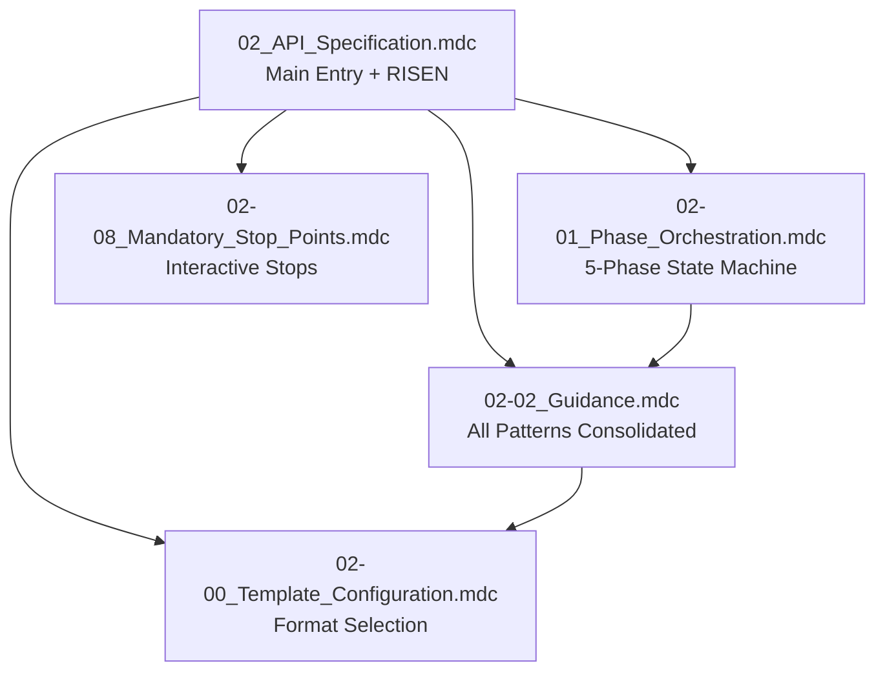

# 📚 API Specification Agent - Rules Index

**Version:** v2.1  
**Last Updated:** April 2026  
**Author**: Cheppali Shaik Sohail

---

## 🗂️ RULE FILE INDEX

| File | Purpose | Priority |
|------|---------|----------|
| `02_API_Specification.mdc` | Main entry point, RISEN framework, format selection | 🔴 Critical |
| `02-00_Template_Configuration.mdc` | Template-first approach, RAML/OAS comparison | � High |
| `02-01_Phase_Orchestration.mdc` | 5-phase state machine with format-aware tasks | � Critical |
| `02-02_Guidance.mdc` | **Consolidated**: API layers, quality, security, patterns | 🟠 High |
| `02-08_Mandatory_Stop_Points.mdc` | Interactive behavior enforcement | 🔴 Critical |

---

## 🔄 RULE RELATIONSHIPS

---

## 📋 RULE DESCRIPTIONS

### 02_API_Specification.mdc (Main Entry)
The primary rule file containing:
- RISEN framework for API specification
- Format selection (RAML 1.0 or OpenAPI 3.0)
- 5-phase workflow overview
- Non-negotiable rules
- Output structure for both formats

**When to reference:** Always - this is the entry point for all API specification generation.

---

### 02-00_Template_Configuration.mdc
Template-first approach configuration:
- Format comparison (RAML vs OpenAPI)
- Pre-generation checklist
- Structure configuration per format

**When to reference:** Phase 0, when loading templates and selecting format.

---

### 02-01_Phase_Orchestration.mdc
Defines the 5-phase workflow:
- **Phase 0:** Initialization
- **Phase 1:** Format Selection + Requirements Analysis
- **Phase 2:** Specification Design (format-aware)
- **Phase 3:** Quality Enhancement
- **Phase 4:** Validation & Delivery

**Key Features:**
- Format selection prompt in Phase 1
- Dual-format task definitions
- State file with format tracking
- Resume capability
- `<thinking>` block template (mandatory before every phase output)
- Confidence Calibration (HIGH/MEDIUM/LOW)
- RGV (Read-Generate-Verify) pattern per phase

**When to reference:** For workflow progression and state management.

---

### 02-02_Guidance.mdc (CONSOLIDATED)
All patterns, quality, and security in one file:
- API-Led Connectivity layers
- Project structure (RAML and OpenAPI)
- Fragment/Component types
- Security by layer
- 105-point quality scoring
- RFC 7807 error format
- Header templates (both formats)
- Evidence-Bound Outputs (source citation for every decision)
- Tree of Thought (ambiguous decision evaluation)
- Few-Shot Patterns (BAD vs GOOD examples)

**When to reference:** For all pattern, quality, and security guidance.

---

### 02-08_Mandatory_Stop_Points.mdc
Interactive behavior enforcement:
- STOP_AND_WAIT protocol
- Phase transition checkpoints
- Anti-pattern prevention
- Constitutional Principles (4 ranked override rules)
- Semantic Anti-Autopilot (phrase → meaning mapping)
- Contradiction Handling protocol
- Graceful Degradation (3-attempt rule)
- Input Sanitization

**When to reference:** Throughout generation for proper user interaction.

---

## 🔗 CROSS-REFERENCE MAP

| Topic | Primary Rule |
|-------|--------------|
| Format Selection | `02-00_Template_Configuration` |
| Phase Workflow | `02-01_Phase_Orchestration` |
| All Patterns | `02-02_Guidance` |
| Quality Scoring | `02-02_Guidance` |
| Security | `02-02_Guidance` |
| Interactivity | `02-08_Mandatory_Stop_Points` |

---

## ⚡ QUICK NAVIGATION

1. **Starting a new specification?**
   → `02_API_Specification.mdc` (entry point)

2. **Choosing RAML or OpenAPI?**
   → `02-00_Template_Configuration.mdc`

3. **Understanding phases?**
   → `02-01_Phase_Orchestration.mdc`

4. **All patterns, quality, security?**
   → `02-02_Guidance.mdc` (consolidated)

5. **Interactive checkpoints?**
   → `02-08_Mandatory_Stop_Points.mdc`

---

## 📂 RELATED RESOURCES

### Examples
| Format | Directory |
|--------|-----------|
| RAML 1.0 | `../examples/customer-system-api/` |
| OpenAPI 3.0 | `../examples/customer-system-api-oas/` |

### Documentation
- `../README.md` - Agent overview and quick start
- `../02_Production_Learnings.md` - Production insights

---

## 🔄 VERSION HISTORY

| Version | Date | Changes |
|---------|------|---------|
| v2.1 | Apr 2026 | LLM behavioral gap countermeasures: `<thinking>` blocks, Confidence Calibration, RGV, Evidence-Bound, Tree of Thought, Few-Shot, Constitutional Principles, Anti-Autopilot, Contradiction Handling, Graceful Degradation, Input Sanitization |
| v2 | Jan 2026 | RAML + OpenAPI support, consolidated guidance, modular architecture |
| 1.0 | Aug 2025 | Initial monolithic rule file |

---

*This index provides quick navigation across all API Specification Agent rules for efficient RAML/OpenAPI generation.*

