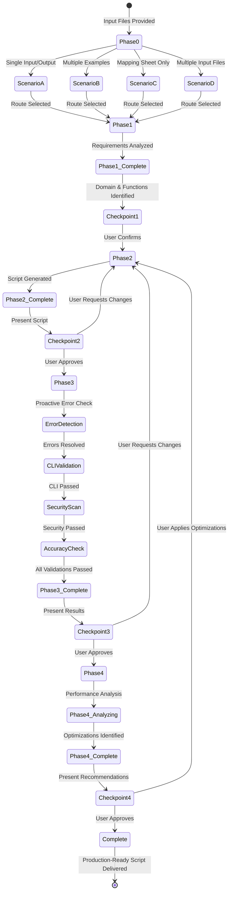

# DataWeave Intelligence Agent - Architecture

**Author**: Cheppali Shaik Sohail

## Overview

The DataWeave Intelligence Agent generates production-ready DataWeave transformations through specialized scripts/tools, smart auto-routing, and enterprise-grade validation. It transforms user requirements (sample data, mapping sheets, or text descriptions) into validated, production-safe DataWeave scripts.

The agent emphasizes production safety with zero runtime crashes through quality gates, MuleSoft best practices enforcement, and comprehensive error prevention. Smart auto-routing automatically detects workflow scenarios (Single Example, Multi-Example, Multi-Input, Mapping-Only) and routes to optimal validation pipelines, eliminating manual tool selection.

Key capabilities include domain intelligence for business context awareness (ECOMMERCE, HEALTHCARE, FINANCIAL), DataWeave function recommendations, proactive error detection before CLI execution, platform-optimized CLI validation, automated security scanning, and MuleSoft performance optimization. The agent follows a safe defaults strategy: natural null for display fields, safe functional defaults (0, now(), false) for arithmetic operations.

As of V2.1, the agent incorporates LLM behavioral gap countermeasures aligned with the R-GENIE Architecture Standard §13: `<thinking>` blocks for structured reasoning before every phase output, Confidence Calibration (HIGH/MEDIUM/LOW), RGV (Read-Generate-Verify) count verification per phase, Evidence-Bound Outputs, Tree of Thought for ambiguous decisions, Few-Shot BAD/GOOD patterns, Constitutional Principles (4 ranked override rules), Semantic Anti-Autopilot, Contradiction Handling, Graceful Degradation, and Input Sanitization. These techniques address all 14 documented LLM behavioral gaps.

## Workflow Steps

### Phase 0: Scenario Detection & Routing
- **What**: Automatically detects transformation scenario type and routes to optimal workflow
- **How**: Analyzes input files, expected outputs, and mapping files; determines complexity; selects workflow path (Single Example, Multi-Example, Multi-Input, Mapping-Only); configures validation pipeline
- **Why**: Ensures optimal tool selection and workflow efficiency, eliminating guesswork and maximizing validation effectiveness

### Phase 1: Requirements Analysis
- **What**: Performs intelligent requirements analysis with domain detection and function recommendations
- **How**: Analyzes input/output structures; detects business domain; identifies XML processing needs; recommends DataWeave functions; generates requirements analysis JSON
- **Why**: Provides deep understanding of transformation requirements before code generation, enabling context-aware script creation

### Phase 2: DataWeave Script Generation
- **What**: Generates production-ready DataWeave scripts with safe defaults and MuleSoft conventions
- **How**: Creates transformations based on requirements; applies safe defaults strategy (natural null for display, safe defaults for arithmetic); ensures no hardcoded values; validates reserved keyword usage
- **Why**: Produces maintainable, production-safe transformations that follow MuleSoft standards and prevent runtime failures

### Phase 3: Validation Suite
- **What**: Executes complete validation pipeline including error detection, CLI validation, security scanning, and accuracy verification
- **How**: Runs error detection → CLI validation → security scanning → output accuracy verification in orchestrated sequence
- **Why**: Ensures script correctness, security compliance, and accuracy before deployment, catching issues early

### Phase 4: Performance Optimization
- **What**: Analyzes script performance and provides MuleSoft optimization recommendations
- **How**: Analyzes imports for efficiency; checks safe checking patterns; evaluates memory usage; provides streaming recommendations for large datasets (>10MB)
- **Why**: Ensures optimal runtime performance following MuleSoft streaming patterns and memory management best practices

## Flow Diagram

