# App Development Agent - Architecture

**Author**: Cheppali Shaik Sohail

## Overview

The App Development Agent generates complete MuleSoft 4.6+ applications through an interactive 6-phase development pipeline with mandatory user checkpoints. It transforms technical design documents into fully functional MuleSoft projects including flow XML files, DataWeave transformations, configuration files, and deployment-ready applications.

The agent follows a modular architecture with template-driven generation, comprehensive reference libraries, and iterative build fixing loops. It ensures production-ready code by validating Maven builds, checking for common errors, and optimizing project structure. The agent integrates with the DataWeave Intelligence Agent for sophisticated transformation generation and maintains strict separation between interface flows, implementation flows, and subflows.

Key capabilities include design document parsing, flow generation with exact doc:ids, DataWeave transformation integration, Maven build validation with automatic error fixing, CloudHub deployment preparation, and comprehensive quality validation. The agent supports both greenfield development (from technical design) and template-based development (using existing project patterns), enabling flexible development approaches while maintaining code quality standards.

As of V2.1, the agent incorporates LLM behavioral gap countermeasures aligned with the R-GENIE Architecture Standard §13: `<thinking>` blocks for structured reasoning before every phase output, Confidence Calibration (HIGH/MEDIUM/LOW), RGV (Read-Generate-Verify) count verification per phase, Evidence-Bound Outputs, Tree of Thought for ambiguous decisions, Few-Shot BAD/GOOD patterns, Constitutional Principles (4 ranked override rules), Semantic Anti-Autopilot, Contradiction Handling, Graceful Degradation, and Input Sanitization. These techniques address all 14 documented LLM behavioral gaps.

## Directory Structure (V2 Lean 4-File Architecture)

```
03_App_Development_Agent/
├── ARCHITECTURE.md              # This file
├── README.md                    # Agent overview and quick start
├── 03_Production_Learnings.md   # Real-world lessons learned
├── rules/                       # 4-File Lean Architecture
│   ├── INDEX.md                 # Navigation guide
│   ├── 03_App_Development.mdc   # Main entry point (RISEN framework)
│   ├── 03-00_Phase_Orchestration.mdc  # Phase workflow & state
│   ├── 03-01_Guidance.mdc       # Patterns, components, errors
│   └── 03-02_Mandatory_Stop_Points.mdc  # Interactive enforcement
├── lib/
│   └── docs/                    # Detailed documentation
│       ├── component-reference.md    # MuleSoft component patterns
│       ├── error-patterns.md         # Build error fixes
│       └── version-compatibility.md  # Version matrix
└── examples/                    # Complete application examples
    ├── README.md
    ├── 01_simple_api_application.md
    ├── 02_batch_integration_application.md
    └── 03_event_driven_application.md
```

### Rule Files Summary

| File | Purpose |
|------|---------|
| `03_App_Development.mdc` | Main entry point with RISEN framework |
| `03-00_Phase_Orchestration.mdc` | 6-phase workflow & state management |
| `03-01_Guidance.mdc` | Patterns, components, error quick fixes |
| `03-02_Mandatory_Stop_Points.mdc` | Interactive user checkpoints |

## Workflow Steps

### Phase 0: Requirements & Template Analysis
- **What**: Understands requirements, analyzes templates (if provided), and detects project scope including complexity level and integration patterns
- **How**: Detects input type (design document vs template application), analyzes project structure and patterns, identifies integration patterns (HTTP, DB, Salesforce, JMS), detects complexity level, and extracts connector requirements
- **Why**: Establishes foundation for generation by understanding both requirements and preferred patterns, enabling accurate project structure creation and appropriate component selection

### Phase 1: Design Analysis & Validation
- **What**: Performs deep analysis of technical design document, validates architecture feasibility, and creates implementation plan
- **How**: Parses technical design sections, extracts endpoint specifications, identifies flow structure (interface, implementation, subflows), maps data transformations, validates architecture feasibility, and creates prioritized implementation plan
- **Why**: Ensures design can be implemented correctly, identifies potential issues early, and creates clear roadmap for code generation

### Phase 2: Application Generation
- **What**: Generates complete MuleSoft project structure including flows, DataWeave transformations, configuration files, and pom.xml
- **How**: Creates project structure, generates flow XML files with exact doc:ids, creates DataWeave transformation files, generates pom.xml with dependencies, creates property files for multiple environments, and sets up error handling flows
- **Why**: Converts design into executable code, ensuring all components are properly structured and follow MuleSoft best practices

### Phase 3: Build Fix & Optimization
- **What**: Achieves Maven build success through iterative error fixing and optimization
- **How**: Runs Maven build, parses errors, diagnoses issues using pattern library, generates fixes, validates fixes before application, applies corrections, and repeats until build succeeds
- **Why**: Ensures generated code compiles and builds correctly, catching dependency issues, XML syntax errors, and configuration problems before deployment

### Phase 4: Deployment Preparation
- **What**: Prepares application for deployment including CloudHub configuration, environment properties, and deployment scripts
- **How**: Configures CloudHub deployment settings, validates environment properties, creates deployment scripts, ensures Anypoint Studio compatibility, and prepares runtime configuration
- **Why**: Makes application ready for immediate deployment, ensuring all configuration is correct and deployment process is documented

### Phase 5: Final Validation & Quality Assessment
- **What**: Performs complete quality assessment using 100-point scoring framework and validates production readiness
- **How**: Runs comprehensive quality scoring across 5 categories (Requirements Compliance, Implementation Quality, Architecture & Design, Code Quality & Tests, Security & Compliance), performs code review checklist validation, and generates production readiness certification
- **Why**: Ensures application meets production standards, validates all quality gates, and provides confidence for deployment

## Flow Diagram

```mermaid
stateDiagram-v2
    [*] --> Phase0: Start Development
    
    Phase0 --> Phase0_Analyzing: Analyze Input
    Phase0_Analyzing --> Phase0_Complete: Analysis Done
    Phase0_Complete --> Checkpoint0: Present Analysis
    Checkpoint0 --> Phase1: User Confirms
    Checkpoint0 --> Phase0_Analyzing: User Requests Changes
    
    Phase1 --> Phase1_Parsing: Parse Design
    Phase1_Parsing --> Phase1_Validating: Validate Architecture
    Phase1_Validating --> Phase1_Complete: Plan Created
    Phase1_Complete --> Checkpoint1: Present Plan
    Checkpoint1 --> Phase2: User Approves
    Checkpoint1 --> Phase1_Parsing: User Requests Changes
    
    Phase2 --> Phase2_Generating: Generate Code
    Phase2_Generating --> Phase2_Complete: Project Created
    Phase2_Complete --> Checkpoint2: Present Structure
    Checkpoint2 --> Phase3: User Approves
    Checkpoint2 --> Phase2_Generating: User Requests Changes
    
    Phase3 --> Phase3_Building: Run Maven Build
    Phase3_Building --> Phase3_Success: Build Success
    Phase3_Building --> Phase3_Fixing: Build Failed
    Phase3_Fixing --> Phase3_Building: Fix Applied
    Phase3_Success --> Checkpoint3: Build Validated
    Checkpoint3 --> Phase4: User Confirms
    
    Phase4 --> Phase4_Preparing: Prepare Deployment
    Phase4_Preparing --> Phase4_Complete: Config Ready
    Phase4_Complete --> Checkpoint4: Present Config
    Checkpoint4 --> Phase5: User Approves
    Checkpoint4 --> Phase4_Preparing: User Requests Changes
    
    Phase5 --> Phase5_Validating: Run Quality Assessment
    Phase5_Validating --> Phase5_Complete: Quality Validated
    Phase5_Complete --> Checkpoint5: Present Score
    Checkpoint5 --> Complete: User Approves
    Checkpoint5 --> Phase5_Validating: Issues Found
    
    Complete --> [*]: Application Delivered
```



## Detailed Documentation

The `lib/docs/` directory contains detailed reference documentation:

| File | Content |
|------|---------|
| `component-reference.md` | MuleSoft connector patterns, flow templates, error handling |
| `error-patterns.md` | Build error diagnosis and fixes |
| `version-compatibility.md` | MuleSoft version matrix, Java 17 support |

> **Note**: Detailed reference content is in `lib/docs/` to keep rule files concise per R-GENIE Architecture Standard.

