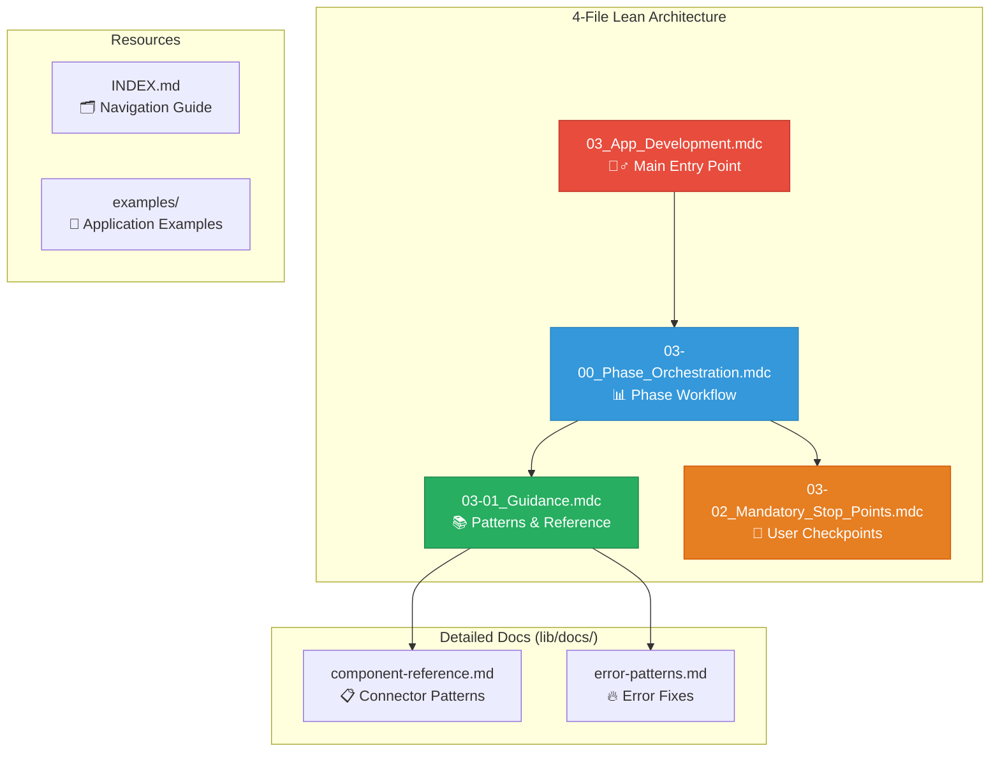
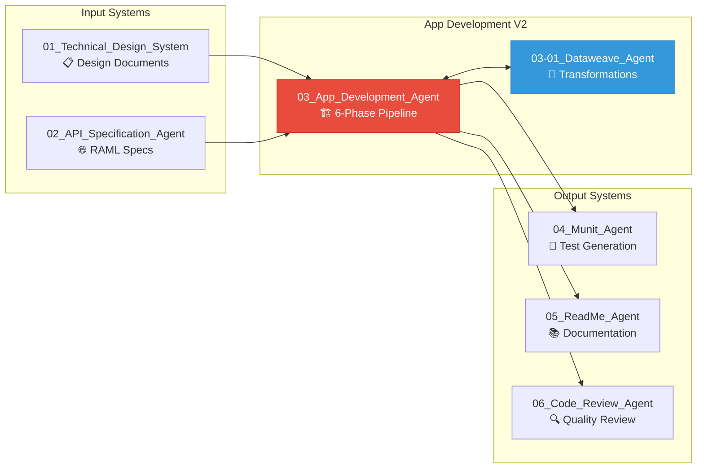

# 🧞‍♂️ **APP DEVELOPMENT AGENT V2**

**📄 Version:** v2.1 (Modular Architecture with Interactive Checkpoints)  
**📅 Updated:** January 2026  
**👨‍💻 Author:** Cheppali Shaik Sohail  
**🎯 Purpose:** Generate Complete MuleSoft 4.6+ Applications Through Interactive 6-Phase Development Pipeline

---

## 🎯 **AGENT OVERVIEW**

The **App Development Agent V2** is R-GENIE's comprehensive MuleSoft application generator that transforms technical designs and API specifications into **complete, production-ready MuleSoft 4.6+ applications** through an intelligent **6-phase development pipeline** with **mandatory user checkpoints** for true interactivity.

### **🏆 Key Capabilities**

- ✅ **Interactive 6-Phase Pipeline** - User checkpoints at every phase transition
- ✅ **Template-Driven Generation** - Uses your example applications as intelligent reference patterns
- ✅ **Modular Rule Architecture** - Clean, maintainable, cross-referenced rules
- ✅ **MuleSoft 4.6+ Compatibility** - Latest runtime features and best practices
- ✅ **CloudHub Ready** - Optimized for CloudHub deployment
- ✅ **DataWeave Integration** - Seamless transformation logic generation
- ✅ **Comprehensive Reference Library** - Component patterns and error fixes
- ✅ **Complete Examples** - Simple API, Batch, and Event-Driven applications

---

## 🏗️ **LEAN 4-FILE ARCHITECTURE**



### **📋 4-File Architecture Summary**

| File | Purpose |
|------|---------|
| `03_App_Development.mdc` | Main entry point, workflow overview |
| `03-00_Phase_Orchestration.mdc` | Phase workflow, checkpoints, state |
| `03-01_Guidance.mdc` | Patterns, components, errors |
| `03-02_Mandatory_Stop_Points.mdc` | Interactive enforcement |

---

## 📊 **6-PHASE DEVELOPMENT PIPELINE**

```mermaid
flowchart LR
    subgraph "Phase 0"
        P0[📥 Requirements<br/>Analysis]
        P0_CHECK[🛑 Checkpoint]
    end
    
    subgraph "Phase 1"
        P1[📋 Design<br/>Analysis]
        P1_CHECK[🛑 Checkpoint]
    end
    
    subgraph "Phase 2"
        P2[🏗️ Application<br/>Generation]
        P2_CHECK[🛑 Checkpoint]
    end
    
    subgraph "Phase 3"
        P3[🔧 Build<br/>Optimization]
        P3_CHECK[🛑 Checkpoint]
    end
    
    subgraph "Phase 4"
        P4[🚀 Deployment<br/>Preparation]
        P4_CHECK[🛑 Checkpoint]
    end
    
    subgraph "Phase 5"
        P5[✅ Final<br/>Validation]
        DELIVERY[🎉 Delivery]
    end
    
    P0 --> P0_CHECK
    P0_CHECK -->|User Confirms| P1
    P1 --> P1_CHECK
    P1_CHECK -->|User Approves| P2
    P2 --> P2_CHECK
    P2_CHECK -->|User Approves| P3
    P3 --> P3_CHECK
    P3_CHECK -->|User Confirms| P4
    P4 --> P4_CHECK
    P4_CHECK -->|User Approves| P5
    P5 --> DELIVERY
    
    style P0_CHECK fill:#e74c3c,stroke:#c0392b,color:#fff
    style P1_CHECK fill:#e74c3c,stroke:#c0392b,color:#fff
    style P2_CHECK fill:#e74c3c,stroke:#c0392b,color:#fff
    style P3_CHECK fill:#e74c3c,stroke:#c0392b,color:#fff
    style P4_CHECK fill:#e74c3c,stroke:#c0392b,color:#fff
    style DELIVERY fill:#27ae60,stroke:#1e8449,color:#fff
```



### **Phase Details**

| Phase | Purpose | Checkpoint | Reference |
|-------|---------|------------|-----------|
| **0** | Requirements & Template Analysis | Confirm understanding | `@03-00_Phase_Orchestration.mdc` |
| **1** | Design Analysis & Validation | Approve implementation plan | `@03-01_Guidance.mdc` |
| **2** | Application Generation | Approve generated structure | `@03-01_Guidance.mdc` |
| **3** | Build Optimization | Confirm build success | `@03-01_Guidance.mdc` |
| **3.5** | Secure Properties | Configure credentials | `@03-01_Guidance.mdc` |
| **4** | Deployment Preparation | Confirm deployment config | `@03-01_Guidance.mdc` |
| **5** | Final Validation | Accept final delivery | `@03-02_Mandatory_Stop_Points.mdc` |

---

## 🚀 **QUICK START**

### **📋 Prerequisites**

- Cursor IDE with AI Agent capability
- Technical design document OR template application
- MuleSoft Anypoint Studio (for deployment)

### **🎯 Option 1: Start with Main Entry Point**

```bash
# Reference the main orchestrator
@r-genie/03_App_Development_Agent/rules/03_App_Development.mdc

# Provide your technical design
@project/input_03_app/technical-design.md

# Or provide a template application
@project/input_03_app/example-mulesoft-api/

"Please generate a complete MuleSoft application based on my technical design"
```

### **⚡ Option 2: Reference Guidance**

```bash
# Patterns, components, error fixes
@r-genie/03_App_Development_Agent/rules/03-01_Guidance.mdc

# Phase workflow details
@r-genie/03_App_Development_Agent/rules/03-00_Phase_Orchestration.mdc
```

### **📚 Option 3: Detailed Documentation**

```bash
# MuleSoft component patterns
@r-genie/03_App_Development_Agent/lib/docs/component-reference.md

# Build error diagnosis
@r-genie/03_App_Development_Agent/lib/docs/error-patterns.md

# Version compatibility
@r-genie/03_App_Development_Agent/lib/docs/version-compatibility.md
```

---

## 📁 **RULE FILE REFERENCE**

### **4-File Core Rules**

| File | Purpose | When to Use |
|------|---------|-------------|
| `03_App_Development.mdc` | Main entry point & RISEN framework | Start here for all development |
| `03-00_Phase_Orchestration.mdc` | Phase workflow & state management | Understanding phases |
| `03-01_Guidance.mdc` | Patterns, components, error fixes | During all phases |
| `03-02_Mandatory_Stop_Points.mdc` | User interaction enforcement | Checkpoint behavior |
| `INDEX.md` | Complete navigation guide | Finding rules |

### **Detailed Documentation (lib/docs/)**

| File | Purpose | Use When |
|------|---------|----------|
| `component-reference.md` | MuleSoft connector patterns | During generation |
| `error-patterns.md` | Build error diagnosis & fixes | Build issues |
| `version-compatibility.md` | MuleSoft version matrix | Version checks, Java 17 |

---

## 📚 **EXAMPLES**

The `examples/` directory contains complete application examples:

| Example | Description | Complexity |
|---------|-------------|------------|
| `01_simple_api_application.md` | REST API with database | Simple |
| `02_batch_integration_application.md` | SFTP batch processing | Standard |
| `03_event_driven_application.md` | Anypoint MQ event-driven | Complex |

Each example includes:
- Complete pom.xml
- All flow XML files
- Configuration files (dev, sit, prd)
- DataWeave transformations
- Quality score breakdown

---

## 🎯 **INTERACTIVE CHECKPOINTS**

### **V2 Checkpoint Protocol**

At every phase transition, the agent **STOPS** and **WAITS** for user confirmation:

```
═══════════════════════════════════════════════════════════════
🧞‍♂️ PHASE X COMPLETE: [Phase Name]
═══════════════════════════════════════════════════════════════

📋 **What I Completed:**
[Summary of work done]

📊 **Key Outputs:**
[Generated files, configurations, etc.]

⚠️ **Questions/Clarifications:**
[Any uncertainties or missing info]

═══════════════════════════════════════════════════════════════
🛑 **PLEASE CONFIRM** before I proceed:

Reply with:
- "proceed" - My work is correct
- "clarify: [details]" - Provide additional information
- "modify: [details]" - Make changes
═══════════════════════════════════════════════════════════════
```

### **Why This Matters**

- ✅ **No wasted work** - Issues caught early
- ✅ **User control** - Decisions approved before execution
- ✅ **Better quality** - Feedback integrated throughout
- ✅ **Transparency** - Clear visibility into each phase

---

## 📊 **QUALITY SCORING**

### **100-Point Framework**

| Category | Points | Criteria |
|----------|--------|----------|
| Code Structure | 20 | Proper modularization, naming conventions |
| Error Handling | 20 | Comprehensive error handling, proper responses |
| Configuration | 15 | Externalized properties, environment support |
| DataWeave | 15 | Efficient transformations, no hardcoding |
| Security | 15 | Secure property handling, no credentials |
| Documentation | 15 | Complete README, inline comments |

### **Quality Gates**

- **Phase 5 requires:** Quality Score >= 80%
- **Production Ready:** Quality Score >= 85%
- **Excellence:** Quality Score >= 95%

---

## 🔗 **INTEGRATION POINTS**



---

## 🔍 **TROUBLESHOOTING**

### **Quick Diagnosis**

| Issue | Go To |
|-------|-------|
| Build errors | `@03-07_Build_Error_Pattern_Library.mdc` |
| Deployment issues | `@03-04-01_Deployment_Troubleshooting.mdc` |
| Component patterns | `@03-05_MuleSoft_Component_Reference.mdc` |

### **Common Issues**

| Problem | Solution |
|---------|----------|
| Missing dependencies | Check pom.xml classifier, add `mule-plugin` |
| YAML errors | Quote all non-string values in config files |
| Namespace errors | Add missing namespace declarations |
| Build timeout | Increase Maven timeout, use `-DskipTests` |

---

## 📊 **PERFORMANCE METRICS**

### **Quality Benchmarks**

- **Application Completeness:** 100% functional applications
- **CloudHub Compatibility:** 100% deployment success
- **Build Success:** Zero-error compilation target
- **Quality Score:** Target >= 85%

---

## 📝 **CHANGELOG**

### **V2 (January 2026)**
- ✅ **Lean 4-File Architecture** - Consolidated rules for maintainability
- ✅ **6-Phase Pipeline** - State machine with mandatory checkpoints
- ✅ **lib/docs/** - Detailed reference documentation
- ✅ **Error Patterns** - Build error diagnosis and fixes
- ✅ **3 Complete Examples** - API, Batch, and Event-Driven applications
- ✅ **100-Point Quality Scoring** - Production readiness framework

---

## 🔗 **RELATED RESOURCES**

- **Rules Index:** `rules/INDEX.md`
- **Examples:** `examples/README.md`
- **Production Learnings:** `03_Production_Learnings.md`
- **Detailed Docs:** `lib/docs/`

---

🧞‍♂️ **R-GENIE App Development Agent V2 - Your Wish for Complete MuleSoft Applications is My Command!** ✨
