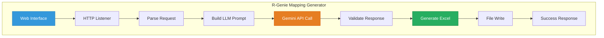

# 🧞‍♂️ R-GENIE App Development Agent - Examples

> **Purpose:** Complete application examples demonstrating R-GENIE App Development Agent capabilities  
> **Version:** 2.0.0  
> **Author**: Cheppali Shaik Sohail

---

## 📋 **Available Examples**

| Example | Description | Complexity | Key Features |
|---------|-------------|------------|--------------|
| [r-genie-mulesoft-mapping-generator/](./r-genie-mulesoft-mapping-generator/) | AI-Powered Mapping Generator | Standard | HTTP API, Gemini LLM Integration, File Connector, DataWeave, Web UI |

---

## 🎯 **How to Use This Example**

### **For Learning**
1. Import the project into Anypoint Studio
2. Study the flow structure (interface → implementation separation)
3. Note the patterns used (error handling, configuration, external API integration)

### **For Reference**
1. Copy relevant patterns for your own implementations
2. Use as a template for AI-integrated MuleSoft applications
3. Reference for best practices in LLM integration

### **For Template-Driven Development**
When using R-GENIE App Development Agent:
1. Point to this example as a template
2. Agent will analyze structure and patterns
3. Generate similar application with your requirements

---

## 📊 **Example Architecture Diagram**



---

## 📁 **Example Project Structure**

The `r-genie-mulesoft-mapping-generator/` project includes:

```
r-genie-mulesoft-mapping-generator/
├── pom.xml                              # Maven configuration
├── mule-artifact.json                   # MuleSoft artifact descriptor
├── .classpath                           # Eclipse/Studio classpath
├── .project                             # Eclipse/Studio project
├── README.md                            # Project documentation
└── src/
    └── main/
        ├── mule/                        # MuleSoft flows
        │   ├── global.xml               # Global configurations
        │   ├── interface.xml            # HTTP interface flows
        │   ├── error.xml                # Error handling
        │   └── implementation/          
        │       └── r-genie-mapping-generator.xml
        └── resources/
            ├── application-dev.yaml     # Development config
            ├── application-secure.yaml  # API keys (gitignored)
            ├── generation-modes.yaml    # AI model configurations
            ├── prompts/                 # AI prompt templates
            └── webapp/                  # Web interface (optional - if requirements need UI)
```

---

## 🚀 **Quick Start**

### **Option 1: Import & Run**
```bash
1. Import project into Anypoint Studio
2. Configure application-secure.yaml with your Gemini API key
3. Run as Mule Application
4. Access http://localhost:8081
```

### **Option 2: Use as Template**
```
User: "Generate an AI-integrated MuleSoft application like 
       r-genie-mulesoft-mapping-generator but for document analysis"

R-GENIE will:
1. Analyze the example structure
2. Extract patterns (HTTP, LLM integration, file operations)
3. Generate new AI-powered application
4. Follow same organization and best practices
```

### **Option 3: Pattern Reference**
```
Study this example for:
- External API integration patterns (Gemini/LLM)
- Multi-configuration file loading
- DataWeave template processing
- File generation workflows
- Web UI serving from MuleSoft
```

---

## 📊 **Key Patterns Demonstrated**

| Pattern | Location | Description |
|---------|----------|-------------|
| **Multi-Config Loading** | `global.xml` | Loading multiple YAML config files |
| **External API Integration** | `r-genie-mapping-generator.xml` | HTTP Request to Gemini API with dynamic path |
| **DataWeave Templates** | `r-genie-mapping-generator.xml` | Template string replacement pattern |
| **File Generation** | `r-genie-mapping-generator.xml` | Excel file creation from JSON |
| **Static Resource Serving** | `interface.xml` | Web UI via `http:load-static-resource` *(if requirements need UI)* |
| **Response Validation** | `r-genie-mapping-generator.xml` | `validation:is-true` for API response checking |

---

## 🔗 **Related Resources**

- `../rules/INDEX.md` - Rule navigation guide
- `../rules/03_App_Development.mdc` - Main development rules
- `../rules/03-01_Guidance.mdc` - Patterns & component reference
- `../lib/docs/component-reference.md` - Detailed connector patterns
- `../lib/docs/error-patterns.md` - Build error fixes

---

🧞‍♂️ **Learn from Examples, Build with Confidence!** ✨

