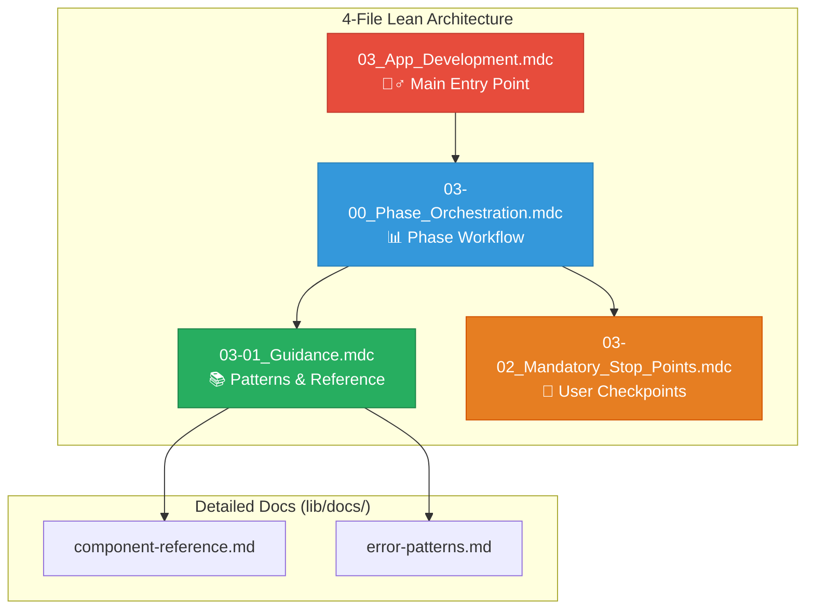
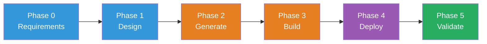

# 🧞‍♂️ R-GENIE App Development Agent - Rules Index

> **Version:** v2.1 (Lean 4-File Architecture)  
> **Purpose:** Navigation guide for App Development Agent  
> **Last Updated:** April 2026  
> **Author**: Cheppali Shaik Sohail

---

## 📋 **4-File Architecture** (Consistent with R-GENIE Agents)

| # | File | Purpose | Priority |
|---|------|---------|----------|
| 1 | `03_App_Development.mdc` | **MAIN ENTRY POINT** - Identity, workflow overview | HIGHEST |
| 2 | `03-00_Phase_Orchestration.mdc` | Phase workflow, checkpoints, state management | HIGH |
| 3 | `03-01_Guidance.mdc` | Patterns, components, errors, quick reference | HIGH |
| 4 | `03-02_Mandatory_Stop_Points.mdc` | Interactive enforcement, stop points | HIGHEST |

---

## 🎯 **Quick Reference**

| Need | Reference |
|------|-----------|
| Start app development | `@03_App_Development.mdc` |
| Phase workflow details | `@03-00_Phase_Orchestration.mdc` |
| Patterns, components & errors | `@03-01_Guidance.mdc` |
| Stop point enforcement | `@03-02_Mandatory_Stop_Points.mdc` |

---

## 📚 **Detailed Documentation** (lib/docs/)

For comprehensive reference beyond the essentials in Guidance:

| Document | Content |
|----------|---------|
| `component-reference.md` | All MuleSoft connector patterns |
| `error-patterns.md` | Build/deploy error fixes |
| `version-compatibility.md` | MuleSoft version reference |

---

## 🎯 **Rule Dependency Map**

---

## 📊 **Development Workflow**

---

## 🔄 VERSION HISTORY

| Version | Date | Changes |
|---------|------|---------|
| v2.1 | Apr 2026 | LLM behavioral gap countermeasures: `<thinking>` blocks, Confidence Calibration, RGV, Evidence-Bound, Tree of Thought, Few-Shot, Constitutional Principles, Anti-Autopilot, Contradiction Handling, Graceful Degradation, Input Sanitization |
| v2 | Jan 2026 | Lean 4-File Architecture, consolidated guidance |

---

🧞‍♂️ **App Development Agent V2.1 - Lean 4-File Architecture** ✨

