# MUnit Agent V2 - Architecture

**Author**: Cheppali Shaik Sohail

## Overview

The MUnit Agent V2 is a phase-enforced MUnit testing system that guarantees 85%+ test coverage through systematic iteration and intelligent optimization. It follows an 8-phase workflow with mandatory checkpoints, iterative Maven fix loops (max 10 iterations), and iterative coverage optimization loops (max 5 iterations) that ensure production-ready test suites.

The agent emphasizes LLM-orchestrated intelligence where Cursor AI applies rule patterns directly for flow classification, test strategy planning, test data generation, and error diagnosis, while JavaScript tools handle only file I/O and Maven execution. This hybrid architecture provides context-aware decisions versus rigid scripts, enabling natural adaptation to edge cases and faster pattern updates through rule file edits rather than code changes.

Key capabilities include proactive error detection (catching 80% of errors before Maven runs), intelligent coverage optimization through processor-level gap analysis, security scanning for hardcoded credentials, enterprise scale parallel processing for large projects, and comprehensive quality gates. The agent maintains strict phase enforcement with state persistence, ensuring workflow can resume from interruptions and providing clear progress visibility throughout the testing process.

As of V2.1, the agent incorporates LLM behavioral gap countermeasures aligned with the R-GENIE Architecture Standard §13: `<thinking>` blocks for structured reasoning before every phase output, Confidence Calibration (HIGH/MEDIUM/LOW), RGV (Read-Generate-Verify) count verification per phase, Evidence-Bound Outputs, Tree of Thought for ambiguous decisions, Few-Shot BAD/GOOD patterns, Constitutional Principles (4 ranked override rules), Semantic Anti-Autopilot, Contradiction Handling, Graceful Degradation, and Input Sanitization. These techniques address all 14 documented LLM behavioral gaps.

## Workflow Steps

### Phase 0: Requirements Analysis
- **What**: Validates project structure, counts flows, detects complexity, and identifies required properties
- **How**: Checks for pom.xml and src/main/mule existence, counts flow files, detects properties (${...}, Mule::p(), Azure Key Vault), and identifies risks and special configurations
- **Why**: Establishes project baseline and identifies testing prerequisites before beginning test generation, ensuring all necessary information is available

### Phase 1: Flow Discovery & Classification
- **What**: Discovers all flows, classifies by type (Business/Utility/Dependency/Simple), and extracts all doc:ids categorized by processor
- **How**: Reads all flow XML files, applies classification patterns, extracts connectors and their doc:ids, identifies mockable components, and scores complexity
- **Why**: Enables targeted test generation by understanding flow types and ensuring accurate mock targeting through exact doc:ids

### Phase 2: Test Strategy Planning
- **What**: Plans comprehensive testing strategy with 85% coverage target, test plans per flow, and mock/spy requirements
- **How**: Sets coverage target (default 85%), plans tests per flow (success, error, edge cases), plans mocks per connector with exact doc:ids, plans spies for all DataWeave transforms, and estimates coverage range
- **Why**: Creates systematic approach to achieve coverage target, ensuring all critical paths are tested and coverage gaps are identified upfront

### Phase 3: Test & Data Generation
- **What**: Generates realistic test data from DataWeave analysis, creates MUnit tests with exact doc:ids, and generates mocks with connector-specific patterns
- **How**: Generates test data matching DataWeave transformation logic, creates MUnit test XML files using templates, generates mocks with exact doc:ids from source flows, and creates spies for DataWeave transforms
- **Why**: Produces production-ready tests with accurate mocks and realistic data, ensuring tests execute correctly and provide meaningful coverage

### Phase 4: Proactive Validation
- **What**: Scans for schema violations, security issues, and quality problems before Maven execution, auto-fixing issues found
- **How**: Scans for schema violations (doc:name on structural elements), checks Salesforce mocks for ArrayList output directive, verifies HTTP mocks handle target variables, scans for hardcoded credentials, and auto-fixes issues
- **Why**: Catches 80% of errors before Maven runs, saving 1-3 minutes per error and ensuring tests are schema-compliant and secure

### Phase 4.5: Properties & Credentials
- **What**: Identifies required properties and requests user input before Maven execution
- **How**: Identifies all required properties from Phase 0 analysis, checks pom.xml for default values, detects connectors requiring credentials, prompts user with consolidated requirements, and constructs Maven command with properties
- **Why**: Ensures credentials are configured before testing begins, preventing authentication failures and maintaining security by never auto-creating credential files

### Phase 5: Maven Validation (Iterative)
- **What**: Fixes errors systematically through validated iterations until all tests pass (max 10 iterations)
- **How**: Runs Maven, parses results, diagnoses first error using pattern library, generates specific fix, validates fix before application, applies fix, shows progress, and repeats until all tests pass
- **Why**: Ensures all tests execute successfully through systematic error resolution, maintaining 90% auto-fix rate and clear progress visibility

### Phase 6: Coverage Optimization (Iterative)
- **What**: Systematically improves coverage to 85%+ through gap analysis and targeted improvements (max 5 iterations)
- **How**: Reads coverage report, calculates gap (85% - current%), analyzes uncovered processors with doc:ids, recommends specific improvements (spies, error tests, branches), generates improvements, runs Maven, measures delta, and repeats until coverage >= 85%
- **Why**: Guarantees 85%+ coverage through systematic gap analysis, ensuring comprehensive test coverage that meets production standards

### Phase 7: Completion & Reporting
- **What**: Generates console summary with iteration statistics and delivers production-ready test suite
- **How**: Counts total iterations (Phase 5 + Phase 6), summarizes results (tests, coverage, errors fixed), generates console summary, and provides next steps
- **Why**: Provides clear visibility into testing results and iteration metrics, enabling users to understand what was accomplished and what was delivered

## Flow Diagram

```mermaid
stateDiagram-v2
    [*] --> Phase0: Start Testing
    
    Phase0 --> Phase0_Validating: Validate Structure
    Phase0_Validating --> Phase0_Complete: Valid
    Phase0_Complete --> Phase1: Proceed
    
    Phase1 --> Phase1_Classifying: Classify Flows
    Phase1_Classifying --> Phase1_Complete: All Classified
    Phase1_Complete --> Phase2: Proceed
    
    Phase2 --> Phase2_Planning: Plan Strategy
    Phase2_Planning --> Phase2_Complete: Plan Created
    Phase2_Complete --> Phase3: Proceed
    
    Phase3 --> Phase3_Generating: Generate Tests
    Phase3_Generating --> Phase3_Complete: Tests Created
    Phase3_Complete --> Phase4: Proceed
    
    Phase4 --> Phase4_Validating: Proactive Validation
    Phase4_Validating --> Phase4_Fixing: Auto-Fix Issues
    Phase4_Fixing --> Phase4_Validating: Re-validate
    Phase4_Validating --> Phase4_Complete: All Passed
    Phase4_Complete --> Phase45: Proceed
    
    Phase45 --> Phase45_Requesting: Request Properties
    Phase45_Requesting --> Phase45_Complete: User Provides
    Phase45_Complete --> Phase5: Proceed
    
    Phase5 --> Phase5_Running: Run Maven
    Phase5_Running --> Phase5_Success: All Pass
    Phase5_Running --> Phase5_Fixing: Errors Found
    Phase5_Fixing --> Phase5_Running: Fix Applied
    Phase5_Success --> Phase6: Proceed
    
    Phase6 --> Phase6_Analyzing: Analyze Coverage
    Phase6_Analyzing --> Phase6_Enough: Coverage >= 85%
    Phase6_Analyzing --> Phase6_Improving: Coverage < 85%
    Phase6_Improving --> Phase6_Running: Generate Improvements
    Phase6_Running --> Phase6_Analyzing: Re-measure
    Phase6_Enough --> Phase7: Proceed
    
    Phase7 --> Phase7_Reporting: Generate Summary
    Phase7_Reporting --> Complete: Complete
    
    Complete --> [*]: Tests Delivered
```

