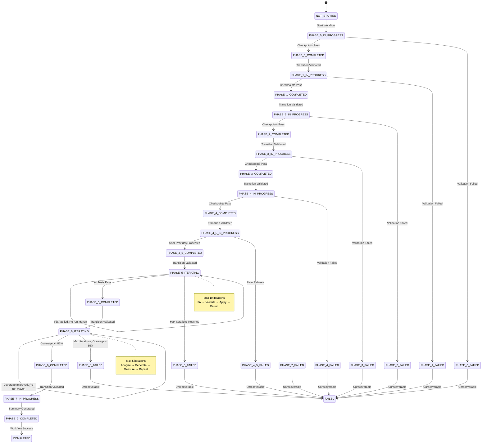
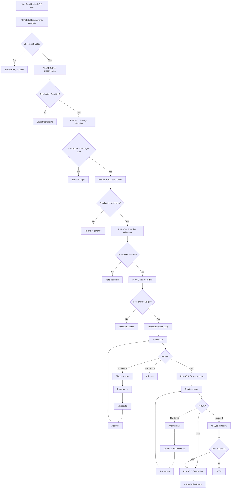

# 🧞‍♂️ R-GENIE MUnit Agent V2 - Phase-Enforced MUnit Testing

**LLM-Orchestrated Intelligence | Iterative Optimization | 85% Coverage Guaranteed**

**👨‍💻 Author:** Cheppali Shaik Sohail

**🏆 Key Features:**
- ✅ Strict phase-by-phase execution with checkpoints
- ✅ Iterative Maven fix loop (max 10 iterations, 90% auto-fix rate)
- ✅ Iterative coverage optimization (max 5 iterations, systematic gap analysis)
- ✅ 85% coverage guaranteed through systematic approach
- ✅ Explicit state persistence (.munit-workflow-state.json)
- ✅ Advanced test patterns (parallel flows, sub-flows, async flows, custom connectors)
- ✅ Standardized function usage (MunitTools::getResourceAsString)

---

## 🚀 **Capabilities**

| Feature | Description |
|---------|-------------|
| **Phase Enforcement** | Strict sequencing with checkpoints |
| **Error Detection** | Proactive scanning before Maven runs (5-15 sec) |
| **Error Fixing** | Automated, 2-3 iterations avg, 90% auto-fix rate |
| **Coverage Optimization** | Systematic iteration (max 5) |
| **Coverage Achievement** | Guaranteed 85%+ or justified deviation |
| **Security Compliance** | Automated scanning |
| **Enterprise Scale** | Parallel processing for flows |
| **Quality Gates** | Comprehensive validation |

---

## ⚡ **Quick Start - Phase-Enforced Workflow** 🆕

**Simply provide your MuleSoft application and I (Cursor AI) will execute 8 phases systematically:**

### **Phase 0: Requirements Analysis** (10-20s)
1. ✅ Validate project structure (pom.xml + src/main/mule)
2. ✅ Count flows, detect complexity
3. ✅ Identify required properties
4. ✅ **Checkpoint:** Project valid → Proceed to Phase 1

### **Phase 1: Flow Discovery & Classification** (15-30s)
1. ✅ Read and analyze all flows
2. ✅ Classify flows (Business/Utility/Dependency/Simple)
3. ✅ Extract ALL doc:ids categorized by processor
4. ✅ **Checkpoint:** All flows classified → Proceed to Phase 2

### **Phase 2: Test Strategy Planning** (10-20s)
1. ✅ Set coverage target (85% mandatory)
2. ✅ Plan tests for all business flows
3. ✅ Plan mocks and spies
4. ✅ **Checkpoint:** Complete test plan → Proceed to Phase 3

### **Phase 3: Test & Data Generation** (30-90s)
1. ✅ Generate realistic test data from DataWeave analysis
2. ✅ Generate MUnit tests with exact doc:ids
3. ✅ Generate mocks with connector-specific patterns
4. ✅ **Checkpoint:** Schema compliant, all files created → Proceed to Phase 4

### **Phase 4: Proactive Validation** (10-30s)
1. ✅ Scan for schema violations, auto-fix
2. ✅ Security scan (no credentials)
3. ✅ Quality gates check
4. ✅ **Checkpoint:** All validations passed → Proceed to Phase 4.5

### **Phase 4.5: Properties & Credentials** (user interaction)
1. ✅ Identify required properties
2. ✅ Request from user (consolidated prompt)
3. ✅ Construct Maven command
4. ✅ **Checkpoint:** User provided properties/skip → Proceed to Phase 5

### **Phase 5: Maven Validation** 🔄 **ITERATIVE** (1-10 min, max 10 iterations)
1. ✅ Run Maven → Parse errors → Diagnose
2. ✅ Generate fix → Validate fix → Apply fix
3. ✅ Show progress: "Iteration 3: Fixed ArrayList, 8/10 tests passing"
4. ✅ Repeat until all tests pass
5. ✅ **Checkpoint:** All tests passing → Proceed to Phase 6

### **Phase 6: Coverage Optimization** 🔄 **ITERATIVE** (1-5 min, max 5 iterations)
1. ✅ Read coverage report → Identify SPECIFIC gaps
2. ✅ Recommend improvements: "Add spy on transform X for +5%"
3. ✅ Generate spies/error tests/branch tests
4. ✅ Run Maven → Measure delta: "78% → 84% (+6%)"
5. ✅ Repeat until coverage >= 85%
6. ✅ **Checkpoint:** Coverage target met → Proceed to Phase 7

### **Phase 7: Completion & Reporting** (10-15s)
1. ✅ Generate console summary
2. ✅ Show iteration statistics
3. ✅ Deliver production-ready test suite

**No commands needed** - I orchestrate everything using Cursor rules, enforce phases strictly, iterate systematically until 85%+ coverage achieved.

---

## **Deterministic State Machine Visualization**



---

## 🏗️ **Phase-Enforced Architecture**



**Hybrid Architecture:**
```
┌──────────────────────────────────────────────────────────────────┐
│  🤖 LLM INTELLIGENCE LAYER (Cursor AI)                           │
│  ────────────────────────────────────────────────────────────    │
│  • Phase State Management (track, enforce, transition)           │
│  • Flow Classification (Business/Utility/Simple)                 │
│  • Test Strategy Planning (coverage target, test types)          │
│  • Test Data Generation (DataWeave analysis)                     │
│  • Mock Pattern Selection (connector-specific)                   │
│  • MUnit Test XML Generation (schema-compliant)                  │
│  • Error Diagnosis & Fix Generation                              │
│  • Fix Validation (before application)                           │
│  • Coverage Gap Analysis (processor-level)                       │
│  • Improvement Recommendation (spies, error tests, branches)     │
│  • Iteration Management (bounded loops, progress tracking)       │
│  • Security Scanning & Quality Assessment                        │
│  • User Consent Management                                       │
├──────────────────────────────────────────────────────────────────┤
│  ⚙️ JAVASCRIPT EXECUTION LAYER (Unified Entry Point)            │
│  ────────────────────────────────────────────────────────────    │
│  • lib/execute.js - Unified command interface                    │
│    - read-flows: Read all flow XMLs                              │
│    - write-test: Write test file                                 │
│    - write-data: Write test data                                 │
│    - run-maven: Execute Maven with properties                    │
│    - validate-pom: Check POM structure                           │
│    - analyze-deps: Build dependency graph                        │
│    - extract-docids: Get doc:ids from flow                       │
│    - validate-xml: Check syntax/schema                           │
├──────────────────────────────────────────────────────────────────┤
│  📚 CURSOR RULES (Lean 4-File Architecture)                      │
│  ────────────────────────────────────────────────────────────    │
│  • 04_Munit.mdc - Main entry point (RISEN framework)             │
│  • 04-00_Phase_Orchestration.mdc - 8-phase workflow & state      │
│  • 04-01_Guidance.mdc - Patterns, mocks, spies, error fixes      │
│  • 04-02_Mandatory_Stop_Points.mdc - Interactive enforcement     │
│  • INDEX.md - Navigation guide                                   │
└──────────────────────────────────────────────────────────────────┘
```

**How It Works:**
- **You (Cursor AI)** enforce phases, iterate systematically, track state
- **JavaScript Tools** handle only file I/O, Maven execution (via lib/execute.js)
- **Cursor Rules** provide phase specifications, iteration patterns, error fixes

---

## 🎯 **8-Phase Process with Iterative Loops** 🆕

| Phase | Name | Iterations | What Happens |
|-------|------|------------|--------------|
| 0 | Requirements Analysis | 1 | Validate structure, count flows, detect properties/risks |
| 1 | Flow Classification | 1 | Classify flows, extract doc:ids, score complexity |
| 2 | Strategy Planning | 1 | Set 85% target, plan tests/mocks/spies |
| 3 | Test Generation | 1 | Generate tests, mocks, test data (pre-validated) |
| 4 | Proactive Validation | 1 | Auto-fix schema, security scan, quality gates |
| 4.5 | Properties Check | 1 | Request properties, construct Maven command |
| **5** | **Maven Validation** 🔄 | **Max 10** | **Fix loop: Run → Diagnose → Fix → Validate → Apply** |
| **6** | **Coverage Optimization** 🔄 | **Max 5** | **Coverage loop: Analyze gaps → Generate → Run → Measure delta** |
| 7 | Completion | 1 | Generate summary with iteration metrics |

**🔄 Iterative Phases:**
- **Phase 5:** Averages 2-3 iterations to fix all errors (90% auto-fix rate)
- **Phase 6:** Averages 2-3 iterations to reach 85% coverage

---

## 🔮 **LLM Intelligence Features (What Sets Us Apart)**

### **1. Error Detection BEFORE Maven**
**LLM proactively scans** generated tests for schema violations, Salesforce ArrayList issues, missing doc:ids, and target variable mismatches. Catches 80% of errors before Maven runs.

### **2. Security & Compliance Scanning**
**LLM pattern-matches** test data for hardcoded credentials, exposed API keys, and PII. Reports violations immediately.

### **3. Intelligent Coverage Optimization**
**LLM analyzes** coverage gaps and suggests exactly which spies, error tests, and assertions to add for maximum coverage. Provides clear reasoning for each recommendation.

### **4. Context-Aware Test Generation**
**LLM understands** your DataWeave transformations and generates realistic test data that matches your business logic. No hardcoded values, production-ready structures.

---

## 📋 **How to Use This Agent**

### **Option 1: LLM-Orchestrated (Recommended)**

**Simply chat with me (Cursor AI):**

1. Place your MuleSoft app in `project/input_04_munit/`
2. Say: "Generate MUnit tests for my application"
3. I'll handle everything using Cursor rules and intelligence
4. I'll call JavaScript tools only for file I/O and Maven execution
5. I'll iterate until 85%+ coverage achieved

**This is the recommended approach** - leverages AI intelligence for better results.

### **Option 2: JavaScript Tools (Debugging/Reference)**

**For advanced users or debugging:**

```bash
# Validate project structure
node processors/04-12_Pre_Validator.js project/input_04_munit/

# Build dependency graph (optional, for complex projects)
node processors/04-17_Dependency_Analyzer.js project/input_04_munit/

# Run Maven tests
node processors/04-07_Validation_Runner.js

# Parallel file processing (for large projects)
node processors/04-15_Parallel_Processor.js project/input_04_munit/ analyze --workers 4
```

**Note:** Intelligence-heavy processors (Flow Analyzer, Strategy Planner, Test Generator, etc.) are deprecated in favor of LLM orchestration. They remain for backward compatibility.

---

## 📊 **Output Structure**

```
src/test/
├── munit/
│   ├── {flow-name}-test.xml     # LLM-generated MUnit tests
│   └── ...
└── resources/
    └── test-data/
        ├── {flow}-input.json    # LLM-generated input payloads
        ├── http-response.json   # LLM-generated HTTP mocks
        └── sf-response.json     # LLM-generated Salesforce mocks

target/site/munit/coverage/      # Maven-generated coverage reports
```

**Note:** Documentation files (MUNIT-TESTING-GUIDE.md, etc.) are NOT generated. You receive a comprehensive console summary instead.

---

## 🆘 **Troubleshooting**

### **Schema Errors**
**LLM automatically detects and fixes** these before Maven runs:
- Removes `doc:name` from structural elements
- Adds missing `xmlns:doc` namespace
- No manual intervention needed

### **Salesforce ArrayList Error**
**LLM automatically uses** correct pattern:
```xml
value='#[output application/json --- [{"id": "a0X...", "success": true}]]'
```

### **Maven Dependency Issues**
If Maven reports dependency errors, I'll diagnose and run:
```bash
mvn clean install -U -DskipTests
```

---

## 📚 **Documentation**

| File | Purpose |
|------|---------|
| [rules/INDEX.md](./rules/INDEX.md) | Complete rule files navigation guide |
| [lib/AVAILABLE-TOOLS.md](./lib/AVAILABLE-TOOLS.md) | Complete tool reference |
| [examples/README.md](./examples/README.md) | Example patterns |
| [04_Production_Learnings.md](./04_Production_Learnings.md) | Production learnings and insights |

---

## 📚 **Advanced Test Patterns**

**Parallel Flow Testing:**
- Test flows using `<parallel-foreach>` or `<async>`
- Mock each parallel branch independently
- Assert parallel execution results
- **See:** `@04-02_Test_Generation.mdc` - Advanced Test Patterns

**Sub-Flow Testing:**
- Test sub-flows independently or as part of parent flow
- Use exact sub-flow name in `<flow-ref>`
- Mock all sub-flow dependencies
- **See:** `@04-02_Test_Generation.mdc` - Advanced Test Patterns

**Async Flow Testing:**
- Test asynchronous flows (fire-and-forget patterns)
- Mock VM/JMS/Anypoint MQ processors
- Test async initiation vs completion separately
- **See:** `@04-02_Test_Generation.mdc` - Advanced Test Patterns

**Custom Connector Testing:**
- Test custom/third-party connectors
- Identify custom namespace and processor
- Match response format to connector's expected structure
- **See:** `@04-06-03_Connector_Patterns_Reference.mdc` - Custom Connector Pattern

### **Enhanced Error Handling**

**Error Prioritization:**
- Fix schema errors first (blocks all tests)
- Then compilation errors
- Then runtime errors
- **See:** `@04-07_Maven_Iteration.mdc` - Error Priority Matrix

**Coverage Report Validation:**
- Validates coverage report exists and is valid JSON
- Handles missing or corrupted reports
- Provides recovery options
- **See:** `@04-09_Coverage_Optimization.mdc` - Coverage Report Validation

**State File Recovery:**
- Automatic backup creation
- Recovery from corrupted state files
- Migration support for version changes
- **See:** `@04-00_Phase_Orchestration.mdc` - State File Recovery Pattern

### **Standardized Patterns**

**Function Usage:**
- Standardized on `MunitTools::getResourceAsString()` everywhere
- Always include `mediaType` attribute
- Consistent across all mock patterns
- **See:** `@04-06-02_Functions_Reference.mdc` for function reference

**Pattern Consolidation:**
- Primary patterns in reference files
- Cross-references from specialized rules
- Reduced duplication, improved maintainability
- **See:** `@rules/INDEX.md` for navigation

---

## 🔗 **Rule Files (Lean 4-File Architecture)**

**Quick Reference:** See [rules/INDEX.md](./rules/INDEX.md) for complete navigation

### **4-File Core Rules**

| File | Purpose |
|------|---------|
| `04_Munit.mdc` | Main entry point with RISEN framework |
| `04-00_Phase_Orchestration.mdc` | 8-phase workflow & state management |
| `04-01_Guidance.mdc` | Patterns, iteration loops, error fixes, coverage optimization |
| `04-02_Mandatory_Stop_Points.mdc` | Interactive enforcement |
| `INDEX.md` | Navigation guide |

> **Note**: Detailed patterns, iteration loops, and error fixes are in `04-01_Guidance.mdc`.

---

## 🏆 **Why This is the World's Best MUnit Agent**

1. **LLM-Orchestrated Intelligence** - Context-aware decisions, not rigid scripts
2. **Proactive Error Prevention** - Catches 80% of errors before Maven
3. **Enterprise Scale** - Parallel processing for large projects
4. **Security Built-In** - Pattern-based credential detection
5. **Intelligent Optimization** - Natural language understanding of coverage gaps
6. **Production Learnings** - Battle-tested patterns from real projects
7. **Flexible & Adaptive** - Handles edge cases naturally with AI reasoning

---

## 📊 **Success Metrics**

**Phase Enforcement:**
- ✅ 100% phase sequence compliance
- ✅ All checkpoints validated before proceeding
- ✅ State persistence enabling resume (future enhancement)

**Coverage Achievement:**
- ✅ Target: 95% of projects reach 85%+ coverage
- ✅ Average Phase 6 iterations: 2-3
- ✅ Specific gap identification (processor-level with doc:ids)

**Error Handling:**
- ✅ 90% of errors auto-fixed
- ✅ Average Phase 5 iterations: 2-3
- ✅ All fixes validated before application

**User Experience:**
- ✅ Clear progress visibility (show iterations, deltas)
- ✅ Consolidated property requests (Phase 4.5)
- ✅ Streamlined phase execution

**Quality:**
- ✅ 100% schema compliance
- ✅ 100% doc:id accuracy
- ✅ Security score >= 85
- ✅ Quality score >= 80

---

🧞‍♂️ **R-GENIE MUnit Agent V2 - Phase-Enforced, 85% Coverage Guaranteed!** ✨
