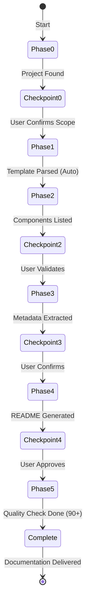

# ReadMe Agent - Architecture

**Author**: Cheppali Shaik Sohail

## Overview

The ReadMe Agent generates professional documentation packages for MuleSoft applications using a **template-first, Mermaid-driven approach**. It follows a **6-phase interactive workflow (Phases 0-5)** with mandatory stop points, ensuring users maintain control over documentation content and accuracy.

The agent automatically extracts information from project files (pom.xml, flow XML files, configuration files) rather than requiring manual input. It produces enterprise-ready documentation with **Mermaid flowchart diagrams** (ASCII art forbidden), code examples, and professional formatting.

As of V2.1, the agent incorporates LLM behavioral gap countermeasures aligned with the R-GENIE Architecture Standard §13: `<thinking>` blocks for structured reasoning before every phase output, Confidence Calibration (HIGH/MEDIUM/LOW), RGV (Read-Generate-Verify) count verification per phase, Evidence-Bound Outputs, Tree of Thought for ambiguous decisions, Few-Shot BAD/GOOD patterns, Constitutional Principles (4 ranked override rules), Semantic Anti-Autopilot, Contradiction Handling, Graceful Degradation, and Input Sanitization. These techniques address all 14 documented LLM behavioral gaps.

## Rule Files (V2 - Template-Driven)

```
rules/
├── INDEX.md                         - Rules index & quick reference
├── 05_ReadMe.mdc                    - Main entry point
├── 05-00_Template_Configuration.mdc - Phase 0: Template-first approach
├── 05-01_Phase_Orchestration.mdc    - Phase workflow & state
├── 05-02_Guidance.mdc               - Phases 1-4: RISEN, extraction, Mermaid
└── 05-03_Mandatory_Stop_Points.mdc  - Always: Interactive enforcement
```

**Total: 5 rule files + INDEX.md**

### V2 Key Changes
- **Template-First**: Reads `templates/` and `examples/` folders before generation
- **Mermaid Mandatory**: Flowchart diagrams required, ASCII art forbidden
- **Enhanced Quality**: 90+ point target (up from 85+)

## Workflow Phases

### Phase 0: Initialization
- **What**: Confirm project location and documentation scope
- **Stop**: User confirms scope before proceeding

### Phase 1: Template Parsing
- **What**: Parse `templates/` folder (YAML), load `examples/` folder (all .md files), extract style rules and Mermaid patterns
- **Stop**: Internal (auto-proceed)
- **Critical**: Must complete before any generation begins

### Phase 2: Discovery
- **What**: Scan project structure, list all components (flows, configs, tests)
- **Stop**: User validates component list

### Phase 3: Extract
- **What**: Parse pom.xml, flows, and config files for metadata
- **Stop**: User confirms extracted information accuracy

### Phase 4: Generate
- **What**: Build README progressively using template structure with Mermaid diagrams
- **Stop**: User approves content

### Phase 5: Finalize
- **What**: Quality check against template (90+ target), verify Mermaid diagrams, final formatting
- **Stop**: Final approval before saving

## Flow Diagram



## Key Principles

1. **Template-First** - MUST read templates and examples before generation
2. **STOP and WAIT** - Never proceed without user confirmation
3. **Mermaid Diagrams** - Flowchart diagrams mandatory (ASCII forbidden)
4. **Progressive Build** - Build README incrementally, not all at once
5. **Quality Target** - 90+ points on 100-point scoring framework
6. **References over Duplication** - Use `templates/` and `examples/` folders

