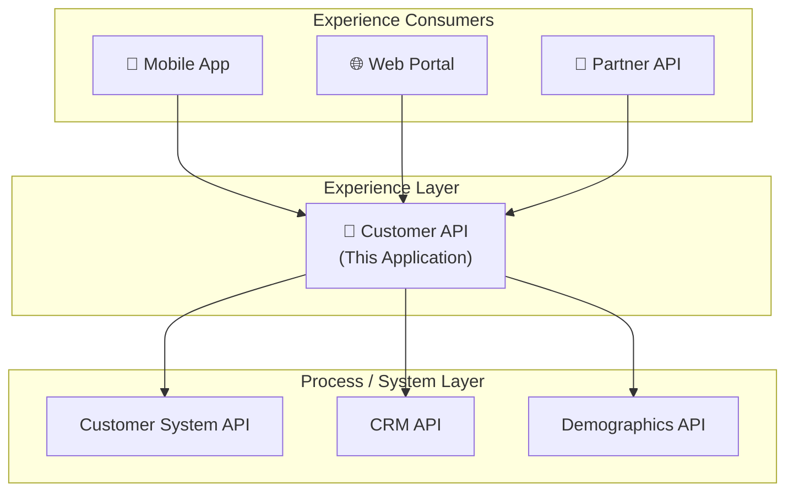
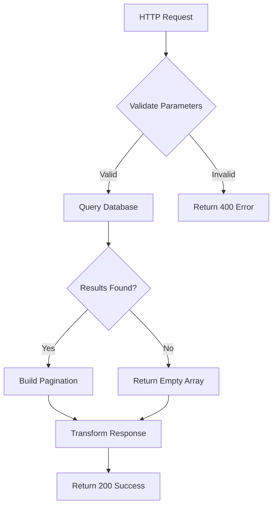
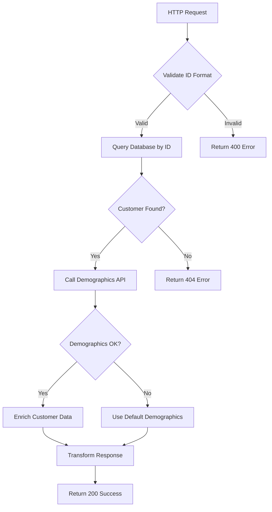
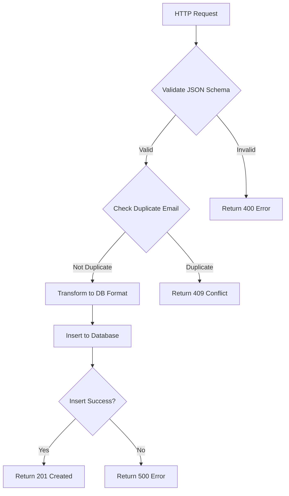
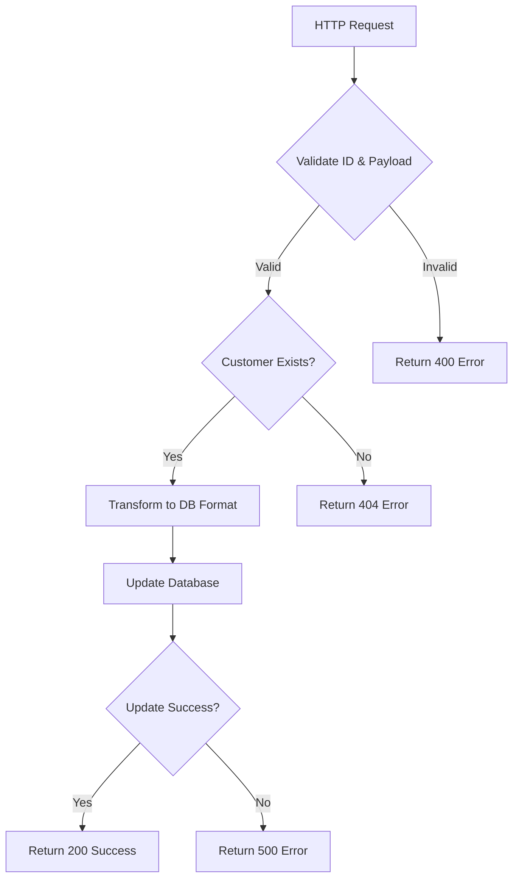
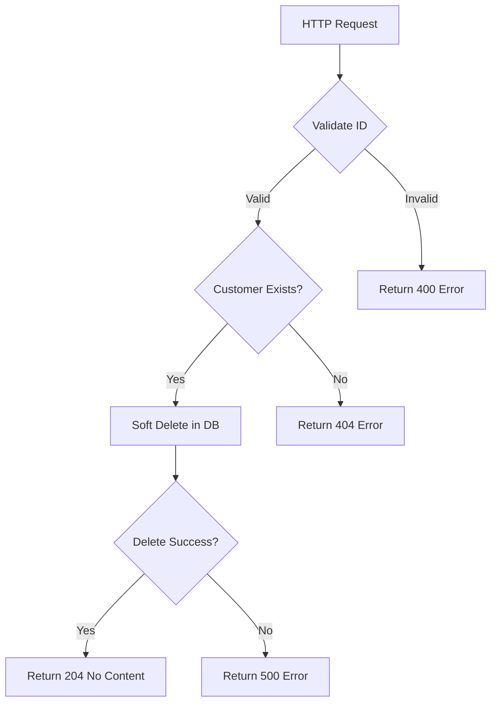

# Customer API Integration

**Version:** 1.2.0 | **MuleSoft Runtime:** 4.4.0 | **Status:** Active

**🧞‍♂️ Generated by R-GENIE README Agent**

---

## 📋 Table of Contents
- [Overview](#-overview)
- [Architecture](#-architecture)
- [API Endpoints](#-api-endpoints)
- [Support](#-support)

---

## 🎯 Overview

### Purpose
The **Customer API Integration** application provides a RESTful API layer for managing customer data. It acts as the Experience Layer in the API-Led Connectivity architecture, orchestrating calls between the frontend applications and backend customer systems.

### Business Context
This integration serves as the primary customer data gateway for:
- Mobile applications
- Web portals
- Partner integrations

### Key Capabilities

| Capability | Description |
|------------|-------------|
| Customer CRUD | Create, Read, Update, Delete customer records |
| Customer Search | Search customers by name, email, or ID |
| Data Validation | Validate incoming customer data against business rules |
| Data Enrichment | Enrich customer data with external demographics |

### Technology Stack

| Component | Version | Purpose |
|-----------|---------|---------|
| MuleSoft Runtime | 4.4.0 | Integration platform |
| HTTP Connector | 1.7.3 | REST API hosting |
| Database Connector | 1.13.6 | PostgreSQL integration |
| Validation Module | 2.0.3 | Input validation |

---

## 🏗️ Architecture

### System Design

This application follows the **Experience API** pattern in MuleSoft's API-Led Connectivity model:

---

## 🌐 API Endpoints

### GET /api/v1/customers

**Description**: Retrieves a paginated list of all customers

**Endpoint Details:**

| Method | Path | Description |
|--------|------|-------------|
| GET | `/api/v1/customers` | List all customers with pagination |

**Query Parameters:**
| Parameter | Type | Required | Default | Description |
|-----------|------|----------|---------|-------------|
| limit | integer | No | 100 | Maximum results to return |
| offset | integer | No | 0 | Number of records to skip |
| sort | string | No | createdAt | Sort field |
| order | string | No | desc | Sort order (asc/desc) |

**Flow Diagram:**

**Test Data:**
- MUnit: `src/test/munit/get-customers-test-suite.xml`
- Mock Data: `src/test/resources/customers/list-response.json`

---

### GET /api/v1/customers/{id}

**Description**: Retrieves a single customer by their unique ID

**Endpoint Details:**

| Method | Path | Description |
|--------|------|-------------|
| GET | `/api/v1/customers/{id}` | Get customer by ID |

**Path Parameters:**
| Parameter | Type | Description |
|-----------|------|-------------|
| id | string | Customer unique identifier (e.g., CUST-001) |

**Flow Diagram:**

**Test Data:**
- MUnit: `src/test/munit/get-customer-by-id-test-suite.xml`
- Test Payload: `src/test/resources/customers/customer-001.json`
- Mock Demographics: `src/test/resources/demographics/enrichment-response.json`

---

### POST /api/v1/customers

**Description**: Creates a new customer record

**Endpoint Details:**

| Method | Path | Description |
|--------|------|-------------|
| POST | `/api/v1/customers` | Create new customer |

**Flow Diagram:**

**Test Data:**
- MUnit: `src/test/munit/create-customer-test-suite.xml`
- Request Payload: `src/test/resources/customers/create-request.json`
- Expected Response: `src/test/resources/customers/create-response.json`

---

### PUT /api/v1/customers/{id}

**Description**: Updates an existing customer record

**Endpoint Details:**

| Method | Path | Description |
|--------|------|-------------|
| PUT | `/api/v1/customers/{id}` | Update customer |

**Flow Diagram:**

**Test Data:**
- MUnit: `src/test/munit/update-customer-test-suite.xml`
- Request Payload: `src/test/resources/customers/update-request.json`

---

### DELETE /api/v1/customers/{id}

**Description**: Deletes a customer record

**Endpoint Details:**

| Method | Path | Description |
|--------|------|-------------|
| DELETE | `/api/v1/customers/{id}` | Delete customer |

**Flow Diagram:**

**Test Data:**
- MUnit: `src/test/munit/delete-customer-test-suite.xml`

---

## 👥 Support

- **Team**: Customer Experience Integration Team
- **Documentation**: [Internal Wiki](https://wiki.example.com/customer-api)
- **Support Email**: customer-api-support@example.com
- **Slack Channel**: #customer-api-support

---

*🧞‍♂️ Generated by R-GENIE README Agent*
