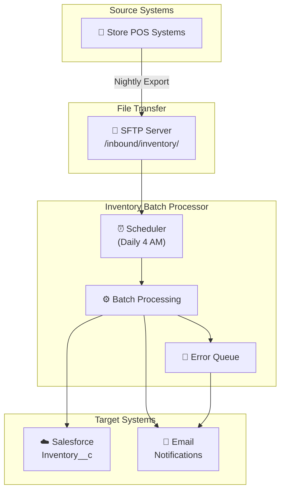
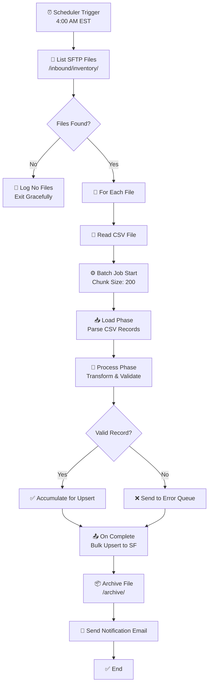
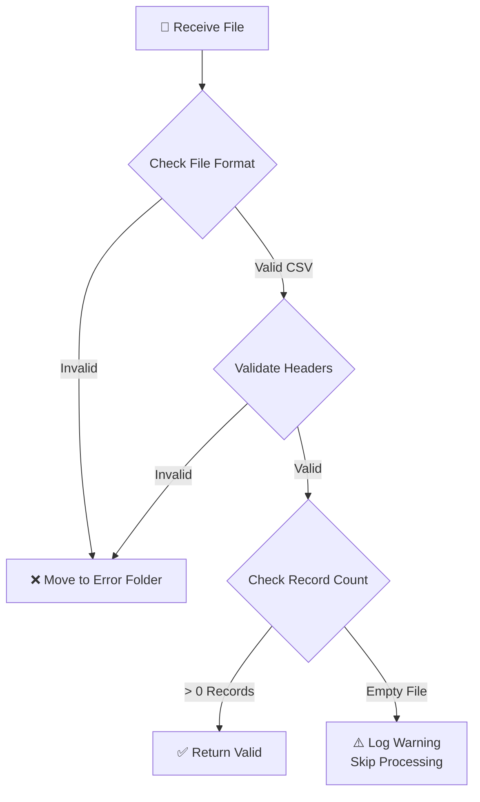
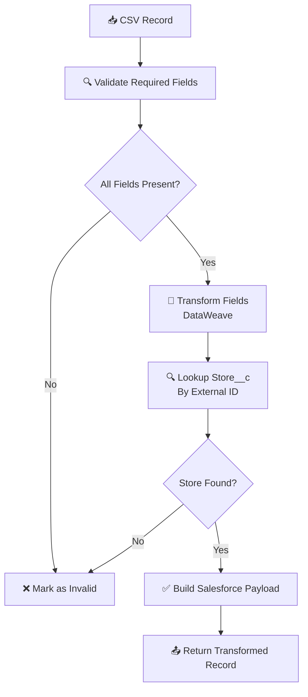
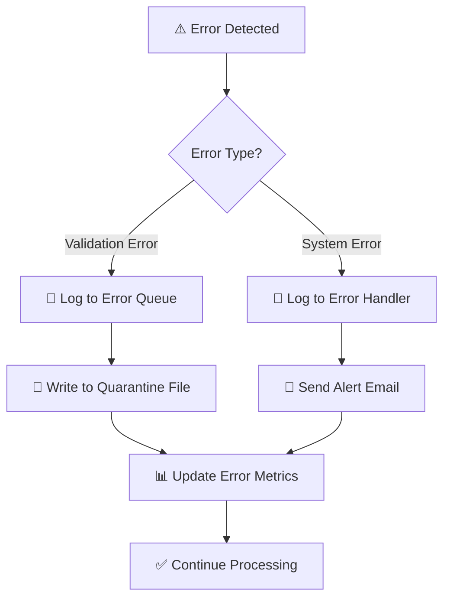
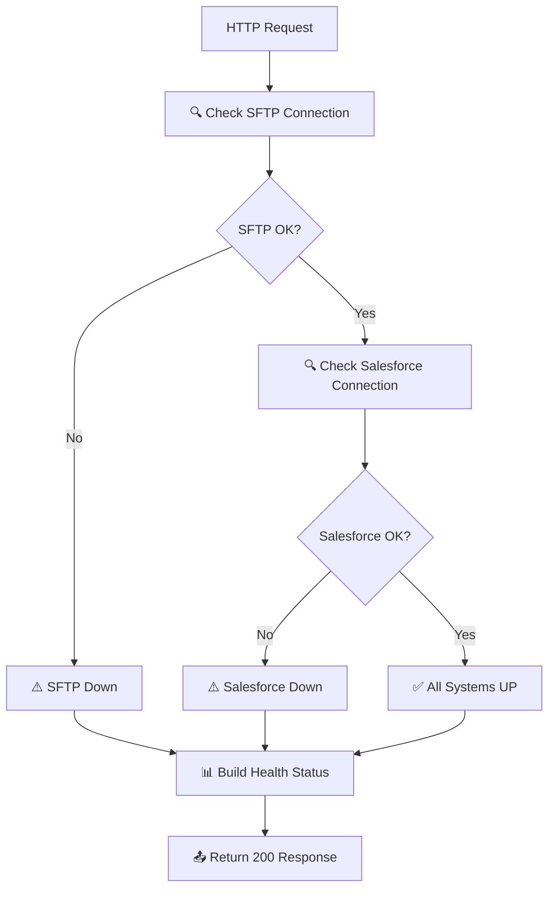

# Inventory Batch Processor

**Version:** 2.0.0 | **MuleSoft Runtime:** 4.4.0 | **Status:** Active | **Type:** Batch

**🧞‍♂️ Generated by R-GENIE README Agent**

---

## 📋 Table of Contents
- [Overview](#-overview)
- [Architecture](#-architecture)
- [API Endpoints](#-api-endpoints)
- [Support](#-support)

---

## 🎯 Overview

### Purpose
The **Inventory Batch Processor** is a scheduled MuleSoft integration that processes daily inventory files from retail stores and synchronizes the data with the Salesforce Inventory Management system.

### Business Context
This batch integration supports the retail operations team by:
- Automating daily inventory updates from 500+ store locations
- Providing near real-time inventory visibility in Salesforce
- Reducing manual data entry errors by 95%
- Enabling inventory-based business decisions

### Key Capabilities

| Capability | Description |
|------------|-------------|
| File Processing | Reads CSV inventory files from SFTP |
| Data Validation | Validates inventory records against business rules |
| Data Transformation | Converts store format to Salesforce schema |
| Upsert Operations | Updates or inserts inventory records |
| Error Handling | Quarantines invalid records for review |
| Notification | Sends completion emails to stakeholders |

### Technology Stack

| Component | Version | Purpose |
|-----------|---------|---------|
| MuleSoft Runtime | 4.4.0 | Integration platform |
| SFTP Connector | 1.6.0 | File retrieval |
| Salesforce Connector | 10.18.0 | Data synchronization |
| Batch Module | 4.4.0 | Batch processing |
| Email Connector | 1.6.1 | Notifications |

### Processing Statistics

| Metric | Value |
|--------|-------|
| Daily Records | ~150,000 |
| Processing Time | 25-35 minutes |
| Success Rate | 99.2% |
| File Size | 5-15 MB per file |

---

## 🏗️ Architecture

### System Design

---

## 🌐 API Endpoints

### Scheduler Flow: Daily Inventory Processing

**Description**: Main scheduled batch flow that processes inventory files from SFTP and loads to Salesforce

**Business Flow Details:**

| Trigger Type | Schedule | Description |
|--------------|----------|-------------|
| Scheduler | Daily 4:00 AM EST | Automated inventory file processing |

**Flow Diagram:**

**Test Data:**
- MUnit: `src/test/munit/inventory-batch-processor-test-suite.xml`
- Sample Input: `src/test/resources/inventory/INV_20240320_STORE001.csv`
- Expected Output: `src/test/resources/inventory/salesforce-upsert-payload.json`

---

### Sub-Flow: File Validation

**Description**: Validates inventory CSV file structure and content before processing

**Business Flow Details:**

| Flow Type | Purpose | Error Handling |
|-----------|---------|----------------|
| Sub-Flow | Pre-processing validation | Quarantine invalid files |

**Flow Diagram:**

**Test Data:**
- MUnit: `src/test/munit/file-validation-test-suite.xml`
- Valid File: `src/test/resources/inventory/valid-inventory.csv`
- Invalid File: `src/test/resources/inventory/invalid-headers.csv`

---

### Sub-Flow: Record Transformation

**Description**: Transforms store inventory format to Salesforce Inventory__c object format

**Business Flow Details:**

| Flow Type | Transformation | Output Format |
|-----------|---------------|---------------|
| Sub-Flow | Store CSV → Salesforce | Inventory__c sObject |

**Flow Diagram:**

**Test Data:**
- MUnit: `src/test/munit/record-transformation-test-suite.xml`
- Input Record: `src/test/resources/inventory/store-record-input.json`
- Expected Output: `src/test/resources/inventory/salesforce-record-output.json`

---

### Sub-Flow: Error Handling & Quarantine

**Description**: Handles processing errors and quarantines invalid records for manual review

**Business Flow Details:**

| Flow Type | Purpose | Output |
|-----------|---------|--------|
| Sub-Flow | Error management | Error log + quarantine file |

**Flow Diagram:**

**Test Data:**
- MUnit: `src/test/munit/error-handling-test-suite.xml`
- Validation Error: `src/test/resources/errors/invalid-store-id.json`
- System Error: `src/test/resources/errors/salesforce-timeout.json`

---

### Health Check Endpoint

**Description**: HTTP endpoint to verify application health and batch processing status

**Endpoint Details:**

| Method | Path | Description |
|--------|------|-------------|
| GET | `/api/health` | Application health check |

**Flow Diagram:**

**Test Data:**
- MUnit: `src/test/munit/health-check-test-suite.xml`
- Expected Response: `src/test/resources/health/health-status-up.json`

---

## 👥 Support

- **Team**: Retail Integration Team
- **Documentation**: [Batch Processing Guide](https://wiki.example.com/inventory-batch)
- **Support Email**: inventory-ops@example.com
- **Slack Channel**: #inventory-batch-support
- **On-Call**: PagerDuty rotation (retail-integration-team)

---

*🧞‍♂️ Generated by R-GENIE README Agent*
