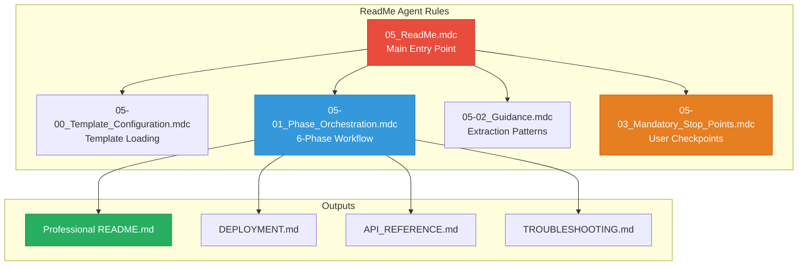

# 📚 ReadMe Agent - Rules Index

**Version:** 2.1  
**Last Updated:** April 2026  
**Author**: Cheppali Shaik Sohail

---

## 📋 **Quick Reference Table**

| Rule File | Purpose | When to Use |
|-----------|---------|-------------|
| `05_ReadMe.mdc` | **Main Entry Point** | Start documentation workflow |
| `05-00_Template_Configuration.mdc` | Template-first approach | Phase 0 template loading |
| `05-01_Phase_Orchestration.mdc` | 6-phase workflow & state | Understanding phases & checkpoints |
| `05-02_Guidance.mdc` | Extraction patterns, Mermaid diagrams | Pattern reference during generation |
| `05-03_Mandatory_Stop_Points.mdc` | User interaction enforcement | Checkpoint behavior reference |

---

## 🎯 **Rule Dependency Map**

---

## 📁 **Rule File Details**

### **`05_ReadMe.mdc`** - Main Entry Point
- **Purpose:** Central orchestration for documentation generation
- **When to Use:** Start every README/documentation workflow
- **Key Features:**
  - RISEN framework structure
  - 6-phase workflow control
  - Multi-document generation
  - Dynamic content extraction
- **Cross-References:** All other rules

### **`05-00_Template_Configuration.mdc`** - Template Loading
- **Purpose:** Phase 0 template-first approach
- **When to Use:** Beginning of workflow for customization
- **Key Features:**
  - README structure configuration
  - Section selection
  - Badge configuration
  - Style preferences
- **Cross-References:** `@05-01_Phase_Orchestration.mdc`

### **`05-01_Phase_Orchestration.mdc`** - Phase Workflow
- **Purpose:** Define phases, checkpoints, and state transitions
- **When to Use:** Understanding workflow progression
- **Key Features:**
  - 6-phase state machine
  - Checkpoint definitions
  - State file format
  - Resume capability
- **Cross-References:** `@05-03_Mandatory_Stop_Points.mdc`

### **`05-02_Guidance.mdc`** - Extraction Patterns
- **Purpose:** Data extraction patterns, Mermaid diagrams
- **When to Use:** During documentation generation phases
- **Key Features:**
  - Project structure analysis
  - Flow extraction patterns
  - Mermaid diagram generation
  - API documentation patterns
- **Cross-References:** `@05-01_Phase_Orchestration.mdc`

### **`05-03_Mandatory_Stop_Points.mdc`** - User Checkpoints
- **Purpose:** Enforce user control at phase transitions
- **When to Use:** All phase transitions
- **Key Features:**
  - STOP_AND_WAIT protocol
  - Phase checkpoints
  - Anti-pattern prevention
  - User response handling
- **Cross-References:** `@05-01_Phase_Orchestration.mdc`

---

## 🔍 **Quick Lookup**

### **"I want to..."**

| Task | Go To |
|------|-------|
| Generate README documentation | `@05_ReadMe.mdc` |
| Customize output sections | `@05-00_Template_Configuration.mdc` |
| Understand phases | `@05-01_Phase_Orchestration.mdc` |
| Reference extraction patterns | `@05-02_Guidance.mdc` |
| Know checkpoint behavior | `@05-03_Mandatory_Stop_Points.mdc` |

---

## 📊 **Generated Outputs**

| Document | Type | Description |
|----------|------|-------------|
| `README.md` | **Essential** | Professional project documentation |
| `DEPLOYMENT.md` | Optional | Deployment procedures |
| `API_REFERENCE.md` | Optional | API documentation |
| `TROUBLESHOOTING.md` | Optional | Issue resolution guide |

---

## 🚀 **Getting Started**

1. **Read Entry Point:** Start with `@05_ReadMe.mdc`
2. **Configure Templates:** Review `@05-00_Template_Configuration.mdc`
3. **Understand Phases:** Study `@05-01_Phase_Orchestration.mdc`
4. **Know Patterns:** Reference `@05-02_Guidance.mdc` for extraction
5. **Know Checkpoints:** Memorize `@05-03_Mandatory_Stop_Points.mdc`

---

## 🔗 **Related Resources**

- `../templates/readme-style.yaml` - Structure and style configuration
- `../templates/readme-template-guide.md` - Content guide (what goes where)
- `../examples/` - Sample README outputs (formatting reference)
- `../README.md` - Agent overview and quick start
- `../05_Production_Learnings.md` - Real-world insights

---

🧞‍♂️ **ReadMe Agent V2.1 - Generate Professional Documentation!** ✨

## 🔄 Version History

| Version | Date | Changes |
|---------|------|---------|
| v2.1 | Apr 2026 | LLM behavioral gap countermeasures: `<thinking>` blocks, Confidence Calibration, RGV, Evidence-Bound, Tree of Thought, Few-Shot, Constitutional Principles, Anti-Autopilot, Contradiction Handling, Graceful Degradation, Input Sanitization |
| v2 | Jan 2026 | Template-driven 6-Phase workflow, Mermaid diagrams |
