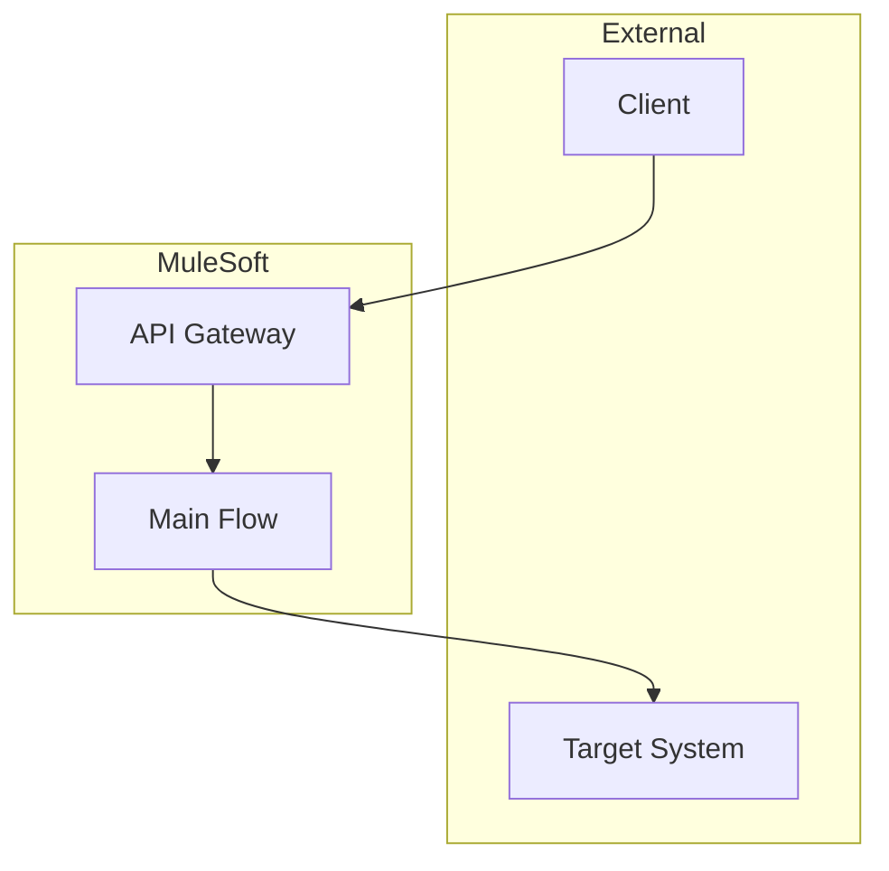
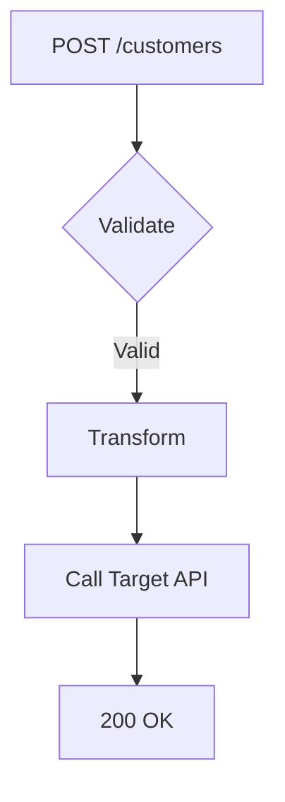

# README Document Template Guide

**Purpose:** This guide explains what content goes in each section of a MuleSoft README document and when to produce each section based on the `readme-style.yaml` configuration.  
**Author**: Cheppali Shaik Sohail

---

## Document Structure Overview

The README document follows a **structured format** with configurable sections:

### Core Sections (Controlled by Template)

| Section | Description | Default |
|---------|-------------|---------|
| Overview | Project purpose, business context, technology stack | Always |
| Architecture | High-level system design with Mermaid diagram | Always |
| API Endpoints | Endpoint details, flow diagrams, test references | Always |
| Configuration | Property files, environment variables | Always |
| Deployment | CloudHub/on-prem setup, CI/CD | Optional |
| Troubleshooting | Diagnosis tables, health checks | Optional |

### Standard Elements (Always Present)

| Element | Description |
|---------|-------------|
| Header & Badges | Project name, version, runtime badges (plain text format, NO external SVG) |
| Table of Contents | Auto-generated navigation |
| Attribution | R-GENIE footer |

**Badge Format:**
```markdown
**Version:** 1.0.1-SNAPSHOT | **MuleSoft Runtime:** 4.9.0+ | **Status:** Active | **Type:** Event-Driven
```

**⚠️ DO NOT use external SVG badges** (e.g., shields.io URLs) - documentation must be self-contained.

---

## Section Inclusion Logic

### Template-Driven Behavior

```yaml
# From readme-style.yaml
structure:
  sections:
    - name: "Overview"
      include: true      # ✅ Generate this section
    - name: "Deployment"
      include: false     # ❌ Skip this section
```

**Rules:**
- `include: true` → Section MUST be generated
- `include: false` → Section MUST NOT be generated
- Sections not in template → DO NOT generate

---

## Section Content Guidelines

### 1. Overview Section

**When:** Always (unless `include: false`)

**Content:**
- Project name and brief description
- Business context (1-2 sentences)
- Key capabilities (bullet list)
- Technology stack table

**Format:**
```markdown
## Overview

Brief description of what the project does.

### Key Capabilities
- Capability 1
- Capability 2

### Technology Stack
| Component | Technology |
|-----------|------------|
| Runtime | Mule 4.x |
| Connectors | Salesforce, HTTP |
```

---

### 2. Architecture Section

**When:** Always (unless `include: false`)

**Content:**
- High-level system design
- Mermaid diagram (flowchart TB)
- Integration pattern description

**Diagram Requirement:**
- MUST include at least 1 Mermaid diagram
- Use `flowchart TB` for system architecture
- Show external systems, MuleSoft components, data flow

**Format:**
```markdown
## Architecture

Brief description of the integration pattern.


```

---

### 3. API Endpoints Section

**When:** Always for API projects (unless `include: false`)

**Content:**
- Endpoint details table (method, path, description)
- Flow-specific Mermaid diagram (flowchart TD)
- Reference to MUnit test files (NOT inline examples)

**Diagram Requirement:**
- MUST include 1 Mermaid diagram per major flow
- Use `flowchart TD` for processing steps

**Format:**
```markdown
## API Endpoints

### POST /customers

| Attribute | Value |
|-----------|-------|
| Method | POST |
| Path | /customers |
| Description | Create new customer |



**Test Data:** See `src/test/resources/create-customer/` for request/response examples.
```

---

### 4. Configuration Section

**When:** Always (unless `include: false`)

**Content:**
- Property files list
- Environment variables table
- Secure properties (names only, no values)

**Format:**
```markdown
## Configuration

### Property Files
- `config.yaml` - Main configuration
- `config-dev.yaml` - Development overrides

### Environment Variables
| Variable | Description | Required |
|----------|-------------|----------|
| MULE_ENV | Environment name | Yes |
| API_KEY | Target API key | Yes |

### Secure Properties
- `db.password`
- `api.secret`
```

---

### 5. Deployment Section (Optional)

**When:** Only if `include: true` in template

**Content:**
- CloudHub/on-prem deployment commands
- vCore/worker requirements
- CI/CD pipeline notes

---

### 6. Troubleshooting Section (Optional)

**When:** Only if `include: true` in template

**Content:**
- Symptom/cause/solution table
- Health check endpoint details
- Common error codes

---

## Diagram Requirements

### Minimum: 2 Mermaid Diagrams

| # | Diagram Type | Mermaid Syntax | Location |
|---|--------------|----------------|----------|
| 1 | System Architecture | `flowchart TB` | Architecture section |
| 2 | Flow/Process | `flowchart TD` | API Endpoints section |

### Diagram Rules

- **Mermaid ONLY** - NO ASCII art, NO PlantUML
- Use subgraphs for logical grouping
- Include emojis for visual clarity (optional)
- Keep diagrams focused and readable

---

## Style Configuration

### From readme-style.yaml

```yaml
style:
  include_badges: true       # Version, runtime badges (plain text format)
  include_toc: true          # Table of contents
  include_diagram: true      # Mermaid diagrams (required)
  include_attribution: true  # R-GENIE footer
  badge_style: "plain-text"  # ⚠️ Use plain text, NOT external SVG badges
```

---

## Content Dos and Don'ts

### DO:
- Extract information from actual project files (pom.xml, flows, configs)
- Use tables for structured data
- Reference MUnit test files for examples
- Include Mermaid diagrams
- Match example formatting exactly

### DON'T:
- Include ASCII art diagrams
- Add verbose explanations
- Include sections not in template
- Hardcode example data (reference test files)
- Skip required diagrams

---

## Quality Checklist (90+ Target)

| Category | Points | Criteria |
|----------|--------|----------|
| Template Compliance | 30 | Matches template structure exactly |
| Example Match | 25 | Formatting matches examples |
| Accuracy | 20 | Information extracted correctly |
| Usability | 15 | Clear, navigable, useful |
| Professional | 10 | Clean formatting, no errors |

---

## File Naming

**Output:** `project/output_05_readme/README.md`

---

## Validation Checklist

Before generating README:

- [ ] Template read (`readme-style.yaml`)
- [ ] Examples read (all .md files)
- [ ] Sections match template (only `include: true`)
- [ ] At least 2 Mermaid diagrams included
- [ ] No ASCII art diagrams
- [ ] Attribution footer present
- [ ] Test file references (not inline examples)

---

*This guide supplements `readme-style.yaml` with detailed content guidance.*

