# Code Review Agent - Architecture

**Version:** v2.1 (RGV Multi-Pass) | **Author**: Cheppali Shaik Sohail

## Overview

The Code Review Agent performs comprehensive MuleSoft code quality assessment using **multi-pass forensic mental code execution** (RGV) and a 100-point scoring framework. It generates **findings-only reports** using **progressive document updates** with **per-pass delta tracking**.

**Key Principle:** Update the output document directly at each phase/pass. Iterate Phase 3 & 4 until convergence.

The agent incorporates LLM behavioral gap countermeasures aligned with the R-GENIE Architecture Standard §13: `<thinking>` blocks for structured reasoning before every phase/pass output, Confidence Calibration (HIGH/MEDIUM/LOW), Evidence-Bound Outputs requiring file:line citations, Tree of Thought for ambiguous severity classifications, Constitutional Principles (4 ranked override rules), Semantic Anti-Autopilot, Contradiction Handling, Graceful Degradation, and Input Sanitization. These techniques address all 14 documented LLM behavioral gaps.

## Progressive Document Workflow

```mermaid
graph TD
    Start([Start]) --> Phase1["Phase 1: Initialize<br/>(CREATE document skeleton)"]
    Phase1 --> Stop1["User confirms scope"]
    Stop1 --> Phase2["Phase 2: Requirements<br/>(UPDATE requirements section)"]
    Phase2 --> Stop2["User validates"]
    Stop2 --> Phase3["Phase 3: Mental Execution<br/>(RGV Loop)"]
    
    Phase3 --> P3Pass1["Pass 1: Full Sweep"]
    P3Pass1 --> P3Review1["User reviews delta"]
    P3Review1 --> P3Check1{Converged?}
    P3Check1 -->|NO| P3Pass2["Pass 2: Fresh Sweep"]
    P3Check1 -->|YES| Phase4["Phase 4: Field Mappings<br/>(RGV Loop)"]
    P3Pass2 --> P3Review2["User reviews delta"]
    P3Review2 --> P3Check2{Converged?}
    P3Check2 -->|NO| P3Pass3["Pass 3+: Continue"]
    P3Check2 -->|YES| Phase4
    P3Pass3 --> Phase4
    
    Phase4 --> P4Pass1["Pass 1: Full Mapping Sweep"]
    P4Pass1 --> P4Review1["User reviews delta"]
    P4Review1 --> P4Check1{Converged?}
    P4Check1 -->|NO| P4Pass2["Pass 2+: Continue"]
    P4Check1 -->|YES| Phase5["Phase 5: Finalize<br/>(UPDATE RGV summary + score)"]
    P4Pass2 --> Phase5
    
    Phase5 --> Done["Review Complete"]
    Done --> Decision{User wants fixes?}
    Decision -->|Yes| Fixes["Generate Fix Suggestions"]
    Decision -->|No| End([End])
    Fixes --> End
```



## Document Update Pattern

Each phase/pass updates the output document directly:

```
Phase 1:         write(skeleton with placeholders)
Phase 2:         search_replace("_Pending Phase 2..._", requirements)
Phase 3 Pass 1:  search_replace("_Pending Phase 3 analysis..._", findings_pass_1)
Phase 3 Pass 2+: append(new_findings_pass_N) to existing tables
Phase 4 Pass 1:  search_replace("_Pending Phase 4 analysis..._", mappings_pass_1)
Phase 4 Pass 2+: append(new_mapping_findings_pass_N)
Phase 5:         search_replace("_Pending RGV completion..._", convergence_summary)
                 search_replace("_Pending Phase 5..._", score)
                 search_replace("_Pending_", final_values)
```

**Benefits:**
- Document is always viewable
- Progress visible at any pass
- Delta tracking shows what each pass found
- No state file needed
- Easy to resume (check placeholders + pass tags)

## Phase Details

### Phase 1: Input Validation & Initialization
- Scan project structure
- Count files (flows, DWL, configs, tests)
- **CREATE** report skeleton with placeholders
- Confirm scope with user

### Phase 2: Requirements Extraction
- Parse requirements document (if provided)
- **UPDATE** document with requirements section
- Skip if no requirements provided

### Phase 3: Mental Code Execution (RGV Loop)
- **Iterates** via RGV until convergence (zero new CRITICAL/MEDIUM)
- Default 3 passes, ask user after
- Each pass: full sweep of ALL flows, DataWeave, configs, tests
- Tag findings with pass number
- **Pass 1:** search_replace placeholders with findings
- **Pass 2+:** Append new findings to existing tables
- Fresh perspective each pass (don't anchor on prior findings)

### Phase 4: Field Mapping Verification (RGV Loop)
- **Iterates** via RGV until convergence
- Same protocol as Phase 3 but for mapping verification
- Tag mapping findings with pass number
- **UPDATE** document with mapping verification

### Phase 5: Score & Finalization
- Generate **RGV Convergence Summary** (per-pass delta table)
- Calculate 100-point quality score (ALL passes cumulative)
- Apply deductions for ALL findings from ALL passes
- **UPDATE** document with score breakdown
- **UPDATE** Executive Summary with final values + RGV metadata
- Determine production decision with RGV impact statement

## Scoring Framework

| Category | Points |
|----------|--------|
| Requirements Compliance | 25 |
| Implementation Quality | 25 |
| Architecture & Design | 20 |
| Code Quality & Tests | 20 |
| Security & Compliance | 10 |

**Production Threshold:** 80 points

## Output

**Main Report:** `project/output_06_review/{project}-code-review.md`
- Built progressively across all phases/passes
- Findings only (no fixes), tagged with pass numbers
- Includes RGV Convergence Summary with per-pass delta

**Supplementary:** `project/output_06_review/{project}-fixes.md`
- Generated only when user requests
- Contains fix suggestions for each finding

## File Structure

```
06_Code_Review_Agent/
├── rules/
│   ├── 06_Code_Review.mdc          # Main entry, RISEN, RGV overview
│   ├── 06-00_Template_Configuration.mdc  # Template loading, RGV config
│   ├── 06-01_Phase_Orchestration.mdc     # Workflow, RGV loop protocol
│   ├── 06-02_Guidance.mdc                # Bug patterns, scoring, RGV strategy
│   └── 06-03_Mandatory_Stop_Points.mdc   # Stop enforcement, inter-pass stops
├── templates/
│   ├── review-style.yaml           # Report + RGV configuration
│   └── review-template-guide.md    # Content structure (RGV format)
└── examples/
    ├── 01_complete_review_report.md    # Multi-pass findings example
    └── 02_quick_review_summary.md      # Summary with pass tracking
```
