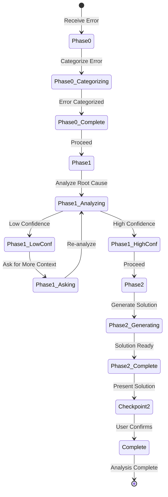

# Error Analysis Agent - Architecture

**Author**: Cheppali Shaik Sohail

## Overview

The Error Analysis Agent provides specialized error diagnosis and resolution for MuleSoft applications using a simplified KISS (Keep It Simple, Stupid) approach with 3-phase workflow. It performs root cause analysis with confidence levels and provides actionable solutions with prevention strategies.

Key capabilities include root cause analysis with confidence levels (High/Medium/Low), actionable solution generation with immediate fixes and long-term resolutions, prevention strategy recommendations, and specialized MuleSoft expertise covering Mule Runtime errors, Anypoint Platform issues, API Gateway problems, integration failures, and CloudHub deployment challenges. The agent provides clear confidence assessments, enabling users to understand solution certainty and when additional information is needed.

As of V2.1, the agent incorporates LLM behavioral gap countermeasures aligned with the R-GENIE Architecture Standard §13: `<thinking>` blocks for structured reasoning before every phase output, enhanced Confidence Calibration (HIGH/MEDIUM/LOW with percentages), RGV (Read-Generate-Verify) count verification per phase, Evidence-Bound Outputs, Tree of Thought for ambiguous diagnoses, Few-Shot BAD/GOOD patterns, Constitutional Principles (4 ranked override rules), Semantic Anti-Autopilot, Contradiction Handling, Graceful Degradation, and Input Sanitization. These techniques address all 14 documented LLM behavioral gaps.

## Workflow Steps

### Phase 0: Input Reception
- **What**: Receives and validates error information, categorizing error type and format
- **How**: Receives error log, stack trace, or description, identifies error format (log, stack trace, description), categorizes error type (connection, transformation, deployment, etc.), and prepares for root cause analysis
- **Why**: Establishes foundation for analysis by understanding error context and format, enabling appropriate analysis approach selection

### Phase 1: Root Cause Analysis
- **What**: Identifies the root cause of the error with confidence level assessment, asking for additional context if confidence is low
- **How**: Parses error message and stack trace, identifies error category (connection, transformation, config, etc.), analyzes component involved (connector, DataWeave, flow), determines root cause based on patterns, and assigns confidence level (High/Medium/Low)
- **Why**: Enables accurate problem identification, providing clear understanding of what went wrong and why, with confidence levels indicating solution certainty

### Phase 2: Solution & Prevention
- **What**: Provides actionable solution with immediate fixes, long-term resolution, and prevention strategies
- **How**: Generates immediate fix steps, provides long-term resolution, suggests prevention measures, offers additional troubleshooting if needed, and presents solution with confidence level and reasoning
- **Why**: Delivers actionable solutions that resolve current issues and prevent future occurrences, enabling both quick problem resolution and long-term stability

## Flow Diagram

