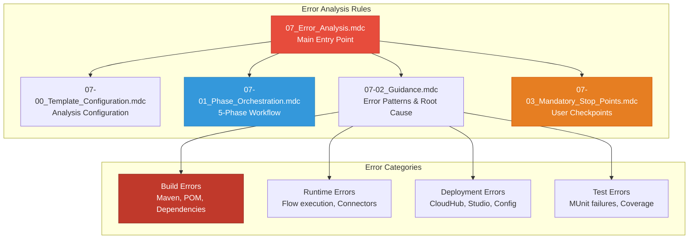
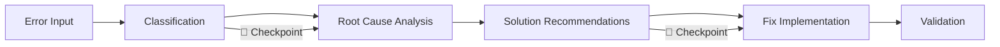

# 🔥 Error Analysis Agent - Rules Index

**Version:** 2.1  
**Last Updated:** April 2026  
**Author**: Cheppali Shaik Sohail

---

## 📋 **Quick Reference Table**

| Rule File | Purpose | When to Use |
|-----------|---------|-------------|
| `07_Error_Analysis.mdc` | **Main Entry Point** | Start error analysis workflow |
| `07-00_Template_Configuration.mdc` | Analysis template configuration | Phase 0 setup |
| `07-01_Phase_Orchestration.mdc` | 3-phase diagnostic workflow | Understanding phases & checkpoints |
| `07-02_Guidance.mdc` | Error patterns, root cause analysis | Pattern reference during diagnosis |
| `07-03_Mandatory_Stop_Points.mdc` | User interaction enforcement | Checkpoint behavior reference |

---

## 🎯 **Rule Dependency Map**

---

## 📁 **Rule File Details**

### **`07_Error_Analysis.mdc`** - Main Entry Point
- **Purpose:** Central orchestration for error diagnosis
- **When to Use:** Start every error analysis session
- **Key Features:**
  - RISEN framework structure
  - Multi-category error handling
  - Root cause analysis
  - Solution recommendations
- **Cross-References:** All other rules

### **`07-00_Template_Configuration.mdc`** - Analysis Configuration
- **Purpose:** Configure analysis approach and output
- **When to Use:** Beginning of workflow for customization
- **Key Features:**
  - Analysis depth configuration
  - Error category focus
  - Output format selection
  - Solution detail level
- **Cross-References:** `@07-01_Phase_Orchestration.mdc`

### **`07-01_Phase_Orchestration.mdc`** - Diagnostic Workflow
- **Purpose:** Define diagnostic phases and state transitions
- **When to Use:** Understanding analysis progression
- **Key Features:**
  - 3-phase diagnostic state machine
  - Error classification phases
  - Root cause analysis flow
  - Fix implementation guidance
- **Cross-References:** `@07-03_Mandatory_Stop_Points.mdc`

### **`07-02_Guidance.mdc`** - Error Patterns & Root Cause
- **Purpose:** Error pattern library, root cause analysis
- **When to Use:** During diagnosis phases
- **Key Features:**
  - Build error patterns
  - Runtime error patterns
  - Deployment issue patterns
  - Security-aware processing
- **Cross-References:** `@07-01_Phase_Orchestration.mdc`

### **`07-03_Mandatory_Stop_Points.mdc`** - User Checkpoints
- **Purpose:** Enforce user control at phase transitions
- **When to Use:** All phase transitions
- **Key Features:**
  - STOP_AND_WAIT protocol
  - Phase checkpoints
  - Anti-pattern prevention
  - User response handling
- **Cross-References:** `@07-01_Phase_Orchestration.mdc`

---

## 🔥 **Error Categories**

| Category | Common Issues | Resolution Approach |
|----------|---------------|---------------------|
| **Build Errors** | Maven config, POM conflicts, plugin issues | Dependency resolution, version fixes |
| **Runtime Errors** | Flow execution, connector failures, DataWeave | Configuration fixes, pattern corrections |
| **Deployment Errors** | CloudHub failures, Studio issues, config | Environment setup, property fixes |
| **Test Errors** | MUnit failures, coverage gaps, mock issues | Test fixes, mock configuration |

---

## 🔍 **Quick Lookup**

### **"I want to..."**

| Task | Go To |
|------|-------|
| Diagnose an error | `@07_Error_Analysis.mdc` |
| Configure analysis depth | `@07-00_Template_Configuration.mdc` |
| Understand diagnostic phases | `@07-01_Phase_Orchestration.mdc` |
| Reference error patterns | `@07-02_Guidance.mdc` |
| Know checkpoint behavior | `@07-03_Mandatory_Stop_Points.mdc` |

---

## 📊 **Resolution Workflow**

---

## 🚀 **Getting Started**

1. **Read Entry Point:** Start with `@07_Error_Analysis.mdc`
2. **Configure Analysis:** Review `@07-00_Template_Configuration.mdc`
3. **Understand Phases:** Study `@07-01_Phase_Orchestration.mdc`
4. **Know Patterns:** Reference `@07-02_Guidance.mdc` for error patterns
5. **Know Checkpoints:** Memorize `@07-03_Mandatory_Stop_Points.mdc`

---

## 🔗 **Related Resources**

- `../examples/` - Sample error analysis reports
- `../README.md` - Agent overview and quick start
- `../07_Production_Learnings.md` - Real-world insights

---

## 🔄 Version History

| Version | Date | Changes |
|---------|------|---------|
| v2.1 | Apr 2026 | LLM behavioral gap countermeasures: `<thinking>` blocks, Confidence Calibration (Enhanced), RGV, Evidence-Bound, Tree of Thought, Few-Shot, Constitutional Principles, Anti-Autopilot, Contradiction Handling, Graceful Degradation, Input Sanitization |
| v2 | Jan 2026 | KISS 3-Phase diagnostic workflow, confidence-based stops |

---

🧞‍♂️ **Error Analysis Agent V2.1 - Diagnose and Resolve with Confidence!** ✨
