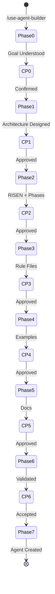

# Agent Builder - Architecture

**Author**: Cheppali Shaik Sohail  
**Version**: 1.3.6

## Overview

The Agent Builder conversationally guides users through creating brand-new R-GENIE agents for any domain or goal. It follows an 8-phase workflow with mandatory stop points at every phase transition, ensuring the user collaboratively designs every element of their agent.

The agent uses an **archetype-driven approach**: it analyzes the user's goal, recommends one of 4 archetypes (Document Generator, Code Generator, Analyzer, Conversational), then scaffolds the new agent using the appropriate skeleton template. All generated agents include the complete R-GENIE architecture skeleton with all 14 prompt engineering techniques embedded.

Key capabilities: conversational goal discovery, archetype-based scaffolding, element-by-element RISEN crafting, phase-by-phase workflow design, automatic prompt engineering embedding, architecture compliance validation, and flexible location choice (inside `r-genie/` or custom path).

## Workflow Steps

### Phase 0: Goal Discovery
- **What**: Understand what the agent should do, for whom, with what inputs/outputs
- **How**: Ask structured questions about goal, audience, inputs, outputs, interaction model
- **Why**: Clear goals produce focused agents; vague goals produce unfocused agents

### Phase 1: Architecture Design
- **What**: Select archetype, determine file structure, choose location
- **How**: Analyze goal against 4 archetypes, recommend best fit, present location options
- **Why**: Archetype determines the entire scaffolding pattern and file count

### Phase 2: RISEN & Phases Design
- **What**: Collaboratively craft RISEN framework, design phase workflow, and gather domain intelligence
- **How**: Propose each RISEN element individually, design each phase individually, define stop points, collect domain-specific mistakes/qualities/decisions/criteria/edge cases
- **Why**: RISEN defines agent identity; phases define agent behavior; domain intelligence feeds the Guidance file. All need user input

### Phase 3: Rule Files Generation
- **What**: Generate rule files ONE AT A TIME using archetype skeleton templates
- **How**: Fill skeleton templates with Phase 0-2 decisions, embed all 14 prompt techniques. Present each file individually for review (per-file sub-checkpoints) to prevent Attention Drift and Error Cascade
- **Why**: Rule files are the agent's complete behavioral specification. Per-file review catches errors before they propagate

### Phase 4: Examples & Templates
- **What**: Create examples and templates appropriate to the archetype
- **How**: Document Generator → style YAML + template guide + example. Code Generator → example project. Analyzer → example output. Conversational → example session.
- **Why**: Examples define the formatting reference; templates control structural output

### Phase 5: Documentation
- **What**: Generate README, ARCHITECTURE, Production Learnings
- **How**: Compile from all previous phase decisions into standard R-GENIE doc format
- **Why**: Documentation enables the agent to be understood and maintained

### Phase 6: Validation
- **What**: Validate all generated files with structural + semantic + ecosystem checks
- **How**: Structural: RISEN, file sizes, cross-references, versions, prompt techniques, decoupling. Semantic: RISEN specificity, phase distinctness, few-shot relevance, domain keyword presence, cross-file coherence, constitutional principle adaptation. Ecosystem (if r-genie/): ID uniqueness, output path uniqueness, activation file name uniqueness
- **Why**: Structural compliance ensures correct format; semantic validation ensures substance; ecosystem checks prevent collisions

### Phase 7: Registration & Activation
- **What**: Write files, create activation workflow, register in ignore files
- **How**: Write to chosen location, create workflow files for Cursor and Windsurf, update ignore files
- **Why**: Registration makes the agent activatable via standard R-GENIE commands

## Flow Diagram

## Key Architectural Patterns

### Archetype-Driven Scaffolding
Analyze user's goal → select from 4 archetypes → use archetype-specific skeleton template → fill with user's design decisions.

### Conversational Design
RISEN crafted element-by-element. Phases designed one-by-one. User approves every element before it becomes part of the agent.

### Prompt Engineering Embedding
All 14 required prompt engineering techniques are automatically embedded into every generated agent. The Agent Builder uses patterns from `lib/docs/prompt-engineering-patterns.md`.

### Architecture Compliance
Every generated agent is validated against `AGENT_ARCHITECTURE_STANDARD.md` before writing. Catches missing sections, oversized files, broken references, and missing techniques.

## State Management

**State File:** `project/output_builder/.builder-state.json`

Tracks: agent name, ID, archetype, complexity assessment, location, current phase, RISEN elements (each with value + status), phase designs, stop points, domain intelligence (top mistakes, good output qualities, ambiguous decisions, quality criteria, edge cases), generated files list, phase statuses.

**Resume Capability:** Load state file on activation, offer resume/restart options.

## Error Recovery

| Situation | Action |
|-----------|--------|
| Phase fails | Save state, inform user, offer: retry / restart phase / abort |
| User disconnects | State preserved, resume on next activation |
| Invalid input | Stay in current phase, request correction |
| Validation fails | Return to Phase 3 for fixes |
| File write error | Report error, offer retry |

## LLM Behavioral Gap Countermeasures (V1.1)

As of V1.1, the Agent Builder incorporates all 14 LLM behavioral gap countermeasures aligned with the R-GENIE Architecture Standard §13. Since this agent creates new agents, it was designed with these countermeasures from v1.0 and they are now version-aligned at v1.1: mandatory `<thinking>` blocks before every phase output, Confidence Calibration (HIGH/MEDIUM/LOW), RGV pattern for generation phases, Evidence-Bound Outputs citing user decisions, Tree of Thought for ambiguous archetype/design choices, Few-Shot patterns for goal/RISEN/phase quality, Constitutional Principles (4 ranked with ARCHITECTURE COMPLIANCE as #1), Semantic Anti-Autopilot ("proceed" ≠ "approved"), Contradiction Handling for design conflicts, Graceful Degradation (3-attempt default), Input Sanitization for user reference materials, and enhanced RISEN Narrowing excluding code execution from user files.

## V1.2 Enhancements

| Enhancement | Gap Addressed | Where |
|-------------|---------------|-------|
| Per-file sub-checkpoints in Phase 3 | Attention Drift (#1), Error Cascade (#11) | Phase Orchestration |
| Semantic validation in Phase 6 | Specification Gaming (#14), Shallow Reasoning (#3) | Phase Orchestration |
| Domain Intelligence Gathering in Phase 2 | Shallow Reasoning (#3), Hallucination (#2) | Phase Orchestration |
| Activation file + display block skeletons | Specification Gaming (#14) | skeleton-templates.md |
| Complexity estimation in Phase 0 | Shallow Reasoning (#3) | Phase Orchestration |
| Backward navigation protocol | Process rigidity (no specific gap) | Phase Orchestration, Stop Points |
| Enhanced state file with design decisions | State Amnesia (#8) | Phase Orchestration |
| Smoke test guide template | Process gap (no testing protocol) | skeleton-templates.md |
| Ecosystem collision checks in Phase 6 | Process gap (no cross-agent checks) | Phase Orchestration |

## V1.3 Enhancements (Adaptive Generation)

| Enhancement | Gap Addressed | Where |
|-------------|---------------|-------|
| **State Persistence Assessment** in Phase 0 (`stateful: true/false`) — conditional state file, State Update Protocol, Resume Capability in generated agents | Over-specification; imposing state file overhead on single-session agents (WSR precedent) | Phase Orchestration, Guidance §2, skeleton-templates.md §3 |
| **Post-Run Audit Snapshot** (`run_metadata.json`) as optional alternative for stateless agents | Process gap — stateless agents had no audit trail | skeleton-templates.md §3 |
| **Lean Script Principle** — "Only script what LLMs are UNRELIABLE at" | Over-engineering; scripts that duplicate LLM capability add maintenance burden | Guidance §9, prompt-engineering-patterns.md #19 |
| **Script vs LLM Decision Matrix** — 13-row per-check decision guide | Shallow Reasoning (#3) in script-vs-LLM tradeoff; prevents over-scripting | Guidance §9 |
| **WSR v1.1 → v1.2 Over-Scripted vs Right-Balance Case Study** (19 → 9 scripts) | Few-shot pattern for right-sizing the Scripts Pillar | Guidance §9 |
| **Archetype Layering (Hybrid Agents)** — primary + secondary archetype, `archetypeSecondary` in state | Process rigidity — forbade mixing archetypes even when real agents are hybrids (WSR, Code Review, Agent Tuner) | Main Entry, Guidance §1 |
| **Conditional compliance checklist** (based on `stateful`, `scriptsPillar`, `inputComplexity`, `archetypeSecondary`) | Process gap — one-size-fits-all compliance for heterogeneous agents | Guidance §7 |

## V1.3.1 Enhancements (Tool-Use Hygiene)

| Enhancement | Gap Addressed | Where |
|-------------|---------------|-------|
| **Gap #15 Tool Misuse Hazard** documented (first production-sourced gap) | LLMs default to `sed`/`awk`/`cat >>` for content mutation instead of native `read_file`/`edit`/`multi_edit`/`write_to_file` — causes platform drift, silent partial success, no diff preview | `lib/docs/LLM_BEHAVIORAL_GAPS.md` |
| **Critical Rule #5 Tool-First Content Mutation** | Shell FORBIDDEN for `.mdc`/`.md`/`.yaml`/`.json`/source files; native tools MANDATORY | `Agent_Builder.mdc` |
| **TOOL-FIRST GUARD** in SELF-CHECK | Pre-action gate catches shell-mutation attempts before they execute | `02_Mandatory_Stop_Points.mdc` |
| **v1.3 completion checks** in SELF-CHECK | Scripts Pillar Assessment, State Persistence Assessment, stateful conditional, archetype layering, Lean Script Principle checks | `02_Mandatory_Stop_Points.mdc` |
| **3 new anti-pattern rows** | Shell-based mutation; skip Phase 0 assessments; include state sections when `stateful: false` | `02_Mandatory_Stop_Points.mdc` |

## V1.3.2 Enhancements (Progressive Documentation + Accuracy Primers)

| Enhancement | Gap Addressed | Where |
|-------------|---------------|-------|
| **Gap #16 IDE Edit-Size Failure Mode** documented (second production-sourced gap) | Large single-shot edits truncate / lose mid-section content / break structural invariants in AI IDE edit tools (Cursor/Windsurf/Cline) | `lib/docs/LLM_BEHAVIORAL_GAPS.md` |
| **Critical Rule #6 Progressive File Writing** | For deliverables >300 lines: skeleton-first + per-phase bounded appends (≤300 lines per edit); Technical Design Agent as canonical precedent | `Agent_Builder.mdc` |
| **Pattern #20 Progressive Documentation** | Embeddable template for Phase Orchestration covering skeleton + per-phase append workflow | `lib/docs/prompt-engineering-patterns.md` |
| **Patterns #21-22 Accuracy Primers (default)** | Deliberation Trigger (Google 2023, +7%) and Stakes Framing (EmotionPrompt, +10-13%) — research-backed psychological framing, ethical guardrails included (no emotional manipulation) | `lib/docs/prompt-engineering-patterns.md` |
| **Pattern #23 Error Premortem** (complex agents) | Klein 2007 + CHI 2024 — -12% confident-wrong outputs via pre-decision failure analysis as `<thinking>` step #6 | `lib/docs/prompt-engineering-patterns.md` |
| **Section 10 Progressive Documentation Pattern** (Guidance) | Full guidance + few-shot + compliance checklist for long-form agents | `01_Guidance.mdc` |
| **Section 11 Accuracy Primers** (Guidance) | Ethical guardrails + embedding locations + few-shot bare-vs-primed comparison | `01_Guidance.mdc` |
| **`longFormOutput` state field** | Phase 0 assessment determines whether Pattern #20 embeds in generated agent | `00_Phase_Orchestration.mdc` |
| **EDIT-SIZE GUARD + Deliberation Primer + Premortem checks** in SELF-CHECK | Pre-action gates catch oversized edits and enforce deliberation before output | `02_Mandatory_Stop_Points.mdc` |
| **2 new anti-pattern rows** | Single edit >300 lines (Gap #16); regenerate full file to modify one section | `02_Mandatory_Stop_Points.mdc` |
| **Long-Form Output Assessment in Phase 0** | New assessment flow with stateless/stateful-style user choice pattern | `00_Phase_Orchestration.mdc` |

## V1.3.3 Enhancements (Watermark Removal + Tool-First Activation)

| Enhancement | Standard/Gap Addressed | Where |
|-------------|------------------------|-------|
| **Removed watermark frontmatter guidance** | `AGENT_ARCHITECTURE_STANDARD.md` doesn't require watermark; was Agent Builder extension | `Agent_Builder.mdc`, `00_Phase_Orchestration.mdc`, `01_Guidance.mdc`, `02_Mandatory_Stop_Points.mdc`, `lib/docs/skeleton-templates.md` |
| **Tool-first activation Step 1 in skeleton** | Gap #15 Tool Misuse Hazard — replaces `sed -i ''` (BSD-only, unconditional mass-toggle, silent failures) with `edit`-tool-based toggle (atomic, platform-independent, verifiable) | `lib/docs/skeleton-templates.md` §6 |
| **Dual-author footer retained** | Agent attribution preserved; distinct from watermark | All generated agent files (footer only, no frontmatter tag) |
