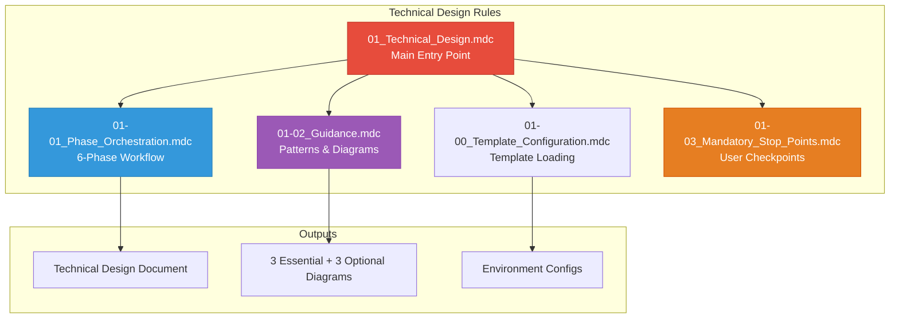
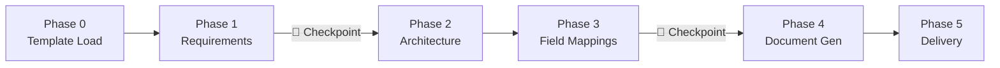

# 🏗️ Technical Design Agent - Rules Index

**Version:** 2.0.0  
**Last Updated:** January 2026  
**Author**: Cheppali Shaik Sohail

---

## 📋 **Quick Reference Table**

| Rule File | Purpose | When to Use |
|-----------|---------|-------------|
| `01_Technical_Design.mdc` | **Main Entry Point** | Start technical design workflow |
| `01-00_Template_Configuration.mdc` | Template-first approach | Phase 0 template loading |
| `01-01_Phase_Orchestration.mdc` | 6-phase workflow & state | Understanding phases & checkpoints |
| `01-02_Guidance.mdc` | RISEN patterns, diagrams, mappings | Pattern reference during generation |
| `01-03_Mandatory_Stop_Points.mdc` | User interaction enforcement | Checkpoint behavior reference |

---

## 🎯 **Rule Dependency Map**

---

## 📊 **6-Phase Workflow**

---

## 📁 **Rule File Details**

### **`01_Technical_Design.mdc`** - Main Entry Point
- **Purpose:** Central orchestration for technical design generation
- **When to Use:** Start every technical design workflow
- **Key Features:**
  - RISEN framework structure
  - 6-phase workflow control
  - User checkpoints
  - Multi-format input support
- **Cross-References:** All other rules

### **`01-00_Template_Configuration.mdc`** - Template Loading
- **Purpose:** Phase 0 template-first approach
- **When to Use:** Beginning of workflow for template customization
- **Key Features:**
  - `design-style.yaml` parsing
  - Custom structure configuration
  - Terminology mapping
  - Fallback to defaults
- **Cross-References:** `@01-01_Phase_Orchestration.mdc`

### **`01-01_Phase_Orchestration.mdc`** - Phase Workflow
- **Purpose:** Define phases, checkpoints, and state transitions
- **When to Use:** Understanding workflow progression
- **Key Features:**
  - 6-phase state machine
  - Checkpoint definitions
  - State file format
  - Resume capability
- **Cross-References:** `@01-03_Mandatory_Stop_Points.mdc`

### **`01-02_Guidance.mdc`** - Patterns & Diagrams
- **Purpose:** Decision patterns, diagram syntax, field mappings
- **When to Use:** During design generation phases
- **Key Features:**
  - 3 Essential diagrams (Connector Pattern, Integration Sequence, Error Handling)
  - Diagram syntax examples (Mermaid)
  - 3 Optional diagrams (Architecture, Business, Data Flow)
  - Field mapping table formats
  - MuleSoft architecture patterns
- **Cross-References:** `@01-01_Phase_Orchestration.mdc`

### **`01-03_Mandatory_Stop_Points.mdc`** - User Checkpoints
- **Purpose:** Enforce user control at phase transitions
- **When to Use:** All phase transitions
- **Key Features:**
  - STOP_AND_WAIT protocol
  - Phase checkpoints
  - Anti-pattern prevention
  - User response handling
- **Cross-References:** `@01-01_Phase_Orchestration.mdc`

---

## 🔍 **Quick Lookup**

### **"I want to..."**

| Task | Go To |
|------|-------|
| Start technical design workflow | `@01_Technical_Design.mdc` |
| Customize output structure | `@01-00_Template_Configuration.mdc` |
| Understand phases | `@01-01_Phase_Orchestration.mdc` |
| Reference diagram patterns | `@01-02_Guidance.mdc` |
| Know checkpoint behavior | `@01-03_Mandatory_Stop_Points.mdc` |

---

## 📊 **Cross-Reference Matrix**

| Rule File | References | Referenced By |
|-----------|------------|---------------|
| `01_Technical_Design.mdc` | All rules | - |
| `01-00_Template_Configuration.mdc` | - | `01_Technical_Design.mdc` |
| `01-01_Phase_Orchestration.mdc` | `01-03` | `01_Technical_Design.mdc` |
| `01-02_Guidance.mdc` | `01-01` | `01_Technical_Design.mdc` |
| `01-03_Mandatory_Stop_Points.mdc` | `01-01` | `01_Technical_Design.mdc` |

---

## 🚀 **Getting Started**

1. **Read Entry Point:** Start with `@01_Technical_Design.mdc`
2. **Configure Templates:** Review `@01-00_Template_Configuration.mdc`
3. **Understand Phases:** Study `@01-01_Phase_Orchestration.mdc`
4. **Know Patterns:** Reference `@01-02_Guidance.mdc` for diagrams
5. **Know Checkpoints:** Memorize `@01-03_Mandatory_Stop_Points.mdc`

---

## 🔗 **Related Resources**

- `../examples/` - Complete design examples
- `../templates/` - Customization templates
- `../README.md` - Agent overview and quick start
- `../01_Production_Learnings.md` - Real-world insights

---

🧞‍♂️ **Technical Design Agent - Transform Requirements into Implementation-Ready Designs!** ✨
