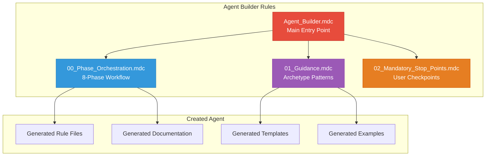
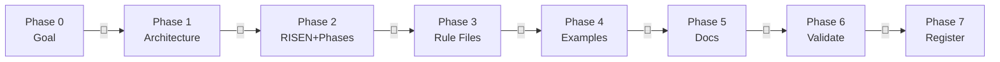

# 🏗️ Agent Builder - Rules Index

**Version:** 1.5.0  
**Last Updated:** May 2026  
**Author**: Cheppali Shaik Sohail

---

## 📋 **Quick Reference Table**

| Rule File | Purpose | When to Use |
|-----------|---------|-------------|
| `Agent_Builder.mdc` | **Main Entry Point** | Start agent creation workflow |
| `00_Phase_Orchestration.mdc` | 8-phase workflow & state | Understanding phases & checkpoints |
| `01_Guidance.mdc` | Archetype patterns, prompt engineering, rule generation | Pattern reference during creation |
| `02_Mandatory_Stop_Points.mdc` | User interaction enforcement | Checkpoint behavior reference |

---

## 🎯 **Rule Dependency Map**

---

## 📊 **8-Phase Workflow**

---

## 📁 **Rule File Details**

### **`Agent_Builder.mdc`** - Main Entry Point
- **Purpose:** Central orchestration for agent creation
- **Key Features:** RISEN, 4 archetypes table, 8-phase workflow, protection override
- **Cross-References:** All other rules

### **`00_Phase_Orchestration.mdc`** - Phase Workflow
- **Purpose:** Define phases, checkpoints, state transitions, archetype-driven generation
- **Key Features:** 8-phase state machine, generation order, state file, resume
- **Cross-References:** `@02_Mandatory_Stop_Points.mdc`

### **`01_Guidance.mdc`** - Archetype Patterns
- **Purpose:** Archetype selection, rule file generation, prompt engineering embedding
- **Key Features:** 4 archetype skeletons, 14 prompt technique embedding patterns, few-shot examples, compliance checklist
- **Cross-References:** `@00_Phase_Orchestration.mdc`

### **`02_Mandatory_Stop_Points.mdc`** - User Checkpoints
- **Purpose:** Enforce conversational design at every phase
- **Key Features:** 8 stop points, RISEN sub-stops, constitutional principles, anti-autopilot
- **Cross-References:** `@00_Phase_Orchestration.mdc`

---

## 🔍 **Quick Lookup**

| Task | Go To |
|------|-------|
| Start creating an agent | `@Agent_Builder.mdc` |
| Understand phases | `@00_Phase_Orchestration.mdc` |
| Reference archetype patterns | `@01_Guidance.mdc` |
| Know checkpoint behavior | `@02_Mandatory_Stop_Points.mdc` |
| See skeleton templates | `lib/docs/skeleton-templates.md` |
| See prompt techniques | `lib/docs/prompt-engineering-patterns.md` |
| Progressive Documentation v2 (Template-First / Per-Phase Write Contract) | `@01_Guidance.mdc` §10 + `lib/docs/prompt-engineering-patterns.md` Pattern #20 v2 |

---

## 📊 **Cross-Reference Matrix**

| Rule File | References | Referenced By |
|-----------|------------|---------------|
| `Agent_Builder.mdc` | All rules | - |
| `00_Phase_Orchestration.mdc` | `09-02` | `Agent_Builder.mdc` |
| `01_Guidance.mdc` | `09-00` | `Agent_Builder.mdc` |
| `02_Mandatory_Stop_Points.mdc` | `09-00`, `09-01` | `Agent_Builder.mdc` |

---

## 🔗 **Related Resources**

- `../lib/docs/skeleton-templates.md` - Rule file skeleton templates
- `../lib/docs/prompt-engineering-patterns.md` - Embeddable prompt techniques
- `../examples/` - Example creation sessions
- `../README.md` - Agent overview
- `../ARCHITECTURE.md` - Technical architecture
- `../lib/docs/AGENT_ARCHITECTURE_STANDARD.md` - Architecture standard (local copy)

---

## Version History

| Version | Date | Changes |
|---------|------|---------|
| v1.5.0 | May 2026 | **Template-First / Example-Based Progressive Documentation v2 — DEFAULT for multi-phase analytical agents.** Pattern #20 elevated to Pattern #20 v2 with Five Mechanics (Template-First Skeleton in Phase 0, Per-Phase Write Contract, Preview→Approve→Write-Clean-to-File loop, Phase N Consolidate-and-Polish mode, What stays in chat vs file). Trigger broadened from `longFormOutput: true` (>300 lines only) to `progressiveDocV2: true` — DEFAULT for any multi-phase agent producing a structured deliverable. Phase 0 "Long-Form Output Assessment" reframed as "Progressive Documentation v2 Assessment" with new state fields `progressiveDocV2` and `exampleAnchorPath`. Phase 3C/3D/3E generation hooks updated so generated agents inherit Per-Phase Write Contract in Phase Orchestration, adapted §10 in Guidance, and Per-Phase Write Self-Check in Stop Points. Critical Rule #7 (Template-First/Example-Based) added to Main Entry. Example-Anchored Conciseness (§10.5) replaces hard line caps. Five new anti-pattern rows. Two canonical references now cited: TDA (long-form precedent) + CSA v1.7.0 (medium-form reform precedent). Source: CSA v1.6.0 healthcare-recommendations run exhausted context window with Phase 5 starting documentation too late. |
| v1.3.6 | Apr 2026 | **Mermaid Diagram Standards integration.** Every newly generated agent now ships with Mermaid guardrails baked in. Created `lib/docs/mermaid-diagram-best-practices.md` (10 non-negotiable rules, `curve: 'linear'` init directive, ` ` vs `\n`, declaration-order layout control, arrow semantics, style placement, Material Design 200/300 palette, stateDiagram/sequenceDiagram specifics, pre-emit self-check). Wired into: (1) `AGENT_ARCHITECTURE_STANDARD.md` as new Section 16 + Full Checklist row; (2) `skeleton-templates.md` Phase Orchestration §2 state machine + INDEX.md §7 Rule Dependency Map + Phase Workflow placeholders; (3) `01_Guidance.mdc` as new Section 12 with embeddable template (§12.2), BAD/GOOD few-shot (§12.3), compliance check for generated agents (§12.4); (4) `00_Phase_Orchestration.mdc` Phase 3C/3D/3F/5 generation steps + Phase 6A structural validation table; (5) `02_Mandatory_Stop_Points.mdc` MERMAID RENDERING GUARD + MERMAID EMBEDDING GUARD in SELF-CHECK + 4 new anti-pattern rows. Agent Builder now enforces Mermaid correctness at generation time for every new agent. |
| v1.3.5 | Apr 2026 | **Phase-count anchoring bias fix.** Root cause: Agent Builder's own 8-phase workflow label (referenced ~10× across files) was anchoring every proposed target-agent phase count to 8 regardless of Complexity Tier. Fix: (1) Phase 1 Architecture Proposal now surfaces Complexity Tier + recommended range (Simple 4-5 / Medium 5-7 / Complex 7-10) + user-visible phase-count justification + alternative sizing + explicit ANCHORING CHECK; (2) New **Phase Count Right-Sizing Rule** block (floor 3, ceiling 10, every phase = distinct deliverable + decision-value checkpoint); (3) Phase 2B split into 2B.i Phase Count Lock (before per-phase design) and 2B.ii Per-Phase Design (merge/split only, no silent addition); (4) Two new SELF-CHECK items (PHASE-COUNT ANCHORING GUARD + PHASE DELIVERABLE GUARD); (5) Three new anti-pattern rows (default-to-8, incremental per-phase drift, unbounded "add" button); (6) Guidance §3 Phase Count few-shot expanded from 1B/1G to 2B/3G covering all three complexity tiers. |
| v1.3.4 | Apr 2026 | **Sequence-number removal for new agents.** Root cause: Phase 1 Architecture Design auto-assigned next sequential ID (e.g., `11_Cloud_Success_Architect_Agent/`) based on `AGENT_ARCHITECTURE_STANDARD.md` §12. Fix: (1) Phase 1 now explicitly uses name-based folder `{Agent_Name}_Agent/` with NO numeric prefix; (2) Phase 6C semantic validation now enforces "No Numeric Prefix" guardrail; (3) Phase 7 activation files use `use-{agent-slug}.md` (not `use-XX-agent-name.md`); (4) State file renames `agentId` → `agentFolderName` + `agentSlug`; (5) `AGENT_ARCHITECTURE_STANDARD.md` §1, §7, §8, §11, §12, §14 split into LEGACY (00–08, frozen) vs MODERN (name-based, required for new agents) conventions; (6) skeleton-templates.md and 01_Guidance.mdc scrub all `{ID}_`/`{ID}-` prefixes from rule/file examples. |
| v1.3.3 | Apr 2026 | Watermark removed from generated agents + tool-first activation pattern: (1) Removed all `watermark: "R-GENIE-CS150893"` frontmatter mandates from rule-generation guidance (skeleton templates, mandatory behavior, compliance checks, SELF-CHECK) — dual-author footer still required; (2) Replaced `sed -i` activation Step 1 in skeleton with tool-first `edit`-based toggle (fixes Gap #15 Tool Misuse Hazard in generated activation files) |
| v1.3.2 | Apr 2026 | Progressive Documentation + Accuracy Primers: Gap #16 IDE Edit-Size Failure Mode added; Critical Rule #6 Progressive File Writing; Pattern #20 Progressive Documentation; Patterns #21-23 Accuracy Primers (Deliberation Trigger, Stakes Framing, Error Premortem); Section 10 Progressive Documentation + Section 11 Accuracy Primers in Guidance; `longFormOutput` state field |
| v1.3.1 | Apr 2026 | Tool-Use Hygiene: Gap #15 Tool Misuse Hazard added; Critical Rule #5 Tool-First Content Mutation; TOOL-FIRST GUARD + v1.3 completion checks in SELF-CHECK; 3 new anti-pattern rows |
| v1.3 | Apr 2026 | Adaptive generation: State Persistence Assessment (`stateful: true/false`), Lean Script Principle + Script vs LLM Decision Matrix, Archetype Layering (Hybrid Agents), conditional compliance checklist |
| v1.2 | Apr 2026 | Per-file sub-checkpoints (Phase 3), semantic validation (Phase 6), domain intelligence gathering (Phase 2), activation/display block skeletons, complexity estimation, backward navigation, enhanced state file, smoke test guide, ecosystem checks |
| v1.1 | Apr 2026 | LLM behavioral gap countermeasures: version alignment, enhanced RISEN Narrowing, mandatory `<thinking>` blocks, RGV verification, assumption flagging across all rule files |
| v1.0 | Mar 2026 | Initial release: 8-phase workflow, 4 archetypes, 14 prompt techniques, architecture compliance validation |

---

🧞‍♂️ **Agent Builder V1.5.0 - Create R-GENIE Agents for Any Goal!** ✨
