# Agent Tuner - Architecture

**Author**: Cheppali Shaik Sohail  
**Version**: 1.2.0

## Overview

The Agent Tuner guides users through customizing any R-GENIE agent's rules, templates, examples, and best practices to match project-specific standards. It performs in-place modification with timestamped backup, following a 7-phase conversational workflow with mandatory stop points at every phase transition.

The agent uses a **study-first approach**: it deep-reads the entire target agent before proposing any changes. It enforces **rules/templates decoupling** (structural content in templates, behavioral content in rules) and validates all modifications against the `AGENT_ARCHITECTURE_STANDARD.md`.

Key capabilities: agent-specific input collection flows (01=design template→markdown→conversational template guide, 02=example RAML/OAS project→traits/fragments, 03=example MuleSoft project→common modules), backup-first safety, architecture compliance validation, and resume capability via state file.

## Workflow Steps

### Phase 0: Discovery & Agent Study
- **What**: Select target agent and study its complete architecture
- **How**: Read all agent files (README → ARCHITECTURE → INDEX → rules → templates → examples), build mental model (phases, alwaysApply behavior, delegation chain, existing sections)
- **Why**: Blind edits break workflows — must understand agent before modifying
- **Approach**: Automatic study, present customization menu, STOP for scope selection

### Phase 1: Backup & Safety
- **What**: Create timestamped backup of all target agent files
- **How**: Copy all files to `.backup-{timestamp}/`, verify file count
- **Why**: Safety net for rollback if customization produces undesired results
- **Approach**: Automatic backup, STOP for confirmation

### Phase 2: Standards Gathering
- **What**: Collect project-specific standards through agent-specific prompts
- **How**: Use agent-specific input collection flows (different for 01, 02, 03, 04-09)
- **Why**: Each agent has fundamentally different customizable artifacts
- **Approach**: Conversational — ask questions, collect inputs, STOP for confirmation

### Phase 3: Templates & Examples Tuning
- **What**: Create/update templates and examples based on collected standards
- **How**: For Agent 01: convert template to example → section-by-section template guide conversation → auto-generate style YAML. For Agent 02: place example project, extract traits/fragments. For Agent 03: place example project with pattern.md, organize common modules.
- **Why**: Templates/examples must be set BEFORE rules (decoupling principle)
- **Approach**: Conversational with multiple sub-stops, STOP for approval

### Phase 4: Rules Tuning
- **What**: Update rule files with project-specific behavioral guidance
- **How**: Tune RISEN, Phase Orchestration, Guidance (append patterns, few-shot), Stop Points (project-specific stops). Follow placement discipline from integrate-production-learnings.md.
- **Why**: Rules define agent behavior; must be tuned after templates are set
- **Approach**: Conversational, STOP for approval with diff summary

### Phase 5: Validation
- **What**: Validate all changes against architecture standard
- **How**: Check RISEN completeness, file sizes, cross-references, version consistency, rules/templates decoupling, prompt techniques
- **Why**: Ensure customized agent still complies with R-GENIE architecture
- **Approach**: Automatic validation, STOP for user decision

### Phase 6: Write & Activate
- **What**: Write all approved changes and show activation summary
- **How**: Write files, update INDEX.md, update workflow file if needed
- **Why**: Final step — apply all changes
- **Approach**: Automatic write, STOP for acknowledgment

## Flow Diagram

```mermaid
stateDiagram-v2
    [*] --> Phase0: /use-agent-tuner
    
    Phase0 --> Phase0_Select: Select Agent
    Phase0_Select --> Phase0_Study: Deep Study
    Phase0_Study --> Checkpoint0: Menu
    Checkpoint0 --> Phase1: Scope Selected
    
    Phase1 --> Phase1_Backup: Create Backup
    Phase1_Backup --> Checkpoint1: Confirm
    Checkpoint1 --> Phase2: Confirmed
    
    Phase2 --> Phase2_Collect: Agent-Specific Inputs
    Phase2_Collect --> Checkpoint2: Summary
    Checkpoint2 --> Phase3: Confirmed
    
    Phase3 --> Phase3_Templates: Templates/Examples
    Phase3_Templates --> Checkpoint3: Preview
    Checkpoint3 --> Phase4: Approved
    Checkpoint3 --> Phase3_Templates: Changes
    
    Phase4 --> Phase4_Rules: Rules Tuning
    Phase4_Rules --> Checkpoint4: Diff Preview
    Checkpoint4 --> Phase5: Approved
    Checkpoint4 --> Phase4_Rules: Changes
    
    Phase5 --> Phase5_Validate: Compliance Check
    Phase5_Validate --> Checkpoint5: Report
    Checkpoint5 --> Phase6: Passed
    Checkpoint5 --> Phase4: Fix Needed
    
    Phase6 --> Phase6_Write: Write Changes
    Phase6_Write --> [*]: Complete
```

## Key Architectural Patterns

### Study-First Pattern
Read ALL agent files before proposing any changes. Build mental model of phases, file relationships, and existing content style.

### Backup-First Pattern
Create timestamped backup before ANY modification. Verify integrity. User must confirm before proceeding.

### Rules/Templates Decoupling
Structural content (section numbers, names, diagram placement, content requirements) → `templates/`. Behavioral content (how to think, when to stop, decision strategies) → `rules/`.

### Conversational Template Guide (Agent 01)
Walk through each section one-by-one, asking about project-specific standards. Compile answers into template guide. This ensures the guide reflects actual project needs rather than assumptions.

### Placement Discipline
From `integrate-production-learnings.md`: `alwaysApply: true` files get only CRITICAL changes. Phase-specific files get detailed changes. Append to existing sections, match style, never restructure.

## State Management

**State File:** `project/output_tuner/.tuner-state.json`

Tracks: target agent, current phase, selected scope, backup path, phase statuses, modified files list.

**Resume Capability:** Load state file on activation, offer resume/restart options.

## Error Recovery

| Situation | Action |
|-----------|--------|
| Phase fails | Save state, inform user, offer: retry / restart phase / abort |
| User disconnects | State preserved, resume on next activation |
| Invalid input | Stay in current phase, request correction |
| Validation fails | Return to Phase 4 for fixes |
| Restore needed | Copy backup files back to original locations |

## LLM Behavioral Gap Countermeasures (V1.1)

As of V1.1, the Agent Tuner incorporates all 14 LLM behavioral gap countermeasures aligned with the R-GENIE Architecture Standard §13. Since this agent modifies live agent files, it was designed with these countermeasures from v1.0 and they are now version-aligned at v1.1: mandatory `<thinking>` blocks before every phase output, Confidence Calibration (HIGH/MEDIUM/LOW), RGV pattern for modification phases, Evidence-Bound Outputs citing user-stated standards, Tree of Thought for ambiguous tuning decisions (rules vs templates placement), Few-Shot patterns for RISEN/guidance/stop-point quality, Constitutional Principles (4 ranked with SAFETY as #1 due to live file modification), Semantic Anti-Autopilot ("proceed" ≠ "approved"), Contradiction Handling for conflicting user inputs, Graceful Degradation (3-attempt default), Input Sanitization for user reference materials, and enhanced RISEN Narrowing excluding code execution from user files.
