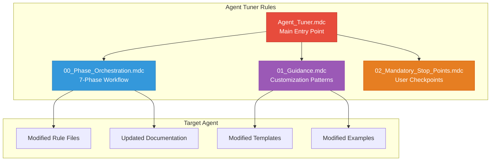
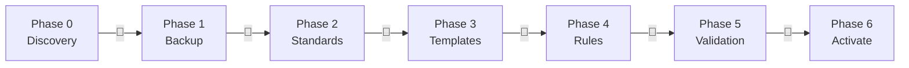

# 🎯 Agent Tuner - Rules Index

**Version:** 1.2.0  
**Last Updated:** April 2026  
**Author**: Cheppali Shaik Sohail

---

## 📋 **Quick Reference Table**

| Rule File | Purpose | When to Use |
|-----------|---------|-------------|
| `Agent_Tuner.mdc` | **Main Entry Point** | Start agent customization workflow |
| `00_Phase_Orchestration.mdc` | 7-phase workflow & state | Understanding phases & checkpoints |
| `01_Guidance.mdc` | Customization patterns, agent-specific flows | Pattern reference during customization |
| `02_Mandatory_Stop_Points.mdc` | User interaction enforcement | Checkpoint behavior reference |

---

## 🎯 **Rule Dependency Map**

---

## 📊 **7-Phase Workflow**

---

## 📁 **Rule File Details**

### **`Agent_Tuner.mdc`** - Main Entry Point
- **Purpose:** Central orchestration for agent customization
- **When to Use:** Start every customization workflow
- **Key Features:**
  - RISEN framework
  - 7-phase workflow control
  - Agent inventory table
  - Backup protocol
- **Cross-References:** All other rules

### **`00_Phase_Orchestration.mdc`** - Phase Workflow
- **Purpose:** Define phases, checkpoints, and state transitions
- **When to Use:** Understanding workflow progression
- **Key Features:**
  - 7-phase state machine
  - Agent-specific sub-flows (Phase 2-3)
  - State file format
  - Resume capability
- **Cross-References:** `@02_Mandatory_Stop_Points.mdc`

### **`01_Guidance.mdc`** - Customization Patterns
- **Purpose:** Agent-specific input collection, tuning patterns, validation
- **When to Use:** During customization phases (2-4)
- **Key Features:**
  - 7 customization dimensions
  - Agent-specific input prompts (01, 02, 03, 04-09)
  - Rules/templates decoupling rules
  - Architecture compliance checklist
  - Few-shot examples
- **Cross-References:** `@00_Phase_Orchestration.mdc`

### **`02_Mandatory_Stop_Points.mdc`** - User Checkpoints
- **Purpose:** Enforce user control at every phase
- **When to Use:** All phase transitions
- **Key Features:**
  - 7 mandatory stop points
  - Backup-first enforcement
  - Anti-pattern prevention
  - Constitutional principles
  - Semantic anti-autopilot
- **Cross-References:** `@00_Phase_Orchestration.mdc`

---

## 🔍 **Quick Lookup**

### **"I want to..."**

| Task | Go To |
|------|-------|
| Start customization workflow | `@Agent_Tuner.mdc` |
| Understand phases | `@00_Phase_Orchestration.mdc` |
| Reference customization patterns | `@01_Guidance.mdc` |
| Know checkpoint behavior | `@02_Mandatory_Stop_Points.mdc` |
| See detailed per-agent patterns | `lib/docs/customization-patterns.md` |

---

## 📊 **Cross-Reference Matrix**

| Rule File | References | Referenced By |
|-----------|------------|---------------|
| `Agent_Tuner.mdc` | All rules | - |
| `00_Phase_Orchestration.mdc` | `10-02` | `Agent_Tuner.mdc` |
| `01_Guidance.mdc` | `10-00` | `Agent_Tuner.mdc` |
| `02_Mandatory_Stop_Points.mdc` | `10-00`, `10-01` | `Agent_Tuner.mdc` |

---

## 🔗 **Related Resources**

- `../lib/docs/customization-patterns.md` - Detailed per-agent patterns
- `../examples/` - Customization session examples
- `../README.md` - Agent overview and quick start
- `../ARCHITECTURE.md` - Technical architecture
- `../Production_Learnings.md` - Lessons learned
- `../lib/docs/AGENT_ARCHITECTURE_STANDARD.md` - Architecture standard (local copy)
- `../examples/reference-agent-01-technical-design/` - Reference agent for studying correct structure

---

## Version History

| Version | Date | Changes |
|---------|------|---------|
| v1.2.0 | Apr 2026 | **Mermaid Standards Retrofit pattern.** Added the ability to retroactively apply Agent Builder's Mermaid Diagram Standards to existing agents. Changes: (1) Copied `lib/docs/mermaid-diagram-best-practices.md` from Agent Builder (self-contained deployment); (2) Added new §7 "Mermaid Standards Retrofit Pattern" in `lib/docs/customization-patterns.md` — 12-point diagnostic checklist, 10 ordered retrofit steps, embedding template, post-retrofit validation (customization-patterns.md bumped 1.0.0 → 1.1.0; renumbered §6 Backup→§8); (3) Added new SECTION 9 "Mermaid Standards Retrofit" in `rules/01_Guidance.mdc` — trigger conditions (5 cases), tuning flow summary (Phase 2 → Phase 4), what-not-to-do list; (4) Updated All-Agents validation checklist to include Mermaid compliance. Agent Tuner now detects and fixes broken Mermaid diagrams + embeds standards in any existing agent. |
| v1.1 | Apr 2026 | LLM behavioral gap countermeasures: version alignment, enhanced RISEN Narrowing, mandatory `<thinking>` blocks, RGV verification, assumption flagging across all rule files |
| v1.0 | Mar 2026 | Initial release: 7-phase workflow, agent-specific flows, backup-first safety, architecture compliance validation |

---

🧞‍♂️ **Agent Tuner V1.2 - Customize Any R-GENIE Agent to Your Project Standards!** ✨
