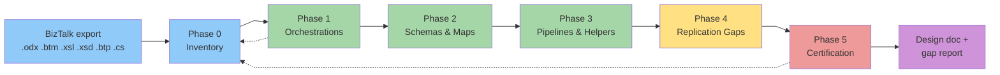

# BizTalk Documentation Agent — Architecture

**Author:** Cheppali Shaik Sohail  |  **Version:** 1.1.0

---

## Overview

The BizTalk Documentation Agent is an **Analyzer (primary) + Document Generator (secondary)** hybrid. Its core work is forensic *analysis* of exported BizTalk artifacts; its deliverable is a structured, template-driven *technical design document* built for MuleSoft migration. The agent reads source directly (no scripts), commits to element counts, and verifies them — the discipline that prevents the summarization which silently drops shapes and map links.

It is purpose-built for the BizTalk→MuleSoft migration question: *"Is the provided source enough to replicate this integration?"* Every artifact gets a replication-readiness verdict, and a dedicated gap report names exactly what is missing (absent assemblies, external schemas, encrypted values) and the recommended MuleSoft action.

The agent is stateful and resumable, processes input forensically (mind map + per-section RGV + positional-bias re-scan), and writes its long-form deliverable progressively (skeleton-first, one section group per phase, consolidate-and-polish at the end) to avoid large-edit failure modes.

---

## Workflow Steps

| Phase | What | How | Why | Approach |
|-------|------|-----|-----|----------|
| 0 Discovery & Inventory | Catalog every artifact | Read `.sln`/`.btproj`, enumerate all files, build assembly-ref graph | Establish the verification baseline (mind map) | Skeleton + Sections 1-2 |
| 1 Orchestrations | Document each `.odx` | Per-orchestration RGV: shapes, ports, expressions | Orchestrations are the control flow to rebuild | Per-`.odx` micro-checkpoints |
| 2 Schemas & Maps | Document each schema + map | Per-map RGV; read `.btm`+`.xsl` | Maps carry the data logic (→ DataWeave) | All links, none summarized |
| 3 Pipelines, Ports & Helpers | Document `.btp` + `.cs` | Per-component RGV; link call-sites | Helpers/pipelines are hidden dependencies | Flag absent source as 🔴 GAP |
| 4 Replication Readiness | Assess MuleSoft fit | Construct→equivalent table + verdicts | Directly answers the migration question | Gap report with actions |
| 5 Validation | Certify completeness | File-by-file reconciliation vs Phase 0 | Prove zero data loss | Consolidate & polish |

---

## Flow Diagram

(Dashed edges = completeness reconciliation back to the Phase 0 baseline.)

---

## Key Patterns

- **RGV (Read-Generate-Verify)** — atomic per-section count verification (DRY source: `02_Guidance.mdc §1`).
- **Forensic Input Processing** — mind map + section isolation + positional-bias re-scan (Heavy input).
- **Progressive Documentation v2** — skeleton-first, per-phase writes, final-phase consolidate.
- **Replication-Gap Discipline** — absent/encrypted → flag, never invent.
- **Evidence-Bound** — every item cites source file + OID/LinkID.
- **Template Consistency (MANDATORY)** — every app yields a structurally identical document; locked table columns + icon references + EXACT certification box, anchored to `examples/01_oracle_changepo/`.

## State Management

`.biztalk-state.json` tracks `currentPhase`, `inventory`, `counts`, `sectionStatus`, `replicationGaps`, `phaseStatuses`. Update protocol runs after each phase/section; resume offered on re-activation.

## Error Recovery

UTF-16 decode, `.btm`↔`.xsl` disagreement, absent assembly, RGV count mismatch, interrupted run — all handled per `01_Phase_Orchestration.mdc` Error Recovery table with graceful 3-attempt degradation into the gap register.
