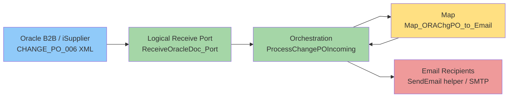
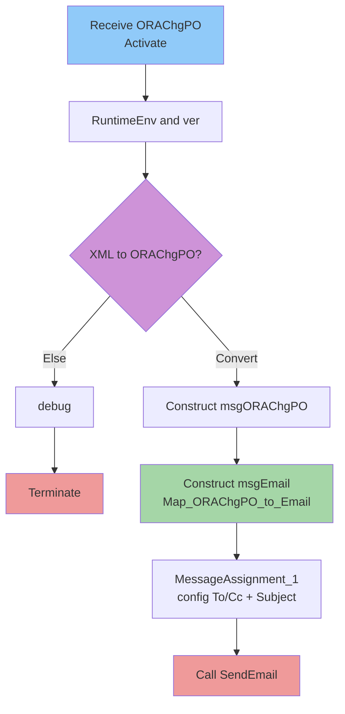

# BizTalk Technical Design — VenOracle._ChangePO

> Forensic, zero-assumption documentation for MuleSoft rebuild.
> **Source:** `biztalk/Simple/VenOracle/VenOracle._ChangePO/`  |  **Generated:** 2026-06-26  |  **Agent:** BizTalk Documentation Agent v1.0.0
> Principle: document what EXISTS in the source; flag what cannot be replicated.

<!-- SECTION:1 -->
## 1. Application Overview

**Application:** VenOracle._ChangePO (project `VenOracle._ChangePO.btproj`)
**Root namespace / assembly:** `VenOracle._ChangePO` (signed; `Key.snk`), target framework `.NET v4.6`, output type `library`.
**Purpose:** Receive an inbound Oracle "Change PO" XML document (`CHANGE_PO_006`, OAGIS 057 format), transform it into an email notification, and send that email to configured recipients.
**Integration scope:** Oracle iSupplier / B2B (`CHANGE_PO_006` XML) → BizTalk → SMTP email.

**Artifact counts:**

| Type | Count | Notes |
|------|-------|-------|
| Orchestrations (.odx) | 1 | `ProcessChangePOIncoming.odx` |
| Maps (.btm/.xsl) | 1 | `Map_ORAChgPO_to_Email` — uses **CustomXSLT** (logic in `.xsl`) |
| Schemas (.xsd) | 1 (present) | `CHANGE_PO_006.xsd` — *imports* type from external assembly (🔴 type body absent) |
| Pipelines (.btp) | 0 | None custom (binding not in export) |
| Helpers (.cs) | 0 present | Referenced: `Venture.Utilities.ConfigHelper`, `Venture.Utilities.Email.SendEmail` (🔴 source absent) |

> Note: `Map_ORAChgPO_to_Email.btm.cs` and `CHANGE_PO_006.xsd.cs` are BizTalk-generated artifacts, not hand-written helpers — excluded from helper count.

**Flow:** `ReceiveOracleDoc_Port` activates `ProcessChangePOIncoming` → read `RuntimeEnv` (ConfigHelper) + log version → decision: is message a `CHANGE_PO_006`? If yes, construct `msgORAChgPO`; else log + terminate → construct `msgEmail` via `Map_ORAChgPO_to_Email` → read To/Cc from config and override map values + prefix Subject with `[RuntimeEnv` → call `Venture.Utilities.Email.SendEmail`.

> **📦 Artifact inventory:** See [`supporting-docs/artifact-inventory.md`](supporting-docs/artifact-inventory.md) for the full file list, artifact-type counts, and the assembly-reference graph.

<!-- SECTION:2 -->
## 2. Architecture



**Project hierarchy:** single BizTalk project `VenOracle._ChangePO` containing `Orchestrations/`, `Maps/` (+ `Maps/xsl/`), `Schemas/`, `Properties/`.

**Assembly-reference graph (from `.btproj`):**

| Referenced Assembly | Used For | Source in export? |
|---------------------|----------|-------------------|
| `VenOracle` (v1.0.0.1) | Holds external schema `VenOracle.Schemas._057_change_po_006` (the `CHANGE_PO_006Type` body) | 🔴 No (sibling project, not in this folder) |
| `Venture.Utilities` | `ConfigHelper.GetNameValueFileSectionHandlerKey` | 🔴 No |
| `Venture.Utilities.Email` | `Email` message type + `SendEmail` | 🔴 No |
| `Microsoft.BizTalk.*`, `Microsoft.XLANGs.BaseTypes`, `System.*` | BizTalk/.NET runtime | N/A (framework) |

**Hosting / ports:** one logical receive port `ReceiveOracleDoc_Port` (PortType `ReceiveOracleDoc_PortType`, one-way `Operation_1`, message `System.Xml.XmlDocument`); physical adapter binding is not present in the export (⚠️ ASSUMPTION: bound at deploy time). No logical send port — outbound email is via a direct `Call` to the `SendEmail` helper.

<!-- SECTION:3 -->
## 3. Orchestration Documentation

### ProcessChangePOIncoming (`ProcessChangePOIncoming.odx`) — 13/13 shapes

**Service:** `internal`, non-invokable, non-transactional. **Activation:** `Receive ORAChgPO` (Activate=True) on `ReceiveOracleDoc_Port`.
**Messages:** `msgIn` (`System.Xml.XmlDocument`, In), `msgORAChgPO` (`Schemas.CHANGE_PO_006`, In), `msgEmail` (`Venture.Utilities.Email.Email`, In — 🔴 external).
**Variables:** `_ver` (String, init `"20151021 1405"`), `strEmailTo` (String), `strEmailCc` (String), `RuntimeEnv` (String).
**Correlations:** none.

| # | Shape | Name | Config / Expression | OID |
|---|-------|------|---------------------|-----|
| 1 | Receive | Receive ORAChgPO | Port `ReceiveOracleDoc_Port`, Activate=True; no DNF filter | `6d7b4c70` |
| 2 | VariableAssignment | RuntimeEnv and ver | `RuntimeEnv = ConfigHelper.GetNameValueFileSectionHandlerKey("RuntimeEnv","VenOracleSettings")`; log `_ver` | `54d0336f` |
| 3 | Decision | XML to ORAChgPO? | branch guard: `Convert.ToDouble(xpath(msgIn,"count(/*[local-name()='CHANGE_PO_006'])")) != 0` | `000b859c` |
| 4-6 | Branch "Convert" → Construct → MessageAssignment | Construct msgORAChgPO / XML > ORAChgPO | `msgORAChgPO = xpath(msgIn,"/*[local-name()='CHANGE_PO_006']")` | `ab17b9a2`/`dfe25ba5`/`eaeec0c1` |
| 7-9 | Branch "Else" → VariableAssignment → Terminate | debug / End | log `"End: Not CHANGE_PO_006"`; `terminate "Not CHANGE_PO_006"` | `3065ecda`/`23c12e23`/`65df7be1` |
| 10-11 | Construct → Transform | Construct msgEmail / ORAChgPO > Email | `transform (msgEmail) = Map_ORAChgPO_to_Email (msgORAChgPO)` | `831f05e9`/`6c17527b` |
| 12 | MessageAssignment | MessageAssignment_1 | read `EmailRecipientTo`/`EmailRecipientCc` from config; **override** map's SendTo/SendCc; `Subject = "[" + RuntimeEnv + Subject` | `7a8e888d` |
| 13 | Call | Call SendEmail | `call Venture.Utilities.Email.SendEmail (msgEmail)` — 🔴 helper source absent | `a16286f8` |

> ⚠️ Effective email recipients come from the `VenOracleSettings` **config** (shape 12), which overwrites the hard-coded recipient lists produced by the map's XSLT.

> **🔀 Orchestration detail:** See [`supporting-docs/orchestration-flows.md`](supporting-docs/orchestration-flows.md) for every shape (verbatim expressions + OIDs), ports, messages, variables, correlations, and the Mermaid flow.



<!-- SECTION:4 -->
## 4. Schemas & Data Mappings

### Schema: `CHANGE_PO_006.xsd` (UTF-16 wrapper)
- Target namespace `http://VenOracle._ChangePO.CHANGE_PO_006`; root element `CHANGE_PO_006` of type `ns0:CHANGE_PO_006Type`.
- 🔴 **GAP:** the type body is in an external OAGIS-057 schema `VenOracle.Schemas._057_change_po_006` (not in export). Full field tree not reproducible.
- Source fields actually consumed (recovered from the XSL): `POHEADER/POID`, `POHEADER/USERAREA/REVISIONNUM`, `POHEADER/BUYERID`, and repeating `POLINE/{POLINENUM, ITEM, ITEMX}` (all under `DATAAREA/CHANGE_PO`).
- Target schema `Venture.Utilities.Email.Email` is an external .NET type — 🔴 GAP. Used shape: `Subject`, `Body`, `SendToList/SendTo`, `SendCcList/SendCc`.

### Map: `Map_ORAChgPO_to_Email` (`.btm` UTF-16 + `.xsl`) — 10/10 links
> The `.btm` declares `CustomXSLT` (logic lives in the `.xsl`); its visual graph has only 1 link + empty functoids and is **superseded**. Mapping below is from the `.xsl`.

| Link | Source | Target | Logic |
|------|--------|--------|-------|
| 1 | `POHEADER/POID` | `Email/Subject` | literal `":OracleB2B] Order change request: PO#"` + POID |
| 2 | `POHEADER/USERAREA/REVISIONNUM` | `Email/Subject` | + `" REV: "` + REVISIONNUM |
| 3 | `POHEADER/POID` | `Email/Body` | `PO#: <POID>` |
| 4 | `POHEADER/USERAREA/REVISIONNUM` | `Email/Body` | `REV: <REVISIONNUM>` |
| 5 | `POHEADER/BUYERID` | `Email/Body` | `Buyer: <BUYERID>` |
| 6 | `POLINE/POLINENUM` | `Email/Body` | for-each POLINE, tab col 1 |
| 7 | `POLINE/ITEM` | `Email/Body` | for-each POLINE, tab col 2 |
| 8 | `POLINE/ITEMX` | `Email/Body` | for-each POLINE, tab col 3 |
| 9 | _constant_ | `Email/SendToList/SendTo` | hard-coded recipient list (⚠️ overwritten by config at runtime) |
| 10 | _constant_ | `Email/SendCcList/SendCc` | hard-coded cc list (⚠️ overwritten by config at runtime) |

> **🗂️ Schema structures:** See [`supporting-docs/schema-structures.md`](supporting-docs/schema-structures.md) for full schema field trees, namespaces, and fields-in-use.
> **🔗 Map mappings:** See [`supporting-docs/map-mappings.md`](supporting-docs/map-mappings.md) for every map link (source→target XPaths + functoid/XSLT logic) and constants.

<!-- SECTION:5 -->
## 5. Pipelines, Ports & Helpers

**Pipelines:** none custom (no `.btp`). ⚠️ ASSUMPTION: a standard XML receive pipeline delivers the message; adapter binding not in export.

**Ports:** one logical receive port `ReceiveOracleDoc_Port` (one-way, `System.Xml.XmlDocument`); no logical send port (email sent via `Call SendEmail`).

**Helpers (referenced, source absent → 🔴 GAP):**
- `Venture.Utilities.ConfigHelper.GetNameValueFileSectionHandlerKey(key, section)` — reads `VenOracleSettings` config (`RuntimeEnv`, `EmailRecipientTo`, `EmailRecipientCc`). Call-sites: shapes 2 & 12.
- `Venture.Utilities.Email.Email` — email message/target type (`Subject`, `Body`, `SendToList/SendTo`, `SendCcList/SendCc`).
- `Venture.Utilities.Email.SendEmail(Email)` — sends the email. Call-site: shape 13.

Framework calls (replicable): `System.Diagnostics.EventLog.WriteEntry` (logging), `xpath`, `System.Convert.ToDouble`.

> **🧩 Pipeline & helper reference:** See [`supporting-docs/pipeline-helper-reference.md`](supporting-docs/pipeline-helper-reference.md) for pipeline stages, port bindings, and `.cs` helper signatures + call-sites.

<!-- SECTION:6 -->
## 6. MuleSoft Replication Readiness

| BizTalk Construct | MuleSoft Equivalent | Verdict |
|-------------------|---------------------|---------|
| Receive port (XmlDocument) | Listener (File/SFTP/HTTP/DB per binding) | 🟡 binding absent |
| Orchestration | Mule flow | 🟢 |
| Decision `count()!=0` | `<choice>` | 🟢 |
| Terminate | `<raise-error>` | 🟢 |
| `xpath` extract | DataWeave / `read()` | 🟢 |
| Transform (Map_ORAChgPO_to_Email) | `<ee:transform>` (XSLT portable / DataWeave) | 🟢 |
| ConfigHelper lookups | `${property}` / Secure Properties | 🟡 helper absent |
| Subject prefix + To/Cc override | DataWeave + config properties | 🟡 |
| Call SendEmail | Email connector `<email:send>` | 🟡 helper absent |
| `Email` type | DataWeave payload model | 🟡 type absent |
| `CHANGE_PO_006` schema | DataWeave type / XSD validation | 🔴 schema body absent |

**Replication gaps (8):** external OAGIS-057 schema body, `Email` type, `ConfigHelper`, `SendEmail`, receive adapter binding, receive pipeline, `VenOracleSettings` `[ENV]` values, and the map's dead hard-coded recipients (overwritten by config). Full reasons + recommended actions in `supporting-docs/replication-gap-report.md`.

**Overall:** the orchestration logic, decision/terminate flow, and transform are cleanly replicable (🟢). The blockers are all **external dependencies absent from the export** — the BizTalk team must supply the OAGIS-057 schema, the `Venture.Utilities*` assemblies' behavior (config + SMTP send), and the port binding.

> **🚧 Replication-gap report:** See [`supporting-docs/replication-gap-report.md`](supporting-docs/replication-gap-report.md) for the BizTalk→MuleSoft mapping and every replication gap with reason + recommended action.

<!-- SECTION:7 -->
## 7. Validation & Certification

| File | Found | Documented |
|------|-------|------------|
| `ProcessChangePOIncoming.odx` | 13 shapes / 1 port / 3 msgs / 4 vars | 13/13 ✅ |
| `Map_ORAChgPO_to_Email.btm` + `.xsl` | 10 effective links (CustomXSLT) | 10/10 ✅ |
| `CHANGE_PO_006.xsd` | 1 root + external import | 1/1 ✅ (body 🔴 GAP) |
| `.btproj` | 6 assembly refs | 6/6 ✅ |

> **📋 Verification checklist:** See [`supporting-docs/verification-checklist.md`](supporting-docs/verification-checklist.md) for file-by-file reconciliation, count summary, and certification.

```
╔══════════════════════════════════════════════════════════════╗
║  BIZTALK DOCUMENTATION — COVERAGE CERTIFICATION                ║
║  App: VenOracle._ChangePO                                      ║
║  ✅ All present artifacts documented                            ║
║     (shapes 13/13, map links 10/10, schema 1/1, helpers 3/3)  ║
║  🔴 8 external/binding dependencies flagged as replication gaps ║
║  RESULT: COMPLETE for provided source. Rebuild requires the    ║
║          BizTalk team to supply: OAGIS-057 CHANGE_PO_006 XSD,  ║
║          Venture.Utilities + Venture.Utilities.Email behavior, ║
║          and the receive port binding/config.                  ║
╚══════════════════════════════════════════════════════════════╝
```
