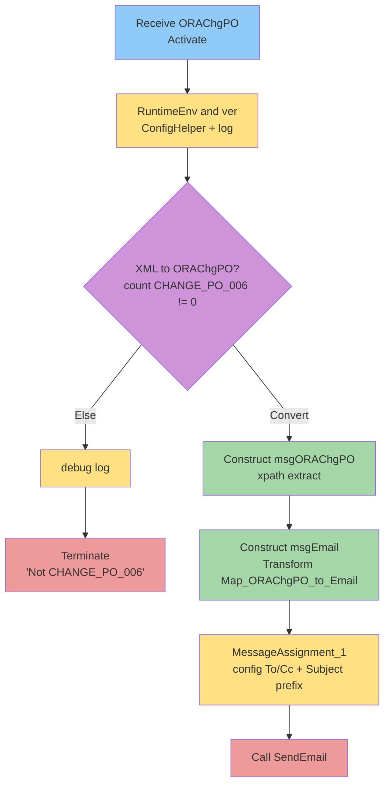

# Orchestration Flows — VenOracle._ChangePO

> Phase 1. Source: `Orchestrations/ProcessChangePOIncoming.odx`. Every shape cited by OID.

## ProcessChangePOIncoming — 13/13 shapes

- **Module:** `VenOracle._ChangePO` (OID `bbd1e485`)
- **Service:** `ProcessChangePOIncoming` — `internal`, `IsInvokable=False`, not transactional (OID `b9211a21`)
- **Activation:** `Receive ORAChgPO` (Activate=True) on `ReceiveOracleDoc_Port`.

### Port type & port

| Element | Detail | OID |
|---------|--------|-----|
| PortType `ReceiveOracleDoc_PortType` | Synchronous=False (one-way); `Operation_1` is `OneWay`; request message `Request` = `System.Xml.XmlDocument` | `15e99f78` / op `f8878f64` |
| Port `ReceiveOracleDoc_Port` | PortModifier `Implements`, Orientation `Left` (receive), Type `ReceiveOracleDoc_PortType`, Direction In; physical adapter binding not in export | `f710f61e` |

### Messages (3)

| Message | Type | Direction | OID |
|---------|------|-----------|-----|
| `msgIn` | `System.Xml.XmlDocument` | In | `87c6a23e` |
| `msgORAChgPO` | `VenOracle._ChangePO.Schemas.CHANGE_PO_006` | In | `267fae6d` |
| `msgEmail` | `Venture.Utilities.Email.Email` (🔴 external, source absent) | In | `40de7521` |

### Variables (4)

| Variable | Type | Initial value | OID |
|----------|------|---------------|-----|
| `_ver` | `System.String` | `"20151021 1405"` | `add7fc6e` |
| `strEmailTo` | `System.String` | `""` | `d722eb14` |
| `strEmailCc` | `System.String` | `""` | `21080416` |
| `RuntimeEnv` | `System.String` | `""` | `73a0cae9` |

**Correlations:** none.

### Shape-by-shape flow

| # | Shape Type | Name | Config / Expression | Source OID |
|---|-----------|------|---------------------|-----------|
| 1 | Receive | Receive ORAChgPO | Port `ReceiveOracleDoc_Port`, `Operation_1`/`Request`, message `msgIn`, **Activate=True**. No DNF filter. | `6d7b4c70` |
| 2 | VariableAssignment | RuntimeEnv and ver | (see code block S2) — read `RuntimeEnv` from config + write version to EventLog | `54d0336f` |
| 3 | Decision | XML to ORAChgPO? | Two branches (Convert / Else) | `000b859c` |
| 4 | DecisionBranch | Convert (if) | Guard: `System.Convert.ToDouble(xpath(msgIn,"count(/*[local-name()='CHANGE_PO_006'])")) != 0` | `ab17b9a2` |
| 5 | Construct | Construct msgORAChgPO | Constructs `msgORAChgPO` | `dfe25ba5` |
| 6 | MessageAssignment | XML > ORAChgPO | `msgORAChgPO = xpath(msgIn,"/*[local-name()='CHANGE_PO_006']");` | `eaeec0c1` |
| 7 | DecisionBranch | Else | Default branch (not a `CHANGE_PO_006`) | `3065ecda` |
| 8 | VariableAssignment | debug | `System.Diagnostics.EventLog.WriteEntry("ChangePO: odxProcessChangePOIncoming", "End: Not CHANGE_PO_006");` | `23c12e23` |
| 9 | Terminate | End | `ErrorMessage = "Not CHANGE_PO_006";` — terminates instance | `65df7be1` |
| 10 | Construct | Construct msgEmail | Constructs `msgEmail` (contains Transform + MessageAssignment) | `831f05e9` |
| 11 | Transform | ORAChgPO > Email | `transform (msgEmail) = VenOracle._ChangePO.Maps.Map_ORAChgPO_to_Email (msgORAChgPO);` — in part `msgORAChgPO`, out part `msgEmail` | `6c17527b` |
| 12 | MessageAssignment | MessageAssignment_1 | (see code block S12) — read To/Cc from config, override map output, prefix Subject | `7a8e888d` |
| 13 | Call | Call SendEmail | `call Venture.Utilities.Email.SendEmail (msgEmail);` (param `msgEmail` In). 🔴 helper source absent | `a16286f8` |

### Inline expression code (verbatim)

**S2 — "RuntimeEnv and ver" (OID `54d0336f`):**
```csharp
RuntimeEnv = Venture.Utilities.ConfigHelper.GetNameValueFileSectionHandlerKey("RuntimeEnv","VenOracleSettings");
System.Diagnostics.EventLog.WriteEntry("ChangePO: odxProcessChangePOIncoming", _ver);
```

**S4 — Decision branch "Convert" guard (OID `ab17b9a2`):**
```csharp
System.Convert.ToDouble(xpath(msgIn,"count(/*[local-name()='CHANGE_PO_006'])")) != 0
```

**S6 — "XML > ORAChgPO" (OID `eaeec0c1`):**
```csharp
msgORAChgPO = xpath(msgIn,"/*[local-name()='CHANGE_PO_006']");
```

**S8 — "debug" (OID `23c12e23`):**
```csharp
System.Diagnostics.EventLog.WriteEntry("ChangePO: odxProcessChangePOIncoming", "End: Not CHANGE_PO_006");
```

**S9 — "End" terminate (OID `65df7be1`):**
```csharp
terminate "Not CHANGE_PO_006";
```

**S12 — "MessageAssignment_1" (OID `7a8e888d`):**
```csharp
strEmailTo = Venture.Utilities.ConfigHelper.GetNameValueFileSectionHandlerKey("EmailRecipientTo","VenOracleSettings");
strEmailCc = Venture.Utilities.ConfigHelper.GetNameValueFileSectionHandlerKey("EmailRecipientCc","VenOracleSettings");
System.Diagnostics.EventLog.WriteEntry("ChangePO: odxProcessChangePOIncoming", "email to = " + strEmailTo + System.Environment.NewLine + "email cc = " + strEmailCc);

msgEmail.Subject = "[" + RuntimeEnv + msgEmail.Subject;
xpath(msgEmail, "/*[local-name()='Email']/*[local-name()='SendToList']/*[local-name()='SendTo']") = strEmailTo;
xpath(msgEmail, "/*[local-name()='Email']/*[local-name()='SendCcList']/*[local-name()='SendCc']") = strEmailCc;
```

> ⚠️ **Runtime-behavior note (evidence-bound):** Shape 12 **overrides** the `SendTo`/`SendCc` values produced by the map (`Map_ORAChgPO_to_Email.xsl` hard-codes recipient lists) with values read from the `VenOracleSettings` config section (`EmailRecipientTo` / `EmailRecipientCc`). The Subject is also prefixed with `"[" + RuntimeEnv`. So the **effective** recipients come from config, not the map. Both sources cited: `ProcessChangePOIncoming.odx` (OID `7a8e888d`) and `Map_ORAChgPO_to_Email.xsl`.

### Helper call-sites (source absent → 🔴 GAP)

| Helper | Signature (as called) | Call-site shape |
|--------|------------------------|-----------------|
| `Venture.Utilities.ConfigHelper.GetNameValueFileSectionHandlerKey` | `(string key, string section) : string` | S2, S12 |
| `Venture.Utilities.Email.SendEmail` | `(Venture.Utilities.Email.Email) : void` | S13 |
| `System.Diagnostics.EventLog.WriteEntry` | `(string source, string message)` | S2, S8, S12 (framework — replicable as logging) |

### Mermaid flow


