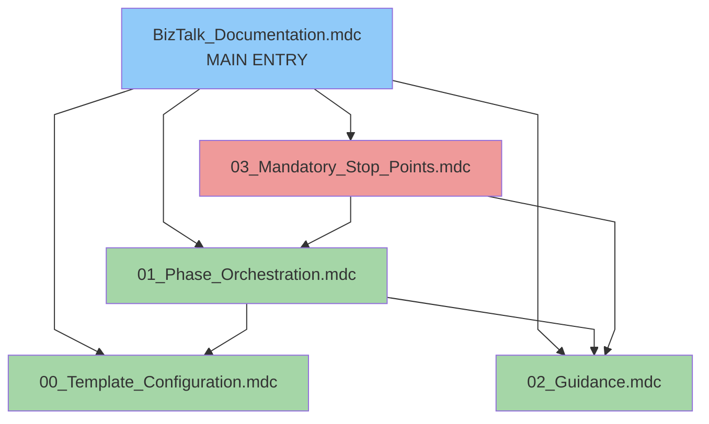
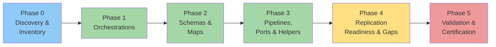

# BizTalk Documentation Agent — Rules Index

**Author:** Cheppali Shaik Sohail
**Version:** 1.1.0

Navigation for the 5-file lean rule architecture (Analyzer + Document Generator hybrid).

---

## Quick Reference

| # | File | Role | Priority | alwaysApply |
|---|------|------|----------|-------------|
| 1 | `BizTalk_Documentation.mdc` | MAIN ENTRY — identity, RISEN, workflow overview | HIGHEST | true |
| 2 | `00_Template_Configuration.mdc` | Output structure + supporting-doc formats | HIGH | false |
| 3 | `01_Phase_Orchestration.mdc` | 6-phase workflow, RGV, forensic processing, state, write contract | HIGH | false |
| 4 | `02_Guidance.mdc` | RGV (DRY), extraction patterns, few-shot, BizTalk→MuleSoft matrices | HIGH | false |
| 5 | `03_Mandatory_Stop_Points.mdc` | Anti-patterns, self-checks, constitutional principles | HIGHEST | true |

---

## Rule Dependency Map

---

## Phase Workflow

---

## File Details

- **MAIN ENTRY** — loaded always; identity + RISEN + 6-phase overview + critical rules.
- **Template Configuration** — read before generating; owns the 7-section main-doc structure and supporting-doc formats.
- **Phase Orchestration** — the engine: state machine, per-phase specs, RGV, forensic input processing, per-phase write contract, state schema, error recovery.
- **Guidance** — the knowledge: RGV (DRY), per-artifact extraction, few-shot, BizTalk→MuleSoft matrices, Mermaid standards, quality checklist.
- **Stop Points** — loaded always; anti-patterns, RGV + per-phase write self-checks, constitutional principles, sanitization.

---

## Cross-Reference Matrix

| Concept | Authoritative Source | Referenced By |
|---------|---------------------|---------------|
| RGV loop | `02_Guidance.mdc` §1 | Main, Phase Orch, Stop Points |
| Output structure | `00_Template_Configuration.mdc` | Main, Phase Orch |
| Per-phase write contract | `01_Phase_Orchestration.mdc` | Main, Stop Points |
| BizTalk→MuleSoft mapping | `02_Guidance.mdc` §4 | Phase Orch (Phase 4) |
| Constitutional principles | `03_Mandatory_Stop_Points.mdc` | Main |

---

## Version History

| Version | Date | Tuned by | Changes |
|---------|------|----------|---------|
| 1.0.0 | 2026-06-26 | — | Initial release — 6-phase forensic BizTalk→MuleSoft documentation agent (Analyzer + Document Generator hybrid, RGV, stateful, progressive doc v2) |
| 1.1.0 | 2026-06-26 | Cheppali Shaik Sohail | **Consistency overhaul** (modeled on 08 Boomi agent): rewrote `00_Template_Configuration.mdc` into a MANDATORY contract (enforcement banner, required-files, locked table columns, icon reference convention, diagram specs, EXACT certification box); rewrote `templates/documentation-template-guide.md` with literal per-section/per-doc templates + per-shape-type formats + Content Patterns; enriched `templates/documentation-style.yaml` (locked_columns, icons, markers, critical_patterns); added template-enforcement guard to `03_Mandatory_Stop_Points.mdc` + main entry; established a single canonical full example `examples/01_oracle_changepo/` (main + 7 supporting docs) as the sole anchor every app must match |
