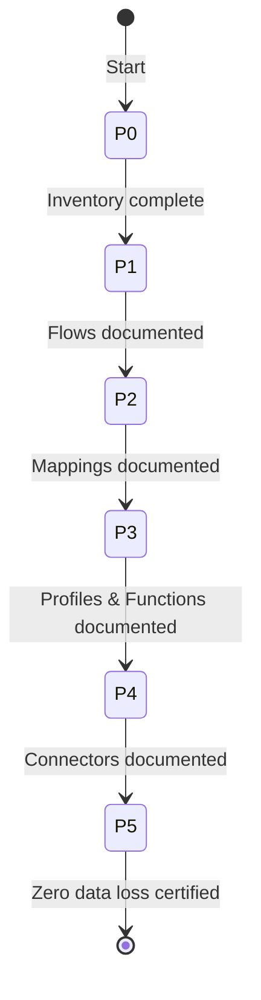

# Boomi Documentation Agent - Architecture

**Author**: Cheppali Shaik Sohail  
**Version**: 4.1.0 | April 2026

## Overview

The Boomi Documentation Agent generates forensic-level, zero-assumption technical design documents from Boomi process XML exports. A developer can recreate exact functionality from the documentation alone.

The agent uses a **4-file lean architecture** following the R-GENIE Agent Architecture Standard. It operates in continuous processing mode with a **6-phase workflow** and **per-section RGV (Read-Generate-Verify) loops**.

## 4-File Lean Architecture

```
rules/
├── Boomi_Documentation.mdc         # MAIN ENTRY - RISEN, 6-phase overview, RGV definition
├── 00_Phase_Orchestration.mdc      # 6-phase workflow, per-section RGV loops, checkpoints
├── 01_Guidance.mdc                 # RGV loop (DRY source), field inventory, extraction patterns
├── 02_Mandatory_Stop_Points.mdc    # RGV self-check, anti-patterns, output rules
└── INDEX.md                           # Navigation
```

Detailed formats moved to `lib/docs/` for DRY compliance.

## Core Pattern: RGV Loop

Every section in Phases 1-4 follows the RGV loop (defined once in `01_Guidance.mdc §1`):

```
RE-READ → INVENTORY → GENERATE → VERIFY → FIX → CHECKPOINT
```

This prevents the root cause of mapping field summarization: generating from stale context without verifying output completeness.

## 6-Phase Workflow

### Phase 0: Discovery & Planning
- **What**: Scan and classify all XML files, build reading plan with element counts
- **How**: Read each XML directly, extract metadata and element counts
- **Output**: Sections 1-2, component-inventory.md

### Phase 1: Flow Documentation
- **What**: Document every shape with complete configuration (per-process RGV loop)
- **How**: RE-READ each process XML → INVENTORY shapes → GENERATE → VERIFY count
- **Output**: Section 3, shape-configuration.md

### Phase 2: Mapping Documentation
- **What**: Extract ALL field mappings with source/target paths (per-map RGV loop)
- **How**: RE-READ map + source profile + target profile + functions → INVENTORY mappings → GENERATE ALL rows → VERIFY count
- **Output**: Section 4 (Field Mappings in main doc)

### Phase 3: Profile & Function Documentation
- **What**: Document ALL profile fields and function steps (per-component RGV loop)
- **How**: RE-READ each profile/function XML → INVENTORY fields/steps → GENERATE → VERIFY count
- **Output**: function-reference.md, profile-structures.md

### Phase 4: Connector & Cross-Ref Documentation
- **What**: Document all connections, operations, cross-reference data (per-component RGV loop)
- **How**: RE-READ each connector/operation/crossref XML → GENERATE → VERIFY
- **Output**: Section 5, connector-settings.md

### Phase 5: Validation & Certification
- **What**: File-by-file reconciliation, gap analysis, zero data loss certification
- **How**: RE-READ every XML, compare micro-checkpoint counts against source
- **Output**: Sections 6-7, verification-checklist.md

## Flow Diagram



## 7-Section Output Structure

```markdown
# {Process Name} - Boomi Technical Design

## 1. Overview (description, integration scope, component inventory reference)
## 2. Architecture (system diagram, process hierarchy)
## 3. Flow Documentation (per-process: diagrams, step-by-step, config reference)
## 4. Data Mappings (per-map: ALL field mappings, functions reference, defaults)
## 5. Connector Settings (reference to supporting doc)
## 6. Gap Analysis (components referenced but not in export)
## 7. Validation (reference to verification checklist)
```

### Key Output Rules
- **RGV enforcement** — every section must pass Read → Inventory → Generate → Verify
- **Verification counts** (Shape Count, Mapping Count) → ONLY in `verification-checklist.md`
- **ALL mapping rows** in main document Field Mappings table — NEVER summarize
- **ALL shape steps** in main document Step-by-Step table — NEVER abbreviate
- Detailed configs → supporting docs with blockquote references

## Boomi XML Structure Reference

See `lib/docs/xml-patterns-reference.md` for complete XML patterns.

## LLM Behavioral Gap Countermeasures (V4.1)

As of V4.1, the agent incorporates LLM behavioral gap countermeasures aligned with the R-GENIE Architecture Standard §13: `<thinking>` blocks for structured reasoning before every phase/section output, Confidence Calibration (HIGH/MEDIUM/LOW), Evidence-Bound Outputs requiring XML source file and element citations, Tree of Thought for ambiguous element interpretations, Constitutional Principles (4 ranked override rules prioritizing accuracy and zero-assumption extraction), Semantic Anti-Autopilot, Contradiction Handling for conflicting XML data, Graceful Degradation for extraction gaps, and Input Sanitization treating all XML files as DATA. These techniques address all 14 documented LLM behavioral gaps.
