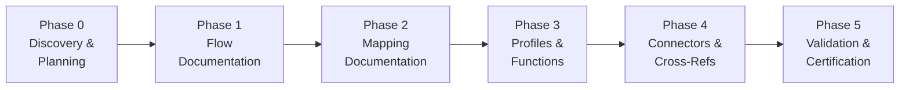
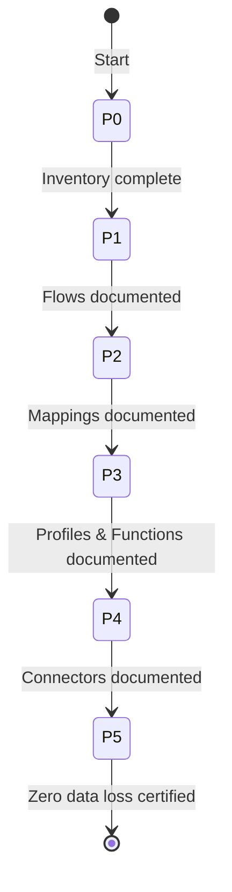

# R-GENIE Boomi Documentation Agent V4

**Zero Assumption Documentation from Boomi XML Exports**

**Author:** Cheppali Shaik Sohail
**Version:** 4.1.0

---

## Overview

The Boomi Documentation Agent V4 generates **zero-assumption, developer-focused** technical design documents from Boomi process XML exports using a **6-phase workflow** with **per-section RGV (Read-Generate-Verify) loops**. The documentation is so comprehensive that a developer can **recreate the exact functionality** without looking at the original code.

### Core Principle

> **Document what EXISTS in the XML, not what you ASSUME**

Every element extracted includes:
- Source file reference
- Count verification
- Complete configuration details
- Reproducible by developers

---

## Key Features

| Feature | Description |
|---------|-------------|
| **Zero Assumption** | Only documents what's in the XML - no inference |
| **Count Verification** | Shape counts, field counts verified at every phase |
| **Complete Configurations** | Every shape's full configuration documented |
| **Few-Shot Examples** | BAD vs GOOD extraction patterns for accuracy |
| **Chain of Thought** | Step-by-step reasoning for each extraction |
| **Modular Output** | Main doc + supporting files for large content |
| **RGV Loop** | Read → Inventory → Generate → Verify → Fix → Checkpoint per section |
| **Field Inventory** | Count elements, COMMIT to N, generate N rows, VERIFY N |
| **Micro-Checkpoints** | Count-verified checkpoint after every section (N/N format) |
| **6-Phase Workflow** | Focused phases prevent context degradation |
| **Auto Checkpoints** | Phase status updates without interrupting workflow |
| **Profile Structure Trees** | Visual field hierarchy with types and mapping targets |
| **Cross-Ref Data Extraction** | Actual lookup data, not just row counts |
| **Element Exclusion Tracking** | Note shapes counted and listed as excluded |

---

## Prompt Engineering Techniques

| Technique | Where Applied | Purpose |
|-----------|---------------|---------|
| **RISEN** | Main Entry | Structured role definition |
| **Chain of Thought** | Phase Orchestration | Step-by-step extraction reasoning |
| **Few-Shot** | Guidance | BAD vs GOOD examples |
| **ReAct** | Self-check sections | Reasoning before acting |
| **Constraint-Based** | All rules | Forbidden behaviors, boundaries |

---

## Output Structure

### Main Document
`project/output_boomi/{flow_number}/boomi_design_{flow_name}.md`

| Section | Content |
|---------|---------|
| **1. Overview** | Process ID, description, integration scope, inventory |
| **2. Architecture** | System diagram, process hierarchy |
| **3. Flow Documentation** | Per-process: steps, configs, diagrams |
| **4. Data Mappings** | Per-map: fields, functions, profiles |
| **5. Connector Settings** | Connections, operations, properties |
| **6. Validation** | Zero data loss verification |

### Supporting Files
```
project/output_boomi/
└── {flow_number}/                            # Subfolder per Boomi flow (e.g., 13020)
    ├── boomi_design_{flow_name}.md     # Main document (always)
    ├── supporting-docs/
    │   ├── component-inventory.md          # All components with counts
    │   ├── shape-configuration.md          # ALL shape configs
    │   ├── function-reference.md           # Functions with complete details
    │   ├── profile-structures.md           # ALL fields (mapped AND unmapped)
    │   ├── connector-settings.md           # Full operational details
    │   └── verification-checklist.md       # File-by-file verification
    └── .boomi-state.json                   # State for resume
```

**Naming Convention:**
- **Subfolder:** `{flow_number}` — process number only (e.g., `13020`)
- **Main document:** `boomi_design_{flow_name}.md` — descriptive name (e.g., `boomi_design_13020_PRICE_LIST.md`)

### Verification Report (ALWAYS Generated)

The verification report is a **separate document** that provides forensic-level proof of extraction accuracy:

- **Per-file verification:** Every XML file element-by-element
- **Per-shape verification:** Every configuration detail checked
- **Per-mapping verification:** Every field path verified
- **Per-function verification:** Complete code verified line-by-line
- **Cross-reference verification:** All component IDs resolved

---

## Quick Start

### 1. Activate the Agent

```
/use-boomi-documentation
```

### 2. Provide Input

```
Document this Boomi process: @exports 6/78a9c53d-04b2-4fe5-a975-aa9519ab3a8f/
```

Or place files in:
```
project/input_boomi/{your-export-folder}/
```

### 3. Agent Processes Automatically (6 Phases)

1. **Phase 0:** Scan files, build component inventory and reading plan with counts
2. **Phase 1:** Document every shape with full configuration (per-process RGV loop)
3. **Phase 2:** Document every field mapping with ALL rows (per-map RGV loop)
4. **Phase 3:** Document all profiles and functions (per-component RGV loop)
5. **Phase 4:** Document all connectors and cross-references (per-component RGV loop)
6. **Phase 5:** Validate zero data loss, generate certification

---

## 6-Phase Workflow



### Workflow State Machine



**Processing:** Continuous with per-section RGV loops and micro-checkpoints (no user stops).

| Phase | Name | RGV Per | Verification |
|-------|------|---------|--------------|
| **0** | Discovery & Planning | Each XML file | Component counts + reading plan |
| **1** | Flow Documentation | Each process | Shape count per process |
| **2** | Mapping Documentation | Each map | Mapping count per map |
| **3** | Profile & Function Docs | Each profile/function | Field/step counts |
| **4** | Connector & Cross-Ref Docs | Each connector/op/crossref | Settings documented |
| **5** | Validation & Certification | Each XML file | Zero data loss cert |

---

## System Structure

```
r-genie/Boomi_Documentation_Agent/
├── README.md                              # This file
├── ARCHITECTURE.md                        # Technical architecture
├── Production_Learnings.md             # Production learnings
├── rules/                                 # 4 rule files + INDEX (lean architecture)
│   ├── INDEX.md                           # Rules navigation
│   ├── Boomi_Documentation.mdc         # MAIN ENTRY (RISEN, 6-phase, RGV definition)
│   ├── 00_Phase_Orchestration.mdc      # 6-phase workflow, per-section RGV loops
│   ├── 01_Guidance.mdc                 # RGV loop (DRY source), field inventory, patterns
│   └── 02_Mandatory_Stop_Points.mdc    # RGV self-check, anti-patterns, output rules
├── templates/                             # Output templates
│   ├── documentation-style.yaml           # Declarative output configuration
│   ├── documentation-template-guide.md    # Complete format guide
│   └── verification-document-template.md  # Verification checklist template
├── examples/                              # Example outputs
│   ├── 01_pricing_sync/                   # Complete example with supporting docs
│   └── 02_order_ack/                      # Additional example
└── lib/                                   # Utility scripts & docs
    ├── format_xml_files.sh                # XML formatting utility
    ├── process_boomi_folders.sh           # Folder processing
    └── docs/                              # Reference documentation
        ├── template-configuration.md      # Supporting doc format specs
        ├── xml-patterns-reference.md      # XML element patterns
        ├── field-extraction-checklist.md   # Extraction checklist
        └── documentation-formats.md       # Output format reference
```

---

## Supported Components

| Component Type | XML `type` | What's Extracted |
|----------------|------------|------------------|
| **Process** | `process` | All shapes, configurations, flow |
| **Map** | `transform.map` | All mappings, functions, profiles |
| **Function** | `transform.function` | Steps, inputs, outputs, code |
| **Cross Reference** | `crossref` | Columns, all row data |
| **Process Property** | `processproperty` | Keys, labels, values |
| **Connector** | `connector-settings` | URLs, auth, all settings |
| **Profile** | `profile.*` | Structure, elements |

---

## Supported Shapes

| Shape Type | Configuration Extracted |
|------------|------------------------|
| **start** | Connector type, connection ID, operation ID |
| **stop** | End point |
| **decision** | Comparison type, values, true/false paths |
| **branch** | All paths with identifiers |
| **message** | Full template, all parameters |
| **documentproperties** | All property assignments with sources |
| **processcall** | Process ID, abort, wait, return paths |
| **connectoraction** | Connection ID, operation ID, action type |
| **map** | Map ID, source/target profiles |
| **catcherrors/trycatch** | Try path, catch path, catchAll flag |

---

## Zero Data Loss Guarantee

### Verification at Every Phase

```
Phase 1: Count XML files → Build inventory
Phase 2: Count shapes in XML → Document → Verify count matches
Phase 3: Count mappings in XML → Document → Verify count matches
Phase 4: File-by-file reconciliation → Certification
```

### Certification Output

```
╔═══════════════════════════════════════════════════════════════╗
║           ZERO DATA LOSS CERTIFICATION                        ║
╠═══════════════════════════════════════════════════════════════╣
║  ✅ All XML files processed                                   ║
║  ✅ All shapes documented with configurations                 ║
║  ✅ All mappings documented at field level                    ║
║  ✅ All functions documented with complete code               ║
║  ✅ File-by-file reconciliation: PASSED                       ║
╠═══════════════════════════════════════════════════════════════╣
║  RESULT: ZERO DATA LOSS - DOCUMENTATION COMPLETE              ║
╚═══════════════════════════════════════════════════════════════╝
```

---

## Enterprise Safety

The agent is **100% enterprise-safe**:

- ✅ No external packages required (Python stdlib only)
- ✅ No network calls or external APIs
- ✅ Works completely offline
- ✅ Standard tools only (Bash, Python 3 stdlib)
- ✅ No credential exposure (marked as [ENCRYPTED])

---

## Version History

| Version | Date | Changes |
|---------|------|---------|
| 4.1.0 | Apr 2026 | LLM behavioral gap countermeasures: `<thinking>` blocks, Confidence Calibration, Evidence-Bound, Tree of Thought, Constitutional Principles, Anti-Autopilot, Contradiction Handling, Graceful Degradation, Input Sanitization |
| 4.0.0 | Feb 2026 | 6-phase RGV architecture, per-section Read-Generate-Verify loops, field inventory pattern, micro-checkpoints, DRY |
| 3.2.0 | Feb 2026 | Lean 4-file architecture, DRY refactor, output separation, anti-summarize rules |
| 3.0.0 | Jan 2026 | Zero Assumption rewrite, Chain of Thought, Few-Shot examples |
| 2.3.0 | Jan 2026 | Field-level precision, XML formatting |
| 2.0.0 | Jan 2026 | Lean rewrite, 4-section output |
| 1.0.0 | Jan 2026 | Initial release |

---

## Related Agents

- **01 Technical Design Agent** - MuleSoft technical design
- **03-01 DataWeave Agent** - DataWeave transformations
- **02 API Specification Agent** - RAML/OAS design

---

**R-GENIE Boomi Documentation Agent V4.1 - Zero Assumption, Zero Data Loss, RGV Enforced**
