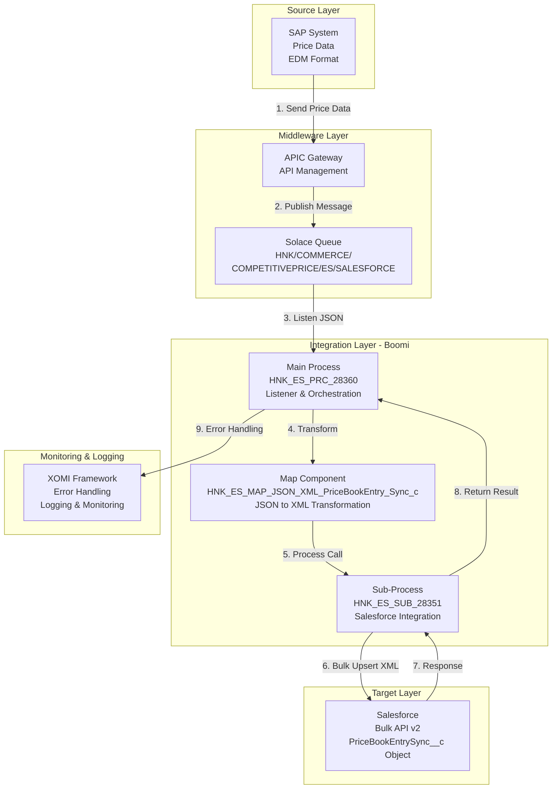
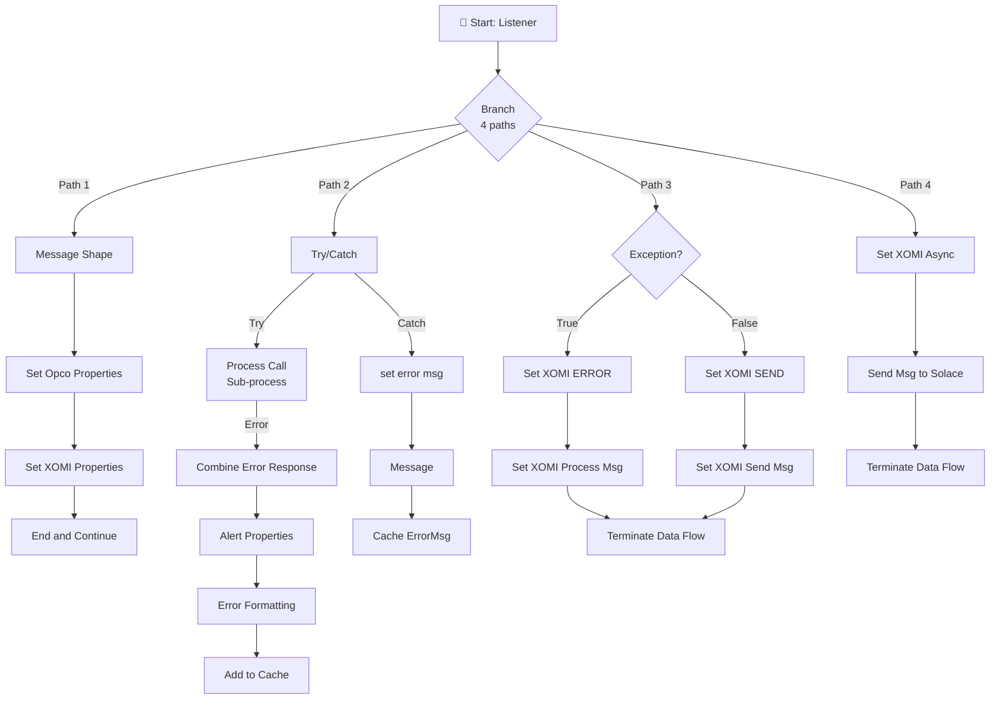
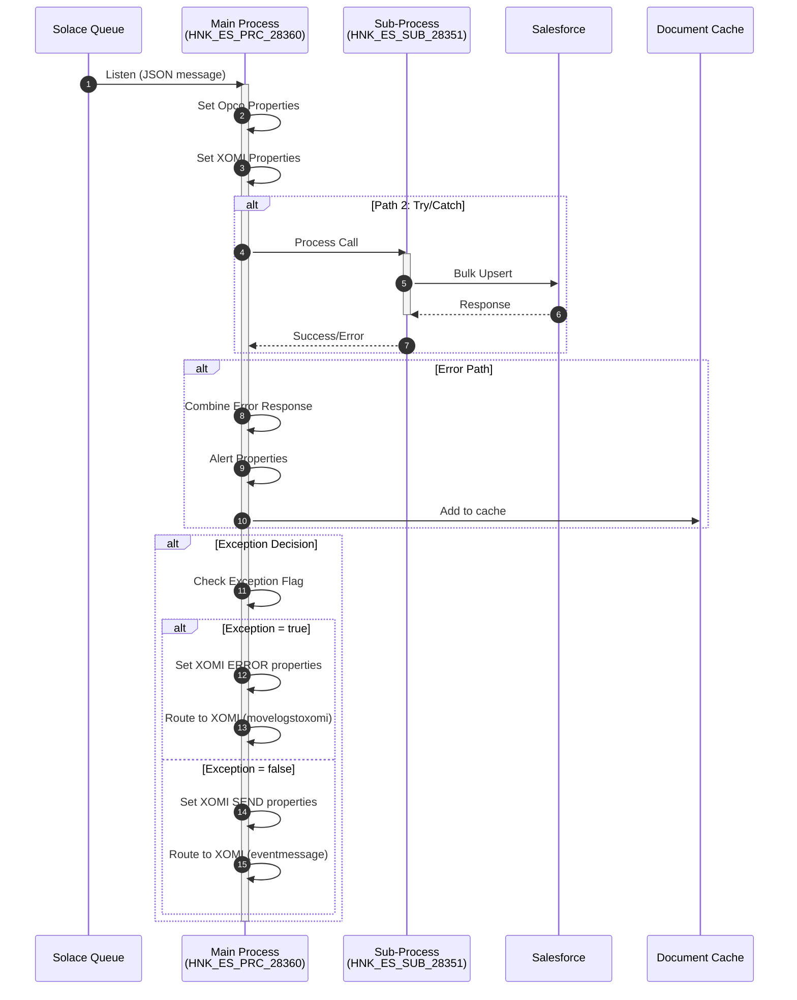
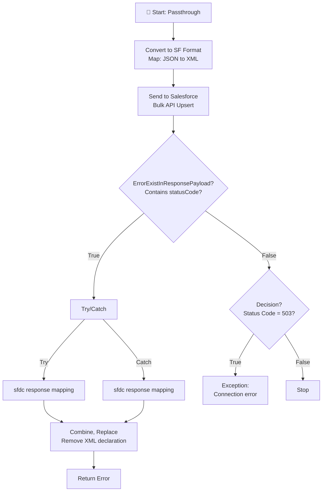
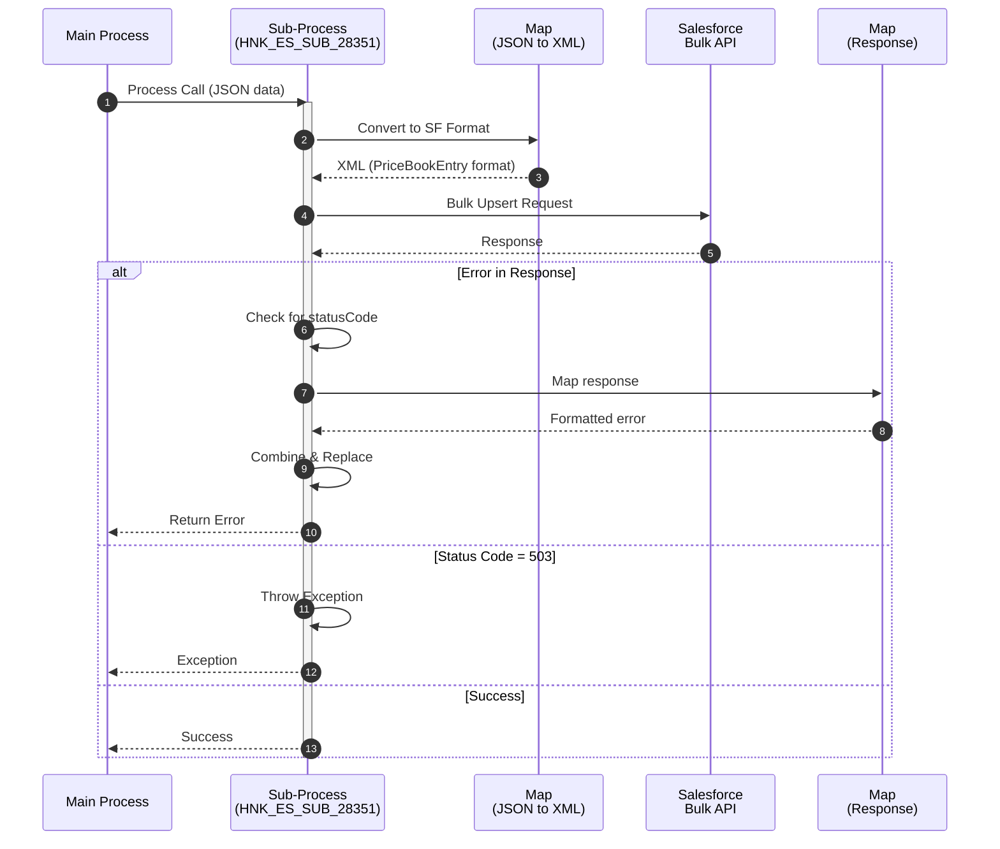

# HNK_ES_PRC_28360_SAP_SFDC_NetListPrices - Boomi Technical Design

**Project:** HNK_ES_PRC_28360_SAP_SFDC_NetListPrices  
**Process ID:** `2429a385-bf85-46d6-906e-cbf936da85db`  
**Processing:** Event-driven (Solace listener)  
**Source File:** `2429a385-bf85-46d6-906e-cbf936da85db.xml`  
**Generated:** 2026-01-27

---

## 1. Overview

### 1.1 Process Description

The Pricing interface is used to send data from the SAP System via APIC and  SOLACE to Boomi in EDM format then Boomi make necessary transformation and send it to Salesforce System .

### 1.2 Integration Scope

| Aspect | Details |
|--------|---------|
| **Source System** | SAP System |
| **Source Protocol** | Solace (via APIC) |
| **Source Format** | JSON (EDM format) |
| **Target System** | Salesforce |
| **Target Protocol** | REST API (Bulk API) |
| **Target Format** | XML |

### 1.3 Component Inventory

> **📦 Complete component inventory:** See [`supporting-docs/component-inventory.md`](supporting-docs/component-inventory.md) for detailed inventory of all 19 components including processes, maps, functions, connectors, operations, cross-references, and profiles with element counts.

---

## 2. Architecture

### 2.1 System Interaction Diagram

### 2.2 Process Hierarchy

| Process | Type | Source File | Shapes |
|---------|------|-------------|--------|
| HNK_ES_PRC_28360_SAP_SFDC_NetListPrices | Main | `2429a385-bf85-46d6-906e-cbf936da85db.xml` | 24 |
| HNK_ES_SUB_28351_SAP_SFDC_PriceBookEntry | Sub | `481e74e4-11de-4756-89b2-722a5ab7dd35.xml` | 12 |

---

## 3. Flow Documentation

### 3.1 Process: HNK_ES_PRC_28360_SAP_SFDC_NetListPrices

**Process ID:** `2429a385-bf85-46d6-906e-cbf936da85db`  
**Source File:** `2429a385-bf85-46d6-906e-cbf936da85db.xml`  
**Description:** The Pricing interface is used to send data from the SAP System via APIC and  SOLACE to Boomi in EDM format then Boomi make necessary transformation and send it to Salesforce System .

#### Shape Count Verification
- **XML shapes:** 24
- **Documented:** 24
- **Status:** ✅ MATCH

#### Flow Diagram

#### Sequence Diagram

#### Step-by-Step Execution

| Step | Shape ID | Type | Label | Action | Next |
|------|----------|------|-------|--------|------|
| 1 | shape1 | start | Listener | Listen for messages from Solace queue (HNK/COMMERCE/COMPETITIVEPRICE/ES/SALESFORCE) using persistent transacted mode | shape14 |
| 2 | shape14 | branch | Branch | Branch to 4 parallel execution paths: (1) Message formatting, (2) Main processing with error handling, (3) Exception decision logic, (4) Async logging to Splunk | shape10(1), shape16(2), shape26(3), shape30(4) |
| 3 | shape10 | message | Message Shape | Extract Solace user properties from message headers and format into document property structure | shape2 |
| 4 | shape2 | documentproperties | setting Opco, path and other properties | Initialize process properties: Set LogKey=0, Opco=Spain (static), ProcessName/ExecutionID/ProcessID from execution context, DistributorID from message senderId profile field | shape4 |
| 5 | shape4 | documentproperties | Set XOMI Properties | Configure XOMI framework properties: BusinessProcess and SubProcess from cross-reference lookup (InterfaceNumber=28360), EntityType=priceListItem, CountryCode=ES, LogXOMI flag from lookup | shape15 |
| 6 | shape15 | stop | End and Continue | Terminate process execution (continue=true allows other paths to complete) | END |
| 7 | shape16 | catcherrors | Try/Catch | Wrap sub-process call in error handling: catchAll=true to catch all exceptions, retryCount=3 for automatic retries on failure | shape35(Try), shape37(Catch) |
| 8 | shape35 | processcall | Process Call | Invoke sub-process HNK_ES_SUB_28351_SAP_SFDC_PriceBookEntry to transform JSON to XML and send to Salesforce Bulk API. abort=true stops on error, wait=true waits for completion. Returns Error path if sub-process fails | shape25(Error) |
| 9 | shape25 | dataprocess | Combine Error Response | Combine multiple error documents from sub-process into single error document for processing | shape20 |
| 10 | shape20 | documentproperties | Alert properties | Set exception flag (DPP_Exception=true), preserve process name from earlier step, set LogKey=1 for error tracking | shape34 |
| 11 | shape34 | message | Error formating | Format error message into XML structure: `<ErrorMessage><MessageText>{error content}</MessageText></ErrorMessage>` | shape18 |
| 12 | shape18 | doccacheload | Add to cache | Store formatted error message in document cache (ID: 70586e06-2db1-4885-8331-88cd9bc539c9) for later retrieval and logging | END |
| 13 | shape37 | documentproperties | set error msg | Capture exception details: Set error message from current document, error status=1, LogKey=1 for error tracking | shape38 |
| 14 | shape38 | message | Message | Format caught exception message into XML error structure using try/catch message from execution context | shape36 |
| 15 | shape36 | doccacheload | Cache ErrorMsg | Store exception error message in document cache (ID: 70586e06-2db1-4885-8331-88cd9bc539c9) | END |
| 16 | shape26 | decision | Exception? | Evaluate if exception occurred: Compare process property DPP_Exception with static value "true". True path routes to error logging, False path routes to success logging | shape22(True), shape21(False) |
| 17 | shape22 | documentproperties | Set XOMI properties-ERROR | Configure XOMI error logging properties: Stage=process, Message="Error in Boomi process", Final=true, RouteKey=movelogstoxomi, Status=error, include ProcessName and ExecutionID for traceability | shape28 |
| 18 | shape28 | processroute | Set XOMI Process Msg to Cache | Call XOMI Processing route ([FWK] XOMI Processing) with routeKey parameter to move error logs to XOMI system. wait=true ensures completion before proceeding | shape29 |
| 19 | shape21 | documentproperties | Set XOMI properties-SEND | Configure XOMI success logging properties: Stage=send, Message="Processed Successfully", Final=true, RouteKey=eventmessage for event logging | shape23 |
| 20 | shape23 | processroute | Set XOMI Send Msg to Cache | Call XOMI Processing route ([FWK] XOMI Processing) with routeKey=eventmessage to log successful processing event. wait=true ensures completion | shape29 |
| 21 | shape29 | stop | Terminate Data Flow | Terminate process execution (continue=true allows other paths to complete) | END |
| 22 | shape30 | documentproperties | Set XOMI properties-SENDTOSPLUNK(Asynch Process) | Configure async logging properties: RouteKey=sendtosolace_asynch for async Splunk logging, NodeId and MainProcessId from execution context for process tracking | shape31 |
| 23 | shape31 | processroute | Send Msg(s) to Solace | Call XOMI Processing route ([FWK] XOMI Processing) with routeKey=sendtosolace_asynch to send async log messages to Solace for Splunk ingestion. wait=true ensures completion | shape32 |
| 24 | shape32 | stop | Terminate Data Flow | Terminate process execution (continue=true allows other paths to complete) | END |

#### Shape Configuration Details

> **📄 Detailed shape configurations:** See [`supporting-docs/shape-configuration.md`](supporting-docs/shape-configuration.md#31-process-hnk_es_prc_28360_sap_sfdc_netlistprices---shape-configurations) for complete configuration details of all 24 shapes.

### 3.2 Process: HNK_ES_SUB_28351_SAP_SFDC_PriceBookEntry

**Process ID:** `481e74e4-11de-4756-89b2-722a5ab7dd35`  
**Source File:** `481e74e4-11de-4756-89b2-722a5ab7dd35.xml`  
**Description:** This interface receives Price data from 28350/28360 and sends it to SF.

#### Shape Count Verification
- **XML shapes:** 12
- **Documented:** 12
- **Status:** ✅ MATCH

#### Flow Diagram

#### Sequence Diagram

#### Step-by-Step Execution

| Step | Shape ID | Type | Label | Action | Next |
|------|----------|------|-------|--------|------|
| 1 | shape1 | start | Data from 28350 / 28360 (common sub process) | Receive JSON pricing data from parent process (passthrough start shape) | shape16 |
| 2 | shape16 | map | Convert to SF Format | Transform JSON pricing request to XML format using map HNK_ES_MAP_JSON_XML_PriceBookEntry_Sync_c. Applies field mappings, function transformations (Pricebook2id, ProductID, Date formatting), and generates Salesforce PriceBookEntrySync__c XML structure | shape17 |
| 3 | shape17 | connectoraction | Send to Salesforce | Send XML data to Salesforce Bulk API v2 using upsert operation on HNK_PricebookEntrySync__c object. Uses external ID field HNK_UniqueExternalId__c for matching. Batch size=150, batch count=200. Returns application errors for processing | shape7 |
| 4 | shape7 | decision | ErrorExistInResponsePayload? | Check if Salesforce response contains error statusCode field using wildcard match "*statusCode*". If found, routes to error processing path; otherwise checks for HTTP status codes | shape8(True), shape10(False) |
| 5 | shape8 | catcherrors | Try Catch | Wrap response mapping in error handling: catchAll=false (only catches mapping errors), retryCount=0 (no retries). Try path processes response, Catch path handles mapping failures | shape9(Try), shape5(Catch) |
| 6 | shape9 | map | sfdc response mapping | Map Salesforce Bulk API XML response to flat file error format using HNK_GLO_MAP_XML_FF_SFDC_PriceBookEntryBulk_Response_v1. Extracts Success, statusCode, message, and unique ID fields, applies error filtering function | shape4 |
| 7 | shape5 | map | sfdc response mapping | Map Salesforce response (same map as step 6) when caught in error handler. Ensures error response is formatted even if mapping step fails | shape4 |
| 8 | shape4 | dataprocess | Combine,Replace | Combine multiple error documents into single document, then remove XML declaration (`<?xml...?>`) using search/replace to prepare clean error output for parent process | shape6 |
| 9 | shape6 | returndocuments | Error | Return formatted error document(s) to parent process with label "Error". Parent process receives this on Error return path from process call | END |
| 10 | shape10 | decision | Decision? | Check if HTTP application status code equals "503" (Service Unavailable). Indicates Salesforce connection issues. True path throws exception, False path indicates successful processing | shape11(True), shape3(False) |
| 11 | shape11 | exception | Exception | Throw exception with message "Connection error while connecting to the SFDC" when status code 503 detected. Stops single document processing, propagates exception to parent process | END |
| 12 | shape3 | stop | Stop | Terminate sub-process execution successfully (continue=true). Indicates successful processing when no errors detected in response | END |

#### Shape Configuration Details

> **📄 Detailed shape configurations:** See [`supporting-docs/shape-configuration.md`](supporting-docs/shape-configuration.md#32-process-hnk_es_sub_28351_sap_sfdc_pricebookentry---shape-configurations) for complete configuration details of all 12 shapes.

---

## 4. Data Mappings

> **📄 Complete profile structures:** See [`supporting-docs/profile-structures.md`](supporting-docs/profile-structures.md) for detailed field structures, hierarchies, data types, and usage of all 5 profiles (79 total fields).

### 4.1 Map: HNK_ES_MAP_JSON_XML_PriceBookEntry_Sync_c

**Map ID:** `f114151e-bb42-49d3-b7f8-b2da80c2bfae`  
**Source File:** `f114151e-bb42-49d3-b7f8-b2da80c2bfae.xml`  
**Source Profile:** `de5f027a-d00e-4c37-a3af-22ae69f72ce4` (HNK_ES_PRF_JSON_PricingRequest - JSON)  
**Target Profile:** `20c4a0c3-1428-456f-abf1-c453fec29910` (HNK_ES_PRF_XML_Bulk_SF_PricebookEntrySync_c_UPSERT_Request - XML)

#### Mapping Count Verification
- **XML mappings:** 15
- **Documented:** 15
- **Functions:** 4
- **Status:** ✅ MATCH

#### Field Mappings

| # | Source Field | Source Path | Target Field | Target Path | Type |
|---|--------------|-------------|--------------|-------------|------|
| 1 | status | Root/Array/ArrayElement1/Object/priceListItems/Array/ArrayElement1/Object/status | HNK_IsActive__c | HNK_PricebookEntrySync__c/HNK_IsActive__c | Direct |
| 2 | unitPrice | Root/Array/ArrayElement1/Object/priceListItems/Array/ArrayElement1/Object/unitPrice | HNK_UnitPrice__c | HNK_PricebookEntrySync__c/HNK_UnitPrice__c | Direct |
| 3 | - | Function: HNK_ES_UDF_Pricebook2id (key=7) | HNK_UniqueExternalPriceBookId__c | HNK_PricebookEntrySync__c/HNK_UniqueExternalPriceBookId__c | Function |
| 4 | priceListKey | Root/Array/ArrayElement1/Object/priceListKey | Function Input | Function: HNK_ES_UDF_Pricebook2id (key=7, input=1) | Function Input |
| 5 | salesOrganization | Root/Array/ArrayElement1/Object/salesArea/Object/salesOrganization | Function Input | Function: HNK_ES_UDF_Pricebook2id (key=7, input=2) | Function Input |
| 6 | priceListKey | Root/Array/ArrayElement1/Object/priceListKey | Function Input | Function: HNK_ES_UDF_ConcatUniqueExternalpricebookEntryId (key=9, input=2) | Function Input |
| 7 | salesOrganization | Root/Array/ArrayElement1/Object/salesArea/Object/salesOrganization | Function Input | Function: HNK_ES_UDF_ConcatUniqueExternalpricebookEntryId (key=9, input=3) | Function Input |
| 8 | - | Function: HNK_ES_UDF_ConcatUniqueExternalpricebookEntryId (key=9) | HNK_UniqueExternalId__c | HNK_PricebookEntrySync__c/HNK_UniqueExternalId__c | Function |
| 9 | localMaterialId | Root/Array/ArrayElement1/Object/priceListItems/Array/ArrayElement1/Object/localMaterialId | Function Input | Function: HNK_ES_UDF_ProductID (key=10, input=1) | Function Input |
| 10 | localMaterialId | Root/Array/ArrayElement1/Object/priceListItems/Array/ArrayElement1/Object/localMaterialId | Function Input | Function: HNK_ES_UDF_ConcatUniqueExternalpricebookEntryId (key=9, input=1) | Function Input |
| 11 | - | Function: HNK_ES_UDF_ProductID (key=10) | HNK_UniqueExternalProduct2Id__c | HNK_PricebookEntrySync__c/HNK_UniqueExternalProduct2Id__c | Function |
| 12 | validFrom | Root/Array/ArrayElement1/Object/priceListItems/Array/ArrayElement1/Object/validFrom | Function Input | Function: HNK_ES_UDF_Date (key=11, input=1) | Function Input |
| 13 | - | Function: HNK_ES_UDF_Date (key=11, output=1) | HNK_ValidFrom__c | HNK_PricebookEntrySync__c/HNK_ValidFrom__c | Function |
| 14 | validTo | Root/Array/ArrayElement1/Object/priceListItems/Array/ArrayElement1/Object/validTo | Function Input | Function: HNK_ES_UDF_Date (key=11, input=2) | Function Input |
| 15 | - | Function: HNK_ES_UDF_Date (key=11, output=2) | HNK_ValidTo__c | HNK_PricebookEntrySync__c/HNK_ValidTo__c | Function |

#### Transformation Functions

> **📚 Complete function documentation:** See [`supporting-docs/function-reference.md`](supporting-docs/function-reference.md) for detailed documentation of all transformation functions including inputs, outputs, function steps, and logic.

#### Default Values

| Target Field | Default Value |
|--------------|---------------|
| HNK_PricebookEntrySync__c/HNK_IsActive__c | true |

---

### 4.2 Map: HNK_GLO_MAP_XML_FF_SFDC_PriceBookEntryBulk_Response_v1

**Map ID:** `d64b02b3-a8da-45fb-9105-badba74ae85f`  
**Source File:** `d64b02b3-a8da-45fb-9105-badba74ae85f.xml`  
**Source Profile:** `a02caced-3ade-4943-a726-6d11da4860dd` (HNK_GLO_PRF_XML_HNK_PriceBookEntrySync_c_Response - XML)  
**Target Profile:** `13c3ea7e-a80c-4dd1-a7fb-22bfca6657cf` (HNK_GLO_PRF_FF_SFDC_Errors - Flat File)

#### Mapping Count Verification
- **XML mappings:** 7
- **Documented:** 7
- **Functions:** 1
- **Status:** ✅ MATCH

#### Field Mappings

| # | Source Field | Source Path | Target Field | Target Path | Type |
|---|--------------|-------------|--------------|-------------|------|
| 1 | Success | HNK_PricebookEntrySync__c/Success | Function Input | Function: HNK_GLO_UDF_PriceBulk_RemoveUnnecessaryErrors (key=2, input=6) | Function Input |
| 2 | statusCode | HNK_PricebookEntrySync__c/Error/statusCode | Function Input | Function: HNK_GLO_UDF_PriceBulk_RemoveUnnecessaryErrors (key=2, input=2) | Function Input |
| 3 | message | HNK_PricebookEntrySync__c/Error/message | Function Input | Function: HNK_GLO_UDF_PriceBulk_RemoveUnnecessaryErrors (key=2, input=1) | Function Input |
| 4 | HNK_UniqueExternalProduct2Id__c | HNK_PricebookEntrySync__c/Fields/HNK_UniqueExternalProduct2Id__c | Function Input | Function: HNK_GLO_UDF_PriceBulk_RemoveUnnecessaryErrors (key=2, input=5) | Function Input |
| 5 | HNK_UniqueExternalId__c | HNK_PricebookEntrySync__c/Fields/HNK_UniqueExternalId__c | Function Input | Function: HNK_GLO_UDF_PriceBulk_RemoveUnnecessaryErrors (key=2, input=3) | Function Input |
| 6 | HNK_UniqueExternalPriceBookId__c | HNK_PricebookEntrySync__c/Fields/HNK_UniqueExternalPriceBookId__c | Function Input | Function: HNK_GLO_UDF_PriceBulk_RemoveUnnecessaryErrors (key=2, input=4) | Function Input |
| 7 | - | Function: HNK_GLO_UDF_PriceBulk_RemoveUnnecessaryErrors (key=2) | Error | Record/Elements/Error | Function |

#### Transformation Functions

> **📚 Complete function documentation:** See [`supporting-docs/function-reference.md`](supporting-docs/function-reference.md#function-hnk_glo_udf_pricebulk_removeunnecessaryerrors-key-2) for detailed documentation of this function.

---

## 5. Connector Settings

> **🔌 Complete connector settings:** See [`supporting-docs/connector-settings.md`](supporting-docs/connector-settings.md) for detailed documentation of all connections, operations, and cross-reference tables including configuration settings, credentials (marked as [ENCRYPTED]), and usage details.

---

## 6. Zero Data Loss Validation

> **📋 Complete verification checklist:** See [`supporting-docs/verification-checklist.md`](supporting-docs/verification-checklist.md) for detailed file-by-file reconciliation, count summaries, configuration completeness, and zero data loss certification.

---

