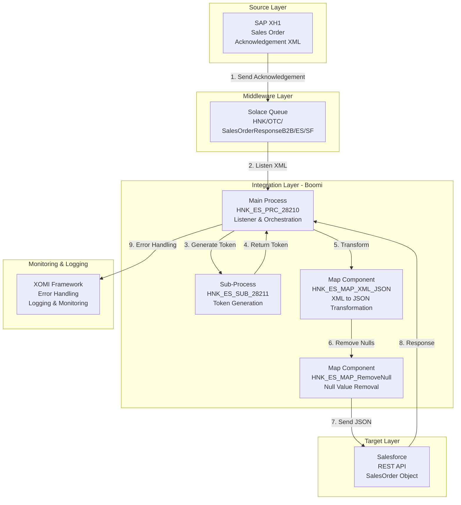
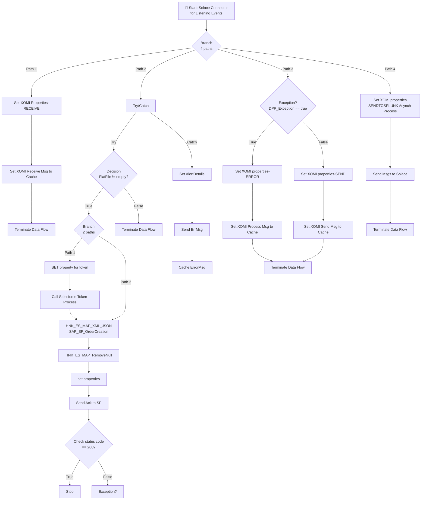
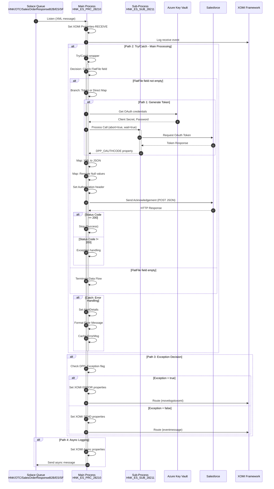
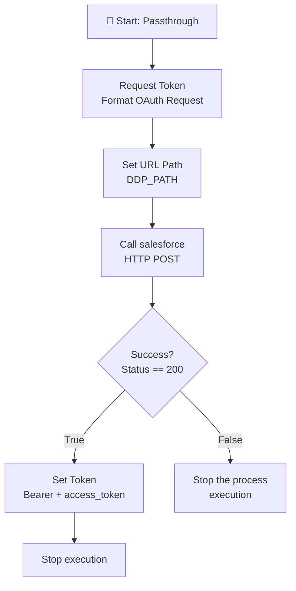
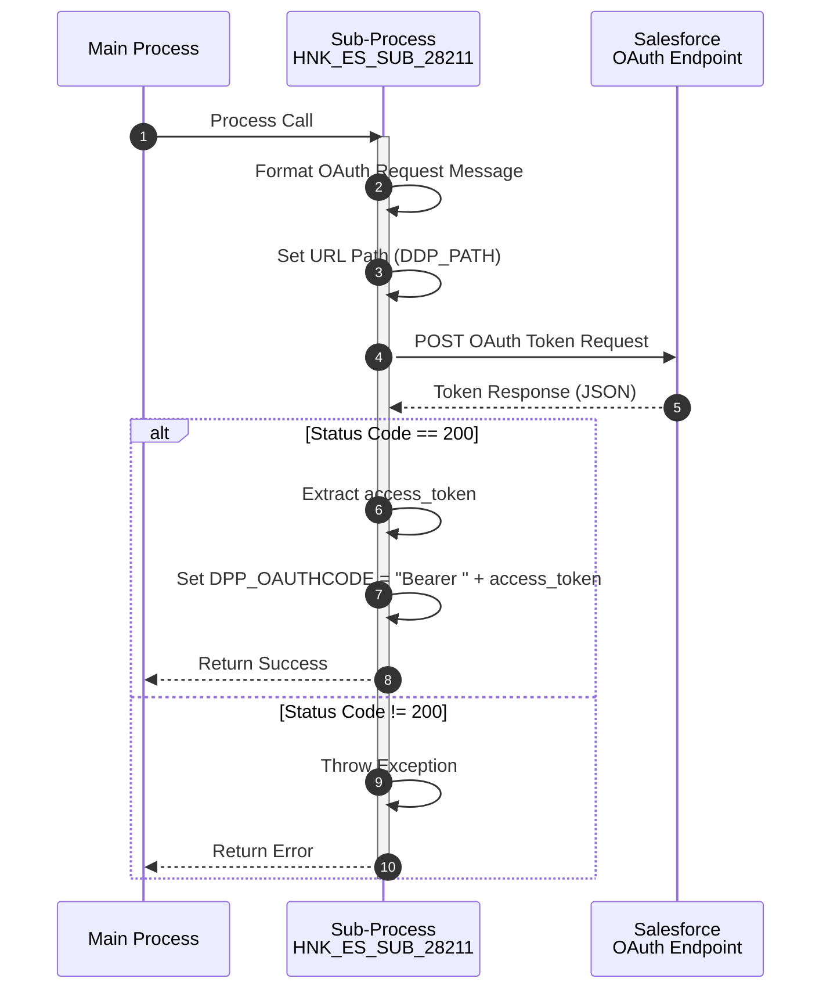

# HNK_ES_PRC_28210_SAPXH1_Salesforce_OrderAck - Boomi Technical Design

**Project:** HNK_ES_PRC_28210_SAPXH1_Salesforce_OrderAck  
**Process ID:** `171fae98-c932-46b6-9fca-12ddc8cde07b`  
**Processing:** Event-driven (Solace listener)  
**Source File:** `171fae98-c932-46b6-9fca-12ddc8cde07b.xml`  
**Generated:** 2026-01-27

---

## 1. Overview

### 1.1 Process Description

This interface is contunation of process 28200 will send Acknowledgement from SAP XH1 to Salesforce.

### 1.2 Integration Scope

| Aspect | Details |
|--------|---------|
| **Source System** | SAP XH1 |
| **Source Protocol** | Solace |
| **Source Format** | XML |
| **Target System** | Salesforce |
| **Target Protocol** | HTTP REST API |
| **Target Format** | JSON |

### 1.3 Component Inventory

> **📦 Complete component inventory:** See [`supporting-docs/component-inventory.md`](supporting-docs/component-inventory.md) for detailed inventory of all 18 components including processes, maps, functions, connectors, operations, cross-references, and profiles with element counts.

---

## 2. Architecture

### 2.1 System Interaction Diagram

### 2.2 Process Hierarchy

| Process | Type | Source File | Shapes |
|---------|------|-------------|--------|
| HNK_ES_PRC_28210_SAPXH1_Salesforce_OrderAck | Main | `171fae98-c932-46b6-9fca-12ddc8cde07b.xml` | 31 |
| HNK_ES_SUB_28211_SF_TokenGeneration | Sub | `36d64309-124c-49a0-8417-bf393a8c24b9.xml` | 8 |

---

## 3. Flow Documentation

### 3.1 Process: HNK_ES_PRC_28210_SAPXH1_Salesforce_OrderAck

**Process ID:** `171fae98-c932-46b6-9fca-12ddc8cde07b`  
**Source File:** `171fae98-c932-46b6-9fca-12ddc8cde07b.xml`  
**Allow Simultaneous:** true  
**Description:** This interface is contunation of process 28200 will send Acknowledgement from SAP XH1 to Salesforce.

#### Shape Count Verification
- **XML shapes:** 31
- **Documented:** 31
- **Status:** ✅ MATCH

#### Flow Diagram

#### Sequence Diagram

#### Step-by-Step Execution

| Step | Shape ID | Type | Label | Action | Next |
|------|----------|------|-------|--------|------|
| 1 | shape1 | start | Solace Connector for Listening Events | Listen for messages from Solace queue (HNK/OTC/SalesOrderResponseB2B/ES/SF) using operation HNK_ES_OPR_SAP_Salesforce_Order. Mode: PERSISTENT_TRANSACTED, batchSize: 1, maxConcurrentExecutions: 1, receiveTimeout: 10000ms. Tracking: KeyTransactionDataID from VBELN field. | shape12 |
| 2 | shape12 | branch | Branch | Branch to 4 parallel execution paths: (1) XOMI receive logging, (2) Main processing with error handling, (3) Exception decision logic, (4) Async logging to Splunk | shape37(1), shape2(2), shape19(3), shape25(4) |
| 3 | shape37 | documentproperties | Set XOMI Properties-RECEIVE | Set XOMI framework properties: DPP_FWK_BusinessProcess and DPP_FWK_Subprocess from cross-reference lookup (InterfaceNumber=28210), DPP_FWK_EntityType=SalesOrderSpain, DPP_FWK_EntityId=VBELN_ACKID (concatenated from profile fields), DPP_FWK_Stage=receive, DPP_FWK_Message="Message from Solace XH1 to Salesforce", DPP_FWK_CountryCodeISO=ES, DPP_FWK_LogXOMI from defined parameter, DPP_FWK_XOMIrouteKey=eventmessage | shape15 |
| 4 | shape15 | processroute | Set XOMI Receive Msg to Cache | Call XOMI Processing route ([FWK] XOMI Processing) with routeKey parameter from DPP_FWK_XOMIrouteKey process property. abort=false, wait=true ensures completion before proceeding | shape14 |
| 5 | shape14 | stop | Terminate Data Flow | Terminate process execution (continue=true allows other paths to complete) | END |
| 6 | shape2 | catcherrors | Try/Catch | Wrap main processing in error handling: catchAll=true to catch all exceptions, retryCount=0 (no retries). Try path executes main logic, Catch path handles exceptions | shape3(Try), shape16(Catch) |
| 7 | shape3 | decision | Decision | Check if FlatFile profile field (SKU;WEEK;YEAR;NOTUSED;VOLUME;CUSTOMERLEV2;DESACTION;PROMOVOL) is not equal to empty string. True path continues processing, False path terminates | shape28(True), shape8(False) |
| 8 | shape8 | stop | Terminate Data Flow | Terminate process execution when FlatFile field is empty (continue=true) | END |
| 9 | shape28 | branch | Branch | Branch to 2 parallel paths: (1) Generate OAuth token, (2) Direct mapping path | shape40(1), shape4(2) |
| 10 | shape40 | documentproperties | SET property for token | Set OAuth properties: DPP_OAuthPath from defined parameter TokenPath, DPP_OAuthGrantType from defined parameter grant_type, DPP_OAuthClientID from defined parameter client_id, DPP_OAuthClientSecret from Azure Key Vault connector (client_secret_alias), DPP_OAuthUserName from defined parameter username, DPP_OAuthPWD from Azure Key Vault connector (password_alias) | shape32 |
| 11 | shape32 | processcall | Call Salesforce Token Process | Invoke sub-process HNK_ES_SUB_28211_SF_TokenGeneration (ID: 36d64309-124c-49a0-8417-bf393a8c24b9). abort=true stops process on error, wait=true waits for completion. Returns DPP_OAUTHCODE process property | shape4 |
| 12 | shape4 | map | HNK_ES_MAP_XML_JSON_SAP_SF_OrderCreation | Transform XML profile (HNK_ES_PRF_XML_SAPXH1_SalesOrder) to JSON profile (HNK_ES_PRF_JSON_SF_SalesOrder_Ack). Map ID: 7795da3f-b322-4738-a8fd-636736ccf92a. Includes 12 field mappings and 7 function steps | shape38 |
| 13 | shape38 | map | HNK_ES_MAP_RemoveNull | Remove null values from JSON document. Map ID: 2bdae992-5e41-44df-8744-23dc3e353065. Maps same profile to itself with 14 field mappings | shape34 |
| 14 | shape34 | documentproperties | set properties | Set dynamic document properties: Authorization header from DPP_OAUTHCODE process property (prefixed with "Bearer "), DDP_PATH from defined parameter SF_SalesOrder_Path | shape9 |
| 15 | shape9 | connectoraction | Send Ack to SF | Send JSON document to Salesforce using HTTP connector (HNK_ES_CON_HTTP_Salesforce). Operation: HNK_ES_OPR_Salesforce_OrderAck (POST, application/json, Authorization header from dynamic document property, path from DDP_PATH) | shape10 |
| 16 | shape10 | decision | Check status code | Compare HTTP response status code (meta.base.applicationstatuscode) with static value "200". True path indicates success, False path indicates error | shape11(True), shape35(False) |
| 17 | shape11 | stop | Stop | Terminate process execution successfully (continue=true) | END |
| 18 | shape35 | exception | Exception? | Throw exception with message from meta.base.applicationstatusmessage. stopProcessReturnSingleDoc=false, stopsingledoc=true stops single document processing | END |
| 19 | shape16 | documentproperties | Set AlertDetails | Set error alert properties: DPP_Exception=true, DPP_AlertMailSubject="Error in Boomi Interface SAP XH1 to Salesforce Ack", DPP_AlertMailBody="Error during Process Execution", DDP_LogKey=1 | shape17 |
| 20 | shape17 | message | Send ErrMsg | Format error message: `<ErrorMessage><MessageText>{try/catch message}</MessageText></ErrorMessage>`. Parameter {1} from meta.base.catcherrorsmessage | shape18 |
| 21 | shape18 | doccacheload | Cache ErrorMsg | Store formatted error message in document cache (ID: 70586e06-2db1-4885-8331-88cd9bc539c9) for later retrieval and logging | END |
| 22 | shape19 | decision | Exception? | Evaluate if exception occurred: Compare process property DPP_Exception with static value "true". True path routes to error logging, False path routes to success logging | shape21(True), shape20(False) |
| 23 | shape21 | documentproperties | Set XOMI properties-ERROR | Configure XOMI error logging properties: DPP_FWK_Stage=process, DPP_FWK_Final=true, DPP_FWK_XOMIrouteKey=movelogstoxomi, DPP_FWK_Status=error | shape23 |
| 24 | shape23 | processroute | Set XOMI Process Msg to Cache | Call XOMI Processing route ([FWK] XOMI Processing) with routeKey=movelogstoxomi to move error logs to XOMI system. abort=false, wait=true ensures completion | shape24 |
| 25 | shape20 | documentproperties | Set XOMI properties-SEND | Configure XOMI success logging properties: DPP_FWK_Stage=send, DPP_FWK_Final from defined parameter 28210_PP_FWK_TransactionFinal, DPP_FWK_XOMIrouteKey=eventmessage | shape22 |
| 26 | shape22 | processroute | Set XOMI Send Msg to Cache | Call XOMI Processing route ([FWK] XOMI Processing) with routeKey=eventmessage to log successful processing event. abort=false, wait=true ensures completion | shape24 |
| 27 | shape24 | stop | Terminate Data Flow | Terminate process execution (continue=true allows other paths to complete) | END |
| 28 | shape25 | documentproperties | Set XOMI properties-SENDTOSPLUNK(Asynch Process) | Configure XOMI async logging properties: DPP_FWK_XOMIrouteKey=sendtosolace_asynch, DPP_FWK_NodeId from execution context Node Id, DPP_FWK_MainProcessId from execution context Process Id | shape26 |
| 29 | shape26 | processroute | Send Msg(s) to Solace | Call XOMI Processing route ([FWK] XOMI Processing) with routeKey=sendtosolace_asynch to send async logging message to Solace. abort=false, wait=true ensures completion | shape27 |
| 30 | shape27 | stop | Terminate Data Flow | Terminate process execution (continue=true allows other paths to complete) | END |
| 31 | shape36 | dataprocess | Data Process | Search and replace operation: Find "null," in document and replace with empty string. Process type: Search/Replace, searchType=document | unset |

#### Shape Configuration Details

> **📄 Detailed shape configurations:** See [`supporting-docs/shape-configuration.md`](supporting-docs/shape-configuration.md#31-process-hnk_es_prc_28210_sapxh1_salesforce_orderack) for complete configuration details of all 31 shapes.

### 3.2 Process: HNK_ES_SUB_28211_SF_TokenGeneration

**Process ID:** `36d64309-124c-49a0-8417-bf393a8c24b9`  
**Source File:** `36d64309-124c-49a0-8417-bf393a8c24b9.xml`  
**Allow Simultaneous:** false  
**Description:** Common process to generate token for SF spain for webservice call

#### Shape Count Verification
- **XML shapes:** 8
- **Documented:** 8
- **Status:** ✅ MATCH

#### Flow Diagram

#### Sequence Diagram

#### Step-by-Step Execution

| Step | Shape ID | Type | Label | Action | Next |
|------|----------|------|-------|--------|------|
| 1 | shape1 | start | Passthrough | Passthrough start shape - no action, passes document through | shape3 |
| 2 | shape3 | message | Request Token | Format OAuth token request message: `grant_type={1}&client_id={2}&client_secret={3}&username={4}&password={5}`. Parameters from process properties: DPP_OAuthGrantType, DPP_OAuthClientID, DPP_OAuthClientSecret, DPP_OAuthUserName, DPP_OAuthPWD | shape7 |
| 3 | shape7 | documentproperties | Set URL Path | Set dynamic document property DDP_PATH from process property DPP_OAuthPath | shape2 |
| 4 | shape2 | connectoraction | Call salesforce | Send HTTP POST request to Salesforce OAuth endpoint using connector HNK_ES_CON_HTTP_Salesforce. Operation: HNK_ES_OPR_SF_Common_Token (POST, application/x-www-form-urlencoded, path from DDP_PATH, response profile: JSON) | shape5 |
| 5 | shape5 | decision | Success? | Compare HTTP response status code (meta.base.applicationstatuscode) with static value "200". True path indicates success, False path indicates error | shape10(True), shape6(False) |
| 6 | shape10 | documentproperties | Set Token | Set process property DPP_OAUTHCODE = "Bearer " + access_token from JSON response profile (HNK_ES_PRF_JSON_SF_TokenResponse, element access_token) | shape9 |
| 7 | shape9 | stop | Stop execution | Terminate process execution successfully (continue=true) | END |
| 8 | shape6 | exception | Stop the process execution | Throw exception with message format "{status code}: {status message}". stopsingledoc=true stops single document processing | END |

#### Shape Configuration Details

> **📄 Detailed shape configurations:** See [`supporting-docs/shape-configuration.md`](supporting-docs/shape-configuration.md#32-process-hnk_es_sub_28211_sf_tokengeneration) for complete configuration details of all 8 shapes.

---

## 4. Data Mappings

> **📄 Complete profile structures:** See [`supporting-docs/profile-structures.md`](supporting-docs/profile-structures.md) for detailed field structures, hierarchies, data types, and usage of all 4 profiles.

### 4.1 Map: HNK_ES_MAP_XML_JSON_SAP_SF_OrderCreation

**Map ID:** `7795da3f-b322-4738-a8fd-636736ccf92a`  
**Source File:** `7795da3f-b322-4738-a8fd-636736ccf92a.xml`  
**Source Profile:** `e360e4ae-df0d-44e7-b3c6-93114ba7989f` (HNK_ES_PRF_XML_SAPXH1_SalesOrder - XML)  
**Target Profile:** `3898b817-d961-43ec-ab67-319dab8cc171` (HNK_ES_PRF_JSON_SF_SalesOrder_Ack - JSON)  
**Optimize Execution Order:** true

#### Mapping Count Verification
- **XML mappings:** 12
- **Documented:** 12
- **Functions:** 7 (5 scripting, 1 user-defined, 1 document property)
- **Status:** ✅ MATCH

#### Field Mappings

| # | Source Field | Source Path | Target Field | Target Path | Type |
|---|--------------|-------------|--------------|-------------|------|
| 1 | Function: Scripting (key=1, output=3) | Function: messageText | orderMessageText | Root/Object/salesOrder/Array/ArrayElement1/Object/orderMessages/Array/ArrayElement1/Object/orderMessageText | Function |
| 2 | Function: Scripting (key=2, output=8) | Function: deliveryBlock | fieldValue | Root/Object/salesOrder/Array/ArrayElement1/Object/lineItems/Array/ArrayElement1/Object/localFields/Array/ArrayElement1[Object/fieldName='deliveryBlock']/Object/fieldValue | Function |
| 3 | Function: Scripting (key=3, output=4) | Function: creditBlock | fieldValue | Root/Object/salesOrder/Array/ArrayElement1/Object/lineItems/Array/ArrayElement1/Object/localFields/Array/ArrayElement1[Object/fieldName='creditBlock']/Object/fieldValue | Function |
| 4 | Function: Get Document Property (key=7, output=3) | Function: DDP_maxvalue | dateTimeTo | Root/Object/salesOrder/Array/ArrayElement1/Object/deliveryDateTime/Array/ArrayElement1/Object/dateTimeTo | Function |
| 5 | ACKID | Envelope/Body/ZHSP_FM_SALES_ORD_CREATE_DETResponse/ACKID | referenceID | Root/Object/salesOrder/Array/ArrayElement1/Object/orderReferenceIDs/Array/ArrayElement1/Object/referenceID | Direct |
| 6 | VBELN | Envelope/Body/ZHSP_FM_SALES_ORD_CREATE_DETResponse/LOG/VBELN | orderNumber | Root/Object/salesOrder/Array/ArrayElement1/Object/orderNumber | Direct |
| 7 | NETWR | Envelope/Body/ZHSP_FM_SALES_ORD_CREATE_DETResponse/LOG/NETWR | itemNetValue | Root/Object/salesOrder/Array/ArrayElement1/Object/lineItems/Array/ArrayElement1/Object/price/Object/itemNetValue | Direct |
| 8 | MWSBK | Envelope/Body/ZHSP_FM_SALES_ORD_CREATE_DETResponse/LOG/MWSBK | totalTaxAmount | Root/Object/salesOrder/Array/ArrayElement1/Object/lineItems/Array/ArrayElement1/Object/price/Object/totalTaxAmount | Direct |
| 9 | TOTWR | Envelope/Body/ZHSP_FM_SALES_ORD_CREATE_DETResponse/LOG/TOTWR | totalAmount | Root/Object/salesOrder/Array/ArrayElement1/Object/lineItems/Array/ArrayElement1/Object/price/Object/totalAmount | Direct |
| 10 | EMPWR | Envelope/Body/ZHSP_FM_SALES_ORD_CREATE_DETResponse/LOG/EMPWR | conditionValue | Root/Object/salesOrder/Array/ArrayElement1/Object/lineItems/Array/ArrayElement1/Object/priceConditions/Array/ArrayElement1/Object/conditionValue | Direct |
| 11 | CMGST | Envelope/Body/ZHSP_FM_SALES_ORD_CREATE_DETResponse/LOG/CMGST | Function Input | Function: Scripting (key=3, input=5) | Function Input |
| 12 | LIFSK | Envelope/Body/ZHSP_FM_SALES_ORD_CREATE_DETResponse/LOG/LIFSK | Function Input | Function: Scripting (key=2, input=7) | Function Input |
| 13 | MESSAGE | Envelope/Body/ZHSP_FM_SALES_ORD_CREATE_DETResponse/MESSAGELOG/item/MESSAGE | Function Input | Function: Scripting (key=1, input=1) | Function Input |
| 14 | EDATU | Envelope/Body/ZHSP_FM_SALES_ORD_CREATE_DETResponse/SCHEDULE/itemLog/EDATU | Function Input | Function: HNK_HS_UDF_SalesOrderSimulate_ShipmentDate (key=6, input=1) | Function Input |

#### Transformation Functions

> **📚 Complete function documentation:** See [`supporting-docs/function-reference.md`](supporting-docs/function-reference.md) for detailed documentation of all transformation functions.

#### Default Values

| Target Field | Default Value |
|--------------|---------------|
| referenceSystem | SAP |
| priceConditionType | empties |

---

### 4.2 Map: HNK_ES_MAP_RemoveNull

**Map ID:** `2bdae992-5e41-44df-8744-23dc3e353065`  
**Source File:** `2bdae992-5e41-44df-8744-23dc3e353065.xml`  
**Source Profile:** `3898b817-d961-43ec-ab67-319dab8cc171` (HNK_ES_PRF_JSON_SF_SalesOrder_Ack - JSON)  
**Target Profile:** `3898b817-d961-43ec-ab67-319dab8cc171` (HNK_ES_PRF_JSON_SF_SalesOrder_Ack - JSON)  
**Optimize Execution Order:** true

#### Mapping Count Verification
- **XML mappings:** 14
- **Documented:** 14
- **Functions:** 0
- **Status:** ✅ MATCH

#### Field Mappings

| # | Source Field | Source Path | Target Field | Target Path | Type |
|---|--------------|-------------|--------------|-------------|------|
| 1 | orderNumber | Root/Object/salesOrder/Array/ArrayElement1/Object/orderNumber | orderNumber | Root/Object/salesOrder/Array/ArrayElement1/Object/orderNumber | Direct |
| 2 | referenceID | Root/Object/salesOrder/Array/ArrayElement1/Object/orderReferenceIDs/Array/ArrayElement1/Object/referenceID | referenceID | Root/Object/salesOrder/Array/ArrayElement1/Object/orderReferenceIDs/Array/ArrayElement1/Object/referenceID | Direct |
| 3 | referenceSystem | Root/Object/salesOrder/Array/ArrayElement1/Object/orderReferenceIDs/Array/ArrayElement1/Object/referenceSystem | referenceSystem | Root/Object/salesOrder/Array/ArrayElement1/Object/orderReferenceIDs/Array/ArrayElement1/Object/referenceSystem | Direct |
| 4 | orderMessageText | Root/Object/salesOrder/Array/ArrayElement1/Object/orderMessages/Array/ArrayElement1/Object/orderMessageText | orderMessageText | Root/Object/salesOrder/Array/ArrayElement1/Object/orderMessages/Array/ArrayElement1/Object/orderMessageText | Direct |
| 5 | dateTimeTo | Root/Object/salesOrder/Array/ArrayElement1/Object/deliveryDateTime/Array/ArrayElement1/Object/dateTimeTo | dateTimeTo | Root/Object/salesOrder/Array/ArrayElement1/Object/deliveryDateTime/Array/ArrayElement1/Object/dateTimeTo | Direct |
| 6 | fieldName | Root/Object/salesOrder/Array/ArrayElement1/Object/lineItems/Array/ArrayElement1/Object/localFields/Array/ArrayElement1/Object/fieldName | fieldName | Root/Object/salesOrder/Array/ArrayElement1/Object/lineItems/Array/ArrayElement1/Object/localFields/Array/ArrayElement1/Object/fieldName | Direct |
| 7 | fieldValue | Root/Object/salesOrder/Array/ArrayElement1/Object/lineItems/Array/ArrayElement1/Object/localFields/Array/ArrayElement1/Object/fieldValue | fieldValue | Root/Object/salesOrder/Array/ArrayElement1/Object/lineItems/Array/ArrayElement1/Object/localFields/Array/ArrayElement1/Object/fieldValue | Direct |
| 8 | fieldValue (deliveryBlock) | Root/Object/salesOrder/Array/ArrayElement1/Object/lineItems/Array/ArrayElement1/Object/localFields/Array/ArrayElement1[Object/fieldName='deliveryBlock']/Object/fieldValue | fieldValue (deliveryBlock) | Root/Object/salesOrder/Array/ArrayElement1/Object/lineItems/Array/ArrayElement1/Object/localFields/Array/ArrayElement1[Object/fieldName='deliveryBlock']/Object/fieldValue | Direct |
| 9 | fieldValue (creditBlock) | Root/Object/salesOrder/Array/ArrayElement1/Object/lineItems/Array/ArrayElement1/Object/localFields/Array/ArrayElement1[Object/fieldName='creditBlock']/Object/fieldValue | fieldValue (creditBlock) | Root/Object/salesOrder/Array/ArrayElement1/Object/lineItems/Array/ArrayElement1/Object/localFields/Array/ArrayElement1[Object/fieldName='creditBlock']/Object/fieldValue | Direct |
| 10 | itemNetValue | Root/Object/salesOrder/Array/ArrayElement1/Object/lineItems/Array/ArrayElement1/Object/price/Object/itemNetValue | itemNetValue | Root/Object/salesOrder/Array/ArrayElement1/Object/lineItems/Array/ArrayElement1/Object/price/Object/itemNetValue | Direct |
| 11 | totalTaxAmount | Root/Object/salesOrder/Array/ArrayElement1/Object/lineItems/Array/ArrayElement1/Object/price/Object/totalTaxAmount | totalTaxAmount | Root/Object/salesOrder/Array/ArrayElement1/Object/lineItems/Array/ArrayElement1/Object/price/Object/totalTaxAmount | Direct |
| 12 | totalAmount | Root/Object/salesOrder/Array/ArrayElement1/Object/lineItems/Array/ArrayElement1/Object/price/Object/totalAmount | totalAmount | Root/Object/salesOrder/Array/ArrayElement1/Object/lineItems/Array/ArrayElement1/Object/price/Object/totalAmount | Direct |
| 13 | priceConditionType | Root/Object/salesOrder/Array/ArrayElement1/Object/lineItems/Array/ArrayElement1/Object/priceConditions/Array/ArrayElement1/Object/priceConditionType | priceConditionType | Root/Object/salesOrder/Array/ArrayElement1/Object/lineItems/Array/ArrayElement1/Object/priceConditions/Array/ArrayElement1/Object/priceConditionType | Direct |
| 14 | conditionValue | Root/Object/salesOrder/Array/ArrayElement1/Object/lineItems/Array/ArrayElement1/Object/priceConditions/Array/ArrayElement1/Object/conditionValue | conditionValue | Root/Object/salesOrder/Array/ArrayElement1/Object/lineItems/Array/ArrayElement1/Object/priceConditions/Array/ArrayElement1/Object/conditionValue | Direct |

#### Default Values

None

---

## 5. Connector Settings

> **🔌 Complete connector settings:** See [`supporting-docs/connector-settings.md`](supporting-docs/connector-settings.md) for detailed documentation of all connections, operations, and cross-reference tables.

---

## 6. Zero Data Loss Validation

> **📋 Complete verification checklist:** See [`supporting-docs/verification-checklist.md`](supporting-docs/verification-checklist.md) for detailed file-by-file reconciliation, count summaries, configuration completeness, and zero data loss certification.

---
