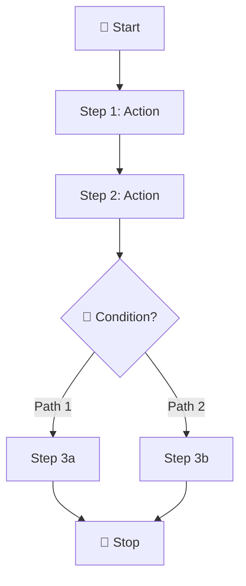
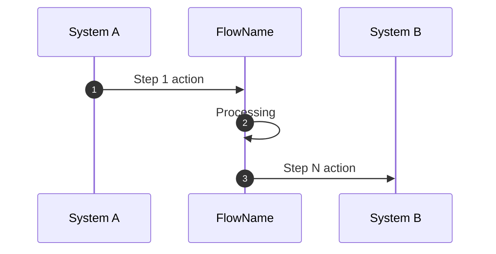

# Boomi Documentation Output Formats

**Purpose**: Standard documentation formats for each component type.  
**Author**: Cheppali Shaik Sohail  
**Version**: 4.0.0

---

## Field Inventory Format (RGV Step 2)

Before generating ANY table, the agent MUST create an inventory:

```markdown
**RGV Inventory:** {N} {element_type} in XML. Generating exactly {N} rows.
```

Examples:
```markdown
**RGV Inventory:** 18 shapes in XML. Generating exactly 18 rows.
**RGV Inventory:** 161 mappings in XML. Generating exactly 161 rows.
**RGV Inventory:** 49 fields in XML. Generating exactly 49 rows.
```

After generation, emit micro-checkpoint:
```markdown
✅ {section}: {name} — {generated}/{expected} {type}
```

---

## Flow Table Format

```markdown
| Step | Shape | Type | Action | Next |
|------|-------|------|--------|------|
| 1 | shape1 | start | Listen from {source} | shape2 |
| 2 | shape2 | map | Transform: {mapName} | shape3 |
| 3 | shape3 | branch | {condition} | shape4, shape5 |
| 4 | shape4 | documentproperties | Set: DPP_Property = {source} | shape5 |
| 5 | shape5 | processroute | Route to: {processName} | shape6 |
| 6 | shape6 | processcall | Call: {subProcessName} | shape7 |
| 7 | shape7 | message | Create message: {template} | shape8 |
| 8 | shape8 | dataprocess | Split by: {element} | shape9 |
```

---

## Mapping Table Format

```markdown
| Source Field | Target Field | Transformation |
|--------------|--------------|----------------|
| path.to.source | path.to.target | Direct |
| field1 + field2 | combined | Concat |
| code | description | Lookup: tableName |
| field | target | Function: udfName |
```

---

## Document Properties Format

```markdown
| Property | Source Type | Source Value | Purpose |
|----------|-------------|--------------|---------|
| DPP_FWK_BusinessProcess | CrossRef Lookup | XOMI_GetDetails.BusinessProcess | Route classification |
| DPP_FWK_EntityId | Profile Element | Nodes/Id (key 104) | Entity identifier |
| DPP_FWK_NodeId | Execution | Node Id | Runtime tracking |
```

---

## Transform Function Format

```markdown
### 4.x Function: {FunctionName}

**Purpose:** {Description from bns:description}  
**Inputs:** {Input names from <Inputs>}  
**Outputs:** {Output names from <Outputs>}

#### Function Steps
| Step | Type | Category | Purpose | Configuration |
|------|------|----------|---------|---------------|
| 1 | PropertyGet | ProcessProperty | Get DPP_Opco | Property: DPP_Opco |
| 2 | CrossRefLookup | Lookup | Lookup country code | Table: uuid, Input: Opco → Output: CountryCode |
| 3 | StringConcat | String | Build product ID | Delimiter: "-", Inputs: CountryCode + MaterialID |

#### Internal Mappings
| From Step | From Output | To Step | To Input |
|-----------|-------------|---------|----------|
| Step 1 | Result | Step 2 | Opco |
| Step 2 | CountryCode | Step 3 | Countrycode |
```

---

## Process Property Set Format

```markdown
### 4.x Process Properties: {PropertySetName}

**Purpose:** OAuth/API configuration for {process}

| Property | Type | Default Value | Purpose |
|----------|------|---------------|---------|
| TokenPath | string | services/oauth2/token | OAuth token endpoint |
| grant_type | string | password | OAuth grant type |
| client_id | string | {value} | OAuth client identifier |
| username | string | {value} | Service account |
| password_alias | string | {alias} | Password secret reference |
| client_secret_alias | string | {alias} | Client secret reference |
| API_Path | string | services/apexrest/... | Target API endpoint |
```

---

## XSLT Format

```markdown
### 4.x XSLT: {XSLTName}

**Purpose:** {Description}  
**Used In:** {Process/Step where referenced}

#### Transformation Logic
- Input: {source format}
- Output: {target format}
- Key transformations:
  - {transformation 1}
  - {transformation 2}
```

---

## Web Service Format

```markdown
### 4.x Web Service: {ServiceName}

**URL Path:** {urlPath}  
**Type:** REST / SOAP  
**Version:** {version}

#### Endpoints
| Operation | Process ID | Description |
|-----------|------------|-------------|
| {operationName} | {processId} | {description} |

#### SOAP Configuration (if applicable)
- WSDL Service: {wsdlServiceName}
- SOAP Version: {SOAP_1_1 / SOAP_1_2}
```

---

## Diagram Patterns

### Flow Diagram (Section 3.x)


### Sequence Diagram (Section 2 & 3.x)


---

## Component Count Validation Table

```markdown
| Component Type | Expected | Documented | Status |
|----------------|----------|------------|--------|
| process | {n} | {n} | ✅/⚠️ |
| transform.map | {n} | {n} | ✅/⚠️ |
| transform.function | {n} | {n} | ✅/⚠️ |
| profile.xml | {n} | {n} | ✅/⚠️ |
| profile.json | {n} | {n} | ✅/⚠️ |
| profile.flatfile | {n} | {n} | ✅/⚠️ |
| crossref | {n} | {n} | ✅/⚠️ |
| processproperty | {n} | {n} | ✅/⚠️ |
| xslt | {n} | {n} | ✅/⚠️ |
| webservice | {n} | {n} | ✅/⚠️ |
```

---

## Unknown Element Format

```markdown
### 4.x Unknown Component: {ComponentName}

**Type:** {UNKNOWN_TYPE} (⚠️ New component type)  
**Component ID:** {uuid}  

#### Key Elements Identified
| Element | Purpose (inferred) | Value/Reference |
|---------|-------------------|-----------------|
| {element1} | {guess purpose} | {value} |

> ⚠️ **Note:** New component type. May require manual review.
```
