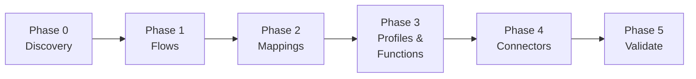

# Boomi Documentation Agent - Rules Index

**Version:** 4.1.0 | **Updated:** April 2026

---

## 4-File Lean Architecture

| # | File | Purpose | Priority |
|---|------|---------|----------|
| 1 | `Boomi_Documentation.mdc` | **MAIN ENTRY** - RISEN, 6-phase overview, RGV definition | HIGHEST |
| 2 | `00_Phase_Orchestration.mdc` | 6-phase workflow, per-section RGV loops, checkpoints | HIGH |
| 3 | `01_Guidance.mdc` | RGV loop (DRY source), field inventory, extraction patterns | HIGH |
| 4 | `02_Mandatory_Stop_Points.mdc` | RGV self-check, anti-patterns, output separation rules | HIGHEST |

---

## Supporting Files

| File | Purpose |
|------|---------|
| `lib/docs/template-configuration.md` | Supporting doc format specifications |
| `lib/docs/xml-patterns-reference.md` | Detailed XML element patterns |
| `lib/docs/field-extraction-checklist.md` | Extraction checklist |
| `lib/docs/documentation-formats.md` | Output format reference |
| `templates/documentation-style.yaml` | Declarative output configuration |
| `templates/documentation-template-guide.md` | Complete format guide |
| `examples/01_pricing_sync/` | **REFERENCE** - Complete example output |

---

## 6-Phase Workflow

---

## Key Rules

1. **RGV Loop** — Read → Inventory → Generate → Verify → Fix → Checkpoint (defined in `08-01 §1`)
2. **Field Inventory** — Count elements, COMMIT to N, generate N rows, VERIFY N (defined in `08-01 §2`)
3. **Section-Atomic** — Each section is independent; must pass verification before proceeding
4. **Forensic extraction** — Read XML directly, extract ALL attributes
5. **Continuous processing** — Never ask to continue between phases; micro-checkpoints per section
6. **Verification in supporting docs** — NO count verification blocks in main document
7. **Complete mapping tables** — ALL rows in main doc, NEVER summarize
8. **`<thinking>` Blocks** — Structured reasoning before every phase/section output
9. **Evidence-Bound** — Every extraction cites XML source file and element
10. **Confidence Calibration** — HIGH/MEDIUM/LOW for every output

---

## Version History

| Version | Date | Changes |
|---------|------|---------|
| v4.1 | Apr 2026 | LLM behavioral gap countermeasures: `<thinking>` blocks, Confidence Calibration, Evidence-Bound, Tree of Thought, Constitutional Principles, Anti-Autopilot, Contradiction Handling, Graceful Degradation, Input Sanitization |
| v4.0 | Feb 2026 | 6-phase RGV architecture, per-section Read-Generate-Verify loops, field inventory, micro-checkpoints, DRY |
| v3.2 | Feb 2026 | Lean 4-file architecture, DRY refactor, output separation |

---

**V4.1** | 6-Phase RGV Architecture | DRY | Section-Atomic | LLM Gap Countermeasures
