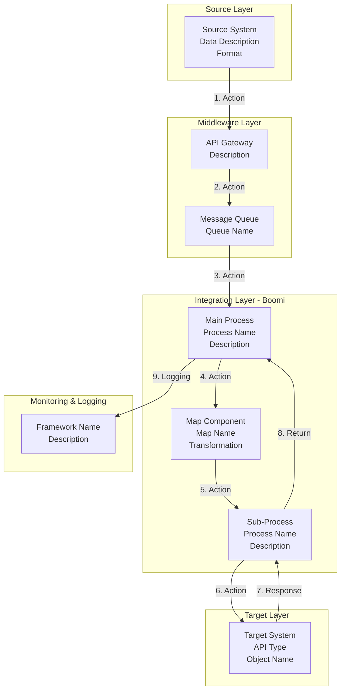
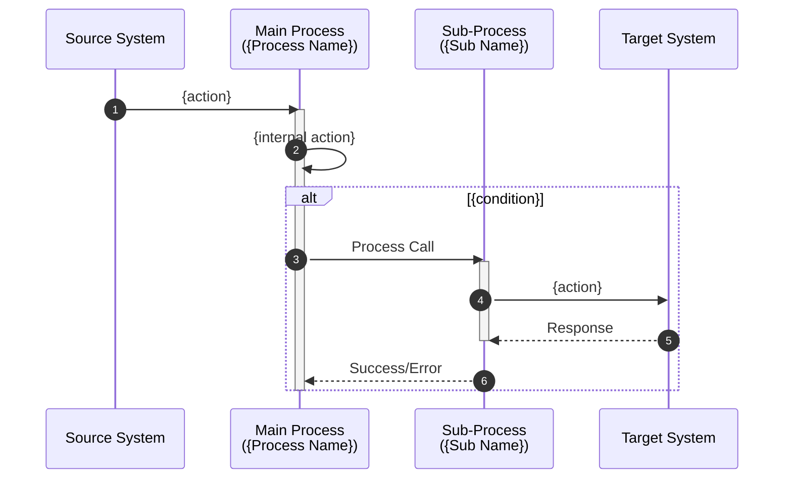

# Boomi Technical Design Template Guide V3.1

**Purpose:** Zero Assumption Documentation - A developer must recreate EXACT functionality from this documentation  
**Author:** Cheppali Shaik Sohail  
**Version:** 3.1.0

---

## Core Principle

> **Document what EXISTS in the XML, not what you ASSUME**

Every element extracted must:
1. Have a source reference (file name)
2. Be verified by count
3. Include complete configuration
4. Be reproducible by a developer

---

## Output Structure

### Modular Output (RECOMMENDED)

```
project/output_boomi/
└── {flow_number}/                           # Subfolder per Boomi flow (e.g., 13020)
    ├── boomi_design_{flow_name}.md    # Main document (compact)
    ├── supporting-docs/
    │   ├── component-inventory.md         # Section 1.3 details
    │   ├── shape-configuration.md         # Section 3 shape configs
    │   ├── function-reference.md          # Section 4 functions
    │   ├── profile-structures.md          # Section 4 profiles
    │   ├── connector-settings.md          # Section 5 details
    │   └── verification-checklist.md      # Section 6 verification
    └── .boomi-state.json                  # State for resume
```

**Naming Convention:**
- **Subfolder:** `{flow_number}` — process number only (e.g., `HNK_US_PRC_13020_...` → `13020`)
- **Main document:** `boomi_design_{flow_name}.md` — descriptive name (e.g., `boomi_design_13020_PRICE_LIST.md`)

### Reference Format

Use blockquote format to reference supporting documents:

```markdown
> **📄 Complete details:** See [`supporting-docs/component-inventory.md`](supporting-docs/component-inventory.md) for detailed inventory.
```

---

## Document Structure Overview

| # | Section | Purpose | Progressive Phase |
|---|---------|---------|-------------------|
| 1 | **Overview** | Process ID, description, scope | Phase 0 |
| 2 | **Architecture** | System diagram, hierarchy | Phase 0 |
| 3 | **Flow Documentation** | Per-process diagrams, steps & configs | Phase 1 |
| 4 | **Data Mappings** | Per-map fields & functions | Phase 2 |
| 5 | **Connector Settings** | Connections, operations, properties | Phase 2 |
| 6 | **Validation** | Zero data loss proof | Phase 3 |

---

## Section 1: Overview

### Template

```markdown
# {Process Name} - Boomi Technical Design

**Project:** {Description from bns:description - EXACT TEXT}  
**Process ID:** `{componentId}`  
**Processing:** {Event-driven/Batch/Real-time}  
**Source File:** `{uuid}.xml`  
**Generated:** {current date}

---

## 1. Overview

### 1.1 Process Description

{EXACT text from <bns:description> element - do NOT paraphrase}

### 1.2 Integration Scope

| Aspect | Details |
|--------|---------|
| **Source System** | {extracted from XML} |
| **Source Protocol** | {Solace/HTTP/File/etc.} |
| **Source Format** | {XML/JSON/etc.} |
| **Target System** | {extracted from XML} |
| **Target Protocol** | {HTTP/Queue/etc.} |
| **Target Format** | {JSON/XML/etc.} |

### 1.3 Component Inventory

> **📦 Complete component inventory:** See [`supporting-docs/component-inventory.md`](supporting-docs/component-inventory.md) for detailed inventory of all {n} components including processes, maps, functions, connectors, operations, cross-references, and profiles with element counts.
```

---

## Section 2: Architecture

### Template (Use graph TB with subgraphs)

```markdown
## 2. Architecture

### 2.1 System Interaction Diagram



### 2.2 Process Hierarchy

| Process | Type | Source File | Shapes |
|---------|------|-------------|--------|
| {Main Process Name} | Main | `{uuid}.xml` | {n} |
| {Sub-Process 1} | Sub | `{uuid}.xml` | {n} |
```

---

## Section 3: Flow Documentation

### IMPORTANT: Order of Elements

For each process, use this order:
1. Shape Count Verification
2. **Flow Diagram** (BEFORE steps)
3. **Sequence Diagram** (BEFORE steps)
4. Step-by-Step Execution
5. Shape Configuration Details (reference to supporting doc)

### Template (Repeat for EACH process)

```markdown
## 3. Flow Documentation

### 3.{x} Process: {Process Name}

**Process ID:** `{componentId}`  
**Source File:** `{uuid}.xml`  
**Description:** {from bns:description}

#### Shape Count Verification
- **XML shapes:** {count from XML}
- **Documented:** {count in table below}
- **Status:** ✅ MATCH

#### Flow Diagram

```mermaid
flowchart TD
    Start[🔵 Start: {label}] --> Branch{Branch<br/>{n} paths}
    
    Branch -->|Path 1| Step1[{label}]
    Step1 --> Step2[{label}]
    Step2 --> End1[End]
    
    Branch -->|Path 2| TryCatch[Try/Catch]
    TryCatch -->|Try| ProcessCall[Process Call<br/>Sub-process]
    TryCatch -->|Catch| ErrorHandler[Error Handling]
    
    Branch -->|Path 3| Decision{Decision?}
    Decision -->|True| TruePath[{label}]
    Decision -->|False| FalsePath[{label}]
```

#### Sequence Diagram



#### Step-by-Step Execution

| Step | Shape ID | Type | Label | Action | Next |
|------|----------|------|-------|--------|------|
| 1 | shape1 | start | {userlabel} | {action details with configuration} | shape2 |
| 2 | shape2 | branch | {userlabel} | {action with all paths listed} | shape3(1), shape4(2) |
| 3 | shape3 | documentproperties | {userlabel} | {action with property details} | shape5 |

#### Shape Configuration Details

> **📄 Detailed shape configurations:** See [`supporting-docs/shape-configuration.md`](supporting-docs/shape-configuration.md#3x-process-name) for complete configuration details of all {n} shapes.
```

---

## Section 4: Data Mappings

### Template

```markdown
## 4. Data Mappings

> **📄 Complete profile structures:** See [`supporting-docs/profile-structures.md`](supporting-docs/profile-structures.md) for detailed field structures, hierarchies, data types, and usage of all {n} profiles.

### 4.{x} Map: {Map Name}

**Map ID:** `{componentId}`  
**Source File:** `{uuid}.xml`  
**Source Profile:** `{profileId}` ({Profile Name} - {Type})  
**Target Profile:** `{profileId}` ({Profile Name} - {Type})

#### Mapping Count Verification
- **XML mappings:** {count}
- **Documented:** {count}
- **Functions:** {count}
- **Status:** ✅ MATCH

#### Field Mappings

| # | Source Field | Source Path | Target Field | Target Path | Type |
|---|--------------|-------------|--------------|-------------|------|
| 1 | {name} | {path} | {name} | {path} | Direct |
| 2 | - | Function: {name} (key={n}) | {name} | {path} | Function |
| 3 | {name} | {path} | Function Input | Function: {name} (key={n}, input={n}) | Function Input |

#### Transformation Functions

> **📚 Complete function documentation:** See [`supporting-docs/function-reference.md`](supporting-docs/function-reference.md) for detailed documentation of all transformation functions.

#### Default Values

| Target Field | Default Value |
|--------------|---------------|
| {path} | {value} |
```

---

## Section 5: Connector Settings

### Template

```markdown
## 5. Connector Settings

> **🔌 Complete connector settings:** See [`supporting-docs/connector-settings.md`](supporting-docs/connector-settings.md) for detailed documentation of all connections, operations, and cross-reference tables.
```

---

## Section 6: Validation

### Template

```markdown
## 6. Zero Data Loss Validation

> **📋 Complete verification checklist:** See [`supporting-docs/verification-checklist.md`](supporting-docs/verification-checklist.md) for detailed file-by-file reconciliation, count summaries, configuration completeness, and zero data loss certification.
```

---

## Supporting Document Templates

### component-inventory.md

```markdown
# {Process Name} - Component Inventory

**Referenced from:** `../boomi_design_{flow_name}.md` Section 1.3  
**Generated:** {date}

---

## Component Inventory

| # | File | Type | Name | ID | Elements |
|---|------|------|------|----|----------|
| 1 | `{uuid}.xml` | process | {name} | `{uuid}` | {n} shapes |
| 2 | `{uuid}.xml` | transform.map | {name} | `{uuid}` | {n} mappings |

**Component Summary:**
- **Processes:** {n} (total shapes: {n})
- **Maps:** {n} (total mappings: {n})
- **Functions:** {n}
- **Connectors:** {n}
- **Operations:** {n}
- **Cross References:** {n}
- **Profiles:** {n}
```

### shape-configuration.md

```markdown
# {Process Name} - Shape Configurations

**Referenced from:** `../boomi_design_{flow_name}.md` Section 3  
**Generated:** {date}

---

## 3.x Process: {Process Name} - Shape Configurations

### Shape: {userlabel} (ID: {shape_id})
**Type:** {shapetype}

| Setting | Value |
|---------|-------|
| **Setting Name** | {value} |

### Shape: {userlabel} (ID: {shape_id})
**Type:** documentproperties

| Property | Property ID | Source Type | Source Value |
|----------|-------------|-------------|--------------|
| {name} | {id} | {static/crossref/track} | {value} |
```

### function-reference.md

```markdown
# {Process Name} - Function Reference

**Referenced from:** `../boomi_design_{flow_name}.md` Section 4  
**Generated:** {date}

---

## Function Reference

### Function: {Function Name} (Key: {n})

**Function ID:** `{uuid}`  
**Type:** User Defined Function  
**Description:** {from bns:description}

**Inputs:**

| Key | Name | Source |
|-----|------|--------|
| 1 | {name} | {path} |

**Outputs:**

| Key | Name | Target |
|-----|------|--------|
| 1 | {name} | {path} |

**Function Steps:**

| Step | Type | Name | Configuration |
|------|------|------|---------------|
| 1 | {type} | {name} | {config details} |

**Logic:** {description of what the function does}
```

---

## Progressive Document Updates

The agent MUST build the document progressively:

| Phase | Action | Content Added |
|-------|--------|---------------|
| 0 | CREATE main document | Header, Sections 1-2 |
| 1 | APPEND to main document | Section 3 |
| 2 | APPEND to main document | Sections 4-5 |
| 3 | APPEND to main document | Section 6 |

At each phase, CREATE supporting documents as needed:
- Phase 0: `component-inventory.md`
- Phase 1: `shape-configuration.md`
- Phase 2: `function-reference.md`, `profile-structures.md`, `connector-settings.md`
- Phase 3: `verification-checklist.md`

---

## Validation Checklist

Before finalizing documentation:

- [ ] Section 1: Process ID and description from XML (not paraphrased)
- [ ] Section 2: Architecture diagram uses graph TB with subgraphs
- [ ] Section 3: Diagrams appear BEFORE step-by-step execution
- [ ] Section 3: Every process has shape count verification
- [ ] Section 4: Every map has mapping count verification
- [ ] Section 5: Reference to supporting document
- [ ] Section 6: Reference to verification checklist
- [ ] All supporting documents created in supporting-docs/
- [ ] All references use blockquote format with links
- [ ] No custom colors on Mermaid diagrams

---

## Example Reference

| Example | Purpose |
|---------|---------|
| `examples/01_pricing_sync/01_pricing_sync_technical_design.md` | Complete technical design document (Example 1) |
| `examples/01_pricing_sync/supporting-docs/` | All supporting documents (Example 1) |
| `examples/02_order_ack/02_order_ack_technical_design.md` | Order Acknowledgment example (Example 2) |
| `examples/02_order_ack/supporting-docs/` | Supporting documents (Example 2) |

These examples demonstrate the new modular output structure.

---

## Supporting Document Content Patterns

> **CRITICAL:** Study examples in `examples/01_pricing_sync/supporting-docs/` and `examples/02_order_ack/supporting-docs/` before creating any supporting document. Output MUST match example format EXACTLY.

### component-inventory.md Content Pattern

**Header Format:**
```markdown
# {Process Name} - Component Inventory

**Referenced from:** `../boomi_design_{flow_name}.md` Section 1.3  
**Generated:** {date}
```

**Component Table:**
- Columns: `# | File | Type | Name | ID | Elements`
- File format: Backtick-wrapped `{uuid}.xml`
- ID format: Backtick-wrapped `{uuid}`
- Elements format: `{n} shapes` or `{n} mappings` or `{n} fields` (be specific)
- Include ALL components: processes, maps, functions, connectors, operations, cross-references, profiles, process properties

**Component Summary (REQUIRED):**
```markdown
**Component Summary:**
- **Processes:** {n} (total shapes: {n})
- **Maps:** {n} (total mappings: {n})
- **Functions:** {n}
- **Connectors:** {n}
- **Operations:** {n}
- **Cross References:** {n}
- **Profiles:** {n} ({types breakdown}, total fields: {n})
- **Process Properties:** {n}  # if present
```

**Footer Reference:**
```markdown
> **📄 Complete profile structures:** See [`profile-structures.md`](profile-structures.md) for detailed field structures, hierarchies, and usage of all {n} profiles.
```

**Critical Patterns:**
- ✅ Include total shape count in Component Summary
- ✅ Include total mapping count in Component Summary
- ✅ Include profile type breakdown (JSON, XML, Flat File)
- ✅ Include total field count across all profiles
- ❌ DO NOT skip Component Summary section

---

### shape-configuration.md Content Pattern

**Header Format:**
```markdown
# {Process Name} - Shape Configurations

**Referenced from:** `../boomi_design_{flow_name}.md` Section 3  
**Generated:** {date}
```

**Per-Process Section:**
```markdown
## 3.x Process: {Process Name} - Shape Configurations
```
- Anchor format: `#3x-process-name-lowercase-with-hyphens` (for linking from main doc)

**Shape Entry Format:**
```markdown
### Shape: {userlabel} (ID: {shape_id})
**Type:** {shapetype}
```

**Configuration Tables by Shape Type:**

**start shape:**
```markdown
| Setting | Value |
|---------|-------|
| **Action Type** | Listen / Passthrough |
| **Connector Type** | {connector type} |
| **Connection ID** | `{uuid}` |
| **Operation ID** | `{uuid}` |
| **Allow Dynamic Credentials** | NONE / {value} |
```

**documentproperties shape:**
```markdown
| Property | Property ID | Source Type | Source Value |
|----------|-------------|-------------|--------------|
| {name} | {id} | static / crossref / track / execution / profile | {value or description} |
```
- Source Type values: `static`, `crossref`, `track`, `execution`, `profile`
- For crossref: Show lookup details (e.g., "HNK_GLO_CRT_XOMI_GetDetails (InterfaceNumber=28360) → BusinessProcess")
- For profile: Show field path (e.g., "senderId (Root/Object/senderId) from profile `{uuid}`")

**branch shape:**
```markdown
| Branch | Target Shape | Description |
|--------|--------------|-------------|
| 1 | shape10 | Message Shape path |
| 2 | shape16 | Try/Catch path |
```

**catcherrors shape:**
```markdown
| Setting | Value |
|---------|-------|
| **Catch All** | true / false |
| **Retry Count** | {n} |
| **Try Path** | shape35 (Process Call) |
| **Catch Path** | shape37 (set error msg) |
```

**processcall shape:**
```markdown
| Setting | Value |
|---------|-------|
| **Process ID** | `{uuid}` |
| **Process Name** | {name} |
| **Abort on Error** | true / false |
| **Wait for Completion** | true / false |
| **Return Paths** | Error → shape25 |
```

**decision shape:**
```markdown
| Setting | Value |
|---------|-------|
| **Comparison Type** | equals / wildcard / etc. |
| **Left Value** | process.DPP_Exception / meta.base.applicationstatuscode / etc. |
| **Right Value** | static: "true" / static: "200" / etc. |
| **True Path** | shape22 (Set XOMI properties-ERROR) |
| **False Path** | shape21 (Set XOMI properties-SEND) |
```

**map shape:**
```markdown
| Setting | Value |
|---------|-------|
| **Map ID** | `{uuid}` |
| **Map Name** | {name} |
```

**connectoraction shape:**
```markdown
| Setting | Value |
|---------|-------|
| **Action Type** | Send / Receive |
| **Connector Type** | {connector type} |
| **Connection ID** | `{uuid}` |
| **Operation ID** | `{uuid}` |
| **Request Profile** | `{uuid}` ({name}) |
| **Allow Dynamic Credentials** | NONE / {value} |
```

**dataprocess shape:**
```markdown
| Step | Process Type | Name | Configuration |
|------|--------------|------|---------------|
| 1 | 9 (Combine) | Combine Documents | profileType: none |
| 2 | 1 (Search/Replace) | Search/Replace | texttofind: `{pattern}`, replacewith: "{value}" |
```

**message shape:**
```markdown
| Setting | Value |
|---------|-------|
| **Message Template** | {full template with {parameter} placeholders} |
```
- Include complete message template with all parameters

**exception shape:**
```markdown
| Setting | Value |
|---------|-------|
| **Message** | {exception message} |
| **Stop Process Return Single Doc** | true / false |
| **Stop Single Doc** | true / false |
```

**returndocuments shape:**
```markdown
| Setting | Value |
|---------|-------|
| **Label** | Error / Success / etc. |
```

**processroute shape:**
```markdown
| Setting | Value |
|---------|-------|
| **Route ID** | resource::rout:{uuid} |
| **Route Name** | {route name} |
| **Wait for Completion** | true / false |
| **Abort on Error** | true / false |
| **Route Parameter** | {parameter name} |
```

**Critical Patterns:**
- ✅ Document EVERY shape in the process
- ✅ Use appropriate table format for each shape type
- ✅ Include ALL configuration details (don't skip any settings)
- ✅ Show complete property assignments for documentproperties shapes
- ✅ Include message templates with parameter placeholders
- ✅ Show all branch paths with descriptions
- ❌ DO NOT use generic "Configuration" table for all shapes

---

### function-reference.md Content Pattern

**Header Format:**
```markdown
# {Process Name} - Function Reference

**Referenced from:** `../boomi_design_{flow_name}.md` Section 4  
**Generated:** {date}
```

**Function Entry Format:**
```markdown
### Function: {Function Name} (Key: {n})

**Function ID:** `{uuid}`  
**Type:** User Defined Function / Scripting / Get Document Property  
**Description:** {from bns:description}  # if present
```

**Inputs Table:**
```markdown
**Inputs:**

| Key | Name | Source |
|-----|------|--------|
| 1 | {name} | {full path from profile root} |
```

**Outputs Table:**
```markdown
**Outputs:**

| Key | Name | Target |
|-----|------|--------|
| 1 | {name} | {full path to target profile} |
```

**Function Steps Table (CRITICAL):**
```markdown
**Function Steps:**

| Step | Type | Name | Configuration |
|------|------|------|---------------|
| 1 | PropertyGet | Get Dynamic Process Property | Property: DPP_DistributorID |
| 2 | StringSplit | String Split | Delimiter: "-", Outputs: Appid, distid |
| 3 | StringConcat | String Concat | Delimiter: "-", Inputs: Country_code (default: ESID), Distribut_id, PriceListkey |
```

**Logic Description:**
```markdown
**Logic:** {description of what the function does - explain the transformation logic}
```

**Critical Patterns:**
- ✅ Include Function Steps table with COMPLETE configuration for each step
- ✅ Show step execution order (Step 1, 2, 3...)
- ✅ Include all step configuration details (delimiters, defaults, lookup tables, etc.)
- ✅ For scripting functions: Include complete code in Logic section
- ✅ For cross-reference lookups: Show table ID and lookup key
- ❌ DO NOT skip Function Steps table
- ❌ DO NOT use generic "See XML" - extract all details

---

### profile-structures.md Content Pattern

**Header Format:**
```markdown
# {Process Name} - Profile Structures

**Referenced from:** `../boomi_design_{flow_name}.md` Section 4  
**Generated:** {date}
```

**Profile Inventory Table:**
```markdown
## Profile Inventory

| # | Profile ID | Name | Type | File | Fields |
|---|------------|------|------|------|--------|
| 1 | `{uuid}` | {name} | JSON / XML / Flat File | `{uuid}.xml` | {n} fields |
```

**Per-Profile Section:**
```markdown
## {n}. Profile: {Profile Name}

**Profile ID:** `{uuid}`  
**Type:** JSON / XML / Flat File  
**Source File:** `{uuid}.xml`  
**Strict Mode:** true / false  
**Encoding:** utf8  # if applicable  
**Usage:** {where profile is used - e.g., "Source profile for Map X"}
```

**Structure Tree (REQUIRED):**
```markdown
### Structure Tree

```
Root (character, key=1)
└── Object (key=2)
    ├── field1 (character, key=3, required)
    └── field2 (character, key=4, required)
```
```
- Show visual hierarchy with indentation
- Include key numbers, data types, minOccurs, maxOccurs
- Use tree structure with └── and ├── characters

**Field Summary Table:**
```markdown
### Field Summary

| Level | Field Count | Types |
|-------|-------------|-------|
| Root | 1 | character |
| Arrays | 2 | repeating elements |
| Objects | 3 | nested structures |
| Leaf Fields | 27 | character (all) / character (45), number (4) |
```

**Field Details Table (REQUIRED - ALL FIELDS):**
```markdown
### Field Details

| Key | Name | Path | Data Type | Min Occurs | Max Occurs | Mappable | Required |
|-----|------|------|-----------|------------|------------|----------|----------|
| 1 | Root | Root | character | - | - | ✅ | - |
| 2 | Object | Root/Object | - | - | - | ❌ | - |
| 3 | field1 | Root/Object/field1 | character | 0 | 1 | ✅ | ✅ |
```
- Include ALL fields, not just mapped ones
- Show complete field hierarchy
- Include data types, constraints, mappable flags

**Mapped Fields Table (for target profiles only):**
```markdown
### Mapped Fields

| Field | Mapping # | Source Field |
|-------|-----------|--------------|
| HNK_IsActive__c | 1 | status |
| HNK_UnitPrice__c | 2 | unitPrice |
```

**Usage Notes:**
```markdown
### Usage Notes

- **fieldName** (key=n): Used in {context} for {purpose}
- **Special handling:** {any special notes}
```

**Profile Usage Summary (at end of document):**
```markdown
## Profile Usage Summary

| Profile | Used In | Purpose |
|---------|---------|---------|
| {name} | {component} | {purpose} |
```

**Footer:**
```markdown
**Total Profile Fields:** {n} fields across {n} profiles  
**Profile Types:** {n} JSON, {n} XML, {n} Flat File
```

**Critical Patterns:**
- ✅ Include Structure Tree visualization for EVERY profile
- ✅ Include Field Details table with ALL fields (not just mapped ones)
- ✅ Show complete field paths from root
- ✅ Include data types, minOccurs, maxOccurs, mappable flags
- ✅ Include Field Summary showing hierarchy levels
- ✅ For target profiles, include Mapped Fields table
- ❌ DO NOT skip unmapped fields
- ❌ DO NOT use generic "See XML" - extract all field details

---

### connector-settings.md Content Pattern

**Header Format:**
```markdown
# {Process Name} - Connector Settings

**Referenced from:** `../boomi_design_{flow_name}.md` Section 5  
**Generated:** {date}
```

**Section Heading:**
```markdown
## 5. Connector Settings
```

**Per-Connection Entry:**
```markdown
### 5.{n} Connection: {Connection Name}

**Connection ID:** `{uuid}`  
**Type:** {Connector Type}  
**Source File:** `{uuid}.xml`

| Setting | Value |
|---------|-------|
| **Username** | {value} |
| **Password** | [ENCRYPTED] |
| **URL** | {value} |
| **Message VPN** | {value} |
| **SMF Host** | {value} |
| **API Token** | [ENCRYPTED] |
| **Custom Property: {name}** | {value} / [ENCRYPTED] |
```
- Mask ALL credentials as `[ENCRYPTED]`
- Include ALL connection properties
- Include custom properties if present

**Per-Operation Entry:**
```markdown
### 5.{n} Operation: {Operation Name}

**Operation ID:** `{uuid}`  
**Type:** {Operation Type}  
**Source File:** `{uuid}.xml`

| Setting | Value |
|---------|-------|
| **Operation Type** | Listen / Send / etc. |
| **Mode** | PERSISTENT_TRANSACTED / etc. |
| **Destination** | {queue/topic name} |
| **Batch Size** | {n} |
| **Receive Timeout** | {n} ms |
| **Maximum Concurrent Executions** | {n} |
| **Object Action** | upsert / insert / etc. |
| **Object Name** | {object name} |
| **External ID Field** | {field name} |
| **Use Bulk API** | true / false |
| **Bulk API Version** | v2 |
| **Request Profile** | `{uuid}` ({name}) |
```

**For Salesforce Operations - Object Fields Table:**
```markdown
**Salesforce Object Fields:**

| Field Name | Data Type | Custom | Enabled | Nillable |
|------------|-----------|--------|---------|----------|
| Id | character | false | true | false |
| HNK_IsActive__c | boolean | false | true | false |
```

**Per-Cross-Reference Entry:**
```markdown
### 5.{n} Cross Reference: {Cross Ref Name}

**Cross Ref ID:** `{uuid}`  
**Source File:** `{uuid}.xml`

**Note:** Cross-reference table contains {n} rows in export. Table is used for lookup operations.

**Columns:** {comma-separated list}

**Usage:** Lookup by {key field} ({value}) to retrieve {output fields}.
```

**Critical Patterns:**
- ✅ Mask ALL credentials as `[ENCRYPTED]`
- ✅ Include ALL connection and operation settings
- ✅ Include custom properties
- ✅ For Salesforce operations, include Object Fields table
- ✅ For cross-references, note row count and usage
- ❌ DO NOT expose actual credential values

---

### verification-checklist.md Content Pattern

**Header Format:**
```markdown
# {Process Name} - Zero Data Loss Verification Checklist

**Referenced from:** `../boomi_design_{flow_name}.md` Section 6  
**Generated:** {date}
```

**Section Heading:**
```markdown
## 6. Zero Data Loss Validation
```

**File-by-File Reconciliation:**
```markdown
### 6.1 File-by-File Reconciliation

| # | XML File | Component | Type | XML Elements | Documented | Status |
|---|----------|-----------|------|--------------|------------|--------|
| 1 | `{uuid}.xml` | {name} | process | {n} shapes | {n} | ✅ |
| 2 | `{uuid}.xml` | {name} | transform.map | {n} mappings | {n} | ✅ |
```

**Include Notes for Missing Files:**
```markdown
**Note:** Function `{name}` (ID: `{uuid}`) is referenced in Map `{map_id}` but XML file is not present in export. Function inputs/outputs documented from map reference.
```

**Count Summary:**
```markdown
### 6.2 Count Summary

| Category | XML Count | Documented | Status |
|----------|-----------|------------|--------|
| **Processes** | {n} | {n} | ✅ |
| **Shapes (total)** | {n} | {n} | ✅ |
| **Maps** | {n} | {n} | ✅ |
| **Mappings (total)** | {n} | {n} | ✅ |
| **Functions** | {n} | {n} | ✅ |
| **Connectors** | {n} | {n} | ✅ |
| **Operations** | {n} | {n} | ✅ |
| **Cross References** | {n} | {n} | ✅ |
| **Profiles** | {n} | {n} | ✅ |
| **Profile Fields** | {n} | {n} | ✅ |
```

**Configuration Completeness:**
```markdown
### 6.3 Configuration Completeness

| Detail Type | Documented | Status |
|-------------|------------|--------|
| **Decision shape logic** | {n}/{n} | ✅ |
| **Message templates** | {n}/{n} | ✅ |
| **Document property assignments** | {n}/{n} | ✅ |
| **Process call settings** | {n}/{n} | ✅ |
| **Connector action details** | {n}/{n} | ✅ |
| **Function configurations** | {n}/{n} | ✅ |
| **Map field mappings** | {n}/{n} | ✅ |
| **Cross-reference lookups** | {n}/{n} | ✅ |
```

**Certification Box (REQUIRED - ASCII Art):**
```markdown
### 6.4 Certification

╔═══════════════════════════════════════════════════════════════╗
║           ZERO DATA LOSS CERTIFICATION                        ║
╠═══════════════════════════════════════════════════════════════╣
║  ✅ All {n} XML files processed                                ║
║  ✅ All {n} shapes documented with configurations              ║
║  ✅ All {n} mappings documented at field level                ║
║  ✅ All {n} functions documented with complete logic          ║
║  ✅ All {n} connectors documented with settings               ║
║  ✅ All {n} operations documented with configurations          ║
║  ✅ File-by-file reconciliation complete                      ║
╠═══════════════════════════════════════════════════════════════╣
║  RESULT: ZERO DATA LOSS - DOCUMENTATION COMPLETE              ║
╚═══════════════════════════════════════════════════════════════╝
```

**Footer:**
```markdown
**Documentation Generated:** {date}  
**Process:** {Process Name}  
**Version:** {version numbers if available}
```

**Critical Patterns:**
- ✅ Include Certification box with ASCII art (DO NOT skip)
- ✅ Show file-by-file reconciliation with status checkmarks
- ✅ Include count summary with all categories
- ✅ Include configuration completeness check
- ✅ Use ✅ for match, ⚠️ for mismatch
- ❌ DO NOT skip Certification box
- ❌ DO NOT use plain text instead of ASCII box

---

## Critical Output Patterns Summary

### Main Document Patterns
1. **Header:** Project (exact text), Process ID, Processing type, Source File, Generated date
2. **Section 1.1:** EXACT text from XML description - NO paraphrasing
3. **Section 2.1:** graph TB with 5 subgraphs (Source, Middleware, Integration, Target, Monitoring)
4. **Section 3:** Diagrams BEFORE step-by-step execution table
5. **Shape Count Verification:** Required for every process
6. **Mapping Count Verification:** Required for every map
7. **Field Mappings:** Show function inputs separately with "Function Input" type

### Supporting Document Patterns
1. **component-inventory.md:** Component Summary with all counts (REQUIRED)
2. **shape-configuration.md:** Complete configuration tables for ALL shapes
3. **function-reference.md:** Function Steps table with complete configuration (REQUIRED)
4. **profile-structures.md:** Structure Tree, Field Summary, Field Details for ALL fields
5. **connector-settings.md:** Mask credentials as [ENCRYPTED]
6. **verification-checklist.md:** Certification box with ASCII art (REQUIRED)

### Reference Patterns
- ALL references use blockquote: `> **{icon} {title}:** See [`{path}`]({path})`
- Relative paths: `supporting-docs/{filename}.md`
- Anchor links: `#3x-process-name-lowercase-with-hyphens`
