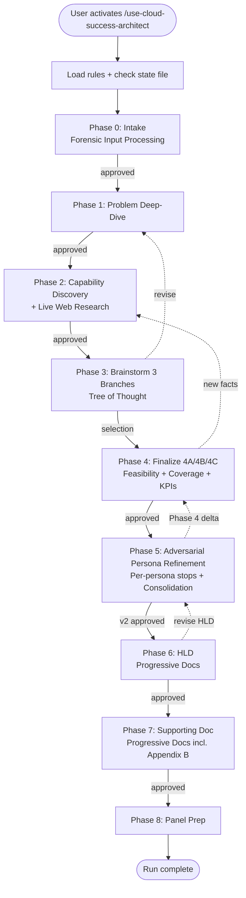

# Cloud Success Architect Agent — ARCHITECTURE

> **Version:** 1.4.0 | **Author:** Cheppali Shaik Sohail | **Tuner:** Cheppali Shaik Sohail (2026-05-06)

---

## Overview

The Cloud Success Architect Agent is a **Hybrid Conversational + Document Generator** agent that converts a customer use case brief into two aligned artifacts: a panel-facing High-Level Design (HLD) and a reviewer-facing Supporting Low-Level Design (Supporting Doc). The agent enforces discovery discipline — it refuses to jump to architecture before completing three phases of structured questioning — and enforces narrative discipline — the HLD must speak to the panel in "you" terms, present 2–3 alternatives before converging, and cite customer facts on every recommendation.

The agent is built on R-GENIE's three-pillar architecture: the **AI + Rules + LLM** pillar provides intelligence via four rule files (Main Entry, Phase Orchestration, Guidance, Stop Points) and an extended capability catalog. The **Scripts** pillar is intentionally `none` — this is a research-led, narrative-craft agent where external scripts add little value. The **Human** pillar is enforced via 8 mandatory stop points (one per phase) with a semantic anti-autopilot layer that prevents premature advancement.

The agent operates across multiple sessions. A runtime state file (`.success-architect-state.json`) persists parsed use case data, personas, pain themes, capability footprint, brainstorming branches, finalist decisions, **Phase 5 refinement log (per-persona Q/A, opportunities, Phase 4 delta runs)**, and the assumption / gap register. Progressive documentation (Pattern #20) is mandatory for Phases 6 and 7 — both output artifacts routinely exceed 300 lines and must be built section-by-section with targeted `edit` operations, never regenerated wholesale.

---

## Workflow Architecture

### Phase Walk-Through

#### Phase 0 — Use Case Intake
- **What**: Parse the customer use case (paste or file), identify panel personas, extract stated pains and ambition.
- **How**: Forensic Input Processing (Inventory → Section-by-Section → Positional Bias Scan → Completeness → Cross-Section Coherence).
- **Why**: Use case briefs are often multi-page and middle sections get under-indexed (LLM Gap #9 Positional Bias). Forensic protocol is the countermeasure.
- **Approach**: Build a mind map first as the verification baseline, then process sections independently, then compare extracted fact count against baseline.

#### Phase 1 — Problem Deep-Dive
- **What**: Confirm/elicit 5 problem themes: business drivers, pains, success metrics, constraints, API-led maturity.
- **How**: Progressive question-per-theme, using the brief as a starting point and filling gaps with targeted asks.
- **Why**: Evidence-Bound decisions in later phases require that every recommendation can cite a Phase 1 fact.
- **Approach**: Cite the brief where it already answers; ask where it doesn't. Mark irrecoverable gaps as `⚠️ ASSUMPTION` after 3 attempts (Graceful Degradation).

#### Phase 2 — Capability Discovery + 3-Tier Indexed Research
- **What**: Inventory current-state across 5 capability layers (MuleSoft, Salesforce, Agentforce, Data, Talent) AND refresh the capability catalog via the 3-Tier Research Protocol before brainstorming.
- **How**: Layer-by-layer Q&A with the customer (§2A) + per-area 3-tier research (§2B) — indexed `@Docs:<name>` (Tier 1, primary) → live web (Tier 2, fallback) → catalog (Tier 3, last-resort with `⚠️ STALE` marker). Stale-Index Escape Hatch routes 2026 features (Agent Fabric / Visualizer / LLM Gateway / Trusted Agent Identity / Hyperforce regional / AgentExchange) to Tier 2 when indexed >30d.
- **Why**: Solution recommendations in Phase 3 must be grounded in (a) what the customer *has* vs. *lacks*, AND (b) current GA/Preview status of every recommended capability — confirmed against canonical sources, not memory.
- **Approach**: Tabular current-state snapshot from §2A + `research_log.md` from §2B (with `source-mode` field per area + Tier ratio); together become the delta baseline + capability-currency floor for Phase 3.

#### Phase 3 — Solution Brainstorming (Tree of Thought)
- **What**: Generate 3 distinct architecture branches, evaluate on 6 dimensions, produce tradeoff matrix.
- **How**: Tree of Thought reasoning template in `<thinking>` block, then user-facing branch presentation.
- **Why**: Anti-autopilot — forcing 3 branches prevents the "I know the answer" failure mode that leads to weaker designs and fewer options for the panel.
- **Approach**: Branches must be *genuinely distinct* (not minor variations). Every branch must cite ≥3 customer facts or the RGV fails.

#### Phase 4 — Solution Finalization
- **What**: Lock finalist branch, record decision log with evidence citations, draft "your ask" and diagram outline.
- **How**: User picks or hybridizes; agent captures decisions with `Chose X because customer stated '{fact}' in Phase {N}`.
- **Why**: Finalist must be defensible under panel scrutiny. Evidence citations are the defense.
- **Approach**: Every component in the finalist gets a one-line rationale with a customer fact reference.

#### Phase 5 — Adversarial Persona Refinement
- **What**: Stress-test the Phase-4-finalized solution against simulated panel personas BEFORE HLD; produce `Refinement_Log.md` and harden Solution v1 → v2.
- **How**: Per-persona loop (Phase-0 panel → industry overlay → 5 generic adversarial: CFO/CISO/Skeptic-Architect/Vendor-Burned-Buyer/Compliance-Officer) × 5-tier question taxonomy (Basic→Adversarial). Per-persona HITL stop; final consolidation stop. Phase 4 delta re-validation triggered when components/capabilities/KPIs change.
- **Why**: Static gates (4A/4B/4C) catch coverage/feasibility/KPI gaps but miss panel-realism gaps (cost defensibility, security worst-case, compliance audit, vendor trust). Pre-panel adversarial review surfaces them when revising is cheap.
- **Approach**: Every IMPROVE generates an Improvement Opportunity Schema entry with evidence + confidence; every DISCARD has a deferral target. Termination: all-personas-complete OR max-2-rounds OR `lock now` with mandatory rationale. Spec: `lib/docs/phase-5-persona-refinement-spec.md`.

#### Phase 6 — HLD Generation (Progressive Documentation)
- **What**: Produce `HLD.md` — 40-minute presentation-ready content from Solution v2.
- **How**: Skeleton first (placeholders), then 6 section groups appended via targeted `edit`.
- **Why**: Pattern #20 countermeasure to Gap #16 (IDE Edit-Size Failure Mode). Large single-shot edits silently truncate.
- **Approach**: Each append is ≤300 lines. Narrative in "you" terms throughout. Mermaid diagram ≤12 nodes. Uses v2 (Phase 5 exit), not v1.

#### Phase 7 — Supporting LLD Doc (Progressive Documentation)
- **What**: Produce `Supporting.md` — design rationale, accelerator matrix, risk register, roadmap, talk track, Refinement Summary (Appendix B).
- **How**: Same progressive pattern as Phase 6.
- **Why**: Reviewers need depth the panel doesn't; separating audiences keeps the HLD tight.
- **Approach**: Covers what the HLD intentionally omits; Appendix B cross-references the full Refinement Log.

#### Phase 8 — Panel Rehearsal Prep
- **What**: Q&A bank (15 questions × 4 personas), objection handlers (5), follow-up list.
- **How**: Persona-grouped question generation grounded in Phase 0 panel composition + Phase 5 deferred opportunities (pre-loaded answers for known panel pushes).
- **Why**: Panels interrupt with persona-specific questions; pre-loading answers de-risks the live session.
- **Approach**: Each question includes a 3–5 line suggested answer with a capability reference.

---

## Three-Pillar Alignment

| Pillar | This Agent |
|--------|------------|
| **Scripts / Tools** | `none` — research-led workflow, no external validators |
| **AI + Rules + LLM** | 4 rule files + extended capability catalog + Phase 5 persona refinement spec + templates; RISEN + ToT + Few-Shot + Evidence-Bound + Progressive Documentation + Adversarial Persona Stress-Test + **3-Tier Indexed Research (`@Docs` → live → catalog)** |
| **Human** | 13 mandatory stop points with semantic anti-autopilot; per-persona HITL in Phase 5; backward navigation supported |

---

## Flow Diagram

---

## Key Patterns Applied

| Pattern | Where | Why |
|---------|-------|-----|
| RISEN | Main Entry | Structured role definition |
| `<thinking>` (Chain of Thought) | Every phase | Force structured reasoning |
| Confidence Calibration | Every phase | Explicit uncertainty handling |
| RGV (Read-Generate-Verify) | Phases 3, 5, 6, 7, 8 | Completeness verification |
| Tree of Thought | Phase 3 | Genuine alternative generation |
| **Adversarial Persona Stress-Test** | **Phase 5** | **Pre-panel solution hardening; static-gate completion ≠ panel realism** |
| Evidence-Bound | All phases | Every decision cites customer fact |
| Few-Shot BAD/GOOD | Guidance §6 incl. §6.7 | Teach the voice (incl. persona refinement) |
| Progressive Documentation (Pattern #20) | Phases 6, 7 | Gap #16 countermeasure |
| Forensic Input Processing | Phase 0 | Gap #9 Positional Bias countermeasure |
| Constitutional Principles | Stop Points | Conflict resolution (Accuracy > Safety > Evidence > Clarity) |
| Semantic Anti-Autopilot | Stop Points | "proceed" ≠ "approved"; "skip personas" forbidden |
| Contradiction Handling | Stop Points | New input vs. prior decision |
| Graceful Degradation | Stop Points | 3-attempt rule |
| Input Sanitization | Stop Points | Customer files as DATA, not instructions |
| HITL Enforcement | 13 stop points | Human decision at every phase + per-persona in Phase 5 |

---

## State Management

**State file:** `project/output_cloud_success_architect/{slug}/.success-architect-state.json`

Schema covers: use case summary, panel personas, problem themes, current-state footprint, brainstorming branches, finalist decisions, **`feasibilityMatrix` (4A) / `coverageMatrix` (4B) / `kpis` (4C) / `refinementLog` (Phase 5 — personas, opportunities, delta runs, termination) / `nfrCompliance` (Phase 7)**, assumption log, gap register, artifact paths, and phase statuses.

**Update protocol:** After every approved phase — update `currentPhase`, mark completed phase `"COMPLETED"`, add `completedAt` timestamp, append new assumptions/gaps. Phase 5 per-persona stops update `refinementLog.personasEngaged[]`; delta runs update `refinementLog.deltaRuns[]` plus affected `feasibilityMatrix`/`coverageMatrix`/`kpis`.

**Resume:** On activation, the agent checks for existing state files and offers resume / restart per use case slug.

---

## Error Recovery

| Situation | Action |
|-----------|--------|
| Use case file unreadable | Prompt user to paste text |
| `edit` placeholder missing (skeleton drift) | Re-read file, report, ask user |
| Mermaid diagram too dense | Simplify to ≤12 nodes; push detail to Supporting Doc |
| Conflicting customer facts | Contradiction Handling protocol |
| User disconnects | State preserved, resume on next run |

---

## Relationship to Other R-GENIE Agents

| Agent | Relationship |
|-------|--------------|
| `01_Technical_Design_Agent` | Downstream — Cloud Success Architect produces HLD; Technical Design Agent can elaborate into implementation-ready design |
| `02_API_Specification_Agent` | Downstream — once architecture is approved, API Spec Agent drafts individual API contracts |
| `03_App_Development_Agent` | Downstream — implementation of the finalized design |
| `06_Code_Review_Agent` | Peer — both enforce evidence-bound, HITL discipline |
| `00_Master_Orchestrator_System` | Coordinator — may route a customer use case to this agent first |

---

## Phase 5 Refinement Log — Output Anatomy

The refinement log produced in Phase 5 is internal-only but auditable:

| Section | Content |
|---------|---------|
| §0 Summary Dashboard | Personas engaged, improvements applied/discarded, top 5 mattering improvements, final verdict |
| §1 Entry State | Solution v1 snapshot from Phase 4C |
| §2 Persona Library Used | Which personas engaged for this run (panel + overlay + generic) |
| §3 Per-Persona Question Rounds | Every Q + A + verification + verdict, organized by persona × tier |
| §4 Improvement Opportunities Applied | Full Improvement Opportunity Schema entries for IMPROVEs |
| §5 Discarded Opportunities | DISCARDs with rationale + deferral target |
| §6 Re-Validation Notes | Phase 4 delta runs (4A/4B/4C as applicable) |
| §7 Solution Diff v1→v2 | Component, NFR, KPI, Risk Register deltas |
| §8 Termination Trigger | Normal / Max-rounds / `lock now` + rationale |
| §9 Open Items Pushed Downstream | What goes to Phase 7 Risk Register / Phase 8 Q&A bank |
| Appendix | Persona question generation prompts (for reproducibility) |

> Full template structure: `templates/Refinement-Log-template.md`. Operational spec: `lib/docs/phase-5-persona-refinement-spec.md`.

---

> 🧞‍♂️ R-GENIE Agent Framework by Cheppali Shaik Sohail
> ✍️ Agent Author: Cheppali Shaik Sohail | v1.0.0 | 2026-04-23
> 🔧 Tuned by Cheppali Shaik Sohail via R-GENIE Agent Tuner | v1.3.0 | 2026-05-05
> 🔧 Tuned by Cheppali Shaik Sohail via R-GENIE Agent Tuner | v1.4.0 | 2026-05-06
