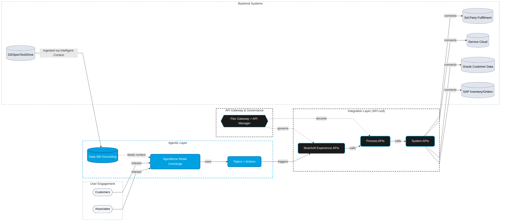

# Retail Personalized Offerings — High-Level Design

> **Prepared for:** Chief Digital Officer, VP of Integration, Director of Architecture, VP of Business Applications
> **Presented by:** R-GENIE Cloud Success Architect
> **Date:** 2026-04-29
> **Duration:** 40-minute presentation + 20-minute Q&A

---

> **📚 EXAMPLE METADATA**
> **Source:** Real CSA session output (retail / personalized-offerings, 2026-04-29).
> **Normalizations applied for example use:** (1) `%%{ init: { 'flowchart': { 'curve': 'linear' } } }%%` directive prepended to §5 mermaid block per `01_Guidance.mdc` §7.6 D2 (straight-line rule). (2) No ` ` → ` ` normalization needed (HLD has 0 instances).
> **Reference for:** Phase 6 §5 architecture-diagram pattern (subgraph dashed-border styling, node-shape vocabulary `[(...)]` / `([...])` / `{{...}}`, action `-->` vs governance `-.->` edges) · "How this works for you" follow-up bullet pattern · `01_Guidance.mdc` §7.7 (Diagram Pattern Recipes).

---

## 1. Executive Summary

We understand your goal is to unlock the agentic era for your retail operations—specifically by providing personalized product recommendations, automating order fulfillment, and offering real-time conversational support. To achieve this, we propose a **Hybrid Trusted Action Layer** architecture. By combining Agentforce Builder on the frontend, Data 360 Intelligent Context for your unstructured data, and MuleSoft API-led connectivity for your transactional backend systems (SAP, Oracle), we can deliver a secure, scalable, and context-aware retail experience.

---

## 2. Why Now — The Agentic Moment

The retail landscape is shifting from static portals to dynamic, conversational agents. Your customers expect instant, personalized interactions, but your current frontend experience is starved of the deep context locked away in S3, OpenText, SAP, and Oracle. 

With the recent general availability of **Agentforce 360** and **Data 360 Intelligent Context**, the barrier to entry for building reasoning AI agents has never been lower. However, an agent is only as good as the actions it can take. By anchoring Agentforce to a MuleSoft integration backbone, you ensure that when an agent promises to fulfill an order, it executes flawlessly against SAP—all within your aggressive 6-month go-live window.

---

## 3. What We Heard From You

- **To the CDO & VP of Business Applications:** You said you need to enhance the customer experience with personalized recommendations and reduce order-fulfillment inquiry volumes by 30%. You want a frontend chat-to-action interface that leverages agent capabilities.
- **To the Director of Architecture:** You said your data is highly fragmented—unstructured documents across AWS S3, Google Drive, and OpenText, and structured data in Oracle. You need a secure way to unify this context while adhering to PCI-DSS/PII compliance.
- **To the VP of Integration:** You said you have a nascent integration footprint and are relying on disparate 3rd-party SaaS systems and SAP for order management. You need to establish a foundational API-led architecture to orchestrate this complexity without starting from scratch.

---

## 4. Aspirational Future State

In 12 months, your retail operations will have transformed from reactive to proactive:
- **For Customers:** A unified, conversational Agentforce interface that instantly recalls their past orders, reads unstructured product manuals to answer complex queries, and processes returns or new orders in real-time.
- **For Operations:** A 30% reduction in manual order-fulfillment inquiries, as Agentforce handles Tier 1 and Tier 2 requests autonomously.
- **For IT:** A robust, reusable library of MuleSoft APIs (accelerated by the Retail templates) that can be easily composed into future Agentforce Actions, turning integration from a bottleneck into a business enabler.

---

## 5. Proposed Architecture

**How this works for you:**
- **Context Generation:** Unstructured documents (PDFs, manuals) from S3 and OpenText are ingested into Data 360 via Intelligent Context, grounding the Agentforce Retail Concierge.
- **Decision & Action:** When a customer asks to fulfill an order, Agentforce uses its Atlas Reasoning engine to trigger a registered Topic/Action.
- **Execution:** That Action calls a governed MuleSoft Experience API, which routes through Process APIs down to the SAP System API to securely execute the transaction.

---

## 6. Key Design Choices & Business Alignment

### Choice 1: Agentforce Builder & Data 360 Intelligent Context
- **What we chose:** Native Salesforce Agentforce platform for the conversational UI, backed by Data 360 vector grounding.
- **Why for you:** You stated a need for a "Frontend chat-to-action interface" and grounding across "AWS S3, Google Drive, and paper document records in OpenText."
- **Business benefit:** Faster time-to-value for personalized recommendations without building a custom chat UI from scratch.

### Choice 2: MuleSoft API-Led Integration for SAP & Oracle
- **What we chose:** MuleSoft CloudHub 2.0 wrapping backend systems in governed System APIs.
- **Why for you:** You must "automate order fulfillment" using "SAP for inventory, order management" securely.
- **Business benefit:** Decouples the fast-moving Agentforce UI from the slow-moving legacy SAP backend, ensuring uptime and compliance (PCI-DSS/PII).

### Choice 3: Anypoint API Experience Hub
- **What we chose:** Publishing MuleSoft APIs directly into Salesforce as Agentforce Actions.
- **Why for you:** Bridges the gap between the VP of Integration's API estate and the CDO's Agentforce vision.
- **Business benefit:** Enables business users to compose new retail use cases rapidly by reusing existing IT-approved API building blocks.

---

## 7. Data Flows

**Flow 1: Personalized Recommendation (The Read Path)**
1. Customer requests a product recommendation via the Agentforce chat interface.
2. Agentforce queries Data 360, which performs a vector search against previously ingested unstructured product manuals (S3/OpenText) and customer history (Oracle).
3. The Atlas Reasoning engine synthesizes the context and returns a highly personalized, accurate recommendation to the customer.

**Flow 2: Automated Order Fulfillment (The Write Path)**
1. Customer confirms they want to purchase the recommended item.
2. Agentforce triggers the "Create Order" Action, passing the necessary parameters.
3. The Action invokes the MuleSoft Order Experience API.
4. MuleSoft orchestrates the request, calling the SAP System API to decrement inventory and create the order, and the 3rd-Party Fulfillment API to initiate shipping.
5. Confirmation is routed back through MuleSoft to Agentforce in real-time.

---

## 8. Accelerators We'll Leverage

| Accelerator | What You Get | Time Compression |
|-------------|--------------|------------------|
| **MuleSoft Accelerator for Retail** | Pre-built APIs, templates, and best practices for SAP ERP, Salesforce OMS, and Service Cloud. | Saves ~4-6 weeks of foundational API development. |
| **Agentforce Service Agent Templates** | Out-of-the-box conversational flows and actions for common retail support inquiries. | Saves ~3 weeks of prompt engineering and bot configuration. |

---

## 9. Roadmap at a Glance

| Horizon | Outcome |
|---------|---------|
| **90 days** | **Foundation & Context:** Ingest S3/OpenText into Data 360; deploy foundational MuleSoft System APIs for SAP (Read-Only). Go-live with Agentforce for basic recommendations. |
| **180 days** | **Transactional Automation:** Deploy SAP Write APIs via MuleSoft; Agentforce handles end-to-end order fulfillment and returns autonomously. |
| **365 days** | **Scale & Compose:** Deploy the remaining 2 Agentforce retail use cases; open the API Experience Hub for internal developer self-service. |

---

## 10. Your Ask of Us / Our Ask of You

**Our ask of you today:**
1. **Commit to a 2-day Discovery Workshop** next week with your Salesforce and Integration teams to map the top 3 Agentforce Actions to the MuleSoft System APIs.
2. **Provide access to sandbox environments** for SAP, Oracle, and a subset of your S3/OpenText documents for our proof-of-value phase.

**What we commit to in return:**
- A detailed, fixed-fee implementation proposal for the first 90-day horizon within 5 days following the workshop.
- Delivery of a functioning Agentforce prototype grounded on your sample data by the end of Month 1.

---

> **For the technical reviewers:** full design rationale, accelerator selection matrix, risk register, and assumption log are in the companion `retail-personalized-offerings_Supporting.md` document.

---

> 🧞‍♂️ R-GENIE Cloud Success Architect Agent by Cheppali Shaik Sohail
> ✍️ Authored with: Cloud Success Architect Agent v1.0.0 | 2026-04-29
> 🔧 Added to agent examples by Cheppali Shaik Sohail via R-GENIE Agent Tuner | v1.6.0 | 2026-05-12