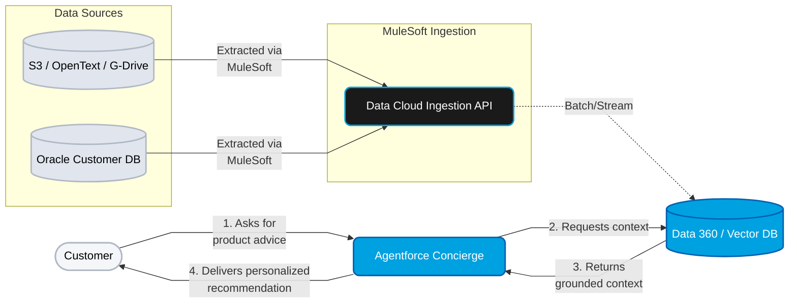
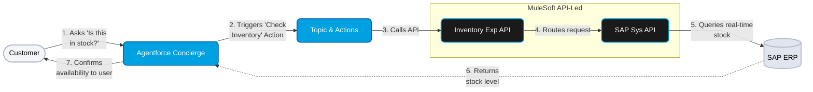
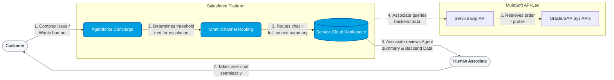

# Retail Action Layer — Individual Use Case Flows

These diagrams break down the high-level architecture into specific data flows for the four core capabilities requested in the business brief. They are styled to match the primary High-Level Design (HLD) architecture.

---

> **📚 EXAMPLE METADATA**
> **Source:** Real CSA session output (retail / personalized-offerings, 2026-04-29) — companion to `retail-personalized-offerings_HLD.md`.
> **Normalizations applied for example use:** (1) ` ` → ` ` (22 instances) per `01_Guidance.mdc` §7.6 D1 (Mermaid-safe linebreak — ` ` renders as literal text in many Mermaid renderers). (2) `'flowchart': { 'curve': 'linear' }` merged into the existing `themeVariables` init directive in all 4 mermaid blocks per `01_Guidance.mdc` §7.6 D2 (straight-line rule). Content unchanged.
> **Reference for:** Phase 6 §7 Data Flows pattern — per-capability drill-down diagrams · numbered step labels on edges (`1. Asks for...`, `2. Triggers...`) · `themeVariables.fontSize` for readability · "Strategy Summary" follow-up bullets · `01_Guidance.mdc` §7.7 (Diagram Pattern Recipes).

---

## 1. Personalized Recommendations
*Grounding the Agentforce response using unstructured data (manuals, PDFs) and structured customer profiles.*

**Strategy Summary:**
- **MuleSoft Data Ingestion:** Utilize MuleSoft to securely extract and orchestrate data from legacy on-premise systems (Oracle) and unstructured silos (S3, OpenText, Google Drive), batching or streaming it into Data Cloud.
- **Data Grounding:** Consolidate this siloed data within Data 360 to create a unified vector database.
- **Contextual Awareness:** Agentforce uses Intelligent Context to retrieve this data dynamically, ensuring recommendations are relevant, accurate, and tailored to the customer's history.
- **Zero-Code UI:** Leverage Agentforce Builder to deliver this complex capability natively, avoiding the need to build and maintain custom frontend chat interfaces.

---

## 2. Real-Time Inventory Updates
*Agentforce utilizing MuleSoft to check live stock levels in SAP without leaving the chat interface.*

**Strategy Summary:**
- **Real-Time Visibility:** Eliminate batch-sync delays and overselling by querying SAP inventory dynamically in real-time as the customer asks.
- **API-Led Reusability:** Use the MuleSoft Retail Accelerator to rapidly deploy the SAP System API, saving weeks of foundational build time.
- **Agentic Actions:** Expose the MuleSoft Experience API as an Agentforce Action via the API Experience Hub, empowering the agent to execute backend queries autonomously.

---

## 3. Automated Order Fulfillment
*End-to-end transactional write path orchestrating SAP and a 3rd-party logistics provider.*

```mermaid
%%{ init: { 'flowchart': { 'curve': 'linear' }, 'themeVariables': { 'fontSize': '16px' } } }%%
flowchart LR
    %% Styling
    classDef sf fill:#00A1E0,stroke:#005fb2,stroke-width:2px,color:#FFFFFF,rx:8px,ry:8px
    classDef ms fill:#1A1A1A,stroke:#00A1E0,stroke-width:2px,color:#FFFFFF,rx:8px,ry:8px
    classDef backend fill:#E0E5EE,stroke:#B0B8C4,stroke-width:2px,color:#000000,rx:8px,ry:8px
    classDef user fill:#F4F6F9,stroke:#B0B8C4,stroke-width:2px,color:#000000,rx:20px,ry:20px

    C([Customer]):::user -->|1. Confirms purchase| ARC[Agentforce Concierge]:::sf
    ARC -->|2. Triggers 'Create<br/>Order' Action| TA[Topic & Actions]:::sf
    
    subgraph MuleSoft API-Led
        Exp[Order Exp API]:::ms
        Proc[Order Orchestration Process API]:::ms
        SysSAP[SAP Sys API]:::ms
        Sys3P[Fulfillment Sys API]:::ms
    end
    
    TA -->|3. Submits Order<br/>Payload| Exp
    Exp -->|4. Initiates transaction| Proc
    
    Proc -->|5a. Decrement inventory<br/>/ Create order| SysSAP
    SysSAP --> SAP[(SAP ERP)]:::backend
    
    Proc -->|5b. Trigger shipping<br/>label| Sys3P
    Sys3P --> Fulfill[(3rd-Party Fulfillment SaaS)]:::backend
    
    Proc -.->|6. Returns Success| ARC
    ARC -->|7. Provides order<br/>tracking #| C
```

**Strategy Summary:**
- **Transactional Integrity:** Keep complex write operations strictly within the governed MuleSoft integration layer. This isolates Agentforce from legacy system intricacies and prevents partial-order failures.
- **Orchestration:** Use a MuleSoft Process API to coordinate the multi-step transaction (decrementing SAP inventory, creating the SAP order, and triggering the 3rd-party shipping label).
- **Secure Handoff:** Ensure all PII and order data flows securely through Flex Gateway, maintaining strict retail PCI-DSS/PII compliance standards.

---

## 4. Real-Time Customer Support
*Seamless handoff from autonomous agent to Service Cloud human associate when required.*

**Strategy Summary:**
- **Seamless Escalation:** Use Agentforce's built-in Atlas reasoning engine to intelligently detect complex issues, sentiment changes, or explicit requests for human intervention.
- **Context Preservation:** Route the chat via Omni-Channel to a Service Cloud human associate, passing the full conversation history and an AI-generated summary so the customer doesn't have to repeat themselves.
- **Empowered Associates (MuleSoft):** Rather than giving the human associate a swivel-chair experience, surface real-time SAP order status and Oracle CRM profiles directly within their Service Cloud console via MuleSoft APIs, enabling immediate issue resolution.

---

## A Note on MuleSoft's Continuous Evolution in the AI Era

The four flows above are not a static reference architecture — they sit on a platform that is shipping new agentic primitives every quarter. A few signals worth keeping front-of-mind:

- **MuleSoft is evolving in lockstep with the AI ecosystem.** What was an iPaaS in 2024 is now a full **MuleSoft Agent Fabric** — a governed runtime for agentic traffic — with new capabilities landing on a monthly drumbeat (Live Research, 2026-04-29).
- **Agentic protocols are now first-class.** Flex Gateway natively supports the **Model Context Protocol (MCP)** and **Agent2Agent (A2A)** protocols with dedicated policies (Schema Validation, Agent Card, PII Detector, Prompt Decorator, SSE Logging, Cedar-based ABAC) — your retail agents can call tools and other agents through a governed edge from day one.
- **MuleSoft AI Gateway went GA (March 31, 2026).** Centralized LLM governance, model routing, and token-level audit — directly addressing the "LLM sprawl" risk that blocks regulated retail rollouts.
- **Topic Center compresses agent build time.** MuleSoft for Agentforce: Topic Center now generates Agentforce Topics directly from your API specifications, with richer metadata than hand-built Salesforce Topics — meaning every API on the diagrams above can become an agent action with no rewrite.
- **Anypoint Code Builder accelerates the build itself.** **MuleSoft Vibes** (AI pair-programming), Agent Network projects with OAuth 2.0 OBO, gRPC support, and bundled runtimes are shortening the integration delivery cycle materially in 2026.

---

> 🧞‍♂️ R-GENIE Cloud Success Architect Agent by Cheppali Shaik Sohail
> ✍️ Authored with: Cloud Success Architect Agent v1.0.0 | 2026-04-29
> 🔧 Added to agent examples by Cheppali Shaik Sohail via R-GENIE Agent Tuner | v1.6.0 | 2026-05-12
