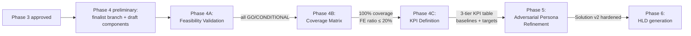

# Phase 4 Enterprise Gates — Detailed Specification

> **Purpose:** Operational specification for Phase 4 sub-stops (4A Feasibility, 4B Coverage, 4C KPIs). Extracted from `rules/00_Phase_Orchestration.mdc` to keep the rule file lean (per `AGENT_ARCHITECTURE_STANDARD.md` size limits).
>
> **Used by:** `rules/00_Phase_Orchestration.mdc` (Phase 4 task list — references this file for full task spec, RGV cycles, and checkpoint formats).
>
> **Related:** `lib/docs/enterprise-validation-patterns.md` (the "why" — patterns, anti-patterns, decision trees); this file (the "how" — task lists and checkpoint formats).
>
> **Maintainer:** Cheppali Shaik Sohail | v1.0.0 | 2026-05-02

---

## Overview

Phase 4 expanded into 3 mandatory sub-stops. Each sub-stop has its own checkpoint. Order is fixed: **4A → 4B → 4C**. The user must approve each sub-stop before the next begins. After 4C approval, Phase 4 (overall) is COMPLETE — proceed to **Phase 5 (Adversarial Persona Refinement)**, then Phase 6 (HLD).



---

## PHASE 4A — Feasibility Validation (Mandatory Gate)

**Purpose:** Validate every draft capability is do-able for THIS customer. No NO-GO capability proceeds to HLD.

### Tasks

1. For each draft capability, score on the **8 mandatory dimensions** (see `lib/docs/enterprise-validation-patterns.md` §2.1):
   - GA Status — confirmed via `research_log.md` (Phase 2)
   - Geography — customer's deployment regions ⊆ capability's available regions
   - Edition Entitlement — customer's Anypoint / Salesforce edition includes the capability (cross-ref `lib/docs/mulesoft-agentforce-capability-catalog.md` §9 NFR Profile)
   - Footprint Compatibility — runtime, identity, networking compatible with customer's current state (Phase 2A)
   - Timeline Fit — `requested_days < customer_velocity × component_count × 1.3` (project formula)
   - Skill Envelope — `team_size ≥ 2 OR partner-augmentation flagged` (project formula)
   - Commercial Signal — consumption headroom OR additional purchase signaled
   - Data Residency — capability supports customer's required residency (FedRAMP / EU / etc.)

2. Assign verdict per capability per `lib/docs/enterprise-validation-patterns.md` §2.2 Verdict Decision Tree:
   - **GO** — all 8 dimensions ✅
   - **CONDITIONAL** — ≥1 ⚠️, no ❌ (logged in Assumption Log)
   - **NO-GO** — ≥1 ❌ (must be removed or escalated)

3. For NO-GO capabilities: propose alternatives (typically a downgraded version, a substitute capability, or phased deferral). Update draft component list.

4. Persist matrix to state file (`feasibilityMatrix`).

### `<thinking>` Block Template

```
For each finalist capability:
- Capability: {name}
- 8-dim scores: {table}
- Verdict: {GO/CONDITIONAL/NO-GO}
- If NO-GO: alternative = {what}
Confidence: {HIGH/MEDIUM/LOW}
```

### RGV Cycle

```
1. READ: Draft capabilities (N) + customer footprint (Phase 2A) + research_log (Phase 2B) + capability catalog §9
2. GENERATE: 8-dim feasibility matrix (N capabilities × 8 dimensions)
3. VERIFY: Every capability has 8 scores + verdict; NO-GO capabilities have proposed alternatives
4. FIX: If verdict missing or alternative not proposed for NO-GO, fix before checkpoint
```

### Checkpoint 4A Format

```
🛑 CHECKPOINT 4A — Feasibility Validation Matrix

Capabilities scored: {N}
Verdicts: {X} GO / {Y} CONDITIONAL / {Z} NO-GO

Blockers (❌):
  - {capability}: {dimension that failed} → proposed alternative: {what}

Conditionals (⚠️):
  - {capability}: {dimension warning} → tracked in Assumption Log

→ "approved" to proceed to Phase 4B Coverage
→ "revise {capability}" to re-score
→ "remove {capability}" to drop from finalist

Waiting for your decision...
```

**STOP. Wait for approval before Phase 4B.**

---

## PHASE 4B — Problem-Solution Coverage Matrix (Mandatory Gate)

**Purpose:** Verify the architecture actually addresses customer pains, bidirectionally.

### Tasks

1. **Pain → Component mapping:** for every Phase 1 customer pain, identify ≥1 component from the (post-Feasibility) finalist that addresses it.
2. **Component → Pain mapping (reverse check):** for every finalist component, identify ≥1 pain it addresses, OR tag it `🎯 FUTURE-ENABLER` with explicit rationale.
3. **Coverage analysis** per `lib/docs/enterprise-validation-patterns.md` §3.1:
   - **Uncovered pains (❌)** — pains with NO addressing component → must be addressed before HLD OR explicitly de-scoped with customer agreement (logged in Gap Register).
   - **Solution-without-problem (⚠️)** — components addressing no pain AND not future-enabler → flagged for removal-or-justification.
   - **Future-enabler cap** — count future-enablers; if > 20% of total components, escalate to user (project standard cap).
4. Persist matrix to state file (`coverageMatrix`).

### `<thinking>` Block Template

```
- Total pains (Phase 1): {M}
- Total components (post-4A): {N}
- Pain coverage: {covered}/{M}
- Component justification: {pain-driven}/{future-enabler}/{unjustified}
- Future-enabler ratio: {N_FE / N_total}
Confidence: {HIGH/MEDIUM/LOW}
```

### RGV Cycle

```
1. READ: Phase 1 pains (M) + Phase 4A finalist components (N)
2. GENERATE: Bidirectional matrix (M pains × N components)
3. VERIFY: Coverage = M/M; future-enabler ratio ≤ 20%; no unjustified components
4. FIX: Add components for uncovered pains OR de-scope with customer; remove or tag unjustified components
```

### Checkpoint 4B Format

```
🛑 CHECKPOINT 4B — Problem-Solution Coverage Matrix

Pains addressed: {covered}/{total}
Components: {pain-driven} pain-driven + {future-enabler} 🎯 future-enabler ({ratio}% — cap 20%)
Solution-without-problem: {count} flagged

Uncovered pains (❌):
  - {pain}: → ACTION: add component OR de-scope OR escalate

Future-enablers (🎯):
  - {component}: rationale = {what next-horizon value}

→ "approved" to proceed to Phase 4C KPIs
→ "revise" to re-map
→ "de-scope {pain}" to remove with explicit customer agreement note

Waiting for your decision...
```

**STOP. Wait for approval before Phase 4C.**

---

## PHASE 4C — KPI Definition (Mandatory Gate)

**Purpose:** Make every solution outcome measurable. Without KPIs, the panel cannot validate success at the 12-month review.

### Tasks

1. Define **3-tier KPI table** per `lib/docs/enterprise-validation-patterns.md` §4.1:
   - **Business KPIs** (3-5) — outcome metrics the board cares about (CSAT, conversion, deflection %, revenue, NPS, etc.). Baselines come from Phase 1 customer facts; targets come from customer's stated ambition.
   - **Operational KPIs** (3-5) — the architect's pulse (agent containment rate, MTTR, time-to-resolution, backlog depth, etc.).
   - **Technical KPIs** (3-5) — platform health (API success rate, p95 latency, agent action latency, queue depth, etc.).
2. For each KPI, record per `lib/docs/enterprise-validation-patterns.md` §4.2 KPI Definition Template: **Metric name**, **Baseline (Phase 1 fact or "TBD pre-launch")**, **Target (Phase 1 ambition or project default)**, **Measurement Window** (default: 30-day rolling for Op/Tech, 90-day rolling for Business), **Owner** (role).
3. Identify the **measurement plan stub** for each KPI — instrumentation tool (Anypoint Monitoring / Visualizer / Agentforce Observability / Data Cloud Calculated Insights / Salesforce Reports). Full instrumentation goes into Supporting Doc §10 in Phase 7.
4. Identify any KPIs that require **90-day pre-launch baseline capture** (mark for `KPI_Baselines_v1.md` deliverable).
5. Persist to state file (`kpis`).

### `<thinking>` Block Template

```
For each tier:
- Business: {3-5 KPIs from customer's stated success metrics}
- Operational: {3-5 KPIs from architectural patterns chosen}
- Technical: {3-5 KPIs grounded in Phase 2 footprint}
Baselines available: {count} / KPIs requiring pre-launch capture: {count}
Confidence: {HIGH/MEDIUM/LOW}
```

### RGV Cycle

```
1. READ: Phase 1 success metrics (M) + Phase 4A/4B finalist (N components)
2. GENERATE: 3-tier KPI table (target ~12 KPIs total: 3-5 per tier)
3. VERIFY: Every KPI has Baseline + Target + Window + Owner + instrumentation stub
4. FIX: Add missing dimensions; mark TBD baselines for pre-launch capture
```

### Checkpoint 4C Format

```
🛑 CHECKPOINT 4C — KPI Definition (3-Tier)

Business KPIs: {count} ({list with baseline → target})
Operational KPIs: {count}
Technical KPIs: {count}

Baselines: {known}/{total} known; {N} require 90-day pre-launch capture
Owners assigned: {assigned}/{total}

Pre-launch capture artifact: `KPI_Baselines_v1.md` (created in Phase 7 §10.4)

→ "approved" to advance Phase 4 → Phase 5 (Adversarial Persona Refinement)
→ "revise" to adjust KPIs
→ "add KPI: {name, tier}" to extend

Waiting for your decision...
```

**STOP. Wait for approval. After Phase 4C approval, Phase 4 (overall) is COMPLETE — proceed to Phase 5 (Adversarial Persona Refinement).**

---

## Phase 5 Delta Triggers

> When Phase 5 (Adversarial Persona Refinement) surfaces an IMPROVE that changes components, capabilities, geographies, editions, or KPIs, a **delta re-validation** of the affected sub-gate(s) is required — NOT a full re-run.
>
> **Trigger matrix and procedures:** see `lib/docs/phase-5-persona-refinement-spec.md` §8 (full trigger matrix + 4A/4B/4C delta procedures + state file update protocol). Delta runs DO NOT trigger their own user checkpoints; outputs are inline-recorded in `Refinement_Log.md` §6 and reconciled at the Phase 5 Final Consolidation Stop.

---

> 🧞‍♂️ R-GENIE Cloud Success Architect Agent by Cheppali Shaik Sohail
> ✍️ Maintainer: Cheppali Shaik Sohail | v1.0.0 | 2026-05-02
> 🔧 Created by Cheppali Shaik Sohail via R-GENIE Agent Tuner | 2026-05-02
